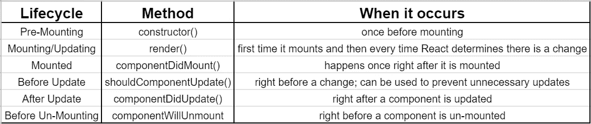

# React 生命周期方法备忘单

> 原文：<https://medium.com/nerd-for-tech/react-lifecycle-methods-cheat-sheet-77c20a3199c9?source=collection_archive---------6----------------------->


React.js 是少数几个，但这就是为什么 cheat sheets 受到赞赏。



不包括静态方法

在我的采访中，我几次被问到 React 生命周期，所以看起来生命周期方法很受欢迎。

我只包括了那些更常见的。

# 什么是生命周期？

对象在其存在过程中经历不同的事件:创建、更新和删除。React 的生命周期方法允许开发人员在对象生命周期的特定时间操作该对象。要使用生命周期方法，您必须使用 React 类组件。然后，只需在类中定义方法。

```
import React, { Component } from ‘react’
import fetchAnimes from '../actions/fetchAnimes'class AnimeContainer extends Component { componentDidMount() {
      **this**.props.fetchAnimes()
   } render() {
      return (
         <div>
            This method must exist.
         </div>
      )
    }}export default connect(null, {fetchAnimes})(AnimeContainer)
```

# 构造函数()

这是 React 组件将经历的第一个方法。这只会发生一次。只有当您打算改变原始的构造函数方法或者打算设置`state`时，才需要这个方法。

# 渲染()

这是组件首次安装的方式。组件挂载后，每当 React 的虚拟 DOM 检测到变化时，就会调用这个方法。

这是 React 类组件中必须存在的一个方法。其他方法都是可选的。该方法必须返回一个 JSX 元素。

# componentDidMount()

因为一个组件只能挂载一次，所以这个方法只被调用一次，也就是组件被成功挂载的时候。通常，`fetch`请求是用这种方法发出的。

# **shouldcomponentdupdate()**

也许你不想让 React 在每一个小变化后都重新渲染。您可以使用此方法手动控制组件更新的时间。应该返回一个布尔值。

# componentDidUpdate()

当您希望将更新发送到另一个库或者希望更新触发另一个事件时，可以使用此方法。

# componentWillUnmount()

这个方法在组件被卸载之前被调用。如果您有每隔几秒钟就发生的后台获取请求，这是您可以停止它们的方法。

还有一些其他的方法，比如`getSnapshotBeforeUpdate`和`static getDerivedStateFromProps()`，但是当我第一次开始学习 React 时，它们只是增加了我的困惑。