# 反应原生:一个意想不到的教程

> 原文：<https://medium.com/nerd-for-tech/react-native-an-unexpected-tutorial-ac5b597e0465?source=collection_archive---------3----------------------->

# 阅读完本教程后，您应该能够:

*   回答问题“什么是 React Native？”
*   熟悉世博会和世博会 CLI
*   使用 Expo 创建一个 React 本机应用程序
*   对 React 内置的本地组件有基本的了解
*   在 iOS 模拟器上远程运行你的应用
*   使用谷歌浏览器调试你的应用程序
*   将您的应用程序发布到 Expo Go
*   展开！世界是你的！

对于本教程，此应用程序是使用以下方式构建的:

*   运行在 Big Sur v11.2.3 上的 Mac OS
*   节点 v14.15.1
*   Visual Studio 代码
*   谷歌浏览器

作为参考，你可以查看我在 https://github.com/Will-Watson/ReactNativeDemo 的 Github 库

# 继续之前

牢牢掌握 Javascript 并做出反应非常重要。由于您不一定需要成为 React 方面的专家，因此对组件、道具、状态和 JSX 有深刻的理解仍然很重要。

# 什么是 React Native？

React Native 是一个框架，主要用于使用 Javascript 在 iOS 和 Android 设备上构建移动应用程序。React Native 是一个特别有用的框架，因为你可以用纯 Javascript 构建一个应用程序，而不必知道为 iOS 或 Android 构建应用程序的细节。这意味着你可以构建一个可以在任一平台上共享的应用。这样做的好处是无穷的，但具体来说，公司或开发者不必为每个平台构建两个独立的应用程序。同时，他们不需要维护两个代码库，也不需要雇佣两个专门研究每个平台相关语言的工程师团队。这一切都包含在一个包装精美的 Javascript 包中。赞美 Javascript。

# 世博会入门

我应该首先提到，在用 React Native 构建应用程序时，使用 Expo 并不是必须的。但是作为初学者，或者第一次使用，Expo 很方便，因为它隐藏了 React Native 中的许多复杂性。其优势在于，它让您能够正确地编码和学习新组件的功能。另一种选择是简单的自然反应。

Expo CLI 基本上是一套加速这一过程的工具。不要让这个小细节阻止你。您仍然可以使用 Expo 构建外观和感觉都很棒的全功能原生应用程序。

# 设置开发环境

你要做的第一件事就是在全球范围内安装 Expo CLI。所以让我们打开终端。

现在，您需要从根目录运行以下命令。

在我们等待安装的同时，你可以打开你的应用商店，在你的 iPhone 上下载 Expo Go。(Expo Go 也可以在 Android 设备上使用，但对于本教程，我们将主要关注 iOS)。

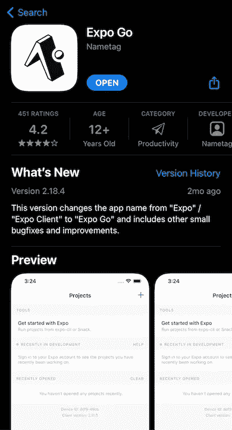

使用此应用程序，您可以在您的设备上运行和测试应用程序。这也是向你的朋友炫耀的好机会。

现在我们可以继续设置项目了。

使用命令行创建一个文件夹。你可以给这个文件夹起任何你喜欢的名字。如果你想为你要开发的应用起一个名字，就这么叫吧。

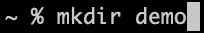

在你改变了你的新文件夹的目录后，你需要运行下面的命令。

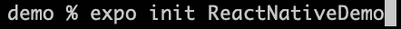

我已经将我的应用程序命名为 ReactNativeDemo，但是您可以随意命名您的应用程序。然后，您将进入以下屏幕。

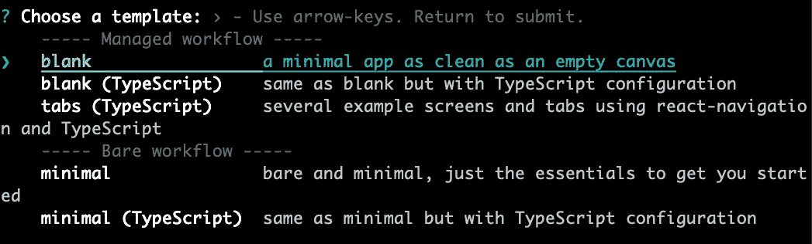

为了简单起见，在本教程中，我们将使用空白画布，或者您当前看到的高亮显示的画布。按回车键。

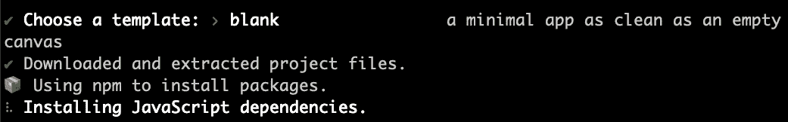

然后你会被带到这个屏幕，这可能需要一点时间，因为有很多依赖项。一旦完成，你会看到这个。

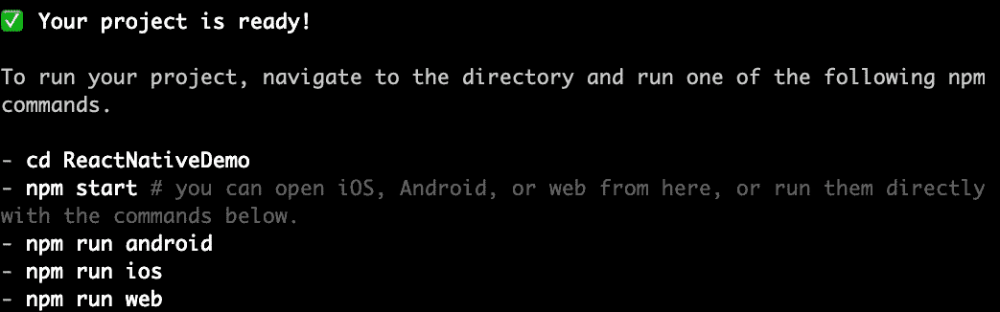

现在，您需要移动到这个文件夹中，并在 VSCode 中打开它。一旦进入，你应该看到这个文件夹已经为你下载了很多文件。

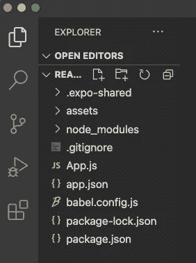

现在您需要关心的唯一文件夹和文件是 assets 文件夹和 App.js 文件。“资源”文件夹包含您计划用于应用程序的所有图像、声音和其他文件。这可能会让你想起在大多数应用程序中看到的“公共”文件夹。App.js 只是一个具有一些显著差异的准系统组件。

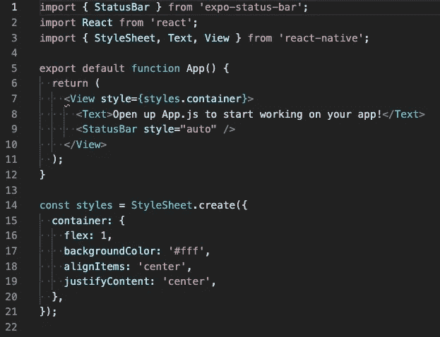

埃斯林特在第 7 行打扰我

# React Native 的内置组件

你应该马上注意到有一些组件是从“react-native”导入的。这些组件起初可能看起来有点奇怪，但在适当的时候会变得有意义。让我们花点时间来看一下这段代码。似乎有点熟悉，我说得对吗？这是因为 React 本机组件的功能与常规 React 组件非常相似，只是有一些例外。主要是在 return 语句中，你会习惯于看到一些 JSX 或 HTML 外观的标签。

视图组件就像一个

一样，文本组件有点像一个

标签。这里的主要区别是，你不能在应用程序中随意输入文本。文本组件是必需的。

您还会在视图组件中看到一个样式属性。这就是 React Native 处理样式的方式。如果看到这一幕让你惊慌，请深呼吸。作为早期开发人员，我讨厌 CSS 和样式，并认为我没有办法掌握这一点。但是就像生活中的所有事情一样，熟能生巧。在使用 React Native 创建了一个项目之后，我感觉自己是他们风格管理方面的专家。

在组件下面有一个名为 styles 的常量声明，分配给它的是调用 create 方法的样式表组件。一开始可能看起来有点吓人，但是慢慢读。样式被分配给正在创建的样式表。如果你熟悉 CSS，我相信你也是，你会看到代码块内部只是普通的 CSS，但是有一些关键的不同。你只需要一个对象，而不是繁琐的特定 ID 或类名。在这个对象中有 CSS 属性。

这里的属性也有点不同，您会注意到第 17–19 行。这些属性不是用连字符分隔，而是大小写一致。

现在，如果您再次查看视图组件内部，您将看到 styles 属性的值为 styles.container。这意味着视图组件现在拥有容器对象的样式属性。

**专业提示:**为你的风格创建一个单独的文件并导出它们。这样，您可以将它导入到每个组件中，并在必要的地方应用相同的样式，而不必在每个组件文件中重写代码。这是保持干燥的好方法。

React Native 有太多可以导入的内置组件。查看它们的文档，获得所有功能的完整指南。

 [## 核心组件和 API 本机反应

### React Native 提供了许多内置的核心组件，可供您在应用程序中使用。你可以在…中找到它们

反应性发展](https://reactnative.dev/docs/components-and-apis) 

现在我们已经对一些基本的 React 原生组件有了基本的了解，我们可以继续一些有趣的部分。

# 在 iOS 模拟器上运行应用程序

如果你还没有下载 Xcode，你首先要做的就是从 app store 下载。这是一个相当大的文件，所以需要一些时间来完成下载。

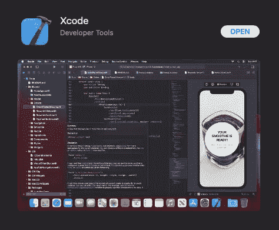

下载完成后，我们将返回到我们的 VSCode 并打开终端。Mac 上的快捷方式是 control+`(反勾)。

在这个终端中，我们将运行每个人都喜欢的命令 npm run start。

这将自动打开我们的浏览器，将我们带到一个以 Metro Bundler 为特色的本地主机地址。

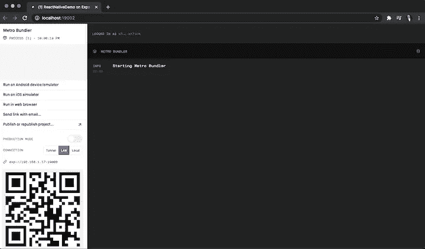

Metro Bundler 是 React Native 的 Javascript bundler。它负责将我们所有的代码打包成一个文件。类似于 webpack 之类的东西。它也是我们的控制台。在这里，您可以找到所有的错误消息和 console.logs，因此它可以成为调试过程中的一个关键因素。Metro Bundler 也是您可以在 iOS 模拟器上快速打开应用程序的地方。你所要做的就是点击“在 iOS 模拟器上运行”按钮。所以让我们现在就开始吧。

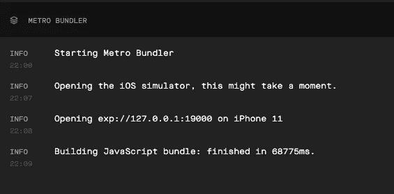

Metro Bundler 日志

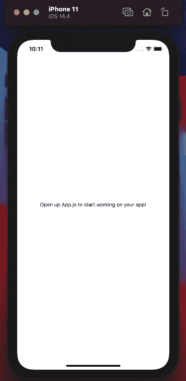

iPhone 11 模拟器

砰！就像你现在模拟你的应用程序一样。这里我用的是 iPhone 11 模拟器，但是你可以通过打开模拟器，选择你喜欢的型号。您也可以使用 Expo Go 在移动设备上模拟您的应用程序，但使用 Xcode 的内置模拟器渲染代码更新要快得多。这就是我们在本教程剩余部分要用到的。

在屏幕的中央，您应该会看到上图中的短语。你可能会想，“我以前在哪里见过这个短语？”。没错！在您的 App.js 文件中。

现在来演示一下我之前提到渲染速度。让我们将 App.js 中的文本改为一些世俗的东西。怎么样，哦，我不知道，“你好世界”。保存文件后，您应该会看到更改几乎立即发生！很酷，对吧？

如果你在想“这怎么会变得更酷呢？”等到你看到模拟器开发者菜单。选择模拟器并按下 command + d。

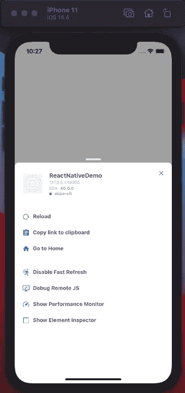

当需要重新加载应用程序时，这个开发者菜单尤其酷。这在快速呈现由于代码中的错误而变得有点奇怪时非常有用。

现在我们已经有了模拟器，试一试，找点乐子。尝试设计一些文本，看看快速渲染的神奇效果。毕竟，这不正是我们最初从事编码工作的原因吗？

# 排除故障

> 不是 bug！这是一个特点！

如前所述，Metro Bundler 将在查看您的 console.logs 时派上用场，这通常是定位 bug 的最快方法，但有时不是最有效的。

让我们先试试这个。Console.log 您选择的字符串。对我来说，我会坚持经典。

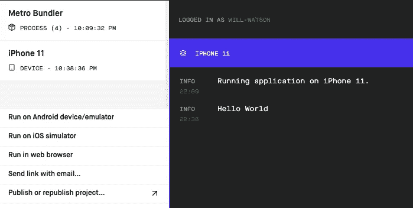

当您打开 Metro Bundler 选项卡并在窗口左侧选择您之前选择的设备时，您应该会看到 console.log。非常有趣，但正如我所说，不是最有效的。这就是 Chrome 调试器的用武之地。

为了证明这一点，我们必须在我们的应用程序中故意创建一个 bug。我知道，亵渎神明，但必须这样做。因此，让我们继续在应用程序组件中做一些奇怪的事情。

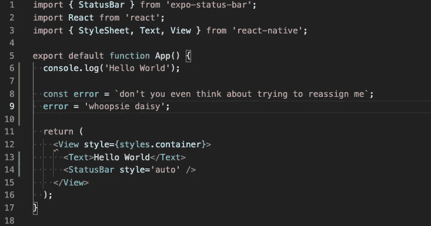

保存文件后，你会注意到模拟器不再有好日子过了。

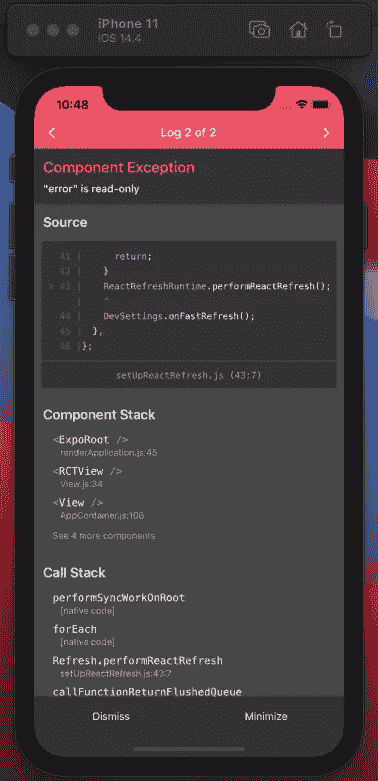

虽然这个红框告诉我们应用程序中有一个错误，但这并不是一个特别有用的错误消息。现在情况并不总是这样。一些错误信息比其他的更有帮助，但是对于这样的事情，我们最好运行 Chrome 调试器。

首先，我们要消除这个错误消息，打开模拟器开发人员菜单。记得捷径吗？命令+ d。

然后我们要点击“调试远程 JS”按钮。

像运行 npm start 一样，这将在 Chrome 浏览器中自动打开一个新标签。

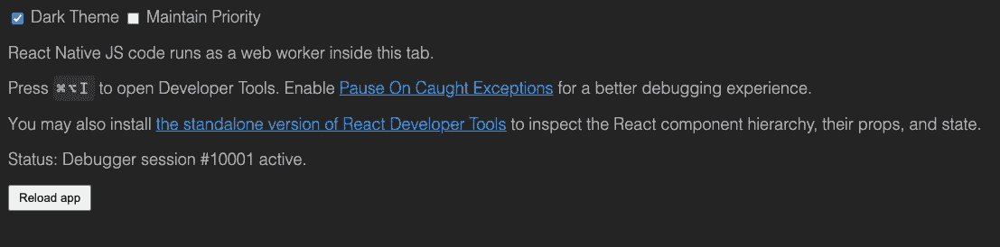

在这里，我们可以使用 Chrome 中的 Javascript。因此，让我们继续打开我们的 Chrome 控制台。选项+命令+ j。

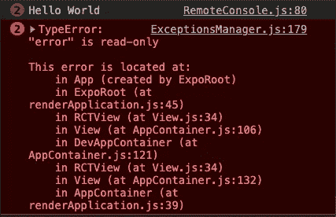

在这里，您可以看到“Hello World”console . logs 和错误消息。

你也可以访问源代码标签，只要你选择了“捕捉到异常时暂停”, Chrome 调试器就会找到你的 bug。

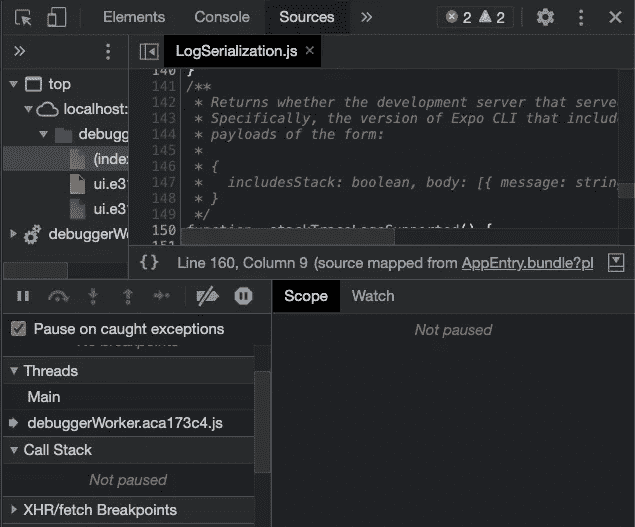

蓝色暂停按钮和橙色复选框。

完成后，请务必关闭 Chrome 调试器标签，因为它会显著降低应用程序的运行速度。

# 出版

> 谁需要应用商店呢？

既然我们已经找到了一些乐趣，并且可能创建了一些很酷的东西，我们可以继续进行发布了。将您的应用发布到 Expo 的快捷方式是只需点击 Metro Bundler 中的“发布或重新发布…”按钮，然后按照提示进行操作。但是在本教程中，我们将讨论另一种方法。

在 VSCode 终端窗口中，运行 expo publish 命令。

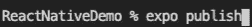

运行此命令后，系统会提示您创建一个 Expo 帐户。键入您的电子邮件、用户名和密码。博览会将捆绑您的文件和中提琴！你被刊登到博览会上了。现在，您可以在手机上登录 Expo Go 帐户，向您的朋友展示您的工作成果。无论何时您做出更改或添加功能，只需再次运行 expo publish 即可重新发布您的更改。

# 外卖/备用

*   React Native 可能非常挑剔。记住使用最佳调试实践和 smart console.logs
*   React Native 有写得很漂亮的文档。使用它。你不会后悔的。
*   虽然看起来你可以在开发阶段使用二维码分享你的应用，但我发现它们似乎不起作用。这可能与 iOS 关于二维码的政策变化有关。幸运的是，它可能仍然适用于 Android。
*   如果你创建了一个你真的想继续发展的应用程序，你最终将不得不通过应用程序商店。
*   这是 React Native 的入门教程。还有更多的东西需要探索。

# 最后的想法

非常感谢您花时间阅读本教程。我希望它在创造性的学习过程中对你有所帮助，并希望你用它做一些真正酷的东西。

如果你对 React Native 或一般代码有任何建议、问题或想要聊天，请随时在 Linkedin 上添加我。我喜欢结交新朋友！

[www.linkedin.com/in/williampwatson](http://www.linkedin.com/in/williampwatson)

最后，如果你想看我正在开发的 React 本地应用的快速演示视频，你可以点击这里查看:【https://youtu.be/kOlgU3YCHXs 

编码快乐！