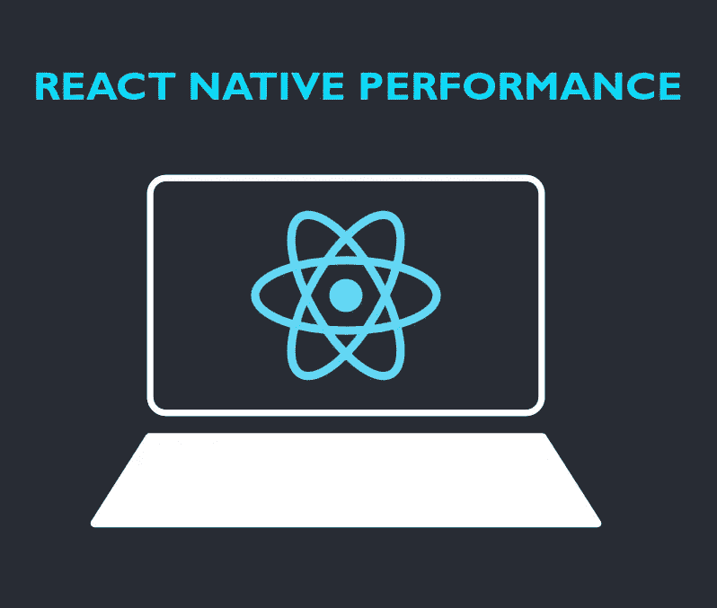

# 反应原生应用性能-第 1 部分

> 原文：<https://medium.com/nerd-for-tech/react-native-app-performance-part-1-ea218dac23ee?source=collection_archive---------12----------------------->



React Native 是一项受工程师欢迎的技术，工程师希望在不牺牲本机性能的情况下高效地构建移动应用程序。

我将分享我在 React Native 中应该注意的性能问题方面的经验。这些都是基于 Avalon 使用 React Native 在 [**场景构建大型表演移动应用的经验。我将强调常见的陷阱，并对可能出错的地方以及如何解决问题给出一个大致的理解。**](https://www.scenes.social/)

# 1.删除源代码中的控制台语句

一般来说，使用`console.log`语句是 JavaScript 应用程序以及 React 本地应用程序中最常见的调试方法之一。然而，在为平台构建 React 本机应用程序时，将控制台语句留在源代码中可能会导致 JavaScript 线程中的一些大瓶颈。

跟踪控制台语句并删除它们的一种方法是使用名为`babel-plugin-transform-remove-console`的第三方包。要使用它，请在终端窗口中使用以下命令安装该软件包:

```
yarn add babel-plugin-transform-remove-console
```

然后，修改`.babelrc`文件以删除所有控制台语句:

```
{
  "env": {
    "production": {
      "plugins": ["transform-remove-console"]
    }
  }
}
```

# 2.使用图像缓存解决方案

React Native 提供了一个 [Image](https://reactnative.dev/docs/image) 组件，作为其核心组件的一部分。该组件用于显示图像，但是，开箱即用时，它没有针对以下问题的解决方案:

*   在一个屏幕上呈现大量图像
*   总体表现不佳
*   从缓存进行低性能加载
*   闪烁的

React Native 中的图像组件像 web 浏览器一样处理缓存图像，这有时是导致上述问题的原因。通过使用名为[react-native-fast-image](https://github.com/DylanVann/react-native-fast-image)的第三方库，可以轻松解决这些问题。它适用于 iOS 和 Android，在缓存图像方面效率很高。

# 3.使用合适的图像尺寸

如果应用程序依赖于使用大量图像，优化图像对于 React 本机应用程序的性能非常重要。如果图像的大小没有适当优化，渲染大量图像可能会导致设备上的高内存使用率。这可能会导致应用程序崩溃。

在 React 本机应用程序中优化图像可以做的一些事情包括:

*   使用图标字体而不是图像图标。您可以使用图标字体生成器，如 [Fontello](https://fontello.com/) 进行转换。
*   使用较小尺寸的图像。
*   对图像使用 WEBP 格式。可以帮助[将 iOS 和 Android 上的二进制大小](/@tgpski/react-native-webp-reducing-bundle-binary-sizes-increase-speed-with-webp-image-format-aa9b1aa11405)减少 29%。

# 4.避免不必要的渲染

React Native 基于 React 库，以与 React.js 相似的方式处理渲染组件。因此，对 React 有效的优化技术也适用于 React Native 应用程序。一种优化技术是避免不必要的渲染，在功能组件中，这可以通过使用`React.memo()`来实现。

`React.memo()`用于处理记忆化。记忆化的概念描述如下:如果一个组件不止一次地接收同一组道具，它将使用先前缓存的道具，并且只呈现一次由功能组件返回的 JSX。

例如，考虑以下父组件和子组件。`Parent`组件有一个名为`count`的状态变量，当按钮被按下时该变量会更新。

每当按下按钮时，`Child`组件也会被重新渲染，即使它的属性`text`在每次渲染时不会改变。它没有对它的父组件做任何特殊的事情，只是显示一些文本。这可以通过用`React.memo()`包装`Child`组件的内容来优化。

```
// Parent.jsconst Parent = () => {
  const [count, setCount] = useState(0); return (
    <View style={{ flex: 1, justifyContent: 'center', alignItems: 'center' }}>
      <Button title='Click' onPress={() => setCount(count + 1)} />
      <Child content='Dummy text' />
    </View>
  );
};// Child.js
const Child = React.Memo(({ content }) => {
  return <Text>{content}</Text>;
});
```

注意:如无必要，不要使用`React.memo()`。查看何时使用备忘录。

# 摘要

构建一个高性能的 React 本地应用并不总是简单的。通常你应该从简单的方法开始，但是如果你开始注意到你的应用程序的性能问题，总是要考虑过桥的次数。