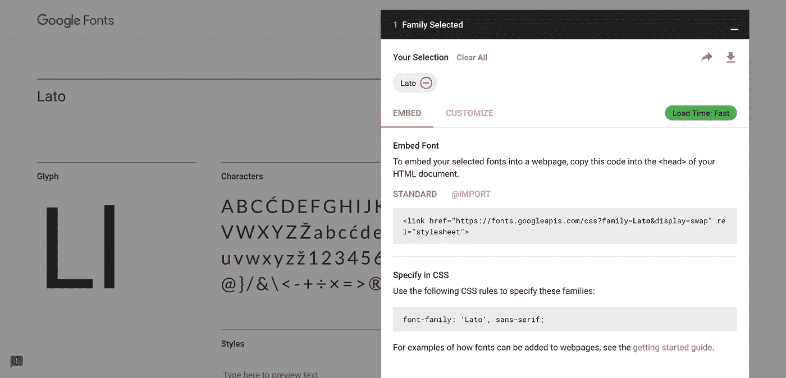
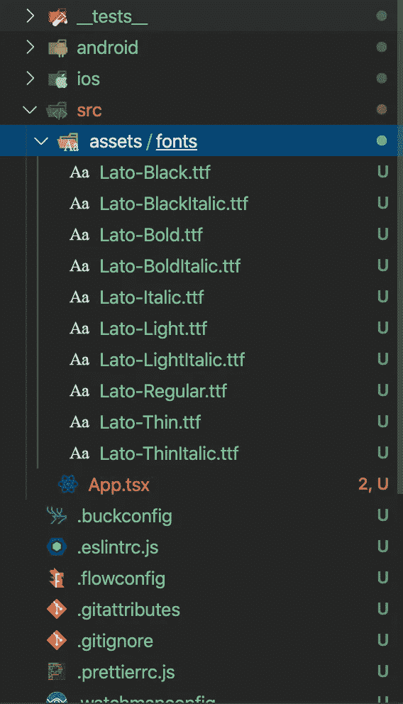

# (React Native)使用自定义字体系列创建自定义文本组件

> 原文：<https://medium.com/nerd-for-tech/react-native-create-a-custom-text-component-with-custom-font-family-61c5fcdf9388?source=collection_archive---------1----------------------->


今天，我将分享我的知识，在 React Native 中创建一个方便的可重用自定义文本组件。最终的源代码可以在 [my Github](https://github.com/KentaKodashima/RNCustomTextTutorial) 上找到。

# 先决条件

*   我将在本文中使用 Typescript
*   该项目是使用纯 React Native 生成的
*   纯 React 本地开发的基础知识

# 我的环境

*   原生反应:0.61.5
*   macOS Catalina:版本 10.15.2 (19C57)
*   打字稿:3.7.4

# 1.生成并设置一个 React 本地项目

首先，用下面的代码生成一个新的 React 原生项目。

```
**react-native init CustomTextExample**
```

接下来，添加必要的依赖项。

```
// Add typescript **npm i -D typescript react-native-typescript-transformer**// Add eslint with typescript plugin **npm i -D eslint** [**@typescript**](http://twitter.com/typescript)**-eslint/parser** [**@typescript**](http://twitter.com/typescript)**-eslint/eslint-plugin**// Add types **npm i -D @types/react @types/react-native**// Optionally, you can add prettier
**npm i -D prettier eslint-config-prettier eslint-plugin-prettier**
```

然后，修改类似下面的`**.eslinttrc.js**`文件来配置类型脚本。

```
// .eslinttrc.js**module.exports = {
  root: true,
  parser: '**[**@typescript**](http://twitter.com/typescript)**-eslint/parser',
  parserOptions: {
    ecmaVersion: 2018, // Allow to parse modern ECMAScript features
    sourceType: 'module', // Allow to use imports
    ecmaFeatures: {
      jsx: true,
    },
  },
  plugins: ['**[**@typescript**](http://twitter.com/typescript)**-eslint'],
  extends: [
    'eslint:recommended',
    'plugin:**[**@typescript**](http://twitter.com/typescript)**-eslint/recommended',
    'plugin:react/recommended',
    'prettier',
    'prettier/@typescript-eslint',
  ],
  rules: {
    semi: 0,
    'ordered-imports': 0,
    'object-literal-sort-keys': 0,
    'member-ordering': 0,
    'jsx-no-lambda': 0,
    'jsx-boolean-value': 0,
    'no-console': 0,
    'no-empty-interface': 0,
    'interface-name': [0, 'always-prefix'],
    '**[**@typescript**](http://twitter.com/typescript)**-eslint/no-unused-vars': 0,
    '**[**@typescript**](http://twitter.com/typescript)**-eslint/camelcase': 0,
    '**[**@typescript**](http://twitter.com/typescript)**-eslint/no-explicit-any': 0,
    '**[**@typescript**](http://twitter.com/typescript)**-eslint/explicit-function-return-type': [
      'warn',
      {
        'allowExpressions': 1,
        'allowTypedFunctionExpressions': 1
      }
    ]
  },
  env: {
    es6: true,
    node: true,
  }
}**
```

最后，将`App.js`和`index.js`文件重命名为`**App.tsx**`和`**index.ts**`。同样，在根目录下创建`**src**`文件夹，并将`App.tsx`文件移动到`src`目录下。移动完`App.tsx`文件后，不要忘记修改`index.ts`文件中的目录。

在这一点上，你可能有一些打字错误。我们将在稍后创建 CustomText 组件时修复这些错误，所以现在忽略这些错误。

这就是设置的全部内容。

# 2.下载谷歌字体

接下来，我们需要在应用程序中使用它的字体。去[谷歌字体网站](https://fonts.google.com/)下载任何你想用的字体。你需要做的就是搜索一种字体，然后点击模块右上角的下载图标。我在本教程中使用“Lato”。



下载字体文件

下载字体后，我们需要配置字体，以便在应用程序中使用。在应用程序的根目录下，创建`/src/assets/fonts/`目录并将你的字体文件放在那里。



把字体文件

然后，在 app 的根目录下，创建名为`**react-native.config.js**`的文件，粘贴下面的代码。

```
// react-native.config.js**module.exports = {
  assets: ['./src/assets/fonts'],
}**
```

最后，在您的终端上运行下面的代码。

```
**react-native link**
```

现在，我们的应用程序应该可以识别下载的字体。

# 3.创建 CustomText 组件

现在，是时候创建 CustomText 组件了。在`src`目录下，创建`**components**`文件夹。在`components`文件夹中，创建文件并命名为`**CustomText.tsx**`。然后，在下面添加样板文件。

```
// CustomText.tsx**import React, { FunctionComponent } from 'react'
import {
  Text,
  StyleSheet
} from 'react-native'****type CustomTextProps = {****}****const CustomText: FunctionComponent<CustomTextProps> = ({ children }) => {
  return (
    <Text>
      {children}
    </Text>
  )
}****const styles = StyleSheet.create({****})****export default CustomText**
```

# 4.使字体系列可配置

要通过 props 配置字体系列，请对组件进行以下更改。

```
// CustomText.tsx...type CustomTextProps = {
  **textType?: 'regular' | 'bold' | 'light'**
}const CustomText: FunctionComponent<CustomTextProps> = ({ children, **textStyle** }) => {
  **let textStyle: {}
  switch (textType) {
    case 'regular':
      textStyle = styles.regular
      break
    case 'bold':
      textStyle = styles.bold
      break
    case 'light':
      textStyle = styles.light
      break
    default:
      textStyle = styles.regular
      break
  }**return (
    <Text **style={textStyle}**>
      {children}
    </Text>
  )
}const styles = StyleSheet.create({
  **regular: {
    fontFamily: 'Lato-Regular'
  },
  bold: {
    fontFamily: 'Lato-Bold'
  },
  light: {
    fontFamily: 'Lato-Light'
  }**
})export default CustomText
```

在上面的代码中，进行了以下更改。

1.  **style sheet . create()中的样式** 在这里定义你想要的字体系列。
2.  `**textType**` **道具类型**
    在 CustomTextProps 类型中添加`textType`道具类型来接收道具以配置使用哪个字体家族。在这种情况下，我可以只传递'**常规**'、'**粗体**'或'**浅色**'作为值。别忘了给被破坏的道具也加上`textType`。
3.  **switch 语句**
    switch 语句用于根据`textType`属性从`styles`常量中分配字体系列。我将它存储到名为`textStyle`的变量中，并将其作为 return 语句中`Text`组件的样式。

# 5.使组件能够接收自定义样式

为了从父组件传递自定义样式，我们需要做更多的工作。在下面添加以下更改。

```
// CustomText.tsximport React, { FunctionComponent } from 'react'
import {
  StyleSheet,
  Text,
  **TextStyle**
} from 'react-native'type CustomTextProps = {
  **style?: TextStyle | TextStyle[]**
  textType?: 'regular' | 'bold' | 'light'
}const CustomText: FunctionComponent<CustomTextProps> = ({ children, textStyle, **style** }) => {
  let textStyle: {}
  switch (textType) {
    ...
  }**const passedStyles = Array.isArray(style) ? Object.assign({}, ...style) : style**return (
    <Text **style={[textStyle, { ...passedStyles } ]}**>
      {children}
    </Text>
  )
}const styles = StyleSheet.create({
  ...
})export default CustomText
```

在上面的代码中，进行了以下更改。

1.  `**style**` **道具类型** 从 react-native 导入`**TextStyle**` 类型，在 CustomTextProps 类型中添加`**style?**`道具类型。在末尾加上`?`使其成为可选道具。类型可以是`TextStyle`或`TextStyle[]`。这是因为 React 中的组件通常接受一个样式对象或一个样式对象数组。
2.  **`**passedStyles**`**常量**
    如果给`style`属性传递一个样式对象数组，我们不能直接赋值。`**Object.assign({}, …style)**` 会将传来的数组的值展开并赋给空对象。使用三元运算符，如果`style`属性的类型是一个数组，那么在它被存储到`passedStyles`常量之前，数组被扩展到一个对象中。**
3.  **传递`textStyle`和`passedStyles` 最后，传递`passedStyles`作为样式属性值之一。**

# **6.修改 App.tsx 以显示 CustomText**

**最后，修改`App.tsx`文件来显示我们的自定义文本。**

```
**import React, { Component } from 'react'
import {
  StyleSheet,
  SafeAreaView,
  View
} from 'react-native'
import CustomText from './components/CustomText'****class App extends Component {
  render() {
    const { container, customTextStyle } = styles

    return (
      <SafeAreaView style={container}>
        <View>
          <CustomText textType='light' style={[customTextStyle, { color: 'blue' }]}>Light</CustomText>
          <CustomText textType='regular' style={[customTextStyle, { color: 'red' }]}>Regular</CustomText>
          <CustomText textType='bold' style={[customTextStyle, { color: 'green' }]}>Bold</CustomText>
        </View>
      </SafeAreaView>
    )
  }
}****const styles = StyleSheet.create({
  container: {
    flex: 1,
    justifyContent: 'center',
    alignItems: 'center'
  },
  customTextStyle: {
    fontSize: 16,
    marginBottom: 8
  }
})****export default App**
```

**如果你运行这个应用程序，你可以看到字体系列和每种文本样式都应用正确，如下图所示。**

****

**带有自定义字体和样式的自定义文本**

**这就是本文的全部内容。**

## **资源:**

*   **向 REACT 本机应用添加自定义字体:
    [https://blog . bam . tech/developer-news/ADD-A-CUSTOM-FONT-TO-YOUR-REACT-NATIVE-APP](https://blog.bam.tech/developer-news/add-a-custom-font-to-your-react-native-app)**