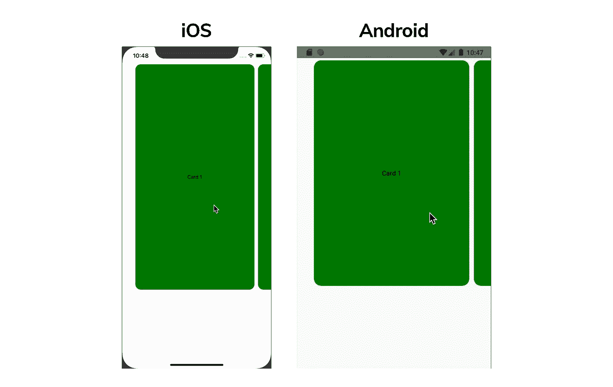
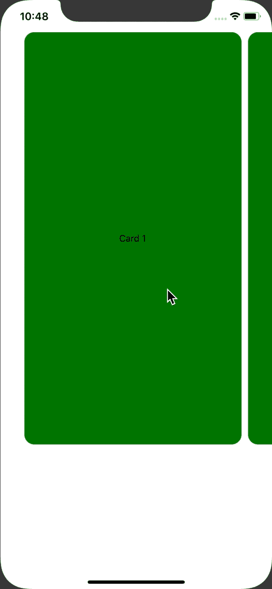
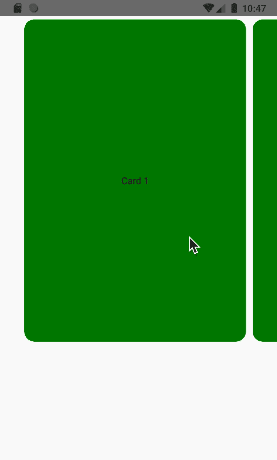

# (React Native)创建水平捕捉滚动视图

> 原文：<https://medium.com/nerd-for-tech/react-native-create-a-horizontal-snap-scrollview-e1d01ac3ba09?source=collection_archive---------0----------------------->



我们正在构建的用户界面

在 React Native 中，您可以使用简单的计算创建一个水平的 snap ScrollView。在本文中，我将向您展示这有多简单。最终的源代码可以在 [my GitHub](https://github.com/KentaKodashima/RNHorizontalSnapScrollViewTutorial) 上找到。

# 先决条件

*   我将在本文中使用 Typescript
*   该项目是使用纯 React Native 生成的
*   纯 React 本地开发的基础知识

# 我的环境

*   原生反应:0.61.5
*   macOS Catalina:版本 10.15.2 (19C57)
*   打字稿:3.7.4

# 1.项目设置

通过以下步骤创建一个项目。

```
// Generate a project **react-native init HorizontalSnapScrollViewExample**// Enter into the project directory **cd HorizontalSnapScrollViewExample**// Add typescript **npm i -D typescript react-native-typescript-transformer**// Add eslint with typescript plugin **npm i -D eslint** [**@typescript**](http://twitter.com/typescript)**-eslint/parser** [**@typescript**](http://twitter.com/typescript)**-eslint/eslint-plugin**// Add types **npm i -D @types/react @types/react-native**// Optionally, you can add prettier
**npm i -D prettier eslint-config-prettier eslint-plugin-prettier**
```

然后，修改类似下面的`**.eslinttrc.js**`文件来配置类型脚本。

```
// .eslinttrc.js**module.exports = {
  root: true,
  parser: '**[**@typescript**](http://twitter.com/typescript)**-eslint/parser',
  parserOptions: {
    ecmaVersion: 2018, // Allow to parse modern ECMAScript features
    sourceType: 'module', // Allow to use imports
    ecmaFeatures: {
      jsx: true,
    },
  },
  plugins: ['**[**@typescript**](http://twitter.com/typescript)**-eslint'],
  extends: [
    'eslint:recommended',
    'plugin:**[**@typescript**](http://twitter.com/typescript)**-eslint/recommended',
    'plugin:react/recommended',
    'prettier',
    'prettier/@typescript-eslint',
  ],
  rules: {
    semi: 0,
    'ordered-imports': 0,
    'object-literal-sort-keys': 0,
    'member-ordering': 0,
    'jsx-no-lambda': 0,
    'jsx-boolean-value': 0,
    'no-console': 0,
    'no-empty-interface': 0,
    'interface-name': [0, 'always-prefix'],
    '**[**@typescript**](http://twitter.com/typescript)**-eslint/no-unused-vars': 0,
    '**[**@typescript**](http://twitter.com/typescript)**-eslint/camelcase': 0,
    '**[**@typescript**](http://twitter.com/typescript)**-eslint/no-explicit-any': 0,
    '**[**@typescript**](http://twitter.com/typescript)**-eslint/explicit-function-return-type': [
      'warn',
      {
        'allowExpressions': 1,
        'allowTypedFunctionExpressions': 1
      }
    ]
  },
  env: {
    es6: true,
    node: true,
  }
}**
```

最后，将`App.js`和`index.js`文件重命名为`**App.tsx**`和`**index.ts**`。同样，在根目录下创建`**src**`文件夹，并将`App.tsx`文件移动到`src`目录下。移动完`App.tsx`文件后，不要忘记修改`index.ts`文件中的目录。

此外，如下修改`App.tsx`，为本教程的其余部分做准备。

```
**import React, { Component } from 'react'
import {
  SafeAreaView,
  StyleSheet,
  ScrollView,
  View,
  Text,
  StatusBar,
  Dimensions,
  Platform**
**} from 'react-native'****class App extends Component {
  render() {
    return (
      <React.Fragment>
        <StatusBar barStyle="dark-content" />
        <SafeAreaView>
          <ScrollView>
            // The contents would be here
          </ScrollView>
        </SafeAreaView>
      </React.Fragment>
    )
  }
}****const styles = StyleSheet.create({
  container: {
    flex: 1,
    justifyContent: 'center',
    alignItems: 'center'
  }
})****export default App**
```

这就是设置的全部内容。

# 2.准备要在 ScrollView 中显示的视图

首先，我们需要准备在 ScrollView 中显示的视图。修改`App.tsx`如下。

```
import React, { Component } from 'react'
import {
  ...
} from 'react-native'**// ==== 1 ====
const CARD_WIDTH = Dimensions.get('window').width * 0.8
const CARD_HEIGHT = Dimensions.get('window').height * 0.7****// ==== 2 ====
type CardType = {
  name: string
}****// ==== 3 ====
const cards = [
  { name: 'Card 1' },
  { name: 'Card 2' },
  { name: 'Card 3' },
  { name: 'Card 4' },
  { name: 'Card 5' },
  { name: 'Card 6' },
  { name: 'Card 7' },
  { name: 'Card 8' },
  { name: 'Card 9' },
  { name: 'Card 10' }
]**class App extends Component {
  **// ==== 5 ====
  _renderViews = (views: CardType[]): JSX.Element[] => {
    const { cardStyle } = styles** **return views.map(card => {
      return (
        <View style={cardStyle}>
          <Text>
            {card.name}
          </Text>
        </View>
      )
    })
  }** render() {
    **// ==== 6 ====
    const { container } = styles** return (
      <React.Fragment>
        <StatusBar barStyle="dark-content" />
        <SafeAreaView **style={container}**>
          <ScrollView>
            **{this._renderViews(cards)}**
          </ScrollView>
        </SafeAreaView>
      </React.Fragment>
    )
  }
}**// ==== 4 ====** const styles = StyleSheet.create({
  ...,
  **cardStyle: {
    width: CARD_WIDTH,
    height: CARD_HEIGHT,
    justifyContent: 'center',
    alignItems: 'center',
    backgroundColor: 'green',
    margin: 5,
    borderRadius: 15
  }**
})export default App
```

我将一步一步地解释这些变化。

1.  常数`CARD_WIDTH` 和`CARD_HEIGHT`
    我用比率计算宽度和高度。通过这样做，无论什么设备，卡都将具有相同的宽度和高度比。
2.  描述卡片对象的类型定义。
3.  `cards`常量
    要显示的数据。
4.  将`cardStyle`添加到样式常量
    中，定义卡片的样式。
5.  `_renderViews`方法
    获取对象数组并呈现它们的方法。我写这个函数是为了让`render()`更简洁。
6.  调用`_renderViews`方法
    调用`ScrollView`内部的`_renderViews()`渲染卡片。不要忘记传递`cards`数组并将`container`样式应用到`SafeAreaView`。

现在，应用程序应该看起来像下面的图片。


iOS 中当前应用程序的用户界面

# 3.配置滚动视图

既然我们现在有东西要显示，那么是时候配置`ScrollView`了。

首先，在`CARD_HEIGHT`常量的正下方添加以下常量。

```
**const SPACING_FOR_CARD_INSET = Dimensions.get('window').width * 0.1 - 10**
```

`SPACING_FOR_CARD_INSET`将用于在水平`ScrollView`的起点和终点留有一定的间距。

然后，修改`ScrollView`如下。我在评论里解释道具的意思。

```
<ScrollView
 **horizontal // Change the direction to horizontal
 pagingEnabled // Enable paging
 decelerationRate={0} // Disable deceleration
 snapToInterval={CARD_WIDTH+10} // Calculate the size for a card including marginLeft and marginRight
 snapToAlignment='center' // Snap to the center
 contentInset={{ // iOS ONLY
   top: 0,
   left: SPACING_FOR_CARD_INSET, // Left spacing for the very first card
   bottom: 0,
   right: SPACING_FOR_CARD_INSET // Right spacing for the very last card
 }}
 contentContainerStyle={{ // contentInset alternative for Android
   paddingHorizontal: Platform.OS === 'android' ? SPACING_FOR_CARD_INSET : 0 // Horizontal spacing before and after the ScrollView
 }}**
>
  {this._renderCardList(cards)}
</ScrollView>
```

注意`contentInset`仅适用于 iOS。为了在 Android 中正确定位卡片，我使用`contentContainerStyle`作为替代。Android 中的`contentInset`道具会自动设置为`‘none’`。

**注:**
你可能觉得我们可以把`contentContainerStyle`用在 iOS 和 Android 上。然而，它对我不起作用。当我试图在 iOS 中使用这个道具定位卡片时，出于某种原因，它给了我错误的位置。所以，我在 iOS 里还是坚持用`contentInset`就好了。

现在，你应该有一个漂亮的水平快照滚动视图，如下图所示。



最终的应用程序(左:iOS，右:Android)

本文到此为止！很简单，是吧？

最终的源代码可以在[这里](https://github.com/KentaKodashima/RNHorizontalSnapScrollViewTutorial)获得。

参考资料:

*   React 原生官方文档—滚动查看
    [https://facebook.github.io/react-native/docs/scrollview](https://facebook.github.io/react-native/docs/scrollview)