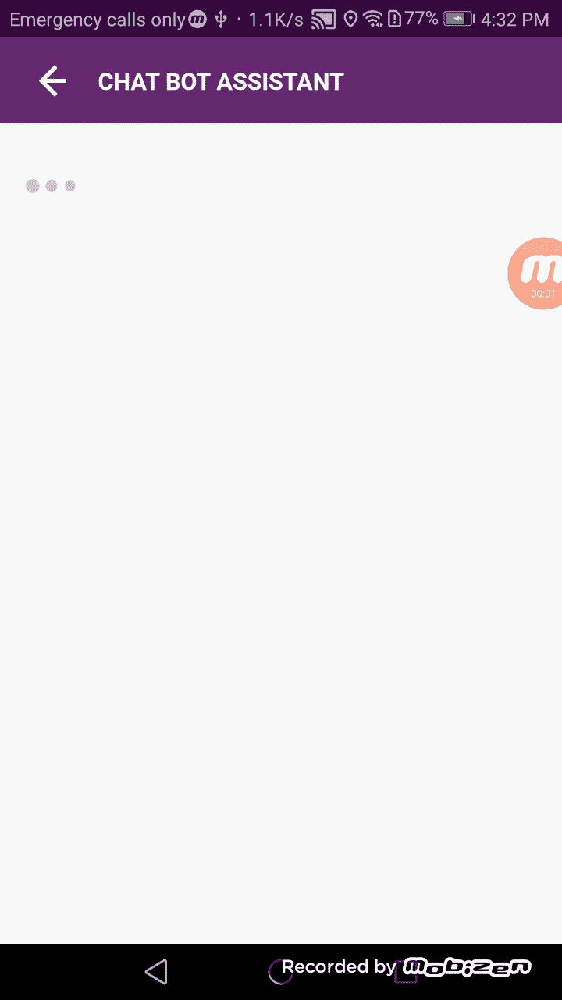

# React native:创建带有闪屏动画的聊天机器人助手

> 原文：<https://medium.com/nerd-for-tech/react-native-creating-chat-bot-assistant-with-splash-screen-animation-9b800b65d842?source=collection_archive---------4----------------------->


我在一个 react 本机应用程序中工作，该应用程序需要实现一个聊天机器人助手来回答客户的询问，该助手能够根据客户选择的答案继续对话。相关的问题和答案集是经过训练的机器学习模型的预测输出。这里，客户选择的答案被发送到后端 API，并通过后端调用第三方 API 来获得机器学习模型的预测输出，这将是向客户显示的下一个问题和答案集。在这篇文章中，我将分享我如何根据机器学习模型预测在 react native 中构建它。

这是完成后的聊天机器人助手的样子:



所以让我们开始吧。

## 定义示例后端 Json 响应:

这里我为每个数组项定义了一个类型，比如文本、列表。如果答案数组为空，我将数据项的类型定义为文本，如果有答案列表，我将类型定义为列表。这将有助于你创建对话项目的用户界面。如果你需要你可以根据相同的格式添加更多的类型，使功能丰富的输出。

## 实施:

作为我的初始实现，我在聊天机器人视图中调用后端 API*组件卸载*方法*。*

```
this.props.chatBotInitiate(requestParams, this);
```

然后，我需要将后端响应更新为 redux 状态。在这里，我将创建另一个聊天临时对象来操作应用程序端的数据，与后端响应格式相同。然后，我在一个 *setTimeout* 方法内将应用程序端 temp 对象更新为不同的 redux 状态，并在其中调用另一个 *setTimeout* ，以仅更新对应用程序端 temp 对象的后端响应的欢迎消息。在这里，我的目标是以秒为单位延迟渲染点指示器，然后渲染带有欢迎消息的闪屏。

下面是 *chatBotInitiate* 函数*的实现。*

这里我使用 redux 状态通过渲染 *ChatBotMainView.js* 中的内容。这是它在 *ChatBotMainView.js.* 中的样子，正如我在上面的第一个 *setTimeout* 方法中解释的那样，我用空数据数组和空欢迎消息更新 redux 状态，以呈现 *dotIndicatorView。*然后在第二个 *setTimeout* 方法中，我用欢迎消息更新 redux 状态以呈现闪屏。

在更新闪屏后的第二个 *setTimeout* 方法中，接下来我将通过使用另一个 *setTimeout* 递归更新数据项来将数据列表呈现为平面列表。这里我们需要将欢迎消息更新为空，以呈现转换内容。然后，我递归地将数组项更新为 redux 状态。下面是我实现的递归函数。

最后，我们需要使用 redux state 实现对话项的 UI。为此，我使用了一个单独的 *chatItemView.js* 来呈现列表项。这里的列表和文本类型项来自后端响应，该响应更新为应用程序端聊天临时对象。然后，我们需要使用不同的类型将用户选择的答案更新到相同的 redux 状态，因为 UI 在问题、答案列表和选择的答案方面是不同的。这里我用类型作为答案。在 *clickAnswer* 函数中，如果是列表类型的项目，我将调用 *updateChatBotAnswers* 来更新 app 端的 redux 状态。

```
this.props.updateChatBotAnswers(item, this.props.chat_bot_ui_data, this.props.screen_context);
```

下面是 *updateChatBotAnswers 的实现。*这里我将用户选择的答案更新到 app 端 redux 状态，最后需要调用后端 API 来获得基于用户选择的答案的响应。

因此，从上面的聊天机器人的例子，你可以创建一个简单的聊天机器人助手，你可以建立在它的基础上，使你的聊天机器人助手功能丰富和动态。此外，您可以集成语音到文本组件和文本输入，以获得来自客户的查询，使其更加复杂。

感谢您的阅读！