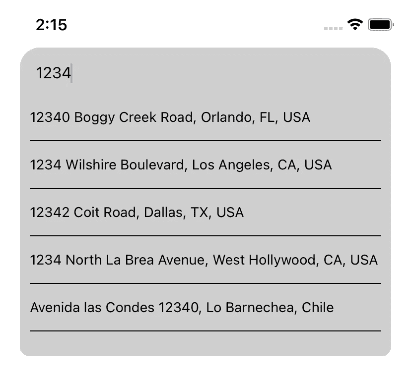
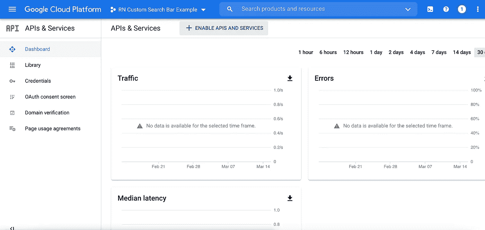
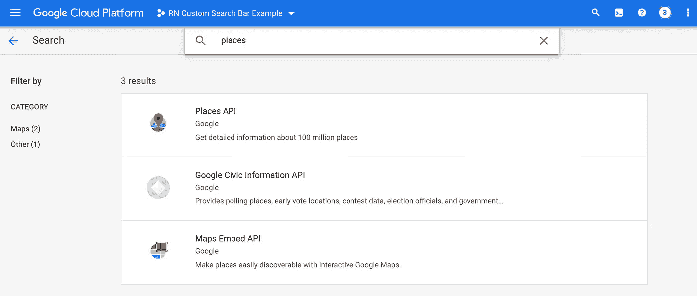
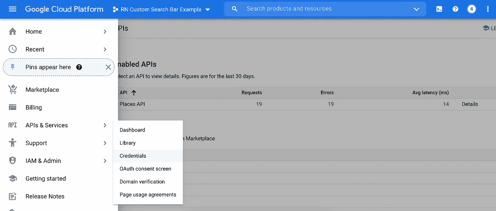
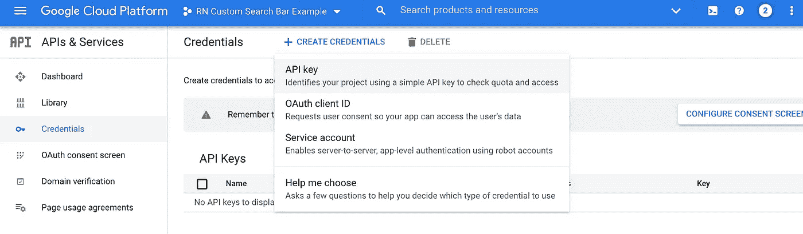
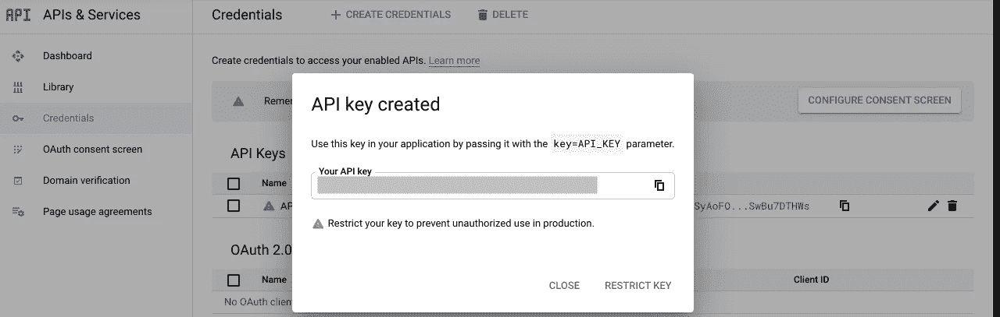
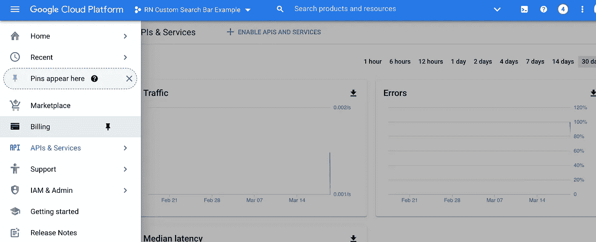

# (React Native)带有 Google Places 自动完成 API 的自定义搜索栏

> 原文：<https://medium.com/nerd-for-tech/react-native-custom-search-bar-with-google-places-autocomplete-api-69b1c98de6a0?source=collection_archive---------1----------------------->



在许多应用程序中，当你输入时，你会看到一些建议列在搜索栏的正下方。为了在 React Native 中实现这个特性，有一个名为“[React-Native-Google-places-autocomplete](https://github.com/FaridSafi/react-native-google-places-autocomplete)”的库。然而，实现相同特性的简单版本并不困难。如果你能建立自己的搜索栏，你将在样式和功能上有更大的灵活性。在本文中，我将向您展示如何使用自动完成功能构建您自己的搜索栏。

# 我的环境

*   反应性:0.63.4
*   打字稿:3.8.3
*   大苏尔马科斯:11.1

# 关于 iOS 和 Android 上潜在编译问题的说明

*   **iOS:** 如果你尝试使用`npx react-native run-ios`在模拟器上运行该应用，可能无法运行。在撰写本文时，React 原生版本(v 0.63.4)使用的`Flipper`库似乎有问题。如果你遇到了编译错误，你可以尝试从 Xcode 运行应用程序，或者你可以尝试从[GitHub 问题](https://github.com/facebook/react-native/issues/30836)的临时解决方案。在我写这篇文章的时候，React Native 0.64 已经发布了，所以希望这个问题在那个补丁中得到解决。
*   **Android:** 如果您最近将操作系统升级到 macOS Big Sur，`npx react-native run-android`可能会因为`JAVA_HOME`路径配置的问题而无法正常工作。为了让它工作，我卸载了旧版本的 Java(版本 9)，通过`Homebrew`从`AdoptOpenJDK`安装了`jEnv`和一些 Java 版本。在 macOS 上设置 Java 环境已经离题了，所以我不会在本文中涉及。然而，我在这篇文章的结尾留下了一些关于这个问题的文章的参考，所以你可以参考它们。

# 1.生成并设置项目

为了生成项目，您可以使用 React Native 社区中的 Typescript 模板。

```
**npx react-native init YourProjectName --template react-native-template-typescript**
```

**注意:**如果你全局安装了旧版本的`react-native`或`react-native-cli`，上面的命令就不起作用，需要卸载才能使其工作。有关更多信息，请参见来自 https://reactnative.dev/docs/typescript[和 https://github.com/react-native-community/cli](https://reactnative.dev/docs/typescript)[的 React 土著社区的官方文档。](https://github.com/react-native-community/cli)

当我生成这个项目时，由于某些原因，它附带了旧版本的`eslint`和`jest`。所以，我按照下面的步骤更新了它们。

```
// Uninstall @react-native-community/eslint-config once to work with the latest configuration, and re-install
**npm uninstall @react-native-community/eslint-config && npm i -D @react-native-community/eslint-config**// Uninstall eslint and re-install
**npm uninstall eslint && npm i -D eslint**// Uninstall jest related dependencies and re-install
**npm uninstall jest @types/jest babel-jest** **&& npm i -D jest @types/jest babel-jest**
```

这些命令应该将依赖项更新到最新配置的版本。你可以选择用下面的命令添加`typescript-eslint`插件和`prettier`。

```
// Add the typescript plugin for eslint **npm i -D @typescript-eslint/parser @typescript-eslint/eslint-plugin**// Add prettier
**npm i -D prettier eslint-config-prettier eslint-plugin-prettier**
```

这对于基本的项目设置应该足够了。

# 2.构建基本搜索栏视图

接下来，我们需要创建一个搜索栏组件。创建一个名为“components”的文件夹，并将组件文件放在该目录下。然后，添加以下代码。这只是用基本样式显示搜索栏的代码，所以我不会详细解释。

```
// ./components/SearchBarWithAutocomplete.tsx**import React, { FunctionComponent } from 'react'
import {
  StyleSheet,
  View,
  TextInput,
  ViewStyle
} from 'react-native'****type SearchBarProps = {
  value: string
  style?: ViewStyle | ViewStyle[]
  onChangeText: (text: string) => void
}****const SearchBarWithAutocomplete: FunctionComponent<SearchBarProps> = props => {
  const {
    value,
    style,
    onChangeText
  } = props** **const {
    container,
    inputStyle
  } = styles
  const passedStyles = Array.isArray(style) ? Object.assign({}, ...style) : style****return (
    <View style={[container, { ...passedStyles }]}>
      <TextInput
        style={inputStyle}
        placeholder='Search by address'
        placeholderTextColor='gray'
        value={value}
        onChangeText={onChangeText}
        returnKeyType='search'
      />
    </View>
  )
}****const styles = StyleSheet.create({
  container: {
    justifyContent: 'center'
  },
  inputStyle: {
    paddingVertical: 16,
    paddingHorizontal: 16,
    backgroundColor: '#cfcfcf',
    borderRadius: 20,
    color: 'black',
    fontSize: 16
  }
})****export default SearchBarWithAutocomplete**
```

我们还需要修改下面的`App.tsx`文件来显示我们刚刚创建的搜索栏。

```
// App.tsx**import React, { useState } from 'react'
import {
  SafeAreaView,
  StyleSheet,
  StatusBar,
  View
} from 'react-native'****import SearchBarWithAutocomplete from './components/SearchBarWithAutocomplete'****const App = () => {
  const [search, setSearch] = useState({ term: '' })****const { container, body } = styles****return (
    <>
      <StatusBar barStyle="dark-content" />
      <SafeAreaView style={container}>
        <View style={body}>
          <SearchBarWithAutocomplete
            value={search.term}
            onChangeText={(text) => setSearch({ term: text })}
          />
        </View>
      </SafeAreaView>
    </>
  )
}****const styles = StyleSheet.create({
  container: {
    flex: 1
  },
  body: {
    paddingHorizontal: 20
  }
})****export default App**
```

如果您构建并运行您的应用程序，您应该会看到屏幕上显示的搜索栏。

# 3.获取 Google Places API 密钥

为了实现自动完成功能，我们需要为 Google Places API 获取一个 API。

## 3.1.去谷歌云平台

访问[谷歌云平台控制台](https://console.cloud.google.com/google/maps-apis/)获取 API 密钥使用“谷歌地图 Javascript API”。

## 3.2.创建项目并启用 API

首先，在控制台上创建一个新项目，并导航到左侧抽屉导航中的“**API 和服务**”。然后，点击仪表板上的“**启用 API 和服务**”。



API 和服务仪表板

在下一个屏幕上，搜索“ **Places API** ”并启用它。



## 3.3.生成 API 密钥

启用 API 后，您需要创建一个密钥来实际使用 API。导航到“**API&服务**”下的“**凭证**，点击屏幕中上方的“**创建凭证**，选择“API key”。



在“API 和服务”下选择“凭据”



选择“API 密钥”

这将生成一个 API 密钥，所以请将它保存在安全的地方，因为您以后需要它来使用应用程序中的 API。



记下这把钥匙

## 3.4 创建一个计费帐户，并将其与项目关联

为了从 API 获得结果，您的 Google Cloud 项目需要有一个链接到您的项目的计费帐户。您可以创建一个计费账户，并在**“计费”**页面将其链接到您的项目。



创建一个计费帐户，并将其链接到您的项目

**注意:为了避免不必要的账单**，我建议你**在本教程结束时在 Google Cloud 控制台上禁用 API 或删除项目**。

# 4.实现向 API 发送请求的功能

现在，我们需要修改应用程序，以便能够使用 API 键向 Places API 发送请求。首先，用下面的命令安装`**axios**` ，这个库用于发送 HTTP 请求。

```
**npm i axios**
```

接下来，修改`App.tsx`文件，如下所示。

```
// App.tsx
// Duplicates are omitted and replaced with "..."import React, { useState } from 'react'
import {
  ...
} from 'react-native'
**// ==== Change No.1 ====
import axios from 'axios'**import SearchBarWithAutocomplete from './components/SearchBarWithAutocomplete'**// ==== Change No.2 ====
const GOOGLE_PACES_API_BASE_URL = 'https://maps.googleapis.com/maps/api/place'****// ==== Change No.3 ====
/**
 * Prediction's type returned from Google Places Autocomplete API
 *** [**https://developers.google.com/places/web-service/autocomplete#place_autocomplete_results**](https://developers.google.com/places/web-service/autocomplete#place_autocomplete_results) ***/
export type PredictionType = {
  description: string
  place_id: string
  reference: string
  matched_substrings: any[]
  tructured_formatting: Object
  terms: Object[]
  types: string[]
}**const App = () => {
  **// === Change No.4 ====**
  const [search, setSearch] = useState({ term: ''**, fetchPredictions: false** })
  **// ==== Change No.5 ====
  const [predictions, setPredictions] = useState<PredictionType[]>([])** const { container, body } = styles **// ==== Change No.6 ====**
  **/**
   * Grab predictions on entering text
   *    by sending reqyest to Google Places API.
   * API details:** [**https://developers.google.com/maps/documentation/places/web-service/autocomplete**](https://developers.google.com/maps/documentation/places/web-service/autocomplete) ***/**
  **const onChangeText = async () => {**
 **if (search.term.trim() === '') return
    if (!search.fetchPredictions) return** **const apiUrl = `${GOOGLE_PACES_API_BASE_URL}/autocomplete/json?key=${env.GOOGLE_API_KEY}&input=${search.term}`
    try {
      const result = await axios.request({
        method: 'post',
        url: apiUrl
      })
      if (result) {
        const { data: { predictions } } = result
        setPredictions(predictions)
      }
    } catch (e) {
      console.log(e)
    }
  }** **// ==== Change No. 7====
  /**
   * Grab lattitude and longitude on prediction tapped
   *    by sending another reqyest using the place id.
   * You can check what kind of information you can get at:
   *** [**https://developers.google.com/maps/documentation/places/web-service/details#PlaceDetailsRequests**](https://developers.google.com/maps/documentation/places/web-service/details#PlaceDetailsRequests) ***/
  const onPredictionTapped = async (placeId: string, description: string) => {
    const apiUrl = `${GOOGLE_PACES_API_BASE_URL}/details/json?key=${env.GOOGLE_API_KEY}&place_id=${placeId}`
    try {
      const result = await axios.request({
        method: 'post',
        url: apiUrl
      })
      if (result) {
        const { data: { result: { geometry: { location } } } } = result
        const { lat, lng } = location
        setShowPredictions(false)
        setSearch({ term: description })
      }
    } catch (e) {
      console.log(e)
    }
  }**return (
    <>
      <StatusBar barStyle="dark-content" />
      <SafeAreaView style={container}>
        <View style={body}>
          <SearchBarWithAutocomplete
            value={search.term}
            **// ==== Change No. 8 ====
     **       **onChangeText={(text) => {
              setSearch({ term: text, fetchPredictions: true })
              onChangeText()
            }}**
            **showPredictions={showPredictions}
            predictions={predictions}
            onPredictionTapped={onPredictionTapped}**
          />
        </View>
      </SafeAreaView>
    </>
  )
}const styles = StyleSheet.create({
  container: {
    flex: 1
  },
  body: {
    paddingHorizontal: 20
  }
})export default App
```

以下是对这些变化的解释。

1.  进口`axios`
2.  将基本 URL 存储在常量中，以便可以重复使用
3.  根据谷歌的官方 API 文档定义`PredictionType`
4.  将`fetchPredictions`添加到`search`状态
    `fetchPredictions`用于决定 app 是否应该向 API 发送请求。
5.  添加一个新的状态
    `predictions`:预测显示
6.  `onChangeText`方法
    文本改变时调用的方法。它通过向 API 发送请求来获取要显示的预测数据。如果输入为空，它会立即返回，这样就不会发送不必要的请求。
    如果`fetchPredictions`设置为`false`也会立即返回。这一行是必要的，以防止应用程序发送请求时，我们更新预测点击搜索栏中的文本。
7.  `onPredictionTapped`方法
    点击预测时调用的方法。它根据预测信息发送另一个请求，以获取更详细的信息，如纬度和经度。这个应用程序不使用纬度和经度，但如果你想在地图上使用搜索栏，这个功能会很方便。它还将整个地址设置到搜索栏中，而不显示预测。
8.  将方法和预测向下传递到搜索栏组件

此外，在搜索栏组件的类型定义中添加新的属性来解决林挺错误。类型定义现在应该是这样的。

```
// ./components/SearchBarWithAutocomplete.tsx**// ==== Change No. 1 ====
import { PredictionType } from '../App'**type SearchBarProps = {
  value: string
  style?: ViewStyle | ViewStyle[]
  onChangeText: (text: string) => void
  **// ==== Change No. 2====
  predictions: PredictionType[]
  showPredictions: boolean
  onPredictionTapped: (placeId: string, description: string) => void**
}
```

1.  从`App.tsx`
    导入`PredictionType`为了组织类型，保持项目的整洁，你也可以有一个存储类型定义的文件，将它们导入到其他文件中。例如，您可以创建一个名为`types.ts`的文件，并在那里存储类型定义。
2.  添加新的道具类型

# 5.显示预测

此时，应用程序应该能够获得必要的数据来显示。接下来，我们将修改搜索栏组件以显示预测。

```
// SearchBarWithAutocomplete.tsx
// Duplicates are omitted and replaced with "..."**// ==== Change No.1 ====**
import React, { FunctionComponent**, useState** } from 'react'
**// ==== Change No.2 ====** import {
  ...
  **FlatList,
  TouchableOpacity,
  Text**
} from 'react-native'...const SearchBarWithAutocomplete: FunctionComponent<SearchBarProps> = props => {
  **// ==== Change No.3 ====**
  **const [inputSize, setInputSize] = useState({ width: 0, height: 0 })** const {
    value,
    style,
    onChangeText,
    **// ==== Change No.4 ====
**    **onPredictionTapped,
    predictions,
    showPredictions**
  } = props const {
    container,
    inputStyle
  } = styles
  const passedStyles = Array.isArray(style) ? Object.assign({}, ...style) : style
  **// ==== Change No.5 ====
  const inputBottomRadius = showPredictions ?
    {
      borderBottomLeftRadius: 0,
      borderBottomRightRadius: 0
    }
    :
    {
      borderBottomLeftRadius: 20,
      borderBottomRightRadius: 20
    }** **// ==== Change No.6 ====
  const _renderPredictions = (predictions: PredictionType[]) => {
    const {
      predictionsContainer,
      predictionRow
    } = styles
    const calculatedStyle = { 
      width: inputSize.width
    }

    return (
      <FlatList
        data={predictions}
        renderItem={({ item, index }) => {
          return (
            <TouchableOpacity
              style={predictionRow}
              onPress={() => onPredictionTapped(item.place_id, item.description)}
            >
              <Text
                numberOfLines={1}
              >
                {item.description}
              </Text>
            </TouchableOpacity>
          )
        }}
        keyExtractor={(item) => item.place_id}
        keyboardShouldPersistTaps='handled'
        style={[predictionsContainer, calculatedStyle]}
      />
    )
  }**return (
    <View style={[container, { ...passedStyles }]}>
      <TextInput
        **// ==== Change No.7 ====
 **       style={**[inputStyle, inputBottomRadius]**}
        placeholder='Search by address'
        placeholderTextColor='gray'
        value={value}
        onChangeText={onChangeText}
        returnKeyType='search'
        **// ==== Change No.8 ====
        onLayout={(event) => {
          const { height, width } = event.nativeEvent.layout
          setInputSize({ height, width })
        }}**
      />
      **// ==== Change No.9 ====
      {showPredictions && _renderPredictions(predictions)}**
    </View>
  )
}const styles = StyleSheet.create({
  ... **// ==== Change No.10 ====
  predictionsContainer: {
    backgroundColor: '#cfcfcf',
    padding: 10,
    borderBottomLeftRadius: 10,
    borderBottomRightRadius: 10
  },
  predictionRow: {
    paddingBottom: 15,
    marginBottom: 15,
    borderBottomColor: 'black',
    borderBottomWidth: 1,
  }**
})export default SearchBarWithAutocomplete
```

这里是变化的总结。

1.  从`react`进口`useState`
2.  从`react-native`导入`FlatList`、`TouchableOpacity`和`Text`
3.  添加新状态`inputSize
    inputSize`用于匹配预测框宽度和`TextInput`宽度。当`TextInput`被渲染时，其宽度和高度将通过`onLayout` prop 存储在该状态下。
4.  提取新道具
5.  调整输入风格
    显示预测时调整输入风格。否则，由于`borderBottomRadius`，在`TextInput`和预测值之间会有多余的空间。
6.  `_renderPredictions`方法
    `_renderPredictions`方法用于渲染`TextInput`正下方的预测。
7.  应用输入样式更改
8.  通过`onLayout`设置`inputSize`
9.  当`showPredictions`为`true`时渲染预测
10.  预测的样式

现在，当您在搜索栏中键入一些内容时，您应该会看到预测。

# 6.我们当前实施的一个关键问题

现在，应用程序能够从 API 获得预测，并在应用程序中显示它们。然而，有一个问题。在我们当前的实现中，每次用户输入内容时，应用程序都会发送一个请求。这在性能方面可能非常糟糕。为了解决这个问题，我们可以使用`**debounce**` 函数**。**

# 7.什么是去抖功能？

`debounce`函数用于延迟函数调用。例如，当它用于搜索栏时，它等待用户停止输入，这样它就不会进行不必要的函数调用。

你可能想知道为什么我们不能只使用内置的 JavaScript 函数`setTimeout`。`setTimeout`的问题是传递给它的回调仍然会在每次检测到依赖关系的变化时被调用。它可以延迟函数调用，但是没有它执行的次数是一样的。

# 8.创建一个自定义挂钩“useDebounce”

现在，为了在我们的应用程序中拥有`debounce`功能，我们将实现一个自定义的`useDebounce`钩子。用下面的代码创建一个名为`hooks`的目录，并在该目录下放置一个名为`useDebounce.ts`的文件。

```
// useDebounce.ts**import { useCallback, useEffect } from "react"****/**
 *** [**@param**](http://twitter.com/param) **{ (...args: any[]) => any } fn - A callback function to use debounce effect on.
 *** [**@param**](http://twitter.com/param) **{ number } delay - A number that indicates how much time it waits.
 *** [**@param**](http://twitter.com/param) **{ any[] } deps - A dependency list.
 * 
*/
export const useDebounce = (
  fn: (...args: any[]) => any,
  delay: number,
  deps: any[]
) => {
  /**
   * Store the memoized version of the callback.
   * It changes only when one of the dependencies has has changed.
   * See official documentation at:** [**https://reactjs.org/docs/hooks-reference.html#usecallback**](https://reactjs.org/docs/hooks-reference.html#usecallback) *** */
  const callback = useCallback(fn, deps)** **/**
   * useEffect gets re-called whenever "callback" changes.
   * You can add "delay" to the second argument array,
   *    if you want to change "delay" dynamically.
   * */
  useEffect(() => {
    // Call the memoized version of callback after the delay
    const handler = setTimeout(() => {
      callback()
    }, delay)** **/**
     * Clear timeout when useEffect gets re-called,
     *    in other words, when "callback" changes.
     * */
    return () => {
      clearTimeout(handler)
    }
  }, [callback])
}**
```

我在代码中留下了一些注释来解释每一行，但是基本上，如果用户在一段延迟时间内没有键入任何东西，它所做的只是执行传递的回调函数。

# 9.修改应用程序以使用“`useDebounce"`挂钩

最后，我们需要修改应用程序来使用我们刚刚创建的`useDebounce`钩子。对`App.tsx`进行以下更改。

```
// App.tsx
// Duplicates are omitted and replaced with "..."import React, { useState } from 'react'**// Change No.1
import { useDebounce } from './hooks/useDebounce'**...const App = () => {
  ... const onChangeText = async () => {
    if (search.term.trim() === '') return
    if (!search.fetchPredictions) return const apiUrl = `${GOOGLE_PACES_API_BASE_URL}/autocomplete/json?key=${env.GOOGLE_API_KEY}&input=${search.term}`
    try {
      const result = await axios.request({
        method: 'post',
        url: apiUrl
      })
      if (result) {
        const { data: { predictions } } = result
        setPredictions(predictions)
        setShowPredictions(true)
      }
    } catch (e) {
      console.log(e)
    }
  }
  **// Change No.2**
  **useDebounce(onChangeText, 1000, [search.term])** ...return (
    <>
      <StatusBar barStyle="dark-content" />
      <SafeAreaView style={container}>
        <View style={body}>
          <SearchBarWithAutocomplete
            value={search.term}
            **// Change No.3
            onChangeText={(text) => {
              setSearch({ term: text, fetchPredictions: true })
            }}**
            showPredictions={showPredictions}
            predictions={predictions}
            onPredictionTapped={onPredictionTapped}
          />
        </View>
      </SafeAreaView>
    </>
  )
}
```

1.  导入`useDebounce`
2.  在`onChangeText` 下添加调用`useDebounce`的代码行，每当它检测到`search.term`的变化时就会被调用。
3.  更换`SearchBarWithAutocomplete` 的`onChangeText`支柱从`onChangeText`支柱上删除线`onChangeText()`，因为不再需要它。

现在，你不应该看到预测，直到你停止输入一秒钟。

本文到此为止。

你可以在[我的 GitHub 库](https://github.com/KentaKodashima/RNCustomSearchBarWithGooglePlacesAutocomplete)找到完整的代码。

## 参考

*   **洛达什官方文件— _。去抖:
    【https://lodash.com/docs/4.17.15#debounce】**
*   **JavaScript 中的去抖——提高你的应用性能:** [https://level up . git connected . com/de bounce-in-JavaScript-Improve-Your-applications-Performance-5b 01855 e086](https://levelup.gitconnected.com/debounce-in-javascript-improve-your-applications-performance-5b01855e086)
*   **去抖解释——如何让你的 JavaScript 等待你的用户完成打字:** [https://www . freecodecamp . org/news/de bounce-Explained-How-To-Make-Your-JavaScript-Wait-Your-User-To-Finish-Typing-2/](https://www.freecodecamp.org/news/debounce-explained-how-to-make-your-javascript-wait-for-your-user-to-finish-typing-2/)
*   **stack overflow—React Hook 如何使用油门或去抖？:** [https://stack overflow . com/questions/54666401/how-to-use-throttle-or-de bounce-with-react-hook](https://stackoverflow.com/questions/54666401/how-to-use-throttle-or-debounce-with-react-hook)
*   **GitHub 问题—无法从 XCode 中的框构建 react native:找不到“event2/event-config.h”文件# 30836:** [https://github.com/facebook/react-native/issues/30836](https://github.com/facebook/react-native/issues/30836)
*   **升级到 macOS Big Sur v11.0.1 后的错误 JAVA _ HOME:** [https://stack overflow . com/questions/64917779/error-JAVA-HOME-after-upgrade-to-MAC OS-Big-Sur-v 11-0-1](https://stackoverflow.com/questions/64917779/wrong-java-home-after-upgrade-to-macos-big-sur-v11-0-1)
*   **如何在 MacOS 上卸载 Java:【https://explainjava.com/uninstall-java-macos/】**
*   **使用 Homebrew 和 JEnv 在 MacOS 上安装 Java:** [https://dev . to/gabethere/Installing-Java-on-a-MAC-using-home brew-and-jevn-12 M8](https://dev.to/gabethere/installing-java-on-a-mac-using-homebrew-and-jevn-12m8)
*   **GitHub 资源库—AdoptOpenJDK/home brew-open JDK:** [https://github.com/AdoptOpenJDK/homebrew-openjdk](https://github.com/AdoptOpenJDK/homebrew-openjdk)
*   **GitHub 资源库—jenv/jenv:** [https://github.com/jenv/jenv](https://github.com/jenv/jenv)