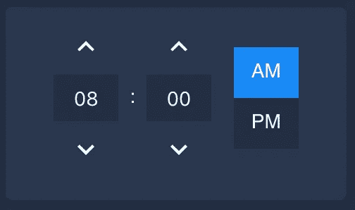
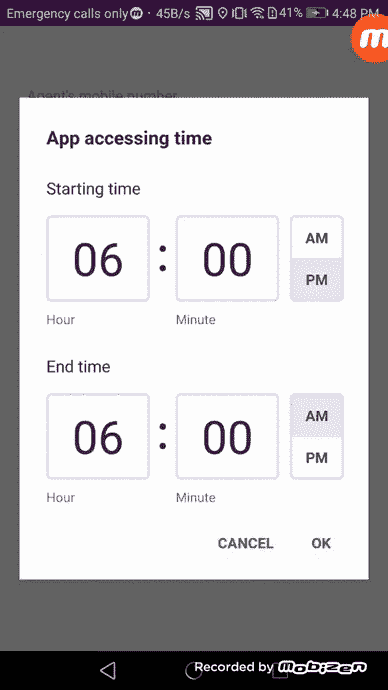

# 反应本机:实现时间范围选择器

> 原文：<https://medium.com/nerd-for-tech/react-native-implement-time-range-module-ee4eacdd10eb?source=collection_archive---------1----------------------->



我正在开发一个 react 本地应用程序，它需要实现一个时间范围模块，能够为用户输入开始和结束时间，并使用两个最小和最大截止时间验证开始和结束时间。我实现的主要目的是，主用户应该能够管理子用户在其时间范围内的应用程序访问时间。在这篇文章中，我将分享我是如何建造它的。

完成的时间范围模块如下所示:



所以让我们开始行动吧！

**实施:**

在这里，我使用 [react-native-navigation](https://www.npmjs.com/package/react-native-navigation) 将时间选择器显示为覆盖图。

下面是 ***onPress*** 函数的样子:

在这里，我将开始和结束时间分离数据对象、本地化和 *onpressOkFn* *函数*作为 *passprops* 发送。时间分离对象的初始格式如下。

```
let time_separation_data = {hours: 0,minutes: 0,is_am: false,is_pm: false};
```

如果已经为用户设置了时间范围，我们需要通过验证默认时间将它们分开，如下所示。

**时间验证:**

```
const isValidAgentStartEndTime = (time) => {let is_valid_time = false;if (time !== undefined && time !== null && time !== '') {is_valid_time = true;}return is_valid_time;};
```

**时间间隔:**

```
const separateTimeIn12h = (time) => {let time_separation_data = {hours: 0,minutes: 0,is_am: false,is_pm: false};if (isValidAgentStartEndTime(time)) {let time1 = time.split(':');let hours = time1[0];let minutes = time1[1];let am_pm = parseInt(hours) >= 12 ? TIME_LABEL.PM : TIME_LABEL.AM;hours = parseInt(hours) % 12;hours = hours ? hours : 12;minutes = parseInt(minutes) < 10 ? '0' + parseInt(minutes) : parseInt(minutes);hours = hours < 10 ? '0' + hours : hours;time_separation_data = {hours: hours,minutes: minutes,is_am: (am_pm === TIME_LABEL.AM) ? true : false,is_pm: (am_pm === TIME_LABEL.PM) ? true : false,am_pm: am_pm};
}return time_separation_data;};
```

**时间范围模块组件:**

下面是时间范围模块的 UI 实现，最初我将开始和结束时间、分钟、am/pm 配置分别分配给状态变量。接下来，我实现了*timeinputuicomponent . js*来呈现开始和结束时间输入模块。这里我对*常量*和*公共函数*使用单独的文件，因为这将有助于轻松管理模块。我稍后会在我的帖子中解释这些，你也可以在我的源代码中清楚地找到。

**时间输入组件:**

下面是*timeinputuicomponent . js*作为功能组件的实现。这里我使用[react-native-masked-text](https://www.npmjs.com/package/react-native-masked-text)进行文本输入。对于 AM/PM 切换器，我实现了一个独立的功能组件。

**AM/PM 切换器组件:**

在这里，我为开始和结束时间输入分别实现了 *onChangeText* 功能逻辑，如下所示。

这里我们需要使用*validatehouinput*函数验证用户输入的小时数，如下所示。

```
const validateHourInput = (newHoursFromInput) => {if (parseInt(newHoursFromInput) > 24) {console.log('validateHourInput');return 12;} else {return convert12HourFormat(newHoursFromInput);}};
```

我使用一个单独的函数来验证用户输入的分钟数，如下所示。我已经使用了*默认时间值作为‘00’*，它被声明为常量。

```
const validateMinuteInput = (newMinutesFromInput) => {if (newMinutesFromInput > 59) {console.log('validateMinuteInput 2');return DEFAULT_TIME_VALUE;} else {return newMinutesFromInput;}};
```

此外，我实现了逻辑来验证用户输入的开始和结束时间，主要用户的时间范围如下。

最后，我需要实现 AM/PM 按钮的逻辑，如下所示。

我用来构建逻辑的支持函数分别添加如下。

以下是我用过的常量:

这个帖子到此为止！这个实现很简单，但是你可以在它的基础上使用时钟图标选择用户输入，并且更加复杂和功能丰富。

你可以在这里找到完整的源代码。

感谢您的阅读！