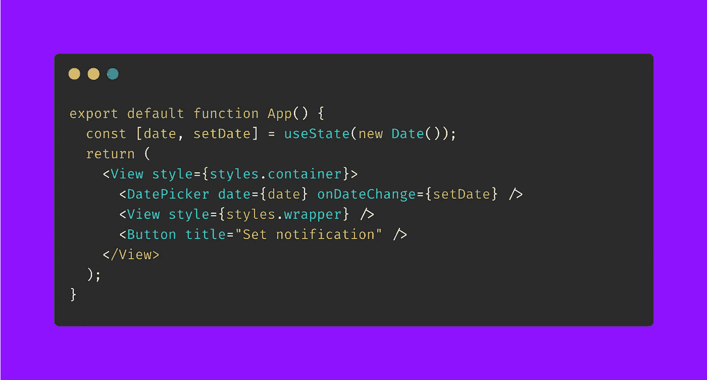
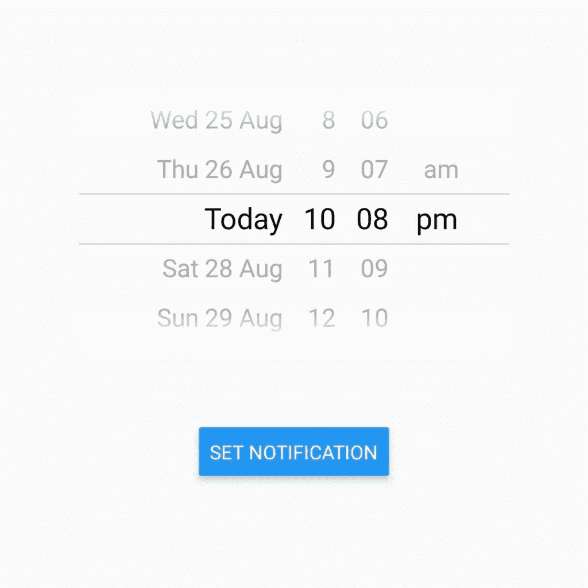
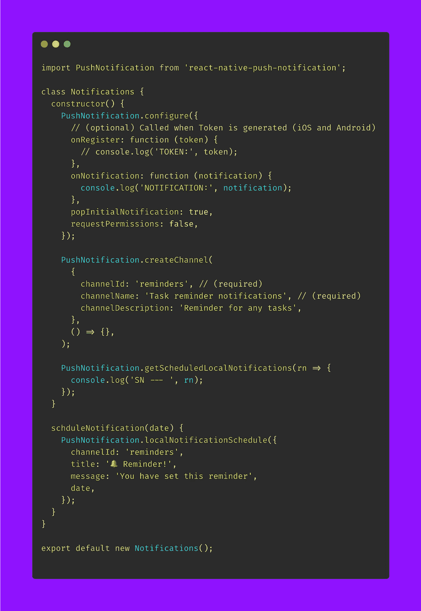
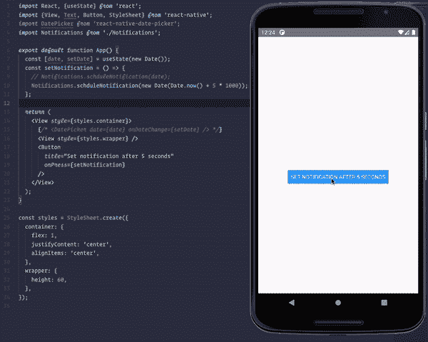
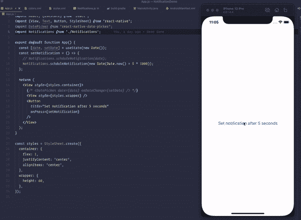

# 对本地推送通知做出反应

> 原文：<https://medium.com/nerd-for-tech/react-native-local-push-notifications-4dcca5a14fd4?source=collection_archive---------0----------------------->


照片由[杰米街](https://unsplash.com/@jamie452?utm_source=unsplash&utm_medium=referral&utm_content=creditCopyText)在 [Unsplash](https://unsplash.com/s/photos/notification?utm_source=unsplash&utm_medium=referral&utm_content=creditCopyText)

# 更新

我建议使用[notifie](https://notifee.app/)库来做你的本地和远程推送通知。它太好了，保养得很好！我用 Notifee 发表了一篇新的博客文章。你会在这里找到它，

[](https://www.notjust.dev/blog/2023-02-02-react-native-local-push-notifications) [## React Native 中的 React Native 本地推送通知入门

### 作为一名应用程序开发人员，需要考虑的最重要的事情之一是如何让你的用户参与进来。推送通知…

www.notjust.dev](https://www.notjust.dev/blog/2023-02-02-react-native-local-push-notifications) 

# 背景

在我们的应用程序中，很多时候我们需要设置本地推送通知。本地通知是什么意思？基本上，推送通知不会从云服务触发，例如，firebase 推送通知是一种远程推送通知服务。类似地，我们还有其他用于远程通知的推送通知服务。

然而，有时我们只想从我们的应用程序端设置通知。假设我们的应用程序中有一个提醒系统，当用户设置时间时，我们需要在特定时间设置通知。

我们将在这篇博文中看到我们如何实现这一目标。我们将使用一个名为[react-native-push-notification](https://github.com/zo0r/react-native-push-notification)的非常好的包。在这篇文章中，我将展示 android 部分，在下一篇文章中，我将写在 iOS 上。

# **演示开始**

开始吧！首先，我们需要一个演示应用程序来显示我们的通知正在工作。那么，让我们创建一个演示应用程序。

```
npx react-native init NotificationDemo
```

出于演示目的，我们需要一个 DateTime 输入，以便用户可以设置通知时间。对于日期选择器，我将安装[react-native-date-picker](https://github.com/henninghall/react-native-date-picker)。安装这个包之后，我们将设置我们的演示组件。



演示组件

有了上面的内容，我们得到了下面的输出。



我们的应用

我们的演示应用程序已经设置好了。现在让我们来看看这篇博文的重点——通知。首先，我将安装通知包。

```
yarn add react-native-push-notification
```

# 程序包设置

不要忘记为 iOS 进行 pod 安装。我们基本上可以遵循软件包中的自述文件，但是因为我们的主要焦点是本地推送通知，所以我们将忽略文档中与 firebase 设置相关的任何内容。

# Android 设置(根据官方自述编写)

只需将以下部分复制粘贴到`<application>`内的`AndroidManifest.xml`文件中，不要忘记根据您的应用名称在必要的地方更改应用名称。

```
<meta-data android:name="google_analytics_adid_collection_enabled" android:value="false" />
<meta-data android:name="com.dieam.reactnativepushnotification.notification_channel_name" android:value="NotifcationDemo"/>
<meta-data android:name="com.dieam.reactnativepushnotification.notification_channel_description" android:value="NotifcationDemo Notifications"/>
<!-- Change the resource name to your App's accent color - or any other color you want -->
<meta-data android:name="com.dieam.reactnativepushnotification.notification_color" android:resource="@android:color/white"/>

<receiver android:name="com.google.android.gms.gcm.GcmReceiver" android:exported="true" android:permission="com.google.android.c2dm.permission.SEND">
   <intent-filter>
      <action android:name="com.google.android.c2dm.intent.RECEIVE" />
       <category android:name="${applicationId}" />
   </intent-filter>
</receiver>
<receiver android:name="com.dieam.reactnativepushnotification.modules.RNPushNotificationPublisher" />
<receiver android:name="com.dieam.reactnativepushnotification.modules.RNPushNotificationBootEventReceiver">
    <intent-filter>
        <action android:name="android.intent.action.BOOT_COMPLETED" />
    </intent-filter>
</receiver>
<service android:name="com.dieam.reactnativepushnotification.modules.RNPushNotificationRegistrationService"/>
<service android:name="com.dieam.reactnativepushnotification.modules.RNPushNotificationListenerServiceGcm" android:exported="false">
    <intent-filter>
       <action android:name="com.google.android.c2dm.intent.RECEIVE" />
    </intent-filter>
</service>
```

另外，在顶部添加权限。

```
<uses-permission android:name="android.permission.VIBRATE" />
<uses-permission android:name="android.permission.RECEIVE_BOOT_COMPLETED"/>
```

一个重要的设置需要补充，来自文档——“如果没有为`notification_color` `meta-data`项目使用内置的安卓颜色(`@android:color/{name}`)。在`android/app/src/main/res/values/colors.xml`(如果不存在，创建文件)。”

在这个演示应用程序中，我在`android/app/src/main/res/values/colors.xml`中创建了文件，并在这个文件中添加了以下内容。

```
<resources>
    <color name="white">#FFF</color>
</resources>
```

至此我们的 android 原生端设置完成！现在是时候回到我们的 React 原生应用了。

# iOS 设置(根据官方自述编写)

对于我们的 iOS 设置，我们需要首先安装[@ react-native-community/push-notification-iOS](https://github.com/react-native-push-notification/ios)。我们可以通过`yarn add @react-native-community/push-notification-ios`做到这一点，然后我们需要在应用程序的 ios 文件夹中运行`pod install`。现在我们需要遵循几个步骤来完成 iOS 设置。

**1。添加功能:后台模式—远程通知**

进入 NotificationDemo/ios 目录，打开 MyProject.xcworkspace 工作区。选择顶部项目“NotificationDemo ”,然后选择“Signing & Capabilities”选项卡。使用“+”按钮添加 2 项新功能:

*   `Background Mode`能力和滴答`Remote Notifications`。
*   `Push Notifications`能力

**2** 。**更新** `**AppDelegate.h**`

在文件的顶部:

`#import <UserNotifications/UNUserNotificationCenter.h>`，

然后，将“unusernotificationcenteredelegate”添加到协议:`@interface AppDelegate : UIResponder <UIApplicationDelegate, RCTBridgeDelegate, UNUserNotificationCenterDelegate>`

**3** 。**更新** `**AppDelegate.m**`

在文件的顶部:

```
#import <UserNotifications/UserNotifications.h>
#import <RNCPushNotificationIOS.h>
```

然后，添加以下几行:

```
// Required for the register event.
- (void)application:(UIApplication *)application didRegisterForRemoteNotificationsWithDeviceToken:(NSData *)deviceToken
{
 [RNCPushNotificationIOS didRegisterForRemoteNotificationsWithDeviceToken:deviceToken];
}
// Required for the notification event. You must call the completion handler after handling the remote notification.
- (void)application:(UIApplication *)application didReceiveRemoteNotification:(NSDictionary *)userInfo
fetchCompletionHandler:(void (^)(UIBackgroundFetchResult))completionHandler
{
  [RNCPushNotificationIOS didReceiveRemoteNotification:userInfo fetchCompletionHandler:completionHandler];
}
// Required for the registrationError event.
- (void)application:(UIApplication *)application didFailToRegisterForRemoteNotificationsWithError:(NSError *)error
{
 [RNCPushNotificationIOS didFailToRegisterForRemoteNotificationsWithError:error];
}
// Required for localNotification event
- (void)userNotificationCenter:(UNUserNotificationCenter *)center
didReceiveNotificationResponse:(UNNotificationResponse *)response
         withCompletionHandler:(void (^)(void))completionHandler
{
  [RNCPushNotificationIOS didReceiveNotificationResponse:response];
}
```

然后在 AppDelegate 实现中，添加以下内容:

```
- (BOOL)application:(UIApplication *)application didFinishLaunchingWithOptions:(NSDictionary *)launchOptions
{
  ...
  // Define UNUserNotificationCenter
  UNUserNotificationCenter *center = [UNUserNotificationCenter currentNotificationCenter];
  center.delegate = self; return YES;
}//Called when a notification is delivered to a foreground app.
-(void)userNotificationCenter:(UNUserNotificationCenter *)center willPresentNotification:(UNNotification *)notification withCompletionHandler:(void (^)(UNNotificationPresentationOptions options))completionHandler
{
  completionHandler(UNNotificationPresentationOptionSound | UNNotificationPresentationOptionAlert | UNNotificationPresentationOptionBadge);
}
```

# 应用程序端设置

为了使用 react-native-push-notification，首先，我们将创建一个`Notifications`类来保存应用程序所需的公共配置和服务。我们不能在组件内部初始化我们的通知，所以它需要在组件之外，并且应该在我们项目的根目录下。

我将创建一个通知类，并直接从文件中导出它的实例。这样，它将作为单例运行。每当我们在任何组件中导入通知类时，它将被初始化一次，并将在整个应用程序中使用。

现在让我们看看我们的通知类



通知类

上述类别的少数故障

*   我们需要首先调用 configure 来初始化我们的 PushNotification，注意，在这个演示中我们并不真正需要 onRegister 函数和 onNotification 函数。但是我们确实需要创建通道，没有通道，通知就无法工作
*   接下来，我们看到名为`scheduleNotification`的函数，我们将从我们的主应用程序组件中使用它。当用户设置日期时，我们还可以注意到它接收了一个 date 对象。`scheduleNotification`将在我们传递给它的选项的日期时间为我们安排一个本地推送通知。我们还需要提到 channelD。可以进行更多的定制。我们现在只是设置一个标题和信息。

仅此而已！现在我们只需要在我们的主应用程序组件中使用这个类。我们可以在用户按下设置通知按钮时完成。


让我们看看我们的最终演示，请注意，为了演示的目的，我计划在 5 秒钟后通知。



android 演示



iOS 演示

这里是这个演示的 [git 回购](https://github.com/Saad-Bashar/LocalPush-Notifications)。今天就到这里，希望在我的下一篇博文中，我们能在 iOS 上看到。