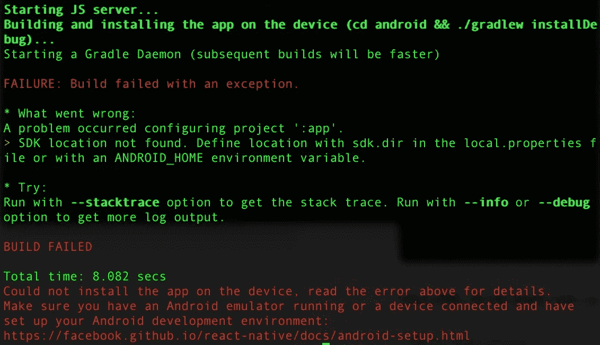

# React Native 找不到 SDK 位置。使用 local.properties 文件中的 sdk.dir 或 ANDROID_HOME 环境变量定义位置

> 原文：<https://medium.com/nerd-for-tech/react-native-sdk-location-not-found-2688c3440aeb?source=collection_archive---------2----------------------->



我最近为一次黑客马拉松创建了一个新的 React 原生应用 [SkinSafe](https://apps.apple.com/us/app/skinsafe-app/id1573125560) (我们赢了)！当我试图在 Android 模拟器上运行该应用程序时，按照 React 原生文档，我遇到了以下错误:

```
Error: SDK location not found. Define location with sdk.dir in the local.properties file or with an ANDROID_HOME environment variable.
```

我很困惑，因为我根本没有弄乱 Android 项目，我遵循了 React Native 对我的新应用程序的所有说明。互联网上的解决方案涉及不同操作系统的不同复杂步骤，以及修改计算机的环境变量。这对我来说感觉不对，因为我从来没有为我的其他应用程序这样做过。

我最终能够通过简单地在 Android Studio 中打开我的项目的 Android 文件夹来解决这个问题。“local.properties”文件是在 Android Studio 打开该文件夹时自动创建的，之后我的项目运行得非常好。以下是如何在 Android Studio 中打开您的项目:

1.  打开 Android Studio
2.  单击“打开现有项目”
3.  在你的项目文件夹中选择“android”文件夹
4.  按“打开”

就是这样！Android Studio 第一次打开这个项目花了几分钟，但是“local.properties”文件很快就创建好了。感谢您阅读我的文章，希望它为您节省了一些时间！