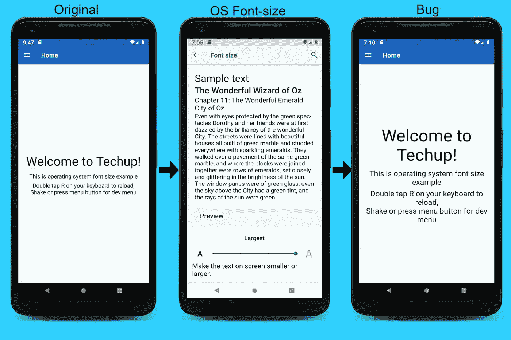
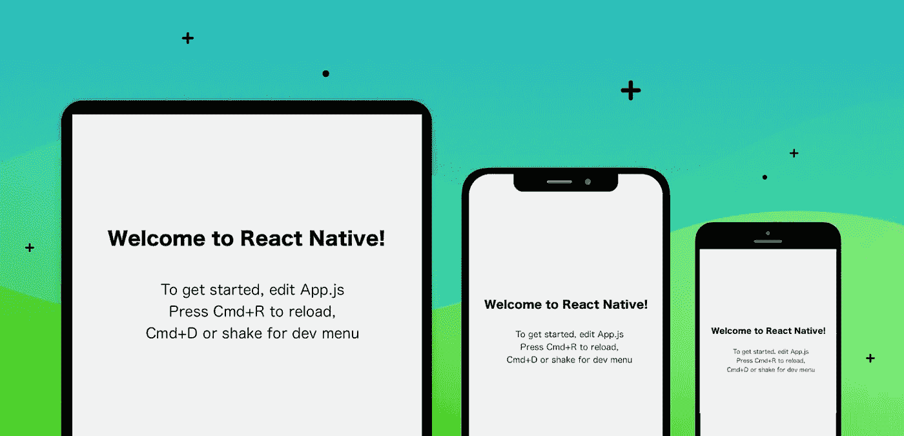

# 反应原生:样式规范化||响应设计

> 原文：<https://medium.com/nerd-for-tech/react-native-styles-normalization-e8ce77a3110c?source=collection_archive---------0----------------------->

当我们开发 React 原生应用程序时，在某些情况下，我们希望该应用程序可以在手机和平板电脑(iPad，Android 平板电脑)上运行。

这种需求的一个挑战是视觉上不同的样式，比如字体大小不能根据屏幕大小进行调整。

iOS 和 Android 设备的像素比例不同。如果您以像素为单位定义字体大小，则大小可能因设备而异。因此，我们必须根据设备的像素密度和尺寸来解释每种字体、宽度和高度。



# 解决方案是:

React 本机应用程序的这种问题可以通过相对于固定的屏幕尺寸比例规范化样式来解决。

## 示例:基于 iPhone 11 秤

> 屏幕宽度= 414 屏幕高度= 896
> 
> 注意:任何设备都可以被考虑用于这种固定比例的输入。最好选择为 UX 设计的设备。

使用这些固定比例来计算 baseWidth 和 baseHeight。

# 第一步:

首先，我们需要从 react-native 包中提取屏幕的高度和宽度。

```
import { Dimensions } from 'react native';const { 
  width: SCREEN_WIDTH, 
  height: SCREEN_HEIGHT 
  } = Dimensions.get('window');
```

现在我们有了当前设备的屏幕宽度和高度，我们可以计算基本比例。

```
const widthBaseScale = SCREEN_WIDTH / 414;
const heightBaseScale = SCREEN_HEIGHT / 896;
```

# 第二步:

使用基本尺度，我们必须创建一个函数来计算最合适的尺寸。

```
import { PixelRatio } from 'react-native'; function normalize(size, based = 'width') {
 const newSize = (based === 'height') ? 
                 size * heightBaseScale : size * widthBaseScale; return Math.round(PixelRatio.roundToNearestPixel(newSize));
}
```

这个 ***规格化函数接受两个参数，即大小和基类型(based)*** 。使用来自 react-native 包的 PixelRatio，我们可以根据输入的大小四舍五入到最近的像素。

# 第三步:

此 ***规格化*** 函数可用于创建和导出可输入字体、边距、填充、高度、宽度等大小的函数。

```
***//for width  pixel***
const widthPixel = (size) => {
  return normalize(size, 'width');
};***//for height  pixel***
const heightPixel = (size) => {
  return normalize(size, 'height');
};***//for font  pixel***
const fontPixel = (size) => {
  return heightPixel(size);
};***//for Margin and Padding vertical pixel***
const pixelSizeVertical = (size) => {
  return heightPixel(size);
};***//for Margin and Padding horizontal pixel***
const pixelSizeHorizontal = (size) => {
  return widthPixel(size);
};export {
  widthPixel,
  heightPixel,
  fontPixel,
  pixelSizeVertical,
  pixelSizeHorizontal
};
```

# 用法示例

可以在样式表中使用上面导出的函数来规范化大小，如下面的代码片段所示。

```
const styles = StyleSheet.create({
 container: {
   paddingHorizontal: **pixelSizeHorizontal(15)**,
   paddingVerticle: **pixelSizeVertical(20)**,
   marginBottom: **pixelSizeVertical(10)**,
   height: **heightPixel(200)**,
   width: **widthPixel(200)**,
 },

 title: {
   fontSize: **fontPixel(18)**,
   paddingVerticle: **pixelSizeVertical(10)**,
 },})
```

# 结论



上面的实现是在不同大小的设备上实现干净的大小合适的用户界面的最简单的方法之一。