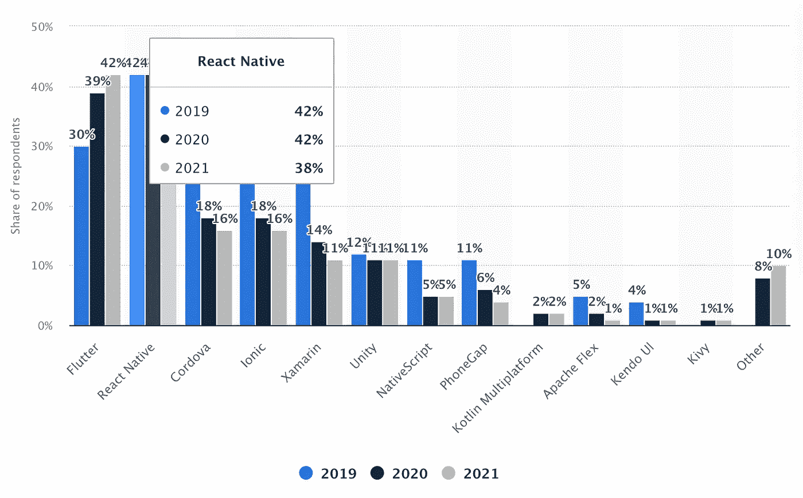

# 反应本土:我从惨痛的教训中学到了两个重要的教训

> 原文：<https://medium.com/nerd-for-tech/react-native-two-important-lessons-i-learned-the-hard-way-3a524bbcef48?source=collection_archive---------0----------------------->

## 在构建跨平台应用程序时，注意并防止事情朝着错误的方向发展。

照片由[西格蒙德](https://unsplash.com/@sigmund?utm_source=unsplash&utm_medium=referral&utm_content=creditCopyText)在 [Unsplash](https://unsplash.com/?utm_source=unsplash&utm_medium=referral&utm_content=creditCopyText) 上拍摄

发展的头几个月就像跑马拉松的前一百米。构建很简单，代码库很小，没有生产问题或技术债务:生活很美好。一旦我们开始接纳新用户，我们的日常工作就会发生变化。

在生产中使用 React 原生应用程序就像在公海上航行一样。有许多重要的决策需要分析和做出。任何事情都没有标准的解决方案，这可能是最难的一点。你必须聪明，选择最适合你需要的选项。您必须做出的最初决定:

*   Expo 或 RN CLI
*   Redux、Apollo、MobX 或上下文 API
*   样式表或样式组件
*   类型脚本或 Javascript

尽管您需要自己决定什么最适合您，但在跨平台开发方面，React Native 仍然占据首要位置。

统计学家:跨平台框架

无论你准备得多么充分，认为你做出了正确的决定，事情都会出错。大多数移动应用程序都超出了应用程序商店的评级，生产中的一次崩溃可能代价高昂。然而，关注重要因素将降低灾难风险(崩溃或性能问题)。

# 1.航行

React Native 的两个常见问题是屏幕之间的缓慢转换或过时的数据，这两个问题都与导航有关。react-navigation 可能会出现各种问题，但最重要的问题之一是我们如何在屏幕之间传递数据。

危险信号:导航时传递大量数据会使屏幕依赖于这些数据。

每个组件都应该被视为一个独立的视图，我们应该考虑如何用尽可能少的信息导航到那个视图。

您也可以将 route 对象想象成一个 URL。如果档案屏幕有一个网址，那里应该有什么？理解不是所有的数据都应该在参数中是很重要的。参数就像是屏幕的一个选项，它们应该只包含配置显示内容的信息。

像用户对象这样的数据应该在全局存储中，而不是在导航状态中。否则，您会在多个地方复制相同的数据。这可能会导致错误，如显示过时数据的个人资料屏幕。

**红旗:嵌套导航器**

建议尽量减少嵌套导航器。总是试图用尽可能少的嵌套来实现您想要的行为。嵌套有许多缺点:

*   嵌套相同类型的导航器(抽屉内的抽屉，标签内的标签)可能会导致混淆 UX。
*   深度嵌套的视图层次结构会导致低端设备出现内存和性能问题。
*   有了嵌套，当导航到嵌套屏幕时，代码会变得难以理解，配置深层链接会变成一场噩梦。

> 让你的导航器保持水平，在屏幕间导航时传递尽可能少的信息。

# 2.动画片

动画对于创造良好的用户体验是必要的。要使用它们，您应该首先了解 React 本机架构。它由线程和进程组成，理解它们之间的区别非常重要。

## 什么是线程？

这是一条执行的线索。你可以把它想象成一组由 CPU 执行的指令。

## 什么是过程？

进程是正在运行的程序，例如浏览器(Chrome、Safari)。通过打开任务管理器，您可以看到计算机上运行的所有进程。

## 什么是单线程？

单线程意味着一个进程只有一个执行线程。这意味着一次只能执行一组指令。

## 什么是多线程？

多线程意味着一个进程有两个或多个线程，它可以同时执行多个指令。

## React Native 是单线程的

这意味着对于每个过程；只有一个单线程。因此，如果您有一个具有多种用途的进程，您可能会遇到性能问题。想象一下，有一个进程负责直播，并在视频下方显示评论列表。由于 React Native 的单线程特性，直播流可能会阻塞评论，反之亦然。

## React Native 是多进程的。

RN 不是多线程，而是多进程。React Native 中运行着三个主要的进程。每个进程都有一个线程与之相连，这就是所有混乱的来源。

*   **UI 线程—** 负责渲染 IOS 和 Android 视图。
*   **JS 线程—** 负责处理 react 本地应用的所有逻辑。
*   **React Native Modules Thread—**当应用程序需要访问本机组件时，就会出现这种情况。例如，如果您正在处理动画，您可以使用本机驱动程序来处理您的动画。

> 如果您想创建额外的进程，可以通过使用 npm 模块 [react-native-threads](https://github.com/joltup/react-native-threads) 来实现。

**红旗**:JS 线程上运行的动画

大多数事情都发生在 JS 线程上。虽然它在大多数时候都工作得很好，但它可能会被应用程序中正在进行的事情阻塞，导致它缓慢而无响应。这就是`useNativeDriver`可能会提供帮助的地方。它告诉应用程序在 UI 而不是 JS 线程上运行动画。

换句话说，这在 Native 的世界中运行动画，提供了更高的性能，您不必担心 Javascript 线程被其他东西阻塞。

或者，您可以使用[交互管理器](https://reactnative.dev/docs/interactionmanager)，它允许在动画完成后安排长时间运行的任务。这使得 JS 动画可以流畅运行。

👋快乐编码。