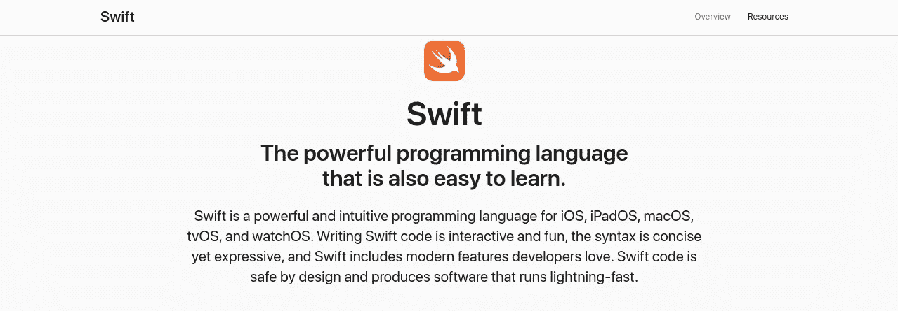
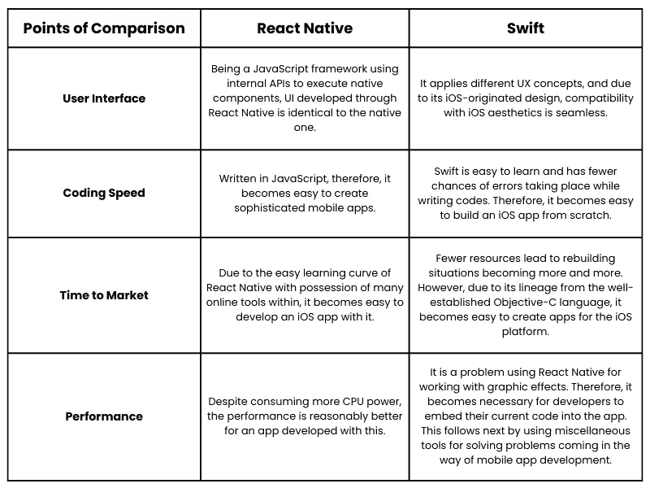

# react Native vs Swift——iOS 开发最佳平台之战

> 原文：<https://medium.com/nerd-for-tech/react-native-vs-swift-for-ios-development-b2fbb527c62c?source=collection_archive---------0----------------------->

在当前的技术时代，我们需要理解移动应用在简化企业成功中的关键作用。有两种主要的操作系统，通过该操作系统的市场，业务的可见性得到了提高。这包括 iOS 和 Android。Android 是一个受欢迎的操作系统，拥有 73%的市场份额，如果你访问 iOS 应用商店，你会发现比谷歌 Play 商店多 1.5 倍的应用。这首先带来了一个问题，为什么企业通过在苹果应用商店上发布他们的应用来努力建立他们的可感知性？

这是我们将在文章中涉及的内容。下面列出了我们还将讨论的其他领域。

**目录:**

*   为什么 iOS 市场欣欣向荣？
*   强大的 iOS 应用程序中的元素
*   iOS 应用程序开发所依赖的流行平台
*   Swift
    -简介
    -Swift 的特点
    -Swift 的优缺点
*   React Native
    -简介
    -React Native 的特点
    -React Native 的优缺点
*   React Native 和 Swift 之间的差异
*   包扎

为了更好地理解，让我们深入到每一点的细节。

## 为什么 iOS 市场欣欣向荣？

当企业采用 iOS 应用程序开发时，他们可以接触到收入相对较高的用户群体。这是主要企业致力于提高其在 iOS 应用市场上的知名度的主要原因。

因此，很明显，当 iOS 应用程序开发进行时，开发者需要确保构建是健壮的。这需要包含一些元素。

## 强大的 iOS 应用程序中的元素

看一下下面的图片:

正如你在上面的图片中所注意到的，有三个要素可以确保 iOS 应用程序开发过程保持稳健。这意味着确认应用程序具有高水平的创新和创造力。它必须在视觉上吸引人。最后，应用程序必须有一个直观的设计，以便用户在相当长的时间内保持参与。

现在我们已经了解了构成一个成功的 iOS 应用的要素，重要的是要补充一点，平台的存在也是必不可少的。

目前，在 iOS 平台上构建应用依赖于两个平台——React Native 和 Swift。

在下面的几行中，我们将讨论这些平台，解释它们的特性、优缺点和差异。看完这些，当你着手使用一个平台进行 [**iOS app 开发**](https://www.xongolab.com/iphone-ios-app-development-services/) 的任务时，你将能够做出更好的选择。

## 迅速发生的

> ***简介***

发布年份— 2014 年

由苹果公司开发

Swift 是苹果公司开发的一种强大而直观的编程语言，有助于 iOS 应用程序的开发。这很容易学。由于本质上是开源的，任何人都可以在它的帮助下构建应用程序。

让我们深入了解它受欢迎的显著特征。

> ***雨燕的特点***

*   通过它在运行时提供的捕获支持来帮助减少错误。
*   故障恢复、格式化等。，通过 Swift 提供的调试帮助很容易执行。
*   通过编程语言可以无缝地执行内存管理。

让我们从下面的几行文字中获得对其不同利弊的看法。

> ***迅捷*的利弊**

**优点**

*   对于工作跟踪和管理应用程序的内存使用等任务，它需要更少的代码依赖。
*   提供确保产品经得起未来考验的能力，并根据业务需求增加新功能。
*   使用自动引用计数(一种旨在添加垃圾收集器功能以删除不再需要的类实例的技术)可以减少内存占用。这使得在不损害内存或 CPU 的情况下增强应用程序的性能变得轻而易举。

**缺点**

*   频繁更新的结果是，寻求帮助成了一项任务。接下来是 Xcode 内部有差异。因此，诸如语法突出显示、自动完成等问题。，变得普遍。
*   拥有较少数量的原生库和工具，如果现在用于 iOS 应用程序开发，当前可用的资源可能不适合。
*   对于遗留项目来说，使用 Swift 可能不是一个好主意。

现在我们已经了解了 Swift 及其在 iOS 应用程序开发中的不同优缺点，让我们了解一下 React Native 及其在开发解决方案方面提供的帮助。

## 反应自然

> ***简介***

发布年份— 2015 年

由— Meta(脸书)开发

React Native 是 Meta 在 2015 年创建的一个开源 UI 软件框架，它可以帮助开发者在不影响用户体验的情况下为 iOS 平台构建应用。

提供多种多样的功能，例如快速刷新和本机开发功能。最后，由于是用 JavaScript 编写并使用本机代码呈现的，跨平台共享代码变成了一项无缝的任务。

> ***React Native 的特性***

*   webpack 的存在使得在一个小文件中打包不同的本机代码变得很容易。因此，链接所有文件变得容易。
*   随着框架中功能的存在，诸如登录、检查值等任务。都很容易。
*   自适应功能有助于将现有的 HTML 脚本转换为本机代码。于是， [**混合 app 开发**](https://www.xongolab.com/hybrid-mobile-app-development/) 无缝执行。

> ***反应本地人的利弊***

**优点**

*   使用[**React Native for mobile app 开发**](https://www.xongolab.com/blog/why-consider-react-native-framework-for-mobile-app-development/) 时，代码重用特性节省了开发人员为不同平台分别编写代码的时间。
*   由于热重装功能，多个任务变得容易处理。因此，等待时间会减少。此外，实时保存更改不再是一个挑战。
*   有了测试库，开发人员可以以一种方便的方式编写无错误的代码。

**缺点**

*   由于框架的构建是用 C/C++和 Java 完成的，调试用 React Native 开发的应用程序成为一个挑战。
*   如果您正着手在这个框架的帮助下构建一个具有多屏幕过渡、动画等特性的解决方案。，使用框架根本不是一个好主意。
*   使用这个框架可能很难实现可伸缩性。因此，开发人员需要选择加入第三方集成或流、类型脚本和其他杂项工具。

有了现在关于 React Native 的想法，让我们知道 React Native 和 Swift 之间的区别。

## React Native 和 Swift 之间的差异

现在你已经理解了 React Native 和 Swift 之间的区别，你现在可以理解当你开始创建具有复杂 UI 和拥有原生 iOS 功能以及 API 的应用时，Swift 是你应该选择的。另一方面，如果您正在考虑构建一个具有热重装和实时重装功能的解决方案，同时要求快速周转，那么 React Native 是您的首选。

## 包扎

如果你选择 Swift 或者[**React Native app development**](https://www.xongolab.com/react-native-app-development/)，你必须知道它们的特性和优缺点，同时要知道它们将为管理你使用的内存和应用内维护提供的支持。有了这些清晰的思路，你就可以继续使用 iOS 应用程序开发的技术堆栈，观察它将对你的业务产生的影响，以确保最大限度的用户参与你的最终解决方案。