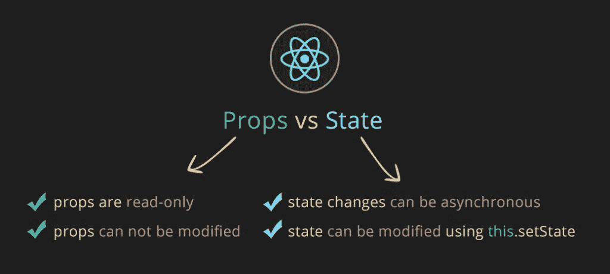
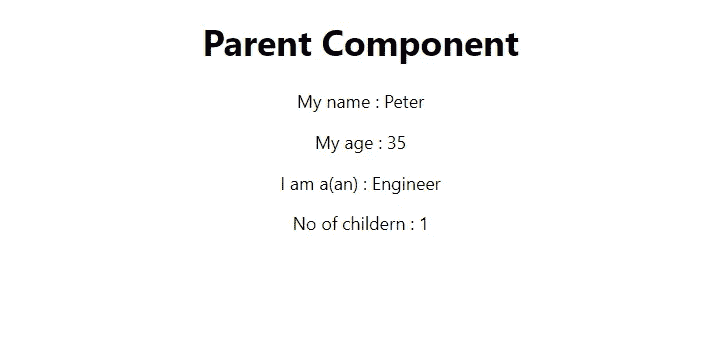
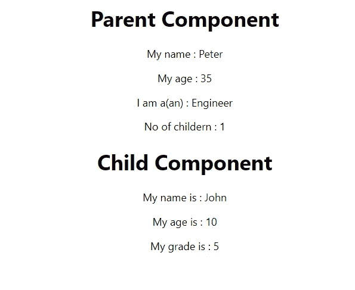
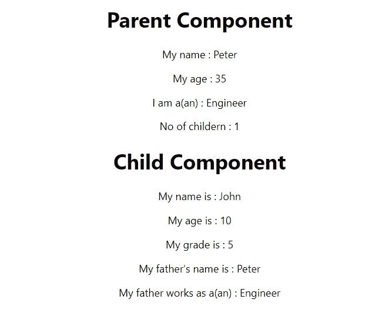

# 反应道具和状态-基本介绍😃

> 原文：<https://medium.com/nerd-for-tech/react-props-and-state-a-basic-introduction-75256831ae84?source=collection_archive---------12----------------------->



React 是用于“前端”开发的著名语言之一。大多数开发人员使用 React 是因为它的易用性和基于组件的架构。

> 如果你想了解更多关于 react 的信息，请查看我以前的文章
> 
> react A simple Beginning[https://medium . com/nerd-for-tech/react-A-simple-Beginning-df98c 89066 D2](/nerd-for-tech/react-a-simple-beginning-df98c89066d2)
> 
> react 组件介绍[https://medium . com/nerd-for-tech/react-js-class-components-and-functional-components-f 346 CB 92 a 02 c](/nerd-for-tech/react-js-class-components-and-functional-components-f346cb92a02c)

**要求**

*   能够创建 react 应用程序
*   React 的基本知识(React-路由器、交换机、路由)

# 状态💭

简而言之，状态就像每个组件的对象，可以由每个组件创建，也可以修改。State 是一个 JSON 对象，它有内部对象、变量和数组。

让我们看一个简单的例子。

我们有一个父类，我们需要显示父亲的详细资料。所以我们给状态增加了一些变量。

```
**constructor(props) {
    super(props);
    this.state= {
        name: "Peter”,
        age: 35,
        child: 1,
        Occupation: "Engineer”
    }
}**
```

现在，我们可以在任何地方使用“**this . state**”来轻松使用这些信息。

```
**render() {
    return (
        <div style={{textAlign:"center"}}>
            <div>
                <h1>Parent Component</h1>
                <p>My name : {this.state.name}</p>
                <p>My age : {this.state.age}</p>
                <p>I am a(an) : {this.state.Occupation}</p>
                <p>No of childern : {this.state.child}</p>
            </div>
        </div>
    );
}**
```

完整的类组件代码应该是这样的。

```
**class Parent extends Component {
    constructor(props) {
        super(props);
        this.state= {
            name: "Peter",
            age: 35,
            child: 1,
            Occupation: "Engineer"
        }
    }** **render() {
        return (
            <div style={{textAlign:"center"}}>
                <div>
                    <h1>Parent Component</h1>
                    <p>My name : {this.state.name}</p>
                    <p>My age : {this.state.age}</p>
                    <p>I am a(an) : {this.state.Occupation}</p>
                    <p>No of childern : {this.state.child}</p>
                </div>
            </div>
        );
    }
}
export default Parent;**
```

输出将是这样的。您可以在组件中的任何地方重用该状态。



# 道具-❔物业😯

Props 代表属性，是 react 最重要的特性之一。我们使用 props 将信息从一个组件传递到另一个组件。我们可以将信息从父(包装)组件传递到子(嵌入)组件。

道具是全局变量，它们是不可变的。

> 不变的是我们不能改变的(不可改变的)

让我们看一个扩展上述内容的简单例子。

父组件需要显示子组件的详细信息。因此，让我们创建一个子类，并添加一些类似父类的状态。

```
**class Child extends Component {
    constructor(props) {
        super(props);
        this.state= {
            name: "John",
            age:10,
            grade:5
        }
    }
    render() {
        return (
            <div style={{alignContent:"center"}}>
                <h1>Child Component</h1>
                <p>My name is : {this.state.name}</p>
                <p>My age is : {this.state.age}</p>
                <p>My grade is : {this.state.grade}</p>
            </div>
        );
    }
}
export default Child;**
```

现在我们需要在 parent 中调用 child 类。将子类导入父类，并在父类的 render()方法中调用。

```
**import Child from './Child';**
```

我创建了一个新的 div，在里面我称之为子类。

```
**render() {
    return (
        <div style={{textAlign:"center"}}>
            <div>
                <h1>Parent Component</h1>
                <p>My name : {this.state.name}</p>
                <p>My age : {this.state.age}</p>
                <p>I am a(an) : {this.state.Occupation}</p>
                <p>No of childern : {this.state.child}</p>
            </div>
            <div>
                <Child/>
            </div>
        </div>
    );
}**
```

输出将是这样的



现在我们要将父亲的名字和职业传递给孩子组件，这样孩子就可以访问 pass 值。

为了传递该值，我们需要将父组件中的 **<子组件/ >** 中的值相加。

```
**<Child ParentName={this.state.name} ParentOccupation={this.state.Occupation}/>**
```

然后我们需要使用 **props** 调用使用子组件中的那些 passes 值。

```
**render() {
    return (
        <div style={{alignContent:"center"}}>
            <h1>Child Component</h1>
            <p>My name is : {this.state.name}</p>
            <p>My age is : {this.state.age}</p>
            <p>My grade is : {this.state.grade}</p>
            <p>My father's name is : {this.props.ParentName}</p>           
            <p>My father works as a(an) : {this.props.ParentOccupation}</p>
        </div>
    );
}**
```

在这里我添加了两个新段落(

)作为父亲的名字和职业。在使用 props 时，我们需要使用我们在父类中使用的确切名称。(ParentName)。如果我们使用任何其他名称，数据将不会显示

输出将是这样的



在这里，我们可以看到子组件正在使用通过父组件传递的值😃

**完成父组件**

```
**import React, { Component } from 'react';
import Child from './Child';****class Parent extends Component {
    constructor(props) {
        super(props);
        this.state= {
            name: "Peter",
            age: 35,
            child: 1,
            Occupation: "Engineer"
        }
    }****render() {
        return (
            <div style={{textAlign:"center"}}>
                <div>
                    <h1>Parent Component</h1>
                    <p>My name : {this.state.name}</p>
                    <p>My age : {this.state.age}</p>
                    <p>I am a(an) : {this.state.Occupation}</p>
                    <p>No of childern : {this.state.child}</p>
                </div>
                <div>
                    <Child ParentName={this.state.name} ParentOccupation={this.state.Occupation}/>
                </div>
            </div>
        );
    }
}
export default Parent;**
```

**完成子组件**

```
**import React, { Component } from 'react';****class Child extends Component {
    constructor(props) {
        super(props);
        this.state= {
            name: "John",
            age:10,
            grade:5
        }
    }
    render() {
        return (
            <div style={{alignContent:"center"}}>
                <h1>Child Component</h1>
                <p>My name is : {this.state.name}</p>
                <p>My age is : {this.state.age}</p>
                <p>My grade is : {this.state.grade}</p>
                <p>My father's name is : {this.props.ParentName}</p>           
                <p>My father works as a(an) : {this.props.ParentOccupation}</p>
            </div>
        );
    }
}
export default Child;**
```

**App.js**

```
**import {BrowserRouter as Router,Route, Switch,} from "react-router-dom";
import Parent from './Components/Medium/Parent';****function App() {
    return (
        <div className="App">
            <header className="App-header">
                <Router>
                    <Switch>
                        <Route exact path='/parent'>
                            <Parent/>
                        </Route>
                    </Switch>
                </Router>
            </header>
        </div>
    );
}
export default App;**
```

# 结论🙌

状态和道具是 React 中最基本也是最重要的东西之一。因此，这是必须有适当的知识。

你也可能认为你的项目不需要使用道具。但是如果你有 500 个父母和孩子在一个数组中，最好使用道具在组件之间传递数据。所以我们可以用可重用性来提高代码质量。

# 参考🙏

*   【https://reactjs.org/docs/components-and-props.html 
*   [https://reactjs.org/docs/state-and-lifecycle.html](https://reactjs.org/docs/state-and-lifecycle.html)
*   [https://www . plural sight . com/guides/add-data-into-a-array-in-a-a-state-object](https://www.pluralsight.com/guides/add-data-into-an-array-in-a-state-object)