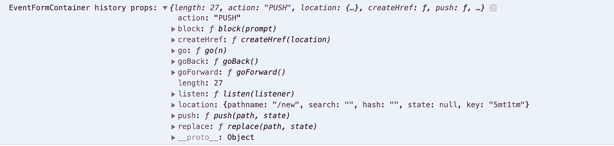

# 对单页应用程序的重定向做出反应

> 原文：<https://medium.com/nerd-for-tech/react-redirections-for-single-page-applications-a7fe17cbe398?source=collection_archive---------4----------------------->

构建单页面 web 应用程序的最大优势之一是能够为页面上的特定组件选择更新，而不是完全重新加载一个新页面。除此之外，这消除了每次采取行动时重复服务器请求的需要，这可以显著提高程序速度。


不幸的是，这种速度的提高是以跟踪浏览器历史为代价的。当你在单页应用中点击浏览器的后退按钮时，浏览器只知道最后加载的是哪个页面，而不知道应用之前的状态。

# 输入`react-router-dom`

React Router 提供了一种在单页应用程序中声明路线导航并链接路线以呈现组件的方法。这样，您的程序可以复制单击链接查看不同页面内容的体验，同时技术上仍然保持在最初加载的 HTML 文件上。此外，该包允许您指定一个可以附加到浏览器的 URL 的路径，完成一个标准点击和重定向的外观。

要进行设置:

```
npm install react-router-dom
```

并声明你的路线(摘自我的[最新项目](https://brownjer3.medium.com/gettin-nifty-with-react-js-80cb8615bc0)的 App.js):

```
import { BrowserRouter as Router, Route } from 'react-router-dom'
...
  return (
    <div className="App">
      <Router>
        <>
          <NavbarContainer />
          <Route exact path="/" component={CalendarContainer} />
          <Route exact path="/tweets" component={TweetsContainer} />
          <Route exact path="/discover" component={DiscoverContainer} />
          <Route exact path="/new" component={EventFormContainer} />
        </>
      </Router>
    </div>
  );
```

然后在 navbar 组件中，您需要导入 NavLink:

```
import { NavLink } from 'react-router-dom'
```

并指定每个链接的路径:

```
<NavLink to="/new">Add Event</NavLink>
```

# 重定向

现在开始有趣的部分——如何在单页 web 应用程序中重定向。在我的程序中，重定向的主要用例是在用户提交一个表单来创建一个新事件之后，应用程序应该重定向回主页，在那里他们可以查看他们新创建的事件。

每个被声明的<route>被自动传递三个呈现方法:</route>

1.  比赛
2.  位置
3.  **历史**

我们将关注历史来处理重定向。下面是我们呈现 EventFormContainer 时 this.props.history 的样子:



根据[文档](https://reactrouter.com/web/api/history)，`push(path, [state])`(函数)将一个新条目推入历史堆栈。换句话说，我们可以将一个路径推入历史对象来模拟重定向！

最初的实现是把它放在表单提交时触发的 handleSubmit 回调函数的末尾。

```
handleSubmit = (e) => {
        e.preventDefault()
        this.props.createEvent(this.state)
        **this.props.history.push('/')**
    }
```

厉害！我们现在在表单提交后重定向。但是，无论表单中提交的数据是否有效，这种实现都会导致重定向。为了确保重定向只在成功提交后**发生，我们希望将其重新定位到我们的 **createEvent 动作:****

```
export const createEvent = (**history**, event) => {
    return (dispatch) => {
        const configObj = {
            method: "POST", 
            headers: {
                "Content-Type": "application/json", 
                "Accepts": "application/json"
            }, 
            body: JSON.stringify(event)
        }
        fetch(url, configObj)
        .then(res => res.json())
        .then(data => {
            dispatch({ type: 'ADD_EVENT', event: data })
            **history.push('/')**
        })
    }
}
```

更新的 handleSubmit 回调:

```
handleSubmit = (e) => {
        e.preventDefault()
        this.props.createEvent(**this.props.history,** this.state)
    }
```

现在，页面只有在确认我们的 API post 请求成功后才会重定向。

# **嵌套组件**

如果您尝试重定向的组件是嵌套的，它不会自动接收匹配、位置和历史属性。作为通过许多组件层传递历史的替代方法，react-router-dom 提供了“withRouter”来访问历史对象的属性。

使用路由器导入到嵌套组件中:

```
import {withRouter} from 'react-router-dom'
```

然后确保包装导出的组件:

```
export default withRouter(NestedComponent)
```

该组件现在可以完全访问同一个历史对象，并且可以在历史堆栈上执行相同的推送，而无需接收历史作为道具。

虽然在我的程序的当前状态中，重定向只有一个明显的用途，但是很明显，如果项目扩展到用户注册、编辑事件细节等新功能中，这将是多么有用。

你可以点击这里查看我的最新版 NFT 日历。随时提交一个新的 NFT 下降事件，体验单页重定向的魔力！