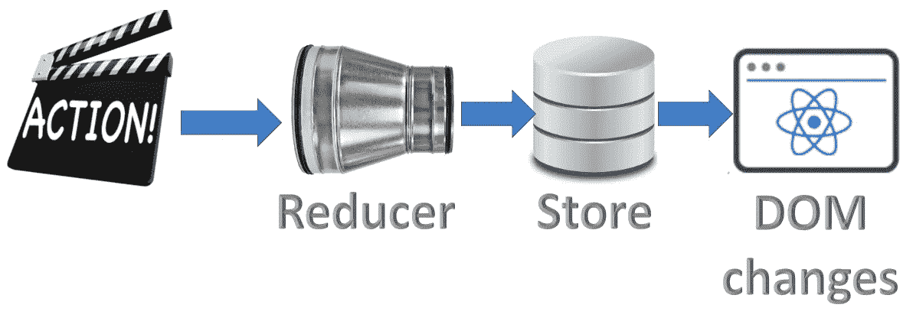

# React-Redux 和 Thunk 分步实践项目

> 原文：<https://medium.com/nerd-for-tech/react-redux-hands-on-project-step-by-step-b394518d55b7?source=collection_archive---------7----------------------->



本文收集了多个独立文章和视频中的步骤

# 1.Redux 是什么？

[](https://ranyel.medium.com/what-is-redux-b16b42b33820) [## Redux 是什么？

### 你可能多次听到 Redux 这个词，你想知道 Redux 是什么？在下面的短片中，我将…

ranyel.medium.com](https://ranyel.medium.com/what-is-redux-b16b42b33820) 

# 2.步骤 1:安装 Nodejs、npm 和 create-react-app

[](https://www.linkedin.com/pulse/step1-install-nodejs-npm-mac-rany-elhousieny-phd%25E1%25B4%25AC%25E1%25B4%25AE%25E1%25B4%25B0/?trackingId=WgbKeLZHPgsrA4Dfm1RY1Q%3D%3D) [## 步骤 1:在 Mac 上安装 NodeJs 和 npm

### 在我们开始任何反应项目之前，我们需要安装节点转到 https://nodejs.org/en/download/滚动到你的…

www.linkedin.com](https://www.linkedin.com/pulse/step1-install-nodejs-npm-mac-rany-elhousieny-phd%25E1%25B4%25AC%25E1%25B4%25AE%25E1%25B4%25B0/?trackingId=WgbKeLZHPgsrA4Dfm1RY1Q%3D%3D) 

# 2.步骤 2:创建基础 React 项目

[](https://ranyel.medium.com/step-2-create-a-react-base-project-using-npx-create-react-app-84ee840ad130) [## 步骤 2:使用 npx create-react-app 创建一个 React 基础项目

ranyel.medium.com](https://ranyel.medium.com/step-2-create-a-react-base-project-using-npx-create-react-app-84ee840ad130) 

# 3.创建 React-Redux Hello World

[](https://www.linkedin.com/pulse/create-react-redux-hello-world-step-rany-elhousieny-phd%E1%B4%AC%E1%B4%AE%E1%B4%B0/) [## 逐步创建 React-Redux(Hello World):1-读取状态

### 如果你以前从未使用过 Redux，我建议你阅读下面的文章来了解主要的…

www.linkedin.com](https://www.linkedin.com/pulse/create-react-redux-hello-world-step-rany-elhousieny-phd%E1%B4%AC%E1%B4%AE%E1%B4%B0/) 

# 4.改变状态

[](https://www.linkedin.com/pulse/create-react-redux-hello-world-step-2-changing-elhousieny-phd%E1%B4%AC%E1%B4%AE%E1%B4%B0/) [## 逐步创建 React-Redux(Hello World):2-改变状态

### 这篇文章是上一篇文章的延续，现在来读读 https://lnkd.in/gKJMy5K 商店，我们将…

www.linkedin.com](https://www.linkedin.com/pulse/create-react-redux-hello-world-step-2-changing-elhousieny-phd%E1%B4%AC%E1%B4%AE%E1%B4%B0/) 

# 5.了解 Redux 中的中间件

[](https://ranyel.medium.com/understanding-middleware-in-redux-9d664cc6f5a5) [## 了解 Redux 中的中间件

### 本文是系列文章的一部分

ranyel.medium.com](https://ranyel.medium.com/understanding-middleware-in-redux-9d664cc6f5a5) 

# 6.了解 REST[可选]

# 7.[使用 Json-Server 创建一个模拟 REST 端点，用于测试](http://creating%20a%20mock%20rest%20endpoint%20using%20json-server%2C%20for%20testing/)

[](https://www.linkedin.com/pulse/creating-mock-rest-server-testing-using-json-server-rany/) [## 使用 Json-Server 创建一个模拟 REST 端点，用于测试

### 当我们开发前端时，我们有时想尝试一些概念，而不是构建一个完整的后端。JSON-服务器…

www.linkedin.com](https://www.linkedin.com/pulse/creating-mock-rest-server-testing-using-json-server-rany/) 

# 8.使用 Redux-Thunk 获取数据

[](https://ranyel.medium.com/fetch-data-with-redux-thunk-in-react-native-app-ee914438c92f) [## 在 React 本地应用程序中使用 Redux-Thunk 获取数据

### 在本文中，我们将开始使用一个名为 Thunk 的中间件来帮助我们从服务器异步获取数据。

ranyel.medium.com](https://ranyel.medium.com/fetch-data-with-redux-thunk-in-react-native-app-ee914438c92f) 

该应用的最终代码可以在[Github https://Github . com/ranyelhousieny/ReactNativeFoodApplication](https://github.com/ranyelhousieny/ReactNativeFoodApplication)中找到

[](https://github.com/ranyelhousieny/ReactNativeFoodApplication) [## ranyelhousieny/ReactNativeFoodApplication

### 在 GitHub 上创建一个帐户，为 ranyelhousieny/ReactNativeFoodApplication 开发做出贡献。

github.com](https://github.com/ranyelhousieny/ReactNativeFoodApplication) 

您可以克隆并使用

```
git clone [https://github.com/ranyelhousieny/ReactNativeFoodApplication.git](https://github.com/ranyelhousieny/ReactNativeFoodApplication.git)
```

作者:

[](https://www.linkedin.com/in/ranyelhousieny/) [## 兰尼·埃尔豪斯尼，PhDᴬᴮᴰ -软件工程高级经理- Zulily | LinkedIn

### 𝙈𝙞𝙘𝙧𝙤𝙨𝙚𝙧𝙫𝙞𝙘𝙚𝙨解决方案架构师𝘼𝙒𝙎𝙎𝙤𝙡𝙪𝙩𝙞𝙤𝙣𝙨𝘼𝙧𝙘𝙝𝙞𝙩𝙚𝙘𝙩𝘾𝙚𝙧𝙩𝙞𝙛𝙞𝙚𝙙…

www.linkedin.com](https://www.linkedin.com/in/ranyelhousieny/) [](https://rany.elhousieny.com) [## 兰尼·埃尔豪斯尼

### 使用 MongoDB，Elastic Search，AWS，React，CSS3，html 5……

rany.elhousieny.com](https://rany.elhousieny.com)