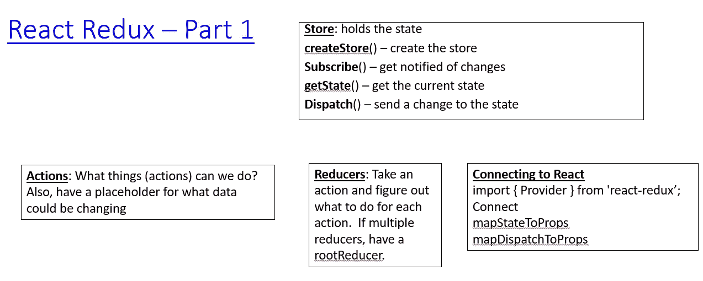
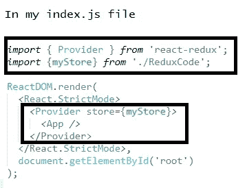
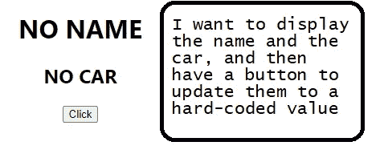
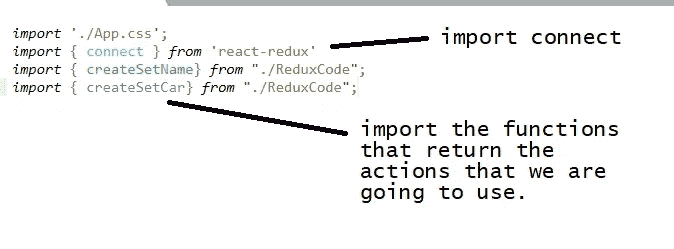
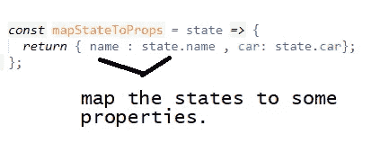
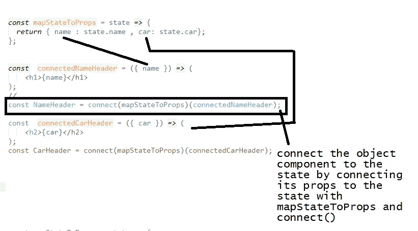
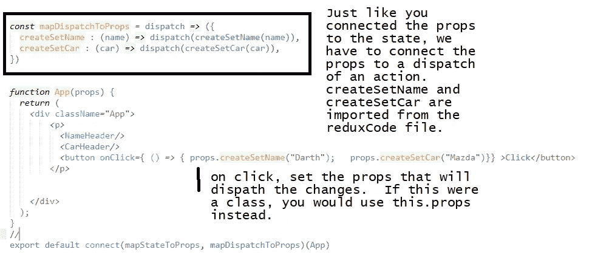
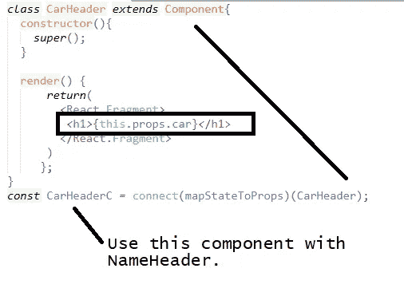

# 反应 Redux。OMG。开始使用。(Redux 1)

> 原文：<https://medium.com/nerd-for-tech/react-redux-omg-getting-started-redux-1-eaae21e96eb5?source=collection_archive---------25----------------------->

妈妈咪呀！这是令人困惑的。我看了一堆教程，看了一堆视频，每次都觉得很困惑。我写这篇笔记是为了给自己澄清一下，也许你也是。

首先要说 Redux 是干什么用的。当我们有一个状态需要在不同的组件之间共享时，我们使用 Redux，并且我们希望它是全局的(您可以在没有 React 的情况下使用 Redux，但是本文使用 React)。

现在，我想尝试一个图表是合适的。



我试图保持事情简单，这样我就可以只关注特定于此的代码，所以我会有很多东西在一起，非常简单的组件。我们走吧！

# 安装 Redux 并为 React 应用程序设置提供程序

Redux 不仅用于 React，事实上，要将它与 React 一起使用，您需要安装:

```
npm install redux
npm intall react-redux
```

在 index.js 文件中:

`import { Provider } from ‘react-redux’`

您将使用 Provider 来包装您想用 redux 使用的任何东西，在我的例子中，是整个东西。

```
ReactDOM.render(
   <React.StrictMode>
      <**Provider store={myStore}**>
         <App />
      </Provider>
   </React.StrictMode>,
document.getElementById('root'));
```

# Redux 商店

使用 Redux，我们将一个应用程序的整个状态存储在一个对象中(一个状态代表一切，不要试图维护多个状态对象)，可以从任何地方访问该对象，尽管不能直接访问。该状态将通过商店进行管理。

要创建商店，使用 **createStore** 并传递给它一个 reducer。如果您有一个以上的缩减器，将它传递给根缩减器(稍后会出现)。

```
const myStore = createStore(rootReducer);
```

我们自动得到一些函数。其中一个是 **getState** ()，它返回当前状态。

要将一个动作传递给商店，可以使用 **dispatch()** 。Dispatch 将一个动作作为参数；

```
myStore.dispatch(SomeAction);
```

商店的另一个功能是 **subscribe()** 。当一个动作被发送到商店时，我们添加的任何侦听器都会被调用。一个例子是:

```
let count = 0;
function **increaseCount**(){
   count++;
   console.log(count);
}**store.subscribe(increaseCount);**
```

# Redux 动作和动作创建者

您必须考虑需要对状态执行什么操作，然后为它们创建操作。动作应该是这样的:

```
const setCurrentName= {
   **type**: 'setCurrentName',
   **payload**: 'setting the name'
}const setCurrentCar= {
   type: 'setCurrentCar',
   payload: 'setting the car'
}
```

只有类型是必需的，但是您可以使用 payload 来传递数据。

动作创建者是返回动作的函数。这样，我们就可以用参数调用创建者，而不是每次都用正确的字符串输入动作。(注意现实生活中要用 SET _ CURRENT _ NAME = " setCurrentName "之类的常量，我只是想尽量简短)。下面，我有两个动作创建器，它们将“无”设置为参数的默认值。

```
//actions - action creators
function createSetName( arg = "nothing"){
   return  {
      type: 'setCurrentName',
      payload: arg
   };
}
function createSetCar( arg = "nothing"){
   return {
      type: 'setCurrentCar',
      payload: arg
   };
}
```

所以我们有状态的存储，以及我们可以在状态上做的动作。现在我们需要减速器。

# Redux 减速器

Reducers 将状态和动作作为参数，并总是返回一个新的状态对象。**注意新的**。这些还原剂不应该有任何副作用，也不应该调用任何 API。

为了简单起见，这里的例子中每个 reducer 只有一个动作。汽车用减速器遵循与命名的减速器相同的模式。通常 action 参数的名称是 action。我只是加了“the”来说明它可以是任何东西。

缩减器采用当前状态和动作，并返回新状态。如果没有传递状态，则默认为 INITIAL_STATE.name，因为这只是名称。

```
function **nameReducer**( **theNameState = INITIAL_STATE.name**, **theAction**){
   **switch** (**theAction**.**type**){
      case "setCurrentName":
         let **new**StateName = Object.assign({}, theNameState); 
         newStateName = theAction.payload;
         **return** newStateName;
      **default**:
         return theNameState;
   }
}
```

我们需要另一个比现有减速器高一个级别的减速器(我有一个用于名称，一个用于汽车)。我们可以创建自己的根归约器，或者我们可以使用 Redux **combineReducers** ()方法。

```
const rootReducer = combineReducers(
   {
      name: nameReducer,
      car: carReducer,      
});
```

一旦我们有了一个 rootReducer，我们将使用它来创建存储:

`const myStore = createStore(rootReducer);`

rootReducer 将调用它用动作包装的所有 Reducer，这样任何应该处理动作的人都可以做。rootReducer 不知道谁应该做什么。

# 用 Redux 连接 React

对我来说，这是最令人困惑的部分，所以我要从我的例子开始，因为我认为这可能是最有意义的。



上面的标题和按钮都在我的 App 组件里。它们不是常规的 React 组件，因为它们必须连接到商店。上面，它们显示的是初始状态。



现在，您可以在应用程序中使用组件 NameHeader 和 CarHeader，它们将在其映射的属性中显示状态。

如果您还想更改组件(在本例中为 App 组件)的状态，您还需要:



注意:如果我们有一个 car 头的类，映射将会同样工作，现在我们将通过这个访问属性。



# 订阅

举个简单的例子来说明你如何订阅状态的变化。

```
function display (){
   console.log(myStore.getState());
}
myStore.subscribe(display);
```

使用该代码，每次状态改变时，都会调用显示函数。

这总是让我困惑，所以我希望我可以用它作为参考。或许你也可以。还有更多的可以重复，但我每次添加一点笔记，因为我自己消化它们。