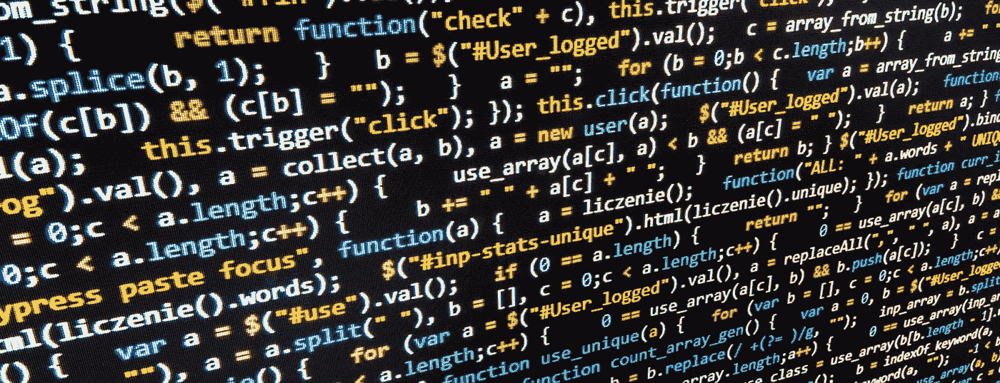
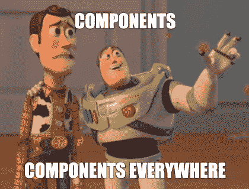
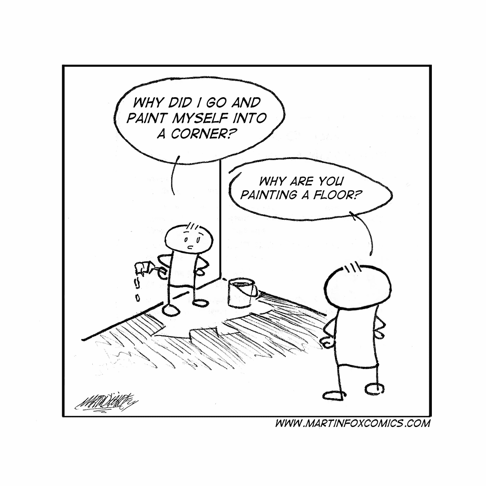

# 反应一下，利弊

> 原文：<https://medium.com/nerd-for-tech/react-the-pros-and-the-cons-1ef9dd221460?source=collection_archive---------32----------------------->

有一天，我正在和一位云工程师进行工作面试，他问了我一个我以前从未认真考虑过的问题。

> " Sharad，使用 React 的最好理由是什么，最坏的理由是什么？"

这是个很好的问题。直到他问我，我才真正考虑过这个问题。我在一个软件开发训练营中历尽艰辛，最终非常轻松地使用了 React，但是，直到那一刻，我还没有真正停下来思考为什么 React 是初级开发人员的绝佳选择，以及为什么它也可能是一个值得错过的选择。

从那以后，我在[谷歌](https://www.altexsoft.com/blog/engineering/the-good-and-the-bad-of-reactjs-and-react-native/)上查看了[几个](https://www.javatpoint.com/pros-and-cons-of-react) [列表](https://brainhub.eu/library/benefits-of-react-js/)。当然，有很多重叠的地方。令我惊讶的是，这些清单并没有真正涵盖我认为的优点和缺点。我想知道是不是我作为一个初级软件开发人员的观点影响了我的观点，或者是因为我在由初级开发人员组成的团队中在紧张的预算下制作可交付产品的经历？

## 赞成者

React.js 是开源的，拥有庞大的开发人员基础，非常容易学习。开发人员社区积极帮助新来者解决日常和独特的问题。当你考虑 React 可用的[组件库](https://www.lambdatest.com/blog/best-react-component-libraries-2021/)[的](https://blog.logrocket.com/top-10-react-component-libraries-for-2020/)时，很明显 React 是一个快速应用开发的发电站。

React 的编程范式，即开发独立且可重用的组件，是*不要重复*编程原则的延伸。只要稍加练习，一个有思想的开发人员就可以制作出可以在一个应用程序中反复重用的组件，甚至可以跨多个应用程序重用。

因为 React.js 很容易上手，可以用来开发生产应用程序，所以企业可以雇佣初级开发人员来处理大部分开发过程。当然，这不仅仅是节省开销的潜力，而是让初级开发人员快速获得有价值的开发经验的潜力，从而增加他们的价值。这是双赢。

使用 React 有更多的好处，例如:React 的呈现方式使其对 SEO 非常友好，这是免费的浏览器内开发工具，实现单元测试非常容易，但我在这里的目标不是列出一个详尽的列表，而是告诉你我个人喜欢 React 的什么。

React 不止一次让我把自己画在角落里

## 坏处

我对 React 的主要抱怨是，没有一种*单一的*方法来实现这种范式。目录结构、命名约定，甚至组件库都不是标准的，并且会因项目而异。在不受管理的开发团队中，这种灵活性很容易导致混乱。在我开发 React 应用的短暂时间里，我已经看到迷宫般的目录结构、深奥的组件库和命名约定被抛到了一边。虽然所有这些问题都源于沟通的中断，但 React 经受住了它们。这就产生了在短期内有效的项目，但从长期来看，却成了需要支持的噩梦。一个应用程序需要最少的时间来更新和开发新功能，但最终可能需要更多的时间。

我看到了这种抱怨，没有一种*React-做事方式* (tm)，当其他人批评 React 时，他们说 React 是*记录不良*。然而，我不同意这种批评。我认为 React 有一些不错的文档。React 足够灵活，可以支持如此多的不同方式来实现相同的组件，以至于 React 文档不足以解释其他开发人员的代码。

## 那么 React 是好是坏？

在本周的博客中，我们讨论了我个人喜欢 React 的地方以及我不太喜欢的地方。React 是一个从知之甚少到快速创建令人兴奋的新应用程序的好方法。像 JavaScript 一样，它也是一个超级灵活的范例，这在实现 React 有许多正确方法的意义上是很棒的，但是要小心！同样的灵活性也足以让你自缢。

你对 React 有什么看法？你更喜欢另一个框架吗？给我留言吧，我很想听听你的想法！编码快乐，下周见！