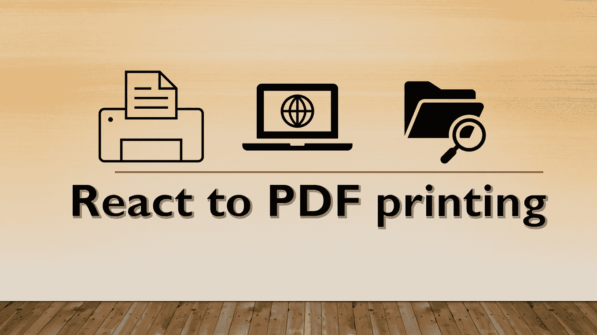
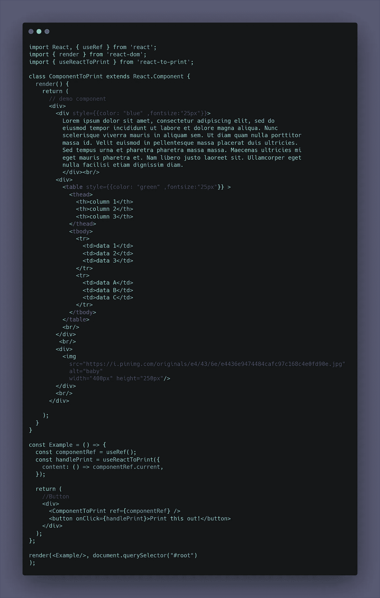
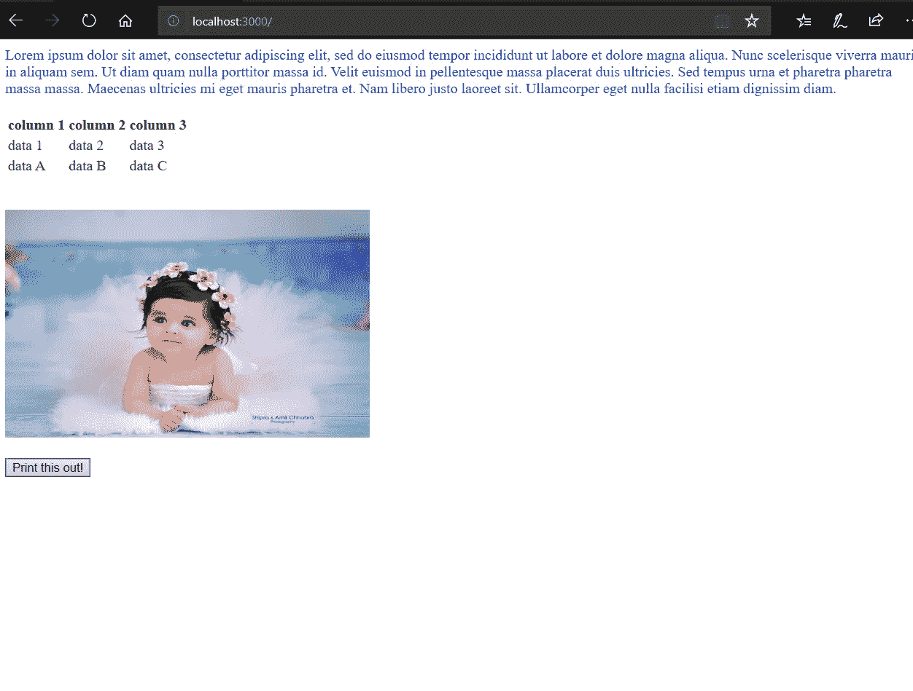
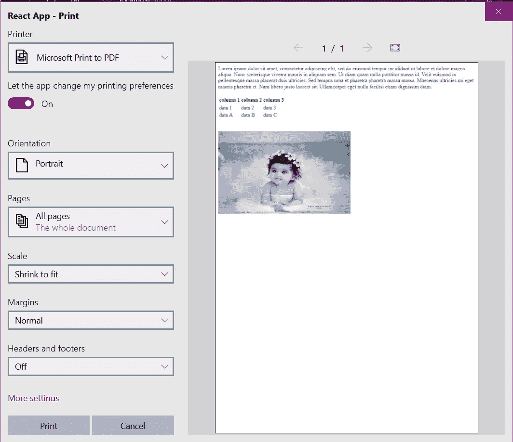

# 对 PDF 打印做出反应

> 原文：<https://medium.com/nerd-for-tech/react-to-pdf-printing-f469cc99b24a?source=collection_archive---------0----------------------->

在本文中，我将向**展示如何使用几个简单的步骤在浏览器中下载 React 组件。**

我们一步一步来。

## 第一步|

首先，您需要创建一个 react 应用程序。打开您的终端并运行以下命令来创建一个 react 应用程序。

> npx 创建-反应-应用 pdf-下载

## 第二步|

现在出现了一个名为 pdf-download 的文件夹。移到那个文件夹。要移动到该文件夹，请在终端中运行以下命令。

> CD pdf-下载

## 第三步|

现在您需要安装 react 包，它允许您以 PDF 格式打印 react 组件。这个包旨在通过弹出一个打印窗口来解决这个问题，这个窗口中也复制了 CSS 样式。

为此，请在终端中运行以下命令

> npm install -s 对打印做出反应

## 第四步|

在演示中，我展示了一个段落、一个表格和一个图像。

现在打开 src 文件夹中的 index.js。如下图所示，用以下代码替换该代码。

索引. js

正如你在图中看到的，你需要从包*中导入 *useReactToPrint* 来打印一个*，你还需要从 *react* 包中导入 *useRef* 。这允许您以 pdf 格式打印组件。我们可以将任何 CSS 添加到组件中，如上图所示。

## 第五步|

现在，让我们运行 react 应用程序来查看输出。要运行 react 应用程序，请在您的终端中运行以下命令。

> npm 开始

输出

你可以看到一个按钮，上面写着“打印出来！”。点击它！！！

出现一个弹出窗口，如下图所示。

突然出现

您可以查看 pdf 文件的预览。你可以随意改变尺寸。

**再次点击打印！！！**所以现在你可以把这个文件保存在任何你想要的地方，并根据你的需要重命名这个文件。

**如需了解本套餐的更多功能，请参考以下链接。**

 [## 对印刷作出反应](https://www.npmjs.com/package/react-to-print) 

希望你从我的文章中有所收获。感谢阅读！