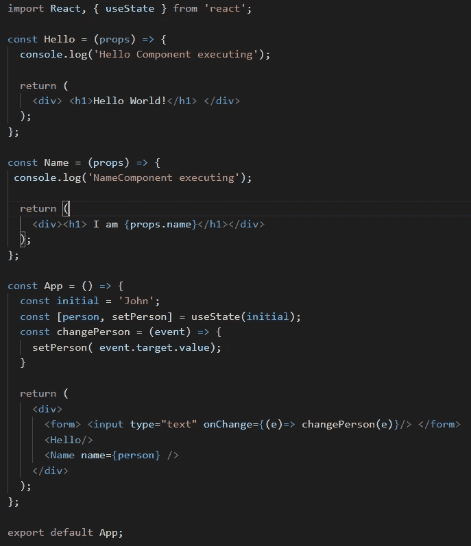
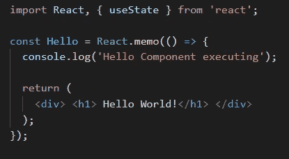
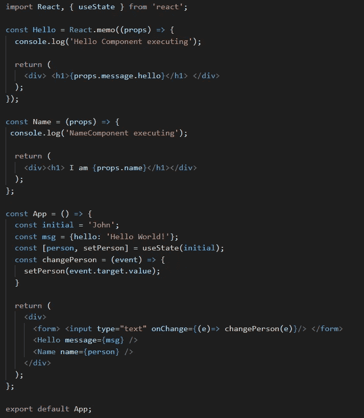
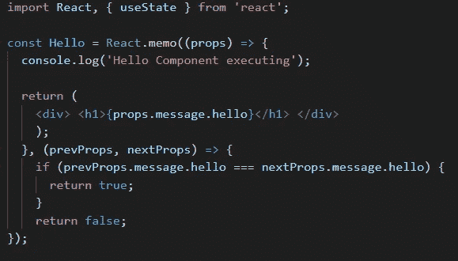
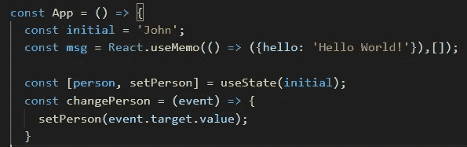

# 对虚拟 Dom 和 Memo 的性能作出反应

> 原文：<https://medium.com/nerd-for-tech/react-virtual-dom-and-memo-hooks-on-performance-8b9498d7b3e1?source=collection_archive---------10----------------------->

在本文中，我将描述 react 用来提高渲染性能的概念。我将详细解释**虚拟 Dom** 概念**，Memo，useMemo hook** 包括，

*   他们是什么？
*   他们是如何提高绩效的？
*   什么时候使用它们？
*   什么时候应该避免？

首先，我有一个想法，它们是孤立的概念/钩子，反应获得性能的使用。但是，我错了。这些是以某种方式相互联系的，在这种方式下，您的应用程序致力于性能的提升。让我们详细研究一下每一个问题。

# **虚拟 Dom (VDOM)**

当加载网页时，浏览器创建页面的文档对象模型。简单地说，它被构造成一个对象树。那 VDOM 是什么？嗯，它是 react 应用程序中位于 DOM 之上的一种抽象层。React 所做的是直接与 VDOM 互动。而不是真正的 dom。然后 **ReactDom** 库将与实际的 Dom 交互，并仅在 DOM 操作中应用更新的元素。

ReactDom 通过比较新渲染的 VDOM 和以前的 VDOM 来识别 VDOM 中的更新元素。这个过程叫做**差*。*** 如果有任何变化，那么变化的元素将在 dom 中更新。这个过程被称为**对账**。如果它们相等，那么根本没有实际的 DOM 操作。这将导致性能提升，因为您节省了更新实际 DOM 的次数和元素数量，因为实际 DOM 更新与处理 diffing 相比很慢，因为它们会导致 UI 元素的实际重新绘制。

React 已经为您完成了这一优化。但是有必要了解它们，以确定事情是如何在幕后运作的。

让我们看看下面的例子。这是一个简单的 react 应用程序，将在下一行显示“Hello，world”和键入的姓名。“Hello”组件不会改变您在输入中键入的任何内容。但是“Name”组件应该更改为我们在输入框中键入的值。因为当名称状态改变时，Hello 和 Name 组件都包含在 App 组件中，所以 App 组件会自动重新呈现每个子组件。因此，每次用户输入内容时，都会调用不必要的重新渲染。这可以通过控制台日志观察到。

确实，即使您的应用程序执行不必要的**重新呈现**，协调过程也会解决问题。但是，想想一个有大量子组件的大组件试图进行不必要的重新渲染。然后，我们应该考虑一些可能影响性能的方面，如以下原因。

*   重新渲染再次执行渲染功能和功能组件
*   区分过程将对一大组元素执行

为了克服这个性能问题，react 引入了**备忘录**。

# 备忘录

Memo 代表记忆。在 React 中，它所做的是当组件渲染发生时，它将被缓存。当组件试图使用相同属性重新渲染时，将返回缓存的值，而不是执行函数。这有助于具有大量子组件的组件 a 获得显著的性能提升，而这些子组件与重新渲染无关。我们只需将组件包装在“React.memo”中，如下所示。

对 Hello 组件使用 React 备忘录

假设我们想将显示消息从 App 组件传递给 Hello 组件。我将创建一个 msg 对象，并将其作为道具传递。然后你突然意识到备忘录不起作用了。这是因为备忘录做了一个肤浅的比较。因为每次重新渲染改变一个对象的引用备忘录认为这是一个新的对象。因此，每次父组件呈现时，react 都会呈现 Hello 组件。

备忘录不起作用

为了解决这个问题，我们可以传递一个**客户平等** **函数**作为备忘录的参数。然后，如果条件**满足，它应该返回真**表示不重新渲染。返回 false 将重新呈现组件。

自定义等价函数

作为这个自定义“areEqual”函数的替代，React 引入了 **useMemo** 钩子。当所提供的相关性发生变化时，它还会返回存储的值。

使用备忘录用法

由于以下原因，React 没有将备忘录作为默认实施。

*   对于小组件来说，这并不真正有益。相反，它还额外执行一些比较功能。
*   内存消耗

所以使用 ReactMemo 是有机会成本的。到处用 memo 不是一个好的解决办法。因此，更好的办法是了解何时使用备忘录。以下是备忘录有用的几种情况

*   如果组件为相似的道具呈现相同的内容
*   如果内容以高频率呈现(例如:股票数据更新)
*   如果一个部件相当重