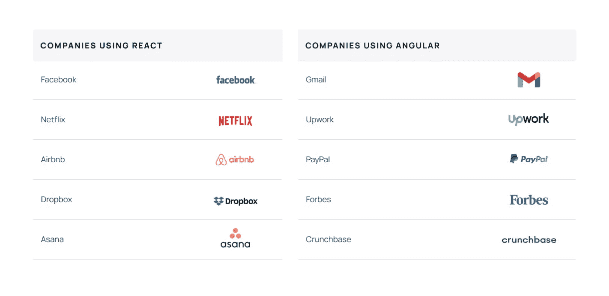
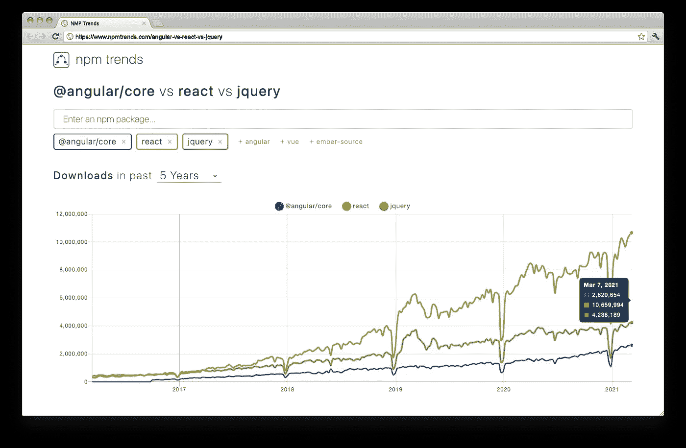
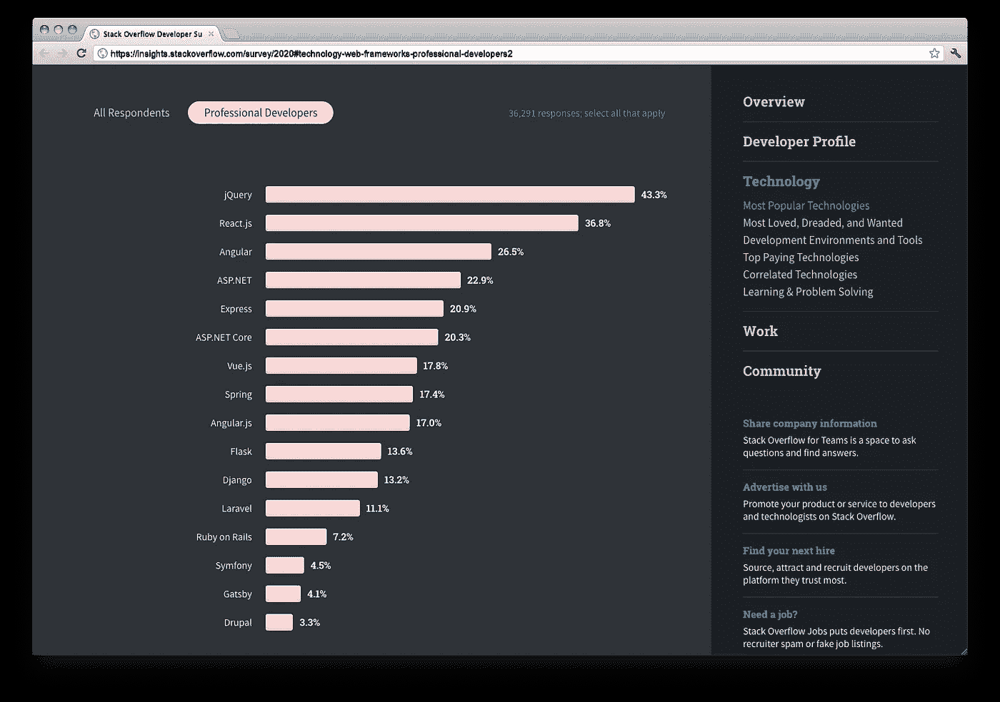
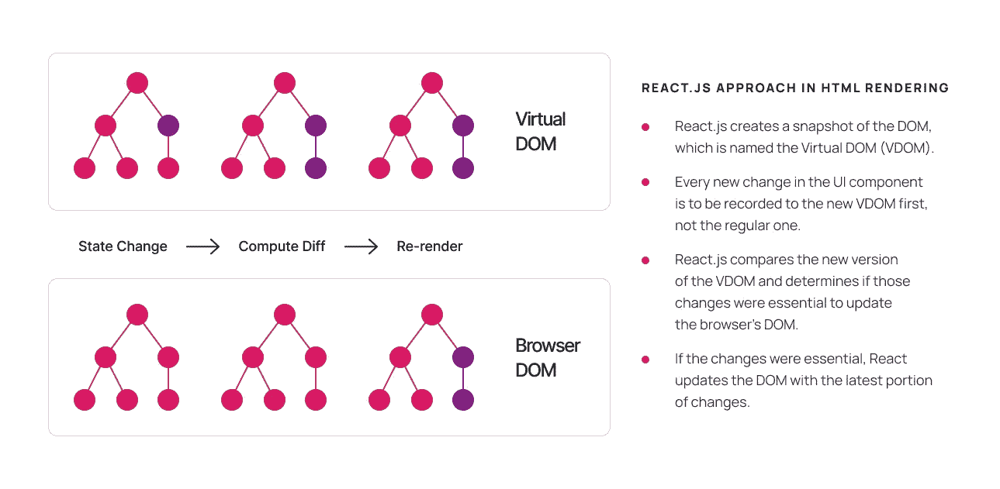

# React vs Angular，谁赢了比赛？

> 原文：<https://medium.com/nerd-for-tech/react-vs-angular-who-wins-the-competition-2138eba3cb17?source=collection_archive---------8----------------------->

# 为前端开发选择最佳选项

React.js vs Angular。他们同样擅长构建基于网络的应用程序。有些世界项目是用 React.js 构建的，有些是同样大小的，用 Angular。

这些强调 React.js 和 Angular 的例子适合于构建大型的、可伸缩的平台，每时每刻处理大量的请求。

# 按受欢迎程度分类的当前统计数据

React.js 在 GitHub 上的下载量超过了 Angular，位居榜首。差别是巨大的。

NPM 下载了过去五年的统计数据

去年对 Stackoverflow 用户的调查表明 React.js 比 Angular 受欢迎程度高 10%。

React.js 的爱好者数量不断增加

是不是说明 Angular 出问题了？或者，这是否意味着 React.js 提供了比 Angular 更好的解决方案？

# 角度的主要原则

让我们通过简单地概述这两个系统来解决这个问题。Angular 源于 Google 的创业产品，产品开发的关键是在一个地方管理多个流程。任何不合理的决定都可能导致一个问题，并在一瞬间影响数十亿的用户操作。

Angular 成为了一个预先定义编程步骤的整体框架。尽管它用服务、控制器和模块丰富了开发过程，但它规定了自己的思考和工作方式。这在程序员和框架之间放置了一个距离。

除此之外，还有一些其他因素使得角度更难接近:

1.  Angular 使用面向对象编程(OOP)，所以它的知识是硬技能。
2.  开发人员应该很好地掌握 TypeScript。
3.  RxJS 知识也是必备的。

显然，学习曲线很高。与 React.js 不同，Angular 要求开发人员具备更多与 OOP 相关的经验。考虑到他们团队的高度专业知识，这对谷歌很有效。Angular 被设想为一个端到端的解决方案，并与他们先进的编程文化兼容。

尽管架构复杂，Angular 有其无可争议的优势:

*   **双向数据绑定**自动化模型和视图之间的同步。比方说，如果模型中的数据发生了变化，那么视图(DOM)中的数据也会自动发生变化。这样的功能消除了编写更多额外代码的需要。想象一下 Google Drive 的文档，当用户在文档中键入文本时，另一个用户会实时查看它。由于双向数据绑定，这样的功能是可能的。
*   **依赖注入(DI)** ，使得从一个类向另一个类传递依赖成为可能。由于 DI，服务器端的服务可以委托给客户端。因此，在 Angular 中使用 OOP 是一个很大的优势。
*   **指令**旨在通过提供新的语法来丰富 HTML。最常见的指令是组件。使用它，程序员可以为现有元素创建任何属性并改变其行为。这是一个有用的特性，它使得使用 DOM 非常灵活。

Angular 增加了许多其他有价值的特性，如 UI 材料，使得在项目的其他部分重用组件代码成为可能，但这与 React 也提供了类似的功能。

# 今天谁选择了 Angular？

有经验的前端开发人员分享说，当 React.js 是早期创业公司和较小公司的更好选择时，Angular 非常适合企业解决方案和企业部门。这可以解释为大企业不经常改变他们的优先事项，他们的首席技术官很早就知道他们的战略目标。

你可以从我们的概述中得到的要点是，记住 **Angular 是对可靠性要求高于一切的长期项目的更好选择**。除了列表中提到的其他公司，还有一些公司正在使用 Angular:微软 Office、德意志银行和三星。

React.js 甚至不称自己是框架，而是 js 库。与 Angular 不同，React.js 将设置项目结构、查找 HTTP 路由的相关服务等工作作为开发人员的职责。在这一点上，React 的思想是敏捷，给开发者提供绝对的自由。结果，它导致从一开始就最小化项目的规模，因为他们可能涉及到他们在某个时候需要的那些库。

假设你是项目中唯一的前端开发人员，或者只有几个。这里的主要目标是为最短的视角设定的。你应该既快又有效率，能够适应创业目标。Angular 直截了当的规则和架构需求会拖慢开发的进程。

因此，遵循单一策略并不是 React.js 社区的主要优先事项。事实上，这与有角是正相反的。

值得一提的是，React.js 不能单独工作，因为它只是视图(V ),需要一个引擎来处理数据。一个开发者需要弄清楚它的实现，用 Redux 和 Saga 管理，并单独安排。

# 是什么让 React.js 与众不同？

*   学习曲线低。具有 HTML 和 JavaScript 经验的开发人员可以从事 web 开发，并很快展示他们的第一批成果。
*   该架构很简单，不需要花太多时间来研究它的所有结构。
*   虚拟 DOM 减少了服务器端渲染的耗时。
*   巨大的社区支持定期为 React.js 收集做出贡献。
*   直观的环境，愉快的工作界面。

虚拟 DOM 解决了什么问题？

接下来是当前的情况:如果用户浏览器在点击页面时发生了任何变化，这些变化将被自动记录到 DOM 中。为了在网页上显示更改，浏览器应该重新加载整个 DOM 结构。它给浏览器带来了更多的负载，降低了应用程序的性能。

# React.js 性能创新

*   React.js 创建 DOM 的快照，命名为虚拟 DOM (VDOM)。
*   UI 组件中的每一个新变化都将首先被记录到新的虚拟 DOM 中，而不是常规的虚拟 DOM。
*   React.js 比较了 VDOM 的新版本，并确定这些更改对于更新浏览器的 DOM 是否是必不可少的。
*   如果更改是必要的，React.js 会用最新的更改更新 DOM。

React.js 有这样的计算算法，允许它决定何时更新浏览器中的 DOM。这使得前端应用程序非常具有表演性。倒霉的是，Angular 没有任何类似这个特征的东西。

React.js 虚拟 DOM 的原理

也就是说，当 Angular 用许多扩展补充 HTML 时，React.js 有助于为项目编写干净的 JavaScript 代码。这很快就会变得混乱，并且很难处理如此庞大的代码。

是时候说: **React.js 今天在前端开发领域占据主导地位**。

高级特性、易用性、丰富的 javascript 库集合将 React.js 放在了比 Angular 更高的位置。这证明了一个理念，以用户为中心的方法才是王道。React.js 已经成为制作前端应用的直观而强大的资源。

像“Angular vs. React”这样的讨论显然因为 React.js 获胜而告一段落。如今，社区对 Vue.js 等其他框架非常感兴趣，这种比较在今天会更加实际

*最初发表于*[T5【https://brocoders.com】](https://brocoders.com/blog/react-vs-angular-who-wins-the-competition/)*。*