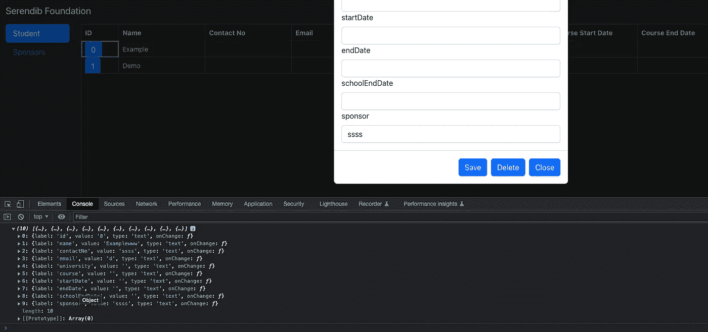

# 用 Typescript 系列(慈善 Web 应用程序)作出反应—表单状态管理

> 原文：<https://medium.com/nerd-for-tech/react-with-typescript-series-charity-web-app-form-state-management-a411552097ff?source=collection_archive---------4----------------------->

大家好，在我们之前的教程中，我们学习了如何使用高阶组件创建表单。

[](/nerd-for-tech/react-with-typescript-series-charity-web-app-higher-order-components-3f099f20a384) [## 与 Typescript 系列(慈善网络应用程序)反应—高阶组件

### 嗨，伙计们，在我们的上一个教程中，我们创建了几个组件，最终得到了一个工作的应用程序。但是我们从来没有实现细节…

medium.com](/nerd-for-tech/react-with-typescript-series-charity-web-app-higher-order-components-3f099f20a384) 

我能够使用高阶组件创建一个动态表单。但是我们在那里所做的有一个大问题。如果你尝试过使用它，你会发现你不能在输入框中输入任何东西。主要原因是我们还没有为输入框实现 onChange 方法，以及适当的状态管理。老实说我也挣扎着想出了一个解决办法；).

在尝试了几种解决方案后，我想出了一个解决办法。如果你还记得的话，我在上一个教程中添加了一个名为 config 的状态。我们使用这个状态将来自表组件的输入数据设置为模态组件。这里，当我们初始化配置时，我们从未处理 onChange 方法。所以我只是将索引和事件对象一起添加到 onChange 方法中。因此，只要其中一个输入框发生变化，我们就可以检测出是哪个框，并分配变化的值。以下代码将显示更改后的 StudentModalButton.tsx 文件。

```
import React, { Component } from 'react';
import { Button } from 'react-bootstrap';
import StudentModalComponent from '../StudentModalComponent/StudentModalComponent';

interface StudentModalButtonComponentProps {
    studentId: string,
    detail: any
}

export default class StudentModalButton extends Component<StudentModalButtonComponentProps, { show: boolean, config: any }> {
    constructor(props: StudentModalButtonComponentProps) {
        super(props);

        let config = [];
        let arr = [...Object.entries(this.props.detail)];

        for (let i = *0*; i < arr.length; i++ ) {
            let str = arr[i] + '';
            let valArr = str.split(",");

            let obj = {
                label: valArr[*0*],
                value: valArr[*1*],
                type: 'text',
                **onChange: (e: any) => {
                    this.setConfigState(e.target.value, i);
                }**
            }

            config.push(obj);
        }

        this.state = {
            show: *false*,
            config: config
        };
    }

    **setConfigState(value: any, i: any) {
        let arr = [...this.state.config];
        arr[i].value = value;
        this.setState({ config: arr });
    }**

    setModalShow(showState: boolean) {
        this.setState({ show: showState });
    }

    **saveData() {
        console.log(this.state.config);
    }**

    render(): React.ReactNode {
        return <>
            <Button onClick={() => this.setModalShow(*true*)}>{this.props.studentId}</Button>
            <StudentModalComponent config={this.state.config} show={this.state.show} onHide={() => this.setModalShow(*false*)} **onSave={() => this.saveData()}** studentid = {this.props.studentId} />
        </>
    }
}
```

现在我们必须更新单元测试文件 StudentModalButton.test.tsx

```
import { render } from "@testing-library/react";
import React from "react";
import { describe, it, expect } from "@jest/globals";
import StudentModalButton from "./StudentModalButton";

**const details = [
  { id: *0*, name: 'Example', contactNo: '', email: '', university: '', course: '', startDate: '', endDate: '', schoolEndDate: '', sponsor: '' },
  { id: *1*, name: 'Demo', contactNo: '', email: '', university: '', course: '', startDate: '', endDate: '', schoolEndDate: '', sponsor: '' }
]**

describe("Card", () => {
  it("renders", () => {
    const wrapper = render(<StudentModalButton **detail={details}** studentId={"1"} />);
    expect(wrapper.container).toMatchSnapshot();
  });
});
```

现在处理新的输入值很容易，更重要的是将数据保存在表单中。我们有一个保存按钮，但我们还没有实现任何东西。所以在上面的代码中你可以看到我添加了一个新的方法来处理它(只是控制台日志状态的表单)。



控制台日志表单数据

我用这个修改了 StudentModalComponent.tsx 文件。

```
import React, { Component } from 'react';
import { Modal, Button } from 'react-bootstrap';
import { withForm } from "../hoc/withForm";

export type StudentPropType = {
    show: boolean,
    form: any,
    studentid: string,
    config: any,
    onHide(): void,
    onSave(): void
}

class StudentModalComponent extends Component<StudentPropType> {
    constructor(props: StudentPropType) {
        super(props);
    }

    render(): React.ReactNode {
        return <Modal show={this.props.show}>
            <Modal.Header closeButton onClick={this.props.onHide}>
                <Modal.Title id="contained-modal-title-vcenter">
                    Details of Student {this.props.config[*1*].value}
                </Modal.Title>
            </Modal.Header>
            <Modal.Body>
                {this.props.form}
            </Modal.Body>
            <Modal.Footer>
                <Button onClick={this.props.onSave}>Save</Button>
                <Button onClick={this.props.onHide}>Delete</Button>
                <Button onClick={this.props.onHide}>Close</Button>
            </Modal.Footer>
        </Modal>
    }
}

export default withForm(StudentModalComponent);
```

现在我们必须更新单元测试文件 StudentModalComponent.test.tsx

```
import { render } from "@testing-library/react";
import React from "react";
import { describe, it, expect } from "@jest/globals";
import StudentModalComponent from "./StudentModalComponent";

**const config = [
  {
    "label": "id",
    "value": "0",
    "type": "text"
  }, 
  {
      "label": "name",
      "value": "Examplewww",
      "type": "text"
  }
]**

describe("StudentModalComponent", () => {
  it("renders", () => {
    const wrapper = render(<StudentModalComponent **config={config}** show={*true*} studentid={"1"} onHide={jest.fn()} />);
    expect(wrapper.container).toMatchSnapshot();
  });

  it("not renders", () => {
    const wrapper = render(<StudentModalComponent **config={config}** show={*false*} studentid={"1"} onHide={jest.fn()} />);
    expect(wrapper.container).toMatchSnapshot();
  });
});
```

像往常一样，一切都在 [Github 链接](https://github.com/deBilla/serendib-scholarship-ui)中。随便问任何问题。快乐编码。下节课再见。(将此连接到后端)。快乐编码:P