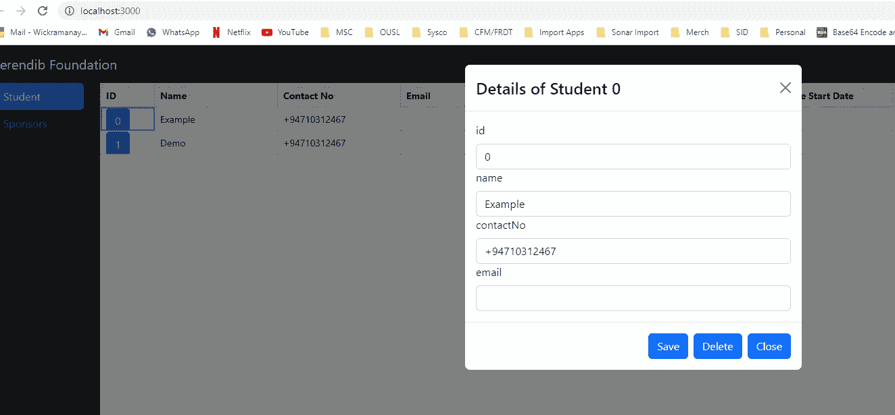

# 与 Typescript 系列(慈善网络应用程序)反应—高阶组件

> 原文：<https://medium.com/nerd-for-tech/react-with-typescript-series-charity-web-app-higher-order-components-3f099f20a384?source=collection_archive---------1----------------------->

嗨，伙计们，在我们的上一个教程中，我们创建了几个组件，最终得到了一个工作的应用程序。但是我们从未在弹出菜单中实现细节。为了实现这一点，我正在尝试一种叫做高阶组件的设计模式。在这里，我要做的是使用高阶组件和生成器类为学生详细信息和赞助商详细信息创建表单。

# **高阶组件**

在开始实现之前，我们将首先尝试理解什么是高阶组件。HOC 是 React 中重用组件逻辑的一种高级技术。基本上，高阶组件将一个组件转换成另一个具有附加功能或 UI 特性的组件。

在我们的代码库中，让我们创建一个名为 hoc 的文件夹来存储 withForm 高阶组件。withForm 高阶组件将向我们的传递组件添加一个窗体。现在，在创建特设之前，让我们考虑一种创建表单的动态方法。为此，我将在路径/src/utils/中创建一个名为 FormBuilder 的函数。

```
import React, { Component } from 'react';
import { Form, Card } from 'react-bootstrap';
type FormBuilderConfigType = "text" | "date";

export type FormBuilderConfig = {
    type: FormBuilderConfigType;
    label: string;
    value: string;
    placeholder: string;
    onChange: (e: any) => VoidFunction;
}

export const FormBuilder = (config: FormBuilderConfig[]) => {
    const form = [];
    for (let val in config) {
        if (config[val].type === "text") {
            form.push(
                React.cloneElement(
                    <Form.Label >{config[val].label}</Form.Label>
                )
            );
            form.push(
                React.cloneElement(
                    <Form.Control />,
                    config[val]
                )
            );
        }
        if (config[val].type === "date") {
            form.push(
                React.cloneElement(
                    <Form.Label >{config[val].label}</Form.Label>
                )
            );
            form.push(
                React.cloneElement(
                    <Form.Control id="passwordHelpBlock" type='date' />,
                    config[val]
                )
            );
        }
    }

    return form;
}
```

这里我们要做的是将字段列表传递到名为 config 的数组中的表单中，并显示这些细节。编辑和状态管理将在以后的教程中讨论。现在使用它，我们可以在我们的 HOC 中创建一个表单，并将这个新创建的元素作为一个 prop 传递给 StudentModalComponent(需要表单的地方)。withForm 代码将是这样的。

```
import React from 'react';
import {FormBuilder} from '../utils/FormBuilder';

export const withForm = (ComposedComponent) => class extends React.Component {
    constructor(props) {
        super(props);
    }

    render() {
        return <ComposedComponent {...this.props} form={FormBuilder(this.props.config)} />;
    }
}
```

现在 form prop 应该包含在 StudentModalComponent 中。此外，我们还必须更改导出类以包含 HOC。所以我们的代码会变成这样。

```
import React, { Component } from 'react';
import { Modal, Button } from 'react-bootstrap';
import { withForm } from "../hoc/withForm";

export type StudentPropType = {
    show: boolean,
    form: any,
    studentid: string,
    config: any,
    onHide(): void
}

class StudentModalComponent extends Component<StudentPropType> {
    constructor(props: StudentPropType) {
        super(props);
    }

    render(): React.ReactNode {
        return <Modal show={this.props.show}>
            <Modal.Header closeButton onClick={this.props.onHide}>
                <Modal.Title id="contained-modal-title-vcenter">
                    Details of Student {this.props.studentid}
                </Modal.Title>
            </Modal.Header>
            <Modal.Body>
                {this.props.form}
            </Modal.Body>
            <Modal.Footer>
                <Button onClick={this.props.onHide}>Save</Button>
                <Button onClick={this.props.onHide}>Delete</Button>
                <Button onClick={this.props.onHide}>Close</Button>
            </Modal.Footer>
        </Modal>
    }
}

export default withForm(StudentModalComponent);
```

现在我们应该创建所需的 cofig，并将其作为道具发送给组件。为此，我必须更改 StudentModalButton 文件。

```
import React, { Component } from 'react';
import { Button } from 'react-bootstrap';
import StudentModalComponent from '../StudentModalComponent/StudentModalComponent';

interface StudentModalButtonComponentProps {
    studentId: string,
    detail: any
}

export default class StudentModalButton extends Component<StudentModalButtonComponentProps, { show: boolean, config: any }> {
    constructor(props: StudentModalButtonComponentProps) {
        super(props);

        let config = [];
        let arr = [...Object.entries(this.props.detail)];

        for (let i = *0*; i < arr.length; i++ ) {
            let str = arr[i] + '';
            let valArr = str.split(",");

            let obj = {
                label: valArr[*0*],
                value: valArr[*1*],
                type: 'text'
            }

            config.push(obj);
        }

        this.state = {
            show: *false*,
            config: config
        };
    }

    setModalShow(showState: boolean) {
        this.setState({ show: showState });
    }

    render(): React.ReactNode {
        return <>
            <Button onClick={() => this.setModalShow(*true*)}>{this.props.studentId}</Button>
            <StudentModalComponent config={this.state.config} show={this.state.show} onHide={() => this.setModalShow(*false*)} studentid = {this.props.studentId} />
        </>
    }
}
```

现在，当我们运行应用程序并单击一行中的按钮时，我们将得到类似这样的结果。



我们已经在代码中成功地使用了 HOC。如果您对此有任何疑问，请发表评论。快乐编码下期教程见:)