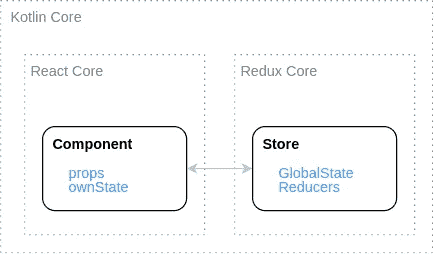
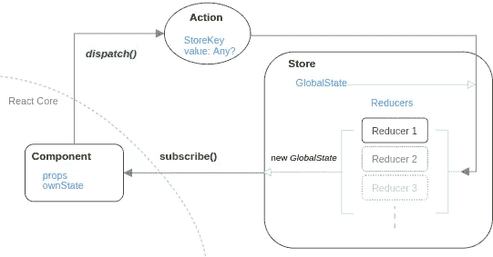

# react droid——Android 的反应式 MVI 架构——第 2 部分

> 原文：<https://medium.com/nerd-for-tech/reactdroid-reactive-mvi-architecture-for-android-part-2-44c3c2810f52?source=collection_archive---------12----------------------->

## 移动应用中的反应式编程——一次旅行

## 一个全面的移动开发库，采用纯 Kotlin 内核设计，并扩展了 Android 层。快速、结构化和可靠的应用程序开发—第 2 部分— Redux

## 介绍

在[之前的文章](/@gguymi/587726a5045f)中，我们学习了 [*如何*](/@gguymi/587726a5045f) 实现一个 [*反应*——就像 *Kotlin 中的*](/nerd-for-tech/react-redux-in-kotlin-for-truly-native-mobile-development-25229937d4f)架构。这一部分将从我们停下来的地方继续向我们展示*如何使用 [*RxKotlin*](https://github.com/ReactiveX/RxKotlin) 实现一个 [*Redux* -like](/nerd-for-tech/react-redux-in-kotlin-for-truly-native-mobile-development-25229937d4f) 架构。这两个组成了 [*Reactdroid*](https://github.com/GuyMichael/Reactdroid) 库，在 *GitHub* 上有[可用。](https://github.com/GuyMichael/Reactdroid)*

> 本文假设你对 [*React* 、 *Redux*](/nerd-for-tech/react-redux-in-kotlin-for-truly-native-mobile-development-25229937d4f) 和 [*rx*](http://reactivex.io/) 有所熟悉。

Redux 定义了单向数据流。像雨林一样:水蒸发(发送)到云(存储)，云将它们合并在一起，然后下雨(通知)到每个人:)

# (类似 Redux 的架构是如何搭建的)？

[提醒你](/@gguymi/587726a5045f)——在高层次上， *Reactdroid* 的 *Kotlin* 内核是这样构造的:

反应性类固醇的科特林核心

今天我们就来聊聊 *Reactdroid* 的 *Redux* 内核及其*存储*。

# 我们将在本文中讨论的内容

1.  *商店*类
2.  *存储*的 API—*subscribe()*&*dispatch()*
3.  *存储*的*全局状态*及其*存储键*
4.  *储存*的*减速器*
5.  *将* [我们的*组件*](/@gguymi/587726a5045f#47f2) 连接到*商店*

下一篇文章将会更深入地探讨*商店*是如何运作的。

# 商店

[商店](https://redux.js.org/api/store/)*是*全局状态*管理器。人们可以*订阅*它——以接收*全局状态*变化更新；并且*将*分派给它——以更新*全局状态*。*

*这个[*1-方向流*](https://www.geeksforgeeks.org/unidirectional-data-flow/) 是这样的(本文将涵盖一切) :*

**

*Reactdroid 的存储调度流程(单向)*

*让我们创建我们的*商店*。[与*组件*](/@gguymi/587726a5045f#7c93) 相同，我们将使用一个*抽象类*用于特定于平台的*基类*到*扩展*(例如在 *Android* — `AndroidStore`)。扩展*类*将使用 [*科特林的*](https://www.baeldung.com/kotlin/objects) `[object](https://www.baeldung.com/kotlin/objects)`(单例)。*

*Reactdroid 的存储声明。简化。*

*这个*构造函数*由两个参数组成:*

1.  *`mainReducer` —将持有*库*的所有*减速器*(作为`List`)*
2.  *`preloadedState` —**初始** *状态*用于 **app 启动时***

*并且唯一的成员是(全局)`state`对象，如果给定，则用`preloadedState`(例如来自 *API 服务器*的一些*状态*)初始化，或者用`mainReducer`提供的*还原器*-定义的应用程序初始状态初始化(例如根据本地 DB 的一些*状态*)。*

## *商店的 API*

**商店*的核心 API 由两个方法组成— `subscribe()`和`dispatch()`。
一个给*订阅*的*全局状态*更新，另一个更新它。*

*下面是这两个 API 的(非常)简化的声明:*

*商店的 API。非常简化。*

*[实际上](https://github.com/GuyMichael/Reactdroid/blob/master/reactdroid/src/main/java/com/guymichael/kotlinflux/model/Store.kt)，这个声明要复杂得多，有[泛型](https://www.baeldung.com/kotlin/generics)和[hoc](https://reactjs.org/docs/higher-order-components.html)等等。但是我们现在真的没有时间，下面的文章会更深入😉。*

> *提醒一下， *Redux* (以及 *Store* )与*React*——[没有任何关系，除非我们将它们绑定在一起](https://react-redux.js.org/introduction/quick-start) *(用一个*组件*——专用*订阅*方法)*。
> 因此，*存储*是一个独立的*全局状态*管理器，任何人都可以通过使用一个纯 [*接收观察器*](https://www.journaldev.com/22594/rxjava-observables-observers) 而不是*组件*来*订阅*。*

## *全球国家*

*[全局状态](https://redux.js.org/introduction/core-concepts)持有整个 app 的整体*状态*。
这意味着它应该能够容纳**任何**类型的*物体*，否则我们会受到很大的限制。难怪，它只是一个`HashMap`:)*

*Reactdroid 的全局状态。*

*`map`将一个`String`键映射到`Any?` *对象*(可空)值。
此外，正如你所看到的，底层的`map`是`[internal](https://www.journaldev.com/20235/kotlin-visibility-modifiers-public-protected-internal-private#internal-modifier)`——我们将使用‘getters’来轻松地从中检索值——因为这个`map`将会很大，有很多层次结构。*

*虽然这个`map`的键是原始的`String`，但是从*全局状态*中更新和检索需要*存储键*。*

## *全局状态的存储密钥*

**StoreKey* 基本上只是一个*返回*一个`String`的 [*功能接口*](https://www.javatpoint.com/java-8-functional-interfaces) 。
那个`String`是指*全局状态*的`map`键。
实际中的键将是*枚举*(或者可能是 *Kotlin* 的 [*密封类*](https://kotlinlang.org/docs/sealed-classes.html) )，它将实现这个*接口*:*

*用于将值检索/分派到存储区的 StoreKey。简化。*

*为什么不直接用*弦*？嗯，随着我们的深入，这将变得更加清楚，但是，例如，这样我们可以将一个 *StoreKey* 绑定到一个特定的 *Reducer* 并向其添加“getters ”,以方便地从*存储*中检索其各自的值。*

> *注意:这就是我们与*JavaScript**Redux*的不同之处，后者需要原始字符串作为*键。**

## *渐缩管*

*这部分不太直观。和我在一起🤓。
*存储*同时保存*全局状态*和*减速器* (s)，简单来说，*减速器* (s)帮助更新*全局状态*。就是这样。*

*现在我们冷静下来了，我们也说一下，每个*减速器*负责更新自己的那部分蛋糕；对不起，*全局状态*。
例如，每个*减速器*可能在我们的应用程序中负责不同的功能。有道理？*

*[状态机](https://www.techopedia.com/definition/16447/state-machine)是这样的:*

**

*储存异径管单向流动*

*在每个*调度*时，每个*减速器*接收 3 个参数:
*前一状态*、(*存储* ) *键*和*值。*利用它们，每个*减速器*产生一个新的“小”*全局状态*——以取代蛋糕中与其相关的部分；不好意思，*全局状态*。
最后，*商店*将所有“小”部分合并到“大”部分*全局状态*中，并通知其*订户*。*

*说够了，让我们来制造*减速器*:*

*Reactdroid 减速器。简化。*

*正如你所看到的，*构造器*接受一个【子】*归约器*的`List`——这就是我们如何创建`mainReducer`的，它被*存储*接收到它的*构造器*。*

*`onNewAction`回调由*商店*在每个*派单*上调用，请求新的*全球状态*零件。*

*是的，你没看错——全局*状态*的*缩减器*的“小”部分和*存储*的“大”部分，合并的全局*状态*，具有相同的类型——`GlobalState`。
由于*全局状态*基本上只是一个`HashMap`，因此我们有一个大的*散列表*来保存多个较小的*散列表*——每个*缩减器*一个散列表。像这样:*

*“原始”应用程序全局状态的示例*

*最后，`getDefaultState()`方法主要用于 app 启动，此时*商店*将从所有减速器的默认*状态*中创建其初始*全局状态*。
例如，一个*缩减器*可能是一个*数据缩减器*，它返回所有的数据库数据，这就是我们在应用启动时将数据库加载到*存储*的方式:)*

*综上所述:*减速器*的`onNewAction`就是它如何控制整体*全局状态*的一个特定的、较小的部分。
和*店*一样，将*扩展*为 [*Kotlin*](https://www.baeldung.com/kotlin/objects) `[object](https://www.baeldung.com/kotlin/objects)`(单胞胎)。*

# *总结流程*

*在我们用一个*连接组件*的例子结束本文之前，让我们再看一下流程图，总结一下正在发生的事情，现在我们已经理解了所有的部分:*

**

*Reactdroid 的存储调度流程(单向)*

1.  *一个*组件*(例如)*调度*一个*动作* ( *StoreKey* ， *value* )。*
2.  **存储*在其所有*减速器*上执行`onNewAction`，并接收一个“小”*全局状态*列表。*
3.  **商店*将所有“小”部分合并成 1 个“大”*全局状态*并更新其
    `var state: GlobalState`*
4.  **商店*通知所有*用户*新的*状态*，例如*组件*。*

*我们完了💪。让我们回顾一下我们所做的一切的简化版本，以便透视:*

*Reactroid 的 Redux 实现概述。简化。*

*这个，就在那里👆，是 *Redux* ，在 *Kotlin* 🤘*🤓 🤘*。***

# *我们的第一个连接组件*

*还记得上一篇文章中的 [*按钮组件*吗？它的*文本*受它的(*组件*)父控件控制。让我们改为*将*连接到*商店*:](/@gguymi/587726a5045f#e3bd)*

*与存储区连接的 button 组件*

*我们的*按钮*的*文本*现在是*连接*到*存储*而不是由它的父节点控制。在一个实际的应用程序中，这意味着你可以将**许多** *组件*连接到*商店*中的同一个*值* (s)，所以当它被更新时，**所有的**都被自动地重新*渲染*。没有麻烦。
此外，与 [*前一个*](/@gguymi/587726a5045f#e3bd) 相反，这个例子中的父节点不会在按钮点击时重新*呈现*，因为它更新的是*存储*而不是它的*own state*——这也是一个很好的补充。*

*我们将在下一篇文章中讨论*连接*方法是如何工作的…*

> *注意: *Reactdroid* 的 *mapStateToProps* 是两个[‘real’*Redux Connect*](https://redux.js.org/)方法的合并:[*mapStateToProps*+*merge props*](https://react-redux.js.org/api/connect)。*

# *摘要*

*我们现在(几乎)知道如何为 *Kotlin* 创建我们自己的 *Redux* 实现！正如你可能理解的那样，事情远不止如此。接下来的文章将更深入，进入*连接的* [HOC](https://reactjs.org/docs/higher-order-components.html) 和 [RxKotlin](https://github.com/ReactiveX/RxKotlin) 实现的*商店*。我希望你和我一样兴奋:)
在那里见(即将到来！)*