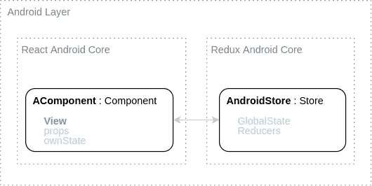

# 反应体——反应式 MVI 建筑，科特林

> 原文：<https://medium.com/nerd-for-tech/reactdroid-reactive-mvi-architecture-for-android-with-a-pure-kotlin-core-multiplatform-587726a5045f?source=collection_archive---------9----------------------->

## 移动应用中的反应式编程——一次旅行

## 一个全面的移动开发库，采用纯 Kotlin 内核设计，并扩展了 Android 层。用于快速、结构化和可靠的应用程序开发。

## 介绍

在之前的文章中，我们谈到了 [*为什么*](/nerd-for-tech/what-is-wrong-with-current-mobile-development-3675ce94ccf5) 当前的原生移动开发方法不够好，以及 [*什么是*](/@gguymi/25229937d4f) 是建议的方法( *React+Redux* )。这次我们将看到*如何在 *Kotlin* 中实现类似 *React* 的架构，下一篇文章将讨论*如何使用 *RxKotlin 实现类似 *Redux* 的架构。* [最终库——*react droid*——在 *GitHub*](https://github.com/GuyMichael/Reactdroid) 上。**

本土手机开发中的 MVI。一个光明的新世界。

# (这个架构是怎么搭建的)？

*React*like 和 *Redux-* like 实现都是纯粹的 *Kotlin* ，允许 [*多平台*](https://kotlinlang.org/docs/multiplatform.html) 开发；而且两者都多了一个 *Android-* 特定层。

> 如果你还不熟悉*反应*和*还原*的原理，请[回到上一篇文章](/@gguymi/25229937d4f)。
> 
> *编辑:在完成这个系列的时候，Android 终于发布了一个稳定版的*[*JetpackCompose*](https://developer.android.com/jetpack/compose)*，基本上模仿了 React 的功能组件。与* [*协同例程*](https://kotlinlang.org/docs/coroutines-overview.html) *和*[*Kotlin-Redux*](https://reduxkotlin.org/)*一起，它是一个强大的“包”，只需一些努力，就可以用来替换或重写*[*react droid*](https://github.com/GuyMichael/Reactdroid)*。
> 虽然所有这些都是真的(而且你应该熟悉上面的技术)，我们将在这个系列中学习的概念是* *现在* *甚至* ***比以往更相关*** *—“标准”的编写移动应用程序的方式越来越接近提到的概念。*

在高层次上，这就是 *Reactdroid* 的 *Kotlin* 内核的结构:

反应性类固醇的科特林核心

而下面是它的 *Android* 层。它的型号扩展了*科特林*核心的型号:

Reactdroid 的 Android 层

# 我们将在本文中讨论的内容

在本文中，我们将只讨论( *Kotlin* -core's) *组件*模型。
我们将介绍:

1.  *组件*类
2.  *组件*的 API — *onRender/setState*
3.  *组件的生命周期回调*
4.  *组件*的【重新】*渲染*逻辑。
5.  在 *Kotlin* 中创建我们的第一个自定义 *React 组件*

下一篇文章将是关于 *Redux* 和 *Store* 车型的。

# 该组件

组件本身包含了整个*反应*架构，真的。
它定义了一个小的[状态机](https://www.techopedia.com/definition/16447/state-machine)，是这样的:

从外部来看，一个想要更新其*组件*的‘父级’:

[*on render(props)*]➡[*check-if-new-props-different*]➡[*render*

或者在内部，一个*组件*可以这样更新自己:

[*setstate(ownstate)*]➡[*check-if-new-state-different*]➡[*render*

> 注意:这种必须经历整个周期而不是直接调用`*this.render()*`的方法称为“[单向数据流](https://www.geeksforgeeks.org/unidirectional-data-flow/)”。

让我们使用一个*抽象类*来定义我们的*组件*:

类反应组件的核心

你可以看到，我们的`props`和`ownState`是*类型化的*(使用 [*泛型*](https://www.baeldung.com/kotlin/generics) ，这样*组件*就可以有自己特定的*道具*和*状态*。
我们稍后会定义`OwnProps`和`OwnState`。

> 注意:特定于平台的实现将*扩展* it 以将其绑定到他们自己的环境(例如，在 *Android* 中，它将是与*视图*绑定的`*AComponent*`)。

下一步是*组件*的 API 和生命周期回调。

## 组件的 API — onRender()

我们[已经知道**唯一让*组件*更新 UI(重新*渲染)*的**方式是给它传递新的*道具*(或者在内部， *ownState* )。这就是 *onRender* 方法(和 *setState* )的用途:](/nerd-for-tech/react-redux-in-kotlin-for-truly-native-mobile-development-25229937d4f#77e9)

组件的(唯一)API — onRender()

API 完成:)
我们后面会定义实际的*渲染*逻辑。

下一步— UI 生命周期回调。

## 组件生命周期

作为 UI 的负责人，*组件*有生命周期回调来帮助我们根据 **U** ser **I** 与它交互的时间来控制我们的应用程序会发生什么。让我们直接进入主题，看看 3 个最重要也是最直观的回调，所有解释都在代码中:

组件生命周期的简化版本

嗯，[还有更多](https://github.com/GuyMichael/Reactdroid/blob/master/reactdroid/src/main/java/com/guymichael/kotlinreact/model/Component.kt)，但这些都是基本面。
它们只是空实现的`open`函数，供定制*组件*使用。我们会看到*当*他们很快被召唤的时候。

> 注意: *componentDidMount* 有点类似于 *Android Activity* 的`onPostCreate()`或者 *View* 的`*onViewAttachedToWindow()*`。
> *component will unmount—*或者更好的称呼， *componentDidUnmount —* 有点类似于*安卓活动*的`onDestroy()`或者*视图*的`*onViewDetachedFromWindow()*` *。*

在我们进入最后一步之前——组件*的*渲染*逻辑——*让我们看看整个事情(到目前为止),以获得一些视角:

组件—概述

差不多就是这样了。
剩下的唯一问题是关于`props`和`ownState`,*渲染*逻辑是如何工作的。
我们将只讨论*道具*，因为它们更有趣，而且我们已经确定 [*ownState* 应该很少使用](/@gguymi/25229937d4f#78a6)。

> *ownState* 流程本质上完全相同…

## 组件的(重新)呈现逻辑

这是有趣的东西。其他一切都很基本。
总的想法还是“[单向数据流](https://www.geeksforgeeks.org/unidirectional-data-flow/)”:一旦新的*道具*(或*自身状态* ) 被传递——使用 *onRender* (或*set state*)—*组件*将它们与先前的进行检查，如果它们不同，它将重新*呈现*

我们不会面面俱到，因为内容很多，但是让我们回顾一下基本原理:

组件在 Render()上。简化。

我们使用我们的 [*lateinit var*](https://stackoverflow.com/questions/37618738/how-to-check-if-a-lateinit-variable-has-been-initialized) *道具*来知道我们是否曾经*渲染过*。
让我们回顾一下`onFirstRender()`和`onStandardRender()`的区别，进一步理解其中的逻辑。

## 组件的首次渲染

`onFirstRender()`背后的逻辑就是这样:
‘等待*挂载*事件，然后*渲染*’。

> 以*安卓*为例，*挂载*是当*视图*被*附着*到窗口*时。*

这是它的简化版:

组件首先呈现流程。简化。

`waitForMount`是一个*抽象*函数，具体平台的*基类*(如 *Android* *组件*)应该实现它，告诉*组件*何时被*挂载*(如*视图*的 *onAttach()* 事件在 *Android* 中)。

`createIntialState(props)`也是一个*抽象*函数。这是*组件*定义它们的初始 *ownState* 的地方，给定一些(初始)*道具*。没什么太有趣的。

> 注意:我简化了这个例子，还有更多的内容；和一些边缘情况

好了，那只是第一次*渲染*。让我们继续有趣的部分。

## 组件的标准(非第一)渲染

在非第一个*呈现*请求时调用`onStandardRender(props)`。它的逻辑也很简单:
‘如果新的*道具*和以前的不一样——*重新渲染【T66’:*

组件非第一渲染流。

正如您现在所希望理解的，这个*等式*检查，就在那里，是 *React* *，*与其他架构的权衡:

*   我们可以做 [*浅相等*](https://stackoverflow.com/questions/36084515/how-does-shallow-compare-work-in-react) (就像在*反应*中一样)，但是会导致更多(不必要)*渲染*(也是‘重’)——就像一些*相等*检查[会无缘无故返回*假*](https://codeburst.io/react-array-re-render-performance-ee23f34c5d66)。
*   或者我们可以做一个完整的*相等*检查——这也是“繁重”的。

解决方案总是介于两者之间:)
它内置在`OwnProps`模型的`equals()`方法中。这就是我把它留到最后的原因。

## 组件的 OwnProps 及其 equals()

`OwnProps` / `OwnState`有一个`React`的*道具*没有的方法(只是一个 *JavaScript* 普通*对象)——*`getAllMembers()`。
*Reactdroid* 的*相等*检查使用**真实**相等，但它们是在一个**选定的*道具* / *ownState* 成员*上完成的，而不是盲目地在整个*对象*上完成的。这就是诀窍。***

让我们回顾一下`OwnProps`:

组件的道具模型。简化了的

就是这样:*等于*上的*道具* / *自身状态*定义为当一个**选择的**集合的成员*等于*时。这提供了两大特性:

1.  开发者可以先定义*原语*成员(为了效率— [早破](https://stackoverflow.com/questions/1162583/optimizing-equals-method))。
2.  开发人员可能会省略不应该影响重新*渲染*的成员。
    例如，如果某些*属性*包含回调(例如*按钮组件*的“onClick”)，最好不要重新*渲染*，以防提供新的回调——因为这不会影响 UI。
    另一个例子是，如果你的*组件*呈现一些*数据*模型(例如一部*网飞*电影)，你可能会认为这些数据在应用程序会话的过程中不会改变——只返回电影的“id”——不需要深入检查整个*网飞*电影*数据*的*相等性*。超级高效。

因此，每次(非第一次)调用`onRender()`时，`onStandardRender()`检查*道具*之间的(特殊)*相等*，如果它们不同，*组件*【re】*渲染*。同样的逻辑也适用于`setState()` …

我们到此为止💪。
让我们回顾一下整个*组件*的简化版本，以便了解:

组件的基本原理。简化。

这个，就在那里👆，是*反应过来*，在*科特林*🤘🤓 🤘*。*

## 定制组件

在结束本文之前，让我们定义我们的第一个定制组件*和它的*道具*😎。*

下面是一个简单的*按钮组件*:

一个简单的自定义按钮组件

这有多简单？现在你可以用这个*组件*来包装**任何** *安卓* *按钮*，无论实际布局如何，并且有一个简洁的方式来控制它。在接下来的文章中，我们将会看到更复杂、更有趣的例子，来理解这种方法到底有多强大。

> 注意:`EmptyState`只是`OwnState`的一个空实现(没有成员)。这仅仅意味着我们的*组件*没有使用它的*自身状态*。

# 摘要

在本文中，我们学习了*如何在 *Kotlin* 中*实现 *React* 式的架构。虽然还有更多细节，但它基本上是如何构建的 [*Reactdroid*](https://github.com/GuyMichael/Reactdroid) 并且它允许创建可预测、高效和简洁的 UI，非常快。
[下一篇文章](https://gguymi.medium.com/44c3c2810f52)将教你如何创建一个 *Redux* 般的架构(也是 [*Reactdroid*](https://github.com/GuyMichael/Reactdroid) 的一部分)。接下来的文章将深入展示一些很酷的例子。
[那里见](https://gguymi.medium.com/44c3c2810f52)👋。