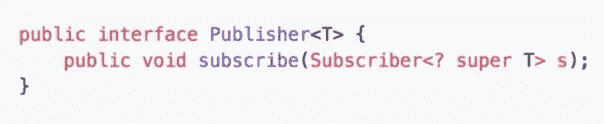
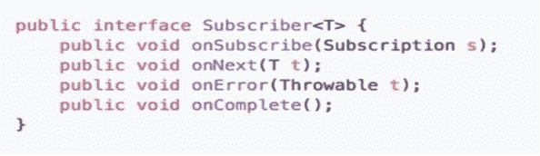
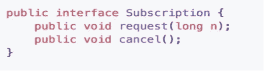
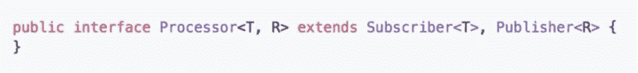
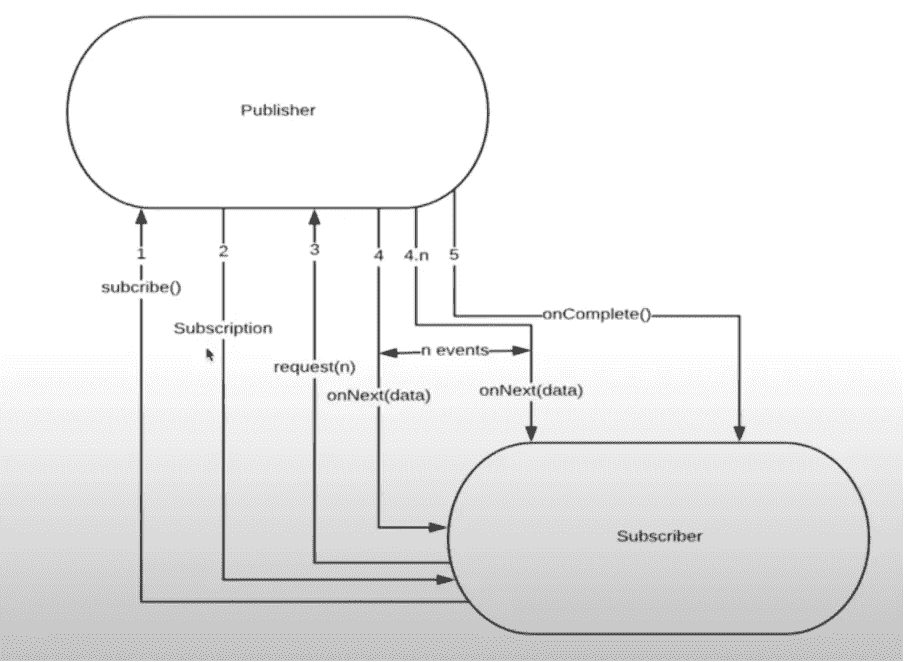
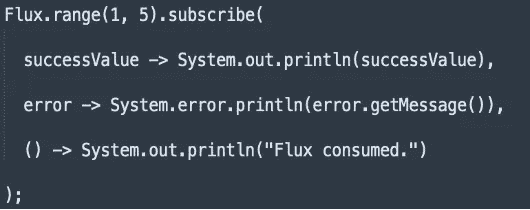
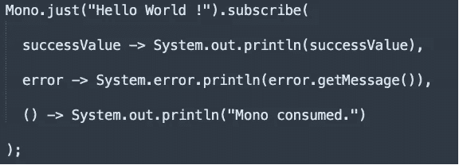

# JAVA- I 中的反应式编程

> 原文：<https://medium.com/nerd-for-tech/reactive-programming-in-java-i-3bde6c0d836c?source=collection_archive---------1----------------------->

很长一段时间以来，Java 开发人员一直羡慕 JavaScript 开发人员，因为 JS 的异步特性。在后台执行进程的能力很有趣。此外，JS 语言使得开发人员很容易使用它。Java 是同步的，主要依靠线程或其他外部库来实现这种能力。但随着时间的推移，开发人员决定弥补这一缺陷，因此反应式编程诞生了。

瑞安·普特拉在 [Unsplash](https://unsplash.com?utm_source=medium&utm_medium=referral) 拍摄的照片

顾名思义，术语“反应式编程”的字面意思是对反应进行编程。“反应”通常来自于由于一个过程或用户的任何动作而发生的事件。引用该术语的字面定义，“反应式编程是关于构建**异步、非阻塞和事件驱动的**应用程序，这些应用程序可以容易地**扩展**

上面的定义可能有点令人困惑，因为它有许多花哨的术语，但让我们通过一个例子来理解它。假设我们有一个简单的 spring boot 应用程序，它使用简单的 rest api 与用户通信。现在假设我们的应用程序通常每秒接收 100 个调用，但是由于突然的增长，请求达到每秒 100000 个调用或者更多。为了处理这些电话，我们有两种选择

1.我们可以使用多线程，跨越 100 个线程，并将每个线程分配给每个客户端请求。但是这种方法的问题是线程来自消耗内存的线程池。线程池的大小越大，应用程序的其他功能可以使用的内存就越少，这反过来会减少应用程序的响应时间。

2.我们可以遵循容器化的方法，使用 Kubernetes 类型的应用程序来旋转我们的 spring 项目的多个实例，并为每个实例分配一些“X”请求(基本上是进行负载平衡)。这种方法听起来不错，但是旋转实例消耗资源，因此花费更多的钱。

为了解决上述问题，开发人员提出了一种新的方法，称为“反应式编程”。现在，这种类型的编程背后的想法是简单地使代码更快，这将自动地使响应更快。通过一个例子来理解这一点，假设我们有一个代码，其中我们有一个*数据库调用*，后面跟着一些处理*，这些处理可能依赖于也可能不依赖于*数据库响应。在 java 中，代码是同步执行的，这意味着在收到数据库的响应之前，下面的代码不会执行。

这本质上是**阻塞**并间接减慢处理速度。进一步想象一下，一个巨大的数据库调用可能需要一分钟左右的时间。避免这些的最好方法是通过使用回调或 future(在 java 中)来使用异步调用。虽然这些术语听起来很简单，但实际的编码有点复杂，可能需要更多的曝光。因此，作为替代方案，我们有反应式编程，它是**非阻塞、异步和事件/消息驱动的**。

继续上面的例子，代码不会等待数据库响应完成，实际上会移动到下一行，从而使**代码异步和非阻塞**。此外，当数据库获取完成时，我们可以基于完成/未完成数据传输的事件做出决策/行动，从而使编程**基于**事件/消息。

在继续之前，我们需要强调几件事。首先，反应式编程使用流来传输数据。基于流的响应，我们可以触发事件

使用 onComplete()、onError()等方法。其次，由于这种编程使用流，我们需要使用 lambdas 或 lambda 函数来正确使用这种风格。最后，假设数据库存储了 500mb 数据，但我们只需要 100mb 数据。因此，获取整个 500mb 将是浪费时间和处理。因此，反应式编程使用了一个名为**背压**的概念，我们可以告诉数据库我们只需要 100mb 的数据，这样它就可以只处理所需的数据，或者在发送数据时降低速度。

反应流规格

来自不同公司的工程师聚集在一起，制定了一套针对流的规则。这些规范非常简单，主要分为 4 个部分/接口。

A.发布者:数据生产者/发布者，描述产生流的数据源。例如:-数据库或外部服务等。对应的界面如下所示。

B.订阅者:订阅者是从发布者接收数据的消费者。该接口主要有 4 种方法，如下所示。虽然接口的名字是不言自明的，但是我们将在后面讨论细节。

C.订阅:这个界面方便了订阅者。他们可以调用 cancel()方法来取消关联 btw pub-sub，反之亦然。

D.处理器:—它是订阅者和发布者接口的组合。

数据流程和方法使用如下

**反应库**

Java 支持的库使我们很容易使用非阻塞 API。 [Project reactor](https://projectreactor.io/) 是开发人员用来开发 java 异步应用程序的最大的库之一。由于这是最大的库，我们将在以后的文章中使用它。

深入挖掘文档我们会发现，Project reactor 的核心是 reactor-core，这个 reactor-core 使用两个模块，即 **Flux** 和 **Mono** 来实现其功能。这两个模块是**发布者接口**的实现，因此使用相似的规范。

***Flux*** 是 reactor-core 中的一个抽象类，它接收 N 个数据，同时在处理每个数据部分时发送回响应。在执行/处理数据时，如果发生错误，则整个流不会被处理，执行将立即终止，否则将执行所有 N 个数据，然后调用 onComplete()结束处理。为了借助代码来解释它，假设我们有(现在不要担心代码细节):-

这将显示在控制台中:

> 1
> 
> 2
> 
> 3
> 
> 4
> 
> 5
> 
> 消耗通量。

现在想象一下，当操作流量中的值时，会为值 4 抛出一个异常。

出现了一个错误:

> 1
> 
> 2
> 
> 3

***Mono*** 是一个专门的发布器< T >，它最多发出一个项目，然后(可选)以 onComplete()信号或 onError()信号终止。单声道流仅用于 1 个元素，并且在一次处理后停止执行。为了借助代码来解释它，假设我们有(现在不要担心代码细节):-

这将显示在控制台中:

> 你好世界！
> 
> 单声道消耗。
> 
> 如果出现错误，它会显示:
> 
> 错误消息
> 
> 单声道消耗。

正如你所注意到的，“消耗的通量”不显示是因为助焊剂还没有完全耗尽。这是因为如果发生错误，流将停止处理将来的值。此外，错误在成功的值之前被处理。