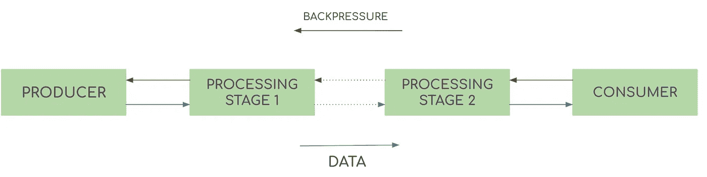
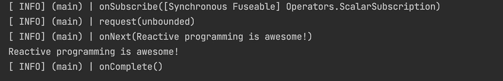

# 用反应器进行反应式编程

> 原文：<https://medium.com/nerd-for-tech/reactive-programming-with-reactor-a8ab236deb36?source=collection_archive---------11----------------------->


电弧反应器

在我们谈论什么/为什么反应器之前，让我们先快速回顾一下反应式编程和反应式流。

**反应式编程**是一种编写异步、非阻塞代码的方式。这意味着，每当有像 IO 操作/api 调用这样的耗时任务时，执行就会切换到另一个活动任务，当异步处理完成时，执行就会返回到当前任务。

> 一种简单的方式认为
> 是反应式的:一旦数据可用或者异步执行完成就做出反应。

# **无功流**

字典上说:一股**流**是某种东西的稳定流动

就计算而言，**流**由数据的生产者和数据的订户组成。当订阅者订阅生成器时，数据开始从生成器流向订阅者。如下图所示，中间可能有多个修改数据的阶段


通用流

这是关于一般的溪流。是什么让一个流真正具有反应性？

1.  异步性:生产者异步产生数据，数据异步通过处理阶段。
2.  非阻塞背压:这是一种机制，每当使用者处理数据缓慢时，使用者可以请求生产者减慢速度



反应流

你可以把反应流想象成传送带。只要原材料在源头可用，就会被倾倒在传送带上。在传送带上的某些点，材料被加工/转换，然后成品被推到另一端(用户)


传送带

这是所有通用的 gyaan 或概念，无论哪种反应框架都保持不变。

回到**反应堆**。它是一个完全**非阻塞**、**反应式编程**框架，带有**非阻塞背压**。
它提供的最强大的功能之一是丰富的操作符词汇表，这些操作符可以相互组合，从而提高代码的可读性。

让我们分解这个框架，按照以下步骤来看:

1.  reactor 中的出版商/生产商
2.  反应堆中的操作员

# Reactor 中的发布者

**Mono** 和 **Flux** 是 Reactor 提供的两个发布器。 **Mono** 用于发布单个实体，而 **Flux i** s 用于发布一系列实体，这是 Mono 和 Flux **之间唯一的主要区别。要创建单声道或通量，你可以使用静态方法 *just()***

```
Mono.just(1)
Flux.just(1,2,3,4,5,6,7,8)
```

在你订阅之前，什么都不会发生。我们已经创建了出版商，但是直到有人订阅，数据才会开始涌入

log()方法记录与发布者发生的所有交互。理解来自出版商的各种信号是非常有帮助的。上面的程序将输出类似这样的内容:



从上面的输出中，我们可以得出以下结论:每当消费者订阅发布者时，在成功订阅时，一个 **onSubscribe** 信号被发送给订阅者。在那之后，用户**请求**数据。然后，发布器将发送一个 **onNext** (数据)信号或一个 **onError** (错误)信号。当发布者没有任何剩余数据时，将向订阅者发送一个 **onComplete** 信号。

# **反应器中的操作人员**

正如我前面说过的，反应堆最强大的武器之一是它庞大的操作者词汇。让我们了解一下可以使用这些操作符的几个用例。

**地图()**

map()运算符用于转换流经流的数据。让我们看一个简单的例子

在上面的例子中，一旦 Mono 被订阅，数据就流入 map operator，在这里它被平方并返回。

**当任何操作符返回一些数据时，这些数据被打包到一个新的发布器(在本例中是 Mono)中，然后被返回。**

> 您可以在一个链中链接任意数量的操作符。从操作者返回的任何东西都流向下一个操作者

**平面地图()**

类似于 map()操作符，flatMap()也可以用来转换数据。但是除此之外，这种转换可以是异步的。

在上面的例子中，当我们获得客户数据时，它在 flatMap()操作符中流动。然后，我们异步地为客户进行支付。所以 PaymentService()。pay()返回单声道<payment>。</payment>

**flat map()在这里扮演的重要角色是解开 PaymentService()返回的 Mono < Payment >。pay()并将其与上游合并，这样 chain 的最终返回是 Mono < Payment >。**

> 如果我们使用 map()而不是 flatMap()，那么响应将会是单声道<mono>>。由于没有人订阅内部单声道，付款永远不会发生。这是 flatMap()和 Map()之间最重要的区别</mono>

**zip()**

zip()可以用来同时执行两个或更多的发布者**和**。

假设我们有一个用例，我们必须从两个不同的 API 获取客户的个人信息和银行账户信息。在这里，这两个任务是相互独立的，因此可以并发执行。

我们开始吧:

zip()从发布者返回一组响应。在上述情况下，它将是元组<personaldetails accountdetails="">。然后我们可以将它们合并在一起，返回一个客户对象</personaldetails>

假设由于某种原因，我们没有获得客户的个人详细信息，在这种情况下，zip 不会执行以下步骤。只有当所有发布者都用数据响应时，它才执行以下步骤。这将导致订阅收到空响应。让我们看看如何使用下一个操作符来处理这种情况。

**switchIfEmpty()**

顾名思义，switchIfEmpty()在收到来自上游的空响应时切换到备用发布者。

在上面的例子中，我们从缓存中切换到客户详细信息，以防我们收到来自客户服务的空响应。

回到我们如何处理我们在 zip 操作符中讨论的场景:

在上面的例子中，如果我们没有获得个人/帐户的详细信息，我们从缓存中切换到详细信息，最终用户将收到相同的信息。

**onErrorMap()**

*onErrorMap()* 是错误处理操作符之一。每当在反应链中出现错误时，控制简单地切换到第一个错误处理操作符

*onErrorMap()* 可用于将发生的异常转换为领域特定异常或应用程序理解的任何异常。

在上面的例子中，每当出现超时异常时，我们都会抛出一个**RequestTimeoutException**以及一些可理解的消息和错误代码

> 识别系统中可能发生的一组**异常**是一个好主意。它可以通过以下方式帮助您:
> 
> 1.当它发生时，你可以采取特殊的措施。
> 
> 2.它提供了更多的信息(在日志中/作为响应)

**onErrorResume()**

onErrorResume()允许您在出现问题时回退到另一个进程/发布者。

在上面的例子中，如果获取收藏夹时超时，将会抛出一个异常。在这种情况下，我们退回到收藏夹缓存服务。

上面给出的操作符是常用的，但只是 Reactor 所拥有的很小一部分。

**继续探索，因为这样做很有趣……**

**参考文献:**
1。项目反应堆官方文件—[https://projectreactor.io/docs/core/release/reference/](https://projectreactor.io/docs/core/release/reference/)