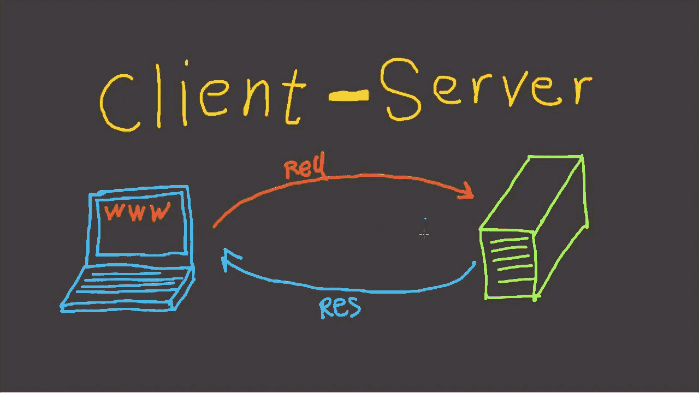

# 反应式 web 客户端

> 原文：<https://medium.com/nerd-for-tech/reactive-webclient-2c402f99584e?source=collection_archive---------0----------------------->



Spring WebFlux 提供了被动的 WebClient 来进行异步 api 调用。它是完全无阻塞的。我喜欢 WebClient 的一点是，它与 [reactor](https://projectreactor.io/docs/core/release/reference/) api 集成得很好，提供了非常可读的代码，并且它可以以各种方式进行配置，我们马上就会看到这一点。

让我们从创建 WebClient 的实例开始。有两种方法可以做到:

1.  使用 **WebCient.create()** 或 **WebClient.builder()** 函数
2.  自动连接**web 客户端。spring 提供的构建器** Bean

一旦创建，WebClient 是不可变的，这使得它是线程安全的。您可以使用 **webClient.mutate()** 来重新配置它并获得一个新的实例。

由于我们已经创建了我们的 WebClient，现在让我们进行一个 api 调用。

仅此而已。仅用四行代码，我们就能够进行一个 **GET** api 调用。让我们分解代码，看看各个部分

1.  **get()** 方法指定这是一个 GET api 调用
2.  **uri()** 接受 uri 字符串。您还可以使用另一种风格的 **uri()** ,它接受一个允许您使用 UriBuilder 配置 uri 的函数
3.  **retrieve()** 方法用于检索响应体。
4.  **body tomono(Customer::class . Java)**真有意思。它使用 **Spring 编解码器**将数据反序列化为所需的域类。关于编解码器的更多信息；在这篇博客的后面

类似地，我们可以进行下面的 post api 调用。

这里唯一的区别是我们用来发送请求体的 **bodyValue()** 方法、

让我们看看我们可以对 WebClient 进行的一些配置。

> 我们在项目中遵循的一件事，我发现它非常有用:在 starter/library 中的一个地方配置 WebClient，并在所有微服务中使用它。这个实例将有一切配置:默认头，过滤器，编解码器，错误处理等。

**默认标题**

我们可以为来自应用程序的每个请求配置默认头

**过滤器**

您可以创建自定义过滤器并将其插入到 WebClient 中，以拦截请求和/或响应。这有助于处理跨领域的问题，如身份验证或日志记录。下面是这种过滤器的一个例子:

要将这个过滤器插入到 WebClient 中，我们可以使用 WebClient builder 提供的 **filter()** 方法

**网络客户端编解码器**

编解码器负责编码/解码来自网络呼叫的数据。WebClient 为此使用了 [spring 编解码器](https://docs.spring.io/spring-framework/docs/current/reference/html/web-reactive.html#webflux-codecs)，所以我们不必担心所有这些。

但是，在某些情况下，我们必须使用自定义的编解码器；WebClient 允许我们配置自定义编解码器，如下所示

您可以通过扩展 **HttpMessageReader** 来创建自定义编解码器

**关于编解码器的更多信息**

默认情况下，web 客户端编解码器可以将 256 KB 的数据缓冲到内存中。因此，如果您得到一个大小超过 256 KB 的 api 响应，您将得到一个 **DataBufferLimitException**

您可以通过修改默认编解码器的设置来更改此限制，如下所示:

您也可以通过应用程序属性进行配置，设置**spring . codec . max-in-memore-size**如下

```
spring:
  codec:
    max-in-memory-size: 1048576
```

> 但是要做到这一点，你必须使用网络客户端。spring boot 提供的构建器 bean。

***参考文献:***

[*Spring web flux 的文档*](https://docs.spring.io/spring-framework/docs/current/reference/html/web-reactive.html#webflux)

**如果你喜欢这个博客，请鼓掌和/或在下面留下回应**

**关注我，了解更多关于 Kotlin、Spring Webflux、Reactor 等的博客……**