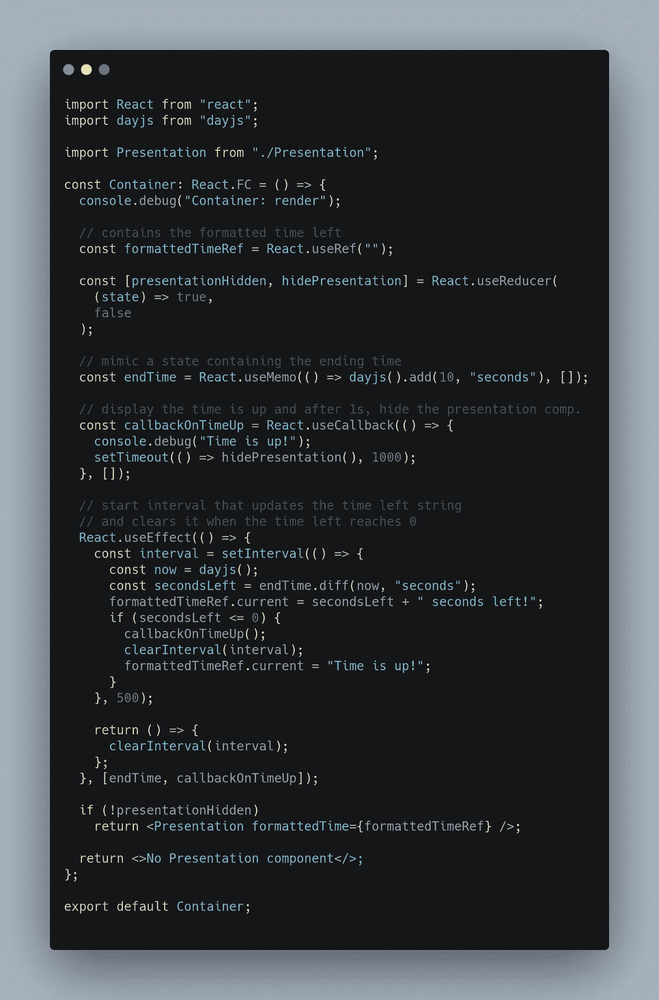
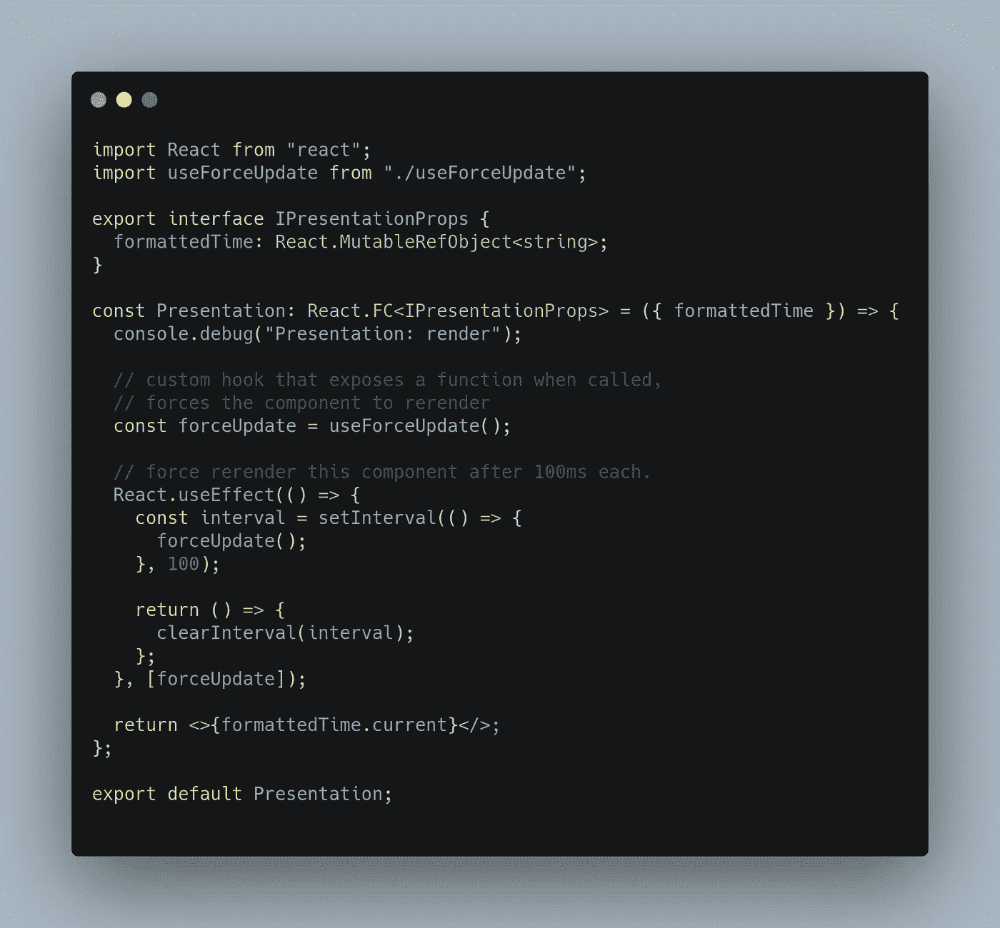
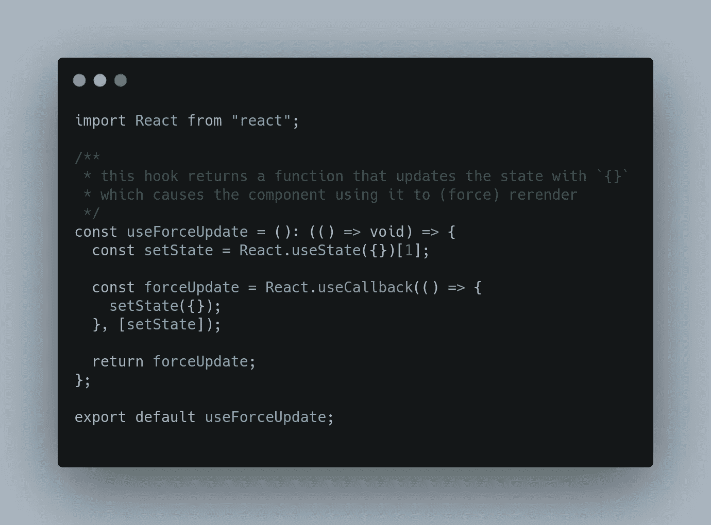

# ReactJS:容器/表示模式+有效管理倒计时

> 原文：<https://medium.com/nerd-for-tech/reactjs-container-presentation-pattern-manage-countdowns-effectively-fdbb5ce383a2?source=collection_archive---------21----------------------->

[Evie S.](https://unsplash.com/@evieshaffer?utm_source=unsplash&utm_medium=referral&utm_content=creditCopyText) 在 [Unsplash](https://unsplash.com/s/photos/pink-wallpaper?utm_source=unsplash&utm_medium=referral&utm_content=creditCopyText) 上拍摄的照片

# 说明

容器/表示模式建议将业务逻辑包含在`Container`组件中，而`Presentation`组件用于呈现/显示业务逻辑的结果。

## 方案

在本文附带的`sandbox`中，我实现了一个基本的倒计时应用程序，当数到 0 时，调用一个函数。业务逻辑在`Container`组件中实现，而`Presentation`组件负责显示还剩多少时间。

## 我如何管理`Container`组件中的倒计时

在`Container`组件中，我使用`useRef`实时存储剩余时间，使用 Javascript 的`setInterval`在每个`500ms`之后运行，并检查剩余时间是否为`<= 0s`。如果是这样的话，当剩余时间到达`0`时，我将停止这个间隔，并调用我已经编写的回调函数`unmounts`

# 解释实施/沙盒

转到以下链接访问沙箱:[https://code sandbox . io/s/github/arbaz 52/container-presentation-pattern-react-with-effective-count down-management/](https://codesandbox.io/s/github/arbaz52/container-presentation-pattern-react-with-effective-countdown-management/)

`Container`具有业务逻辑的组件

演示组件在 100 毫秒后重新呈现，以显示更新后的剩余时间。

useForceUpdate 自定义挂钩，强制组件重新呈现

## 实施/沙盒的现场演示

## 文章背后的动机/想法

我和高级开发人员以及我的导师[塔齐·穆斯塔法](https://github.com/taqimustafa)正在讨论管理容器/表示模式中倒计时的最佳方式，他提出了我在这里实现的想法。