# ReactJS:选择性上下文消费者

> 原文：<https://medium.com/nerd-for-tech/reactjs-selective-context-consumer-939464e9ca02?source=collection_archive---------12----------------------->

## 如果选定的值/值的子集更改，则重新呈现组件

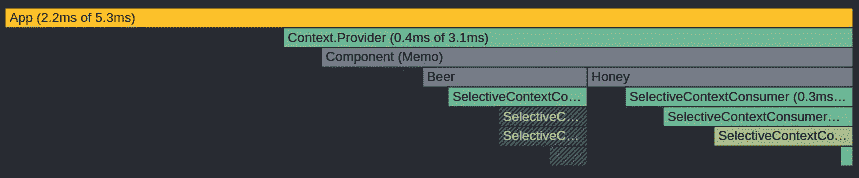

“反应分析器”输出

不久前，我们遇到了一个问题，使用一个`object`作为包含`states`和`methods`的上下文值来更新所述的`states`

## 相关链接:

项目库(重构源代码)可以在 [**Github**](https://github.com/arbaz52/selective-context-consumer) 访问。可以在 [**CodeSandbox**](https://codesandbox.io/s/github/arbaz52/raw-selective-context-values-consumer) 访问沙盒的链接。

## 问题:

如果当`object`内的任何一个或多个值改变时`context value`更新，它会导致使用带有`useContext`钩子的所述上下文的每个组件重新呈现，即使组件没有使用更新的上下文内的值。

这导致了不必要的重新渲染，我们不想使用一个库，因为时间线已经快完成了。

## 我如何创建一个变通办法:

我使用了`memoization`技术来减少不必要的重新渲染。

我创建了一个将`context`和`selection`函数作为`props`的`Functional Component`。然后，我缓存选择并将选择传递给一个`memoized` React 组件。

然后，`memoized` React 组件呈现结果。我写了一个自定义的`function`来检查传递的属性是否被改变，如果是，我`flag`组件来渲染，否则它不会重新渲染。

## 上述方法背后的原因:

我创建两个组件的原因在于我们面临的问题。

第一个/父组件使用带有`useContext`的上下文，每次上下文值更新时，它都会重新渲染。

子/第二个组件将`selection`作为`prop`接受，自定义`shouldComponentUpdate`函数作为第二个参数传递给`React.memo`检查下一个`selection prop`与旧的`selection prop`是否匹配，如果不匹配，则`flags`将其渲染。

这样，作为子道具传递给第一个组件的组件只有在选择改变时才会重新渲染。

# 代码解释

## 项目结构:

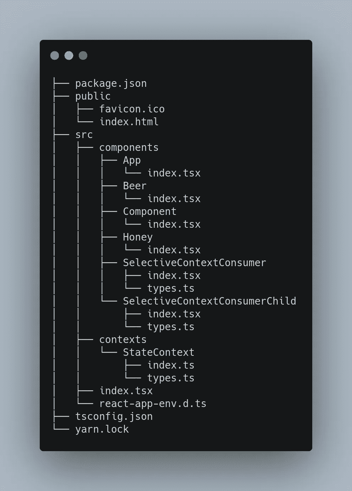

项目结构

## “选择性上下文消费者”组件:

`context`接受一个`React Context`，`selector`接受一个函数，该函数将上下文作为道具传递给它，并返回`selection`。

该组件遵循一种`render prop`模式，并将选择作为参数传递给函数`children`，然后该函数返回一个`React Node`。

`name`只是为了调试，所以我们可以看看是怎么回事。

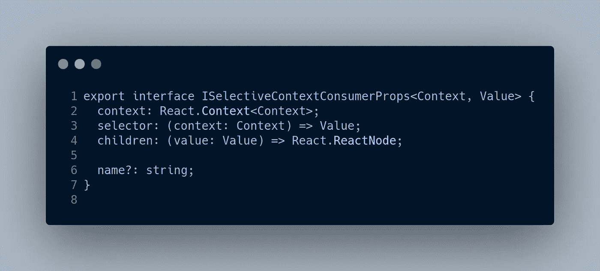

它只是使用传递给它的上下文，并使用传递给它的`selection function`从中提取所需的内容。

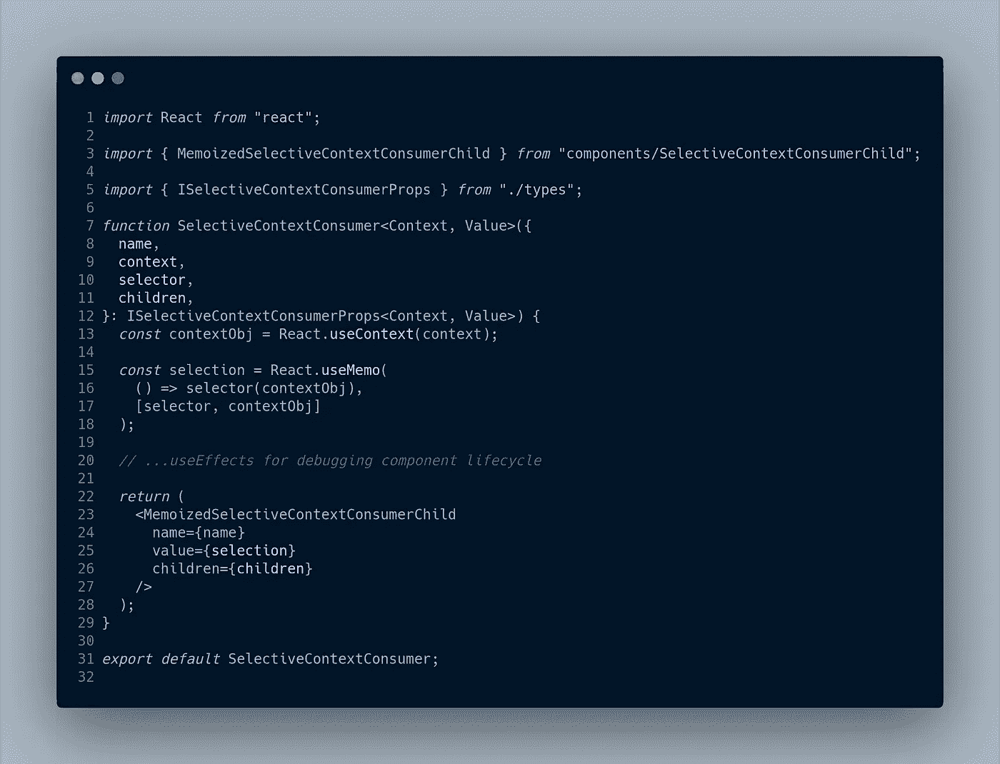

## 选择性上下文消费者子代:

它接受`memoized`选择和`render function`作为道具。`name`只是为了调试组件的生命周期。

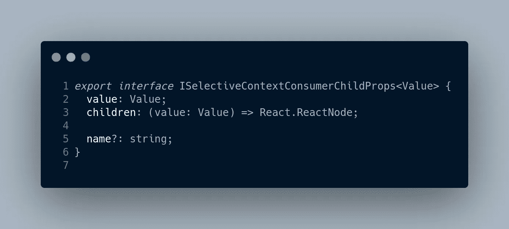

它只包含渲染，主要逻辑来自于`memoizing`它。

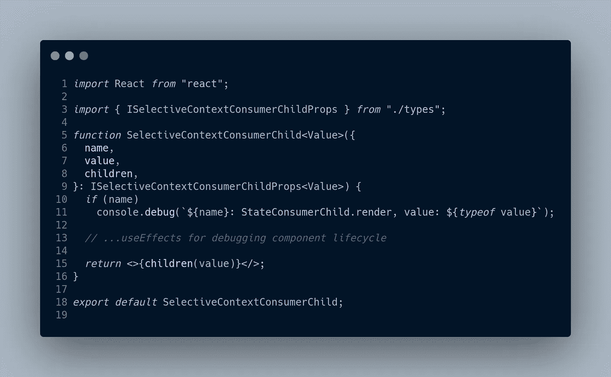

## 组件是否应该更新:

`pvProps.value` & `nxtProps.value`包含选择，所以我们检查选择是否已经更新，如果是，我们重新渲染它。如果没有，我们检查传递给它的`render function`是否已经改变。如果是，它会重新渲染它。

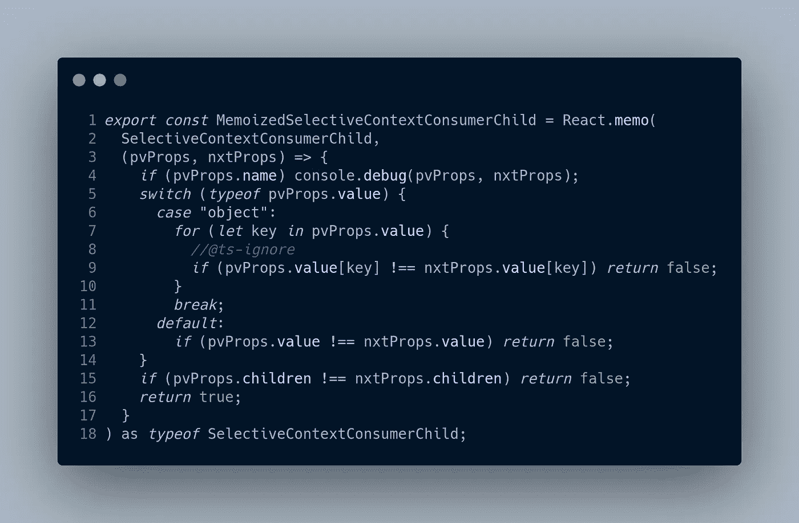

## 状态上下文:

包含了两种状态:`beer` & `honey`。两个功能分别对`addBeer` & `addHoney`状态进行突变。

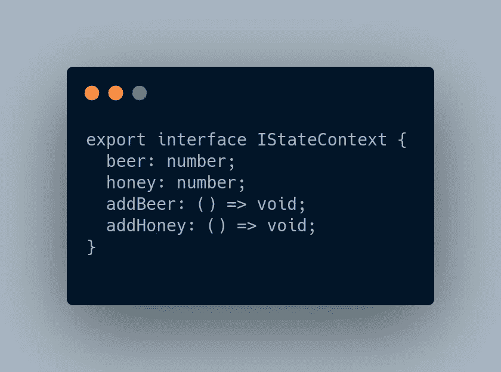

## 应用程序组件:

创建状态和调度并用`StateContext.Provider`包装记忆组件。

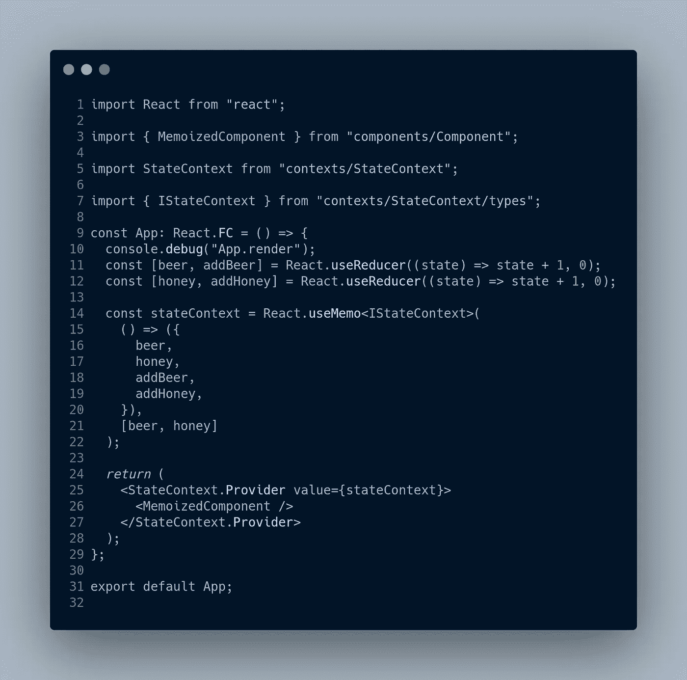

应用程序组件

## “组件”组件:

只是一个`memoized`组件，其中包含实际的糖。

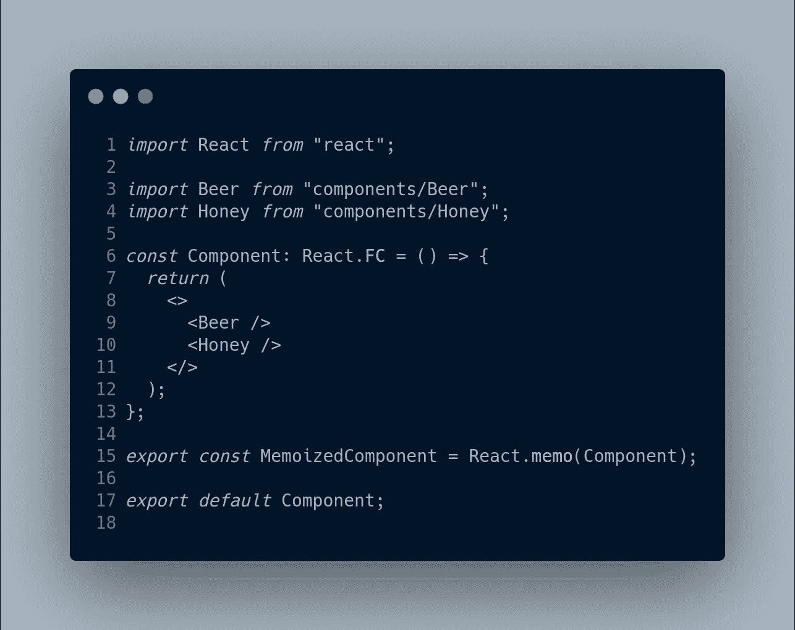

## 蜂蜜成分:

我们传递我们定义的选择函数，它从上下文中提取出`honey`和`addHoney`。我必须`memoize`选择器函数，因为它对选择进行类型转换，所以在第 21 行，我们知道值的类型。

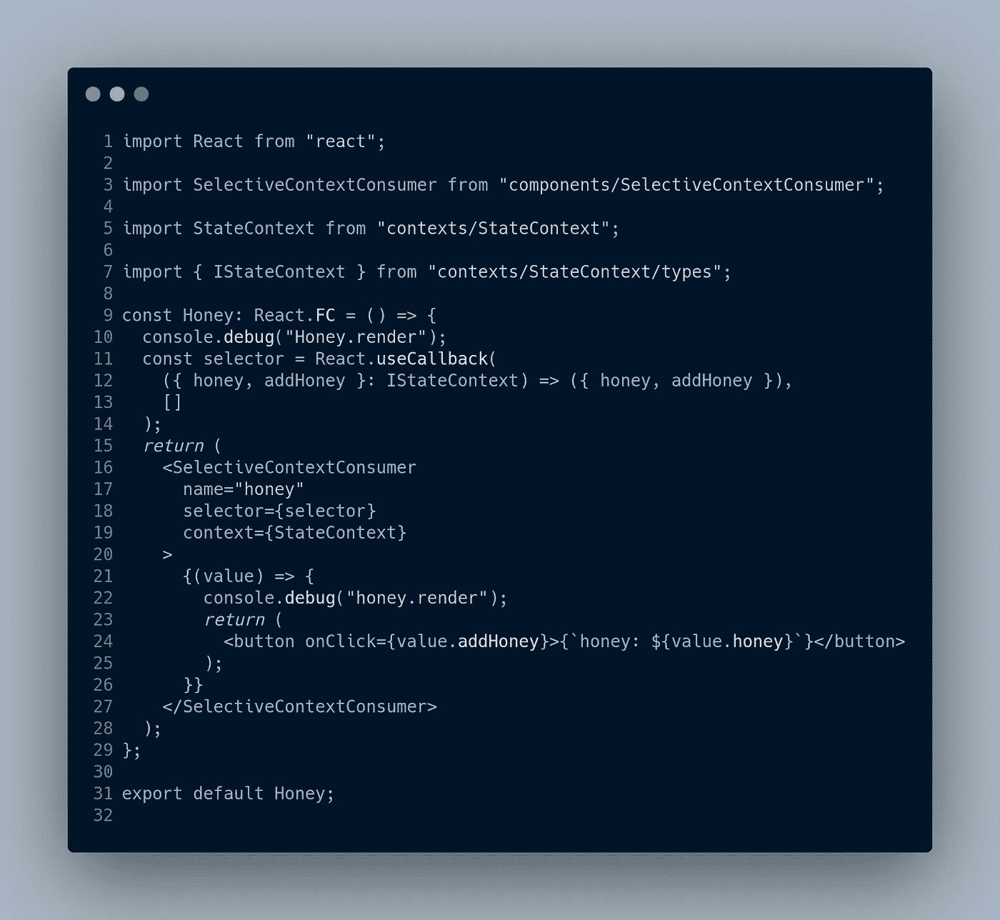

# 了解组件的生命周期:

使用`console logs`我们可以通过调用`addHoney`函数来解释增加`honey`值后的流程。

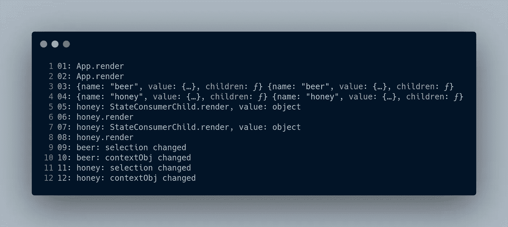

选择改变了，所以增加蜂蜜的按钮的渲染函数被调用，而增加啤酒的按钮保持不变。

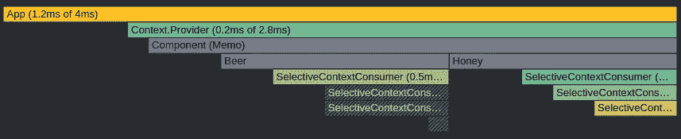

具有增加蜂蜜的按钮的呈现功能的选择性上下文消费者子代被重新呈现，而具有增加啤酒的按钮的呈现功能的子代不被呈现。

# 结论

是的，有一些库可以达到相同甚至更好的效果。动机是以一种可重用的方式实现优化，并在优化过程中学习。本文提供了问题的解决方案，以及旅程和旅程本身背后的智慧。

我想把这篇文章献给我的未婚夫 **Badria Arshad** ，是他激励了我，并在旅途中陪伴着我。