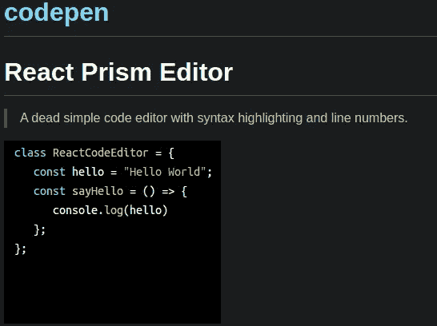
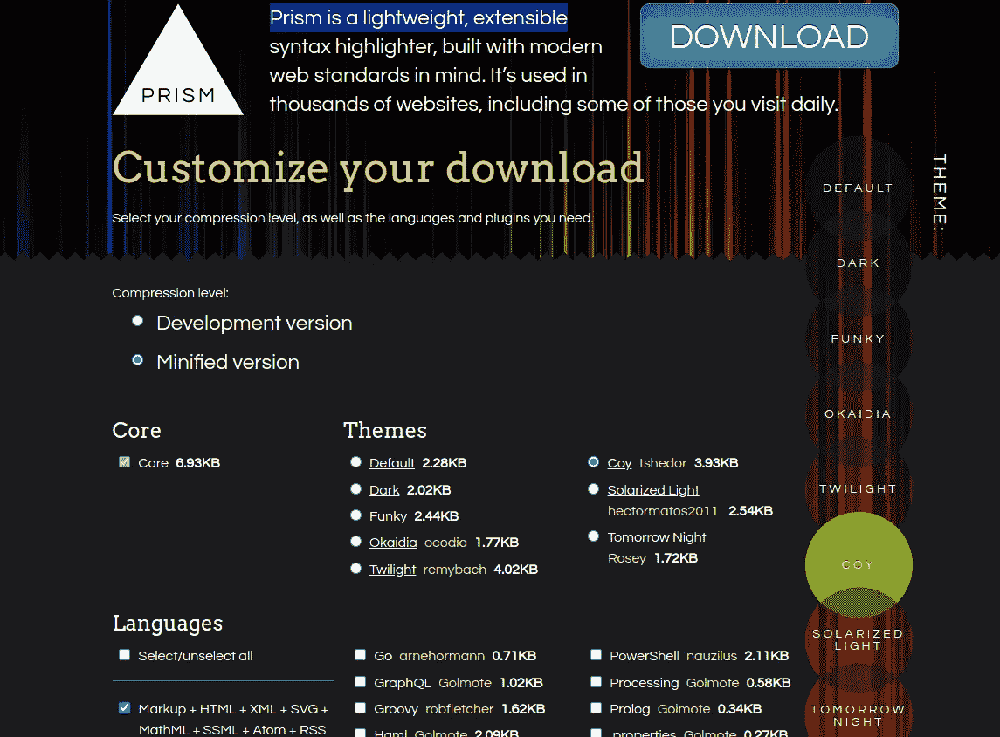
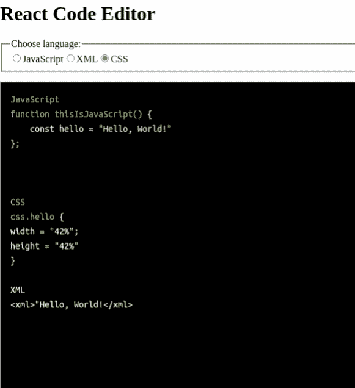

# 带有语法高亮显示的反应文本编辑器

> 原文：<https://medium.com/nerd-for-tech/reacttext-editor-with-syntax-highlighting-9ae15d93cac0?source=collection_archive---------0----------------------->

最近，我在 React 和 Rails 项目上花了很多时间，该项目将整合用户认证、Redux、Thunk、一个健壮的后端和许多其他特性。我非常喜欢这个项目，然而，作为一个 JavaScript 和 Ruby 用户，我已经习惯了快速和毫不犹豫地构建整个应用程序的奢侈，这些应用程序可以以同样快的速度放到 web 上。我有一个像这样的快速和有趣的项目的愿望，这导致是一个文本编辑器！在这里，我将简单介绍一下这个版本的一些有趣的特性。它叫 codepen。https://github.com/JCGuest/codepen[。](https://github.com/JCGuest/codepen)



对于语法突出显示(我也想快速完成)，我使用了一个轻量级的包和库 PrismJs/prism。您可以设计一个自定义配色方案，并决定要在他们的网站上包含哪些语言。【https://prismjs.com/index.html 



它们生成 JavaScript 和 CSS 文件，您需要将这些文件合并到 React 应用程序中。导入 Prism 类后，您需要按照 Prismjs 文档提供两个标准 HTML 元素。这是您的文本将被呈现的地方。

```
<pre className="code-output"> <code className={`language-${props.language}`}>{content}</code></pre>
```

你可能会注意到我的道具。从 App.js 传递到唯一的组件 CodeEditor.js。在 App.js 中，我有一个菜单供用户选择语言，并使用 useState()；我更新语言并呈现代码编辑器。

```
export default function App() { const [editorLanguage, setEditorLanguage] = useState("javascript");return (     <div className="App"> <h1>React Code Editor</h1><fieldset> <legend>Choose language:</legend><input type="radio" id="javascript" name="language"value="javascript" checked={editorLanguage === "javascript"}onChange={() => setEditorLanguage("javascript")}/>
```

要将文本传递给 Prism，可以调用 Prism . highlight all()；。我再次使用了钩子，这样整个应用程序可以在不产生任何反应的情况下运行。组件类。这里使用的钩子叫做 use effect()；它在这里工作是因为当提供的元素被更新时它被调用。

```
useEffect(() => {Prism.highlightAll();}, [props.language, content]);
```

我的应用程序利用了一些棘手的 CSS，我不会在这里深入讨论，但这是最终的结果。这里你可以看到我选择了不同的语言来突出显示。



这个构建的目的是在一两个小时内完成一个产品，并在这个过程中学习一些东西。它做得很漂亮，非常有趣。