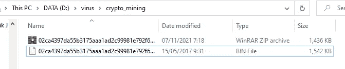
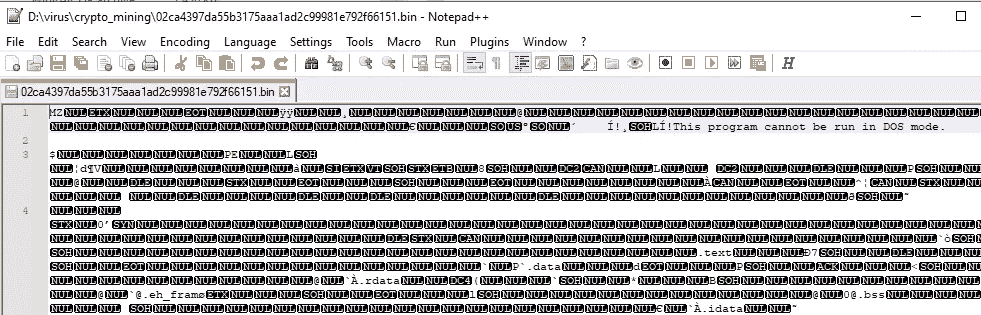
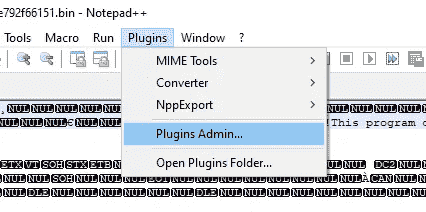
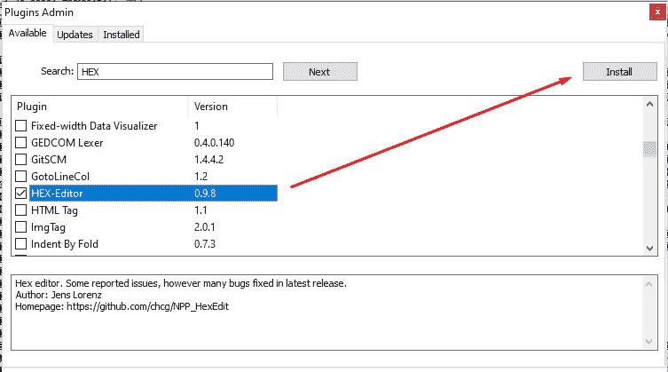
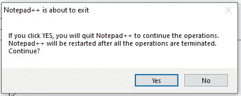
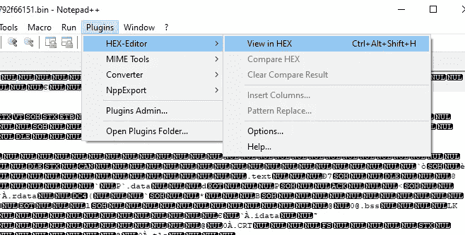
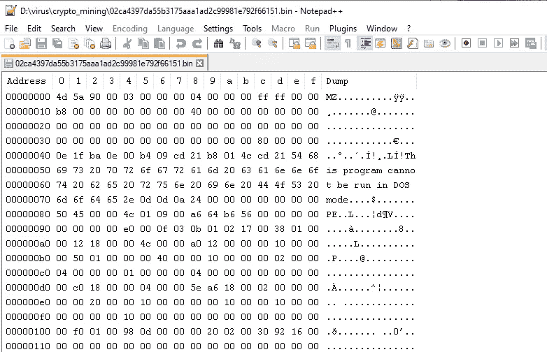

# 使用 Notepad++读取恶意软件的十六进制文件

> 原文：<https://medium.com/nerd-for-tech/read-a-malware-as-hex-file-using-notepad-45bf4ce9e217?source=collection_archive---------2----------------------->

马库斯·斯皮斯克在 [Unsplash](https://unsplash.com/s/photos/malware?utm_source=unsplash&utm_medium=referral&utm_content=creditCopyText) 上的照片

十六进制，通常称为“十六进制”，是一种用 16 为基数表示数字的数字数学系统。读取十六进制格式文件的典型方法是使用 IDA，但是 IDA 不是免费的。嗯，有很多破解版本。但是，我们可以保证该应用程序的安全性。

我们需要读取十六进制格式的东西，因为我们的系统通常会面临一些危险的东西，例如恶意软件或我们一次无法识别的东西。为什么？因为在这个数字时代，有时我们可以从许多来源获得任何东西，而不知道它是否安全。在这篇文章中，我想分享如何让你的记事本++可以用来读取一个十六进制文件。

# **恶意软件来源**

好吧，我们来练习一下。你可以按照这个如果你想或只是阅读文章。我最后提醒一句，我们在玩恶意软件，如果你的电脑被感染了，我也无能为力。**自担风险！**

在本文中，我将以比特币矿工恶意软件为例。我从[fabrimagic 72](https://github.com/fabrimagic72/malware-samples)库收集了这个恶意软件。你可以在这里下载[。记住永远不要执行它，因为我们还不知道它如何影响你的系统。下载并解压缩它，如果您的下载或解压缩失败，可能您的防病毒功能已启用；你应该先禁用它。](https://github.com/fabrimagic72/malware-samples/tree/master/Bitcoin%20miners)

*恶意软件已经被下载。*

# 配置

## 以前

拿到恶意软件样本后，用 Notepad++打开 BIN 文件，会看到类似这样的内容。

恶意软件的可视化(以前)

正如您现在所看到的，我们无法从中获得任何信息，因为该文件显示为已损坏。仅供参考，在第一行中，单词“MZ”代表“马克·茨柏克沃斯基”单词“MZ”是 MS-DOS 可重定位 16 位 EXE 格式使用的签名。它就像一个标准的可执行文件(。exe)更旧。通常，这种签名通常被称为恶意软件中使用的可移植可执行文件(PE)。

简单来说，如果你执行这个文件，程序正在运行，这意味着病毒成功渗透到你的系统。所以面对这样的文件一定要小心。

## 添加十六进制插件

Notepad++有读取十六进制的特性，但是默认情况下，这个特性是禁用的。要激活它，请打开插件标签并选择插件管理。

将插件添加到 Notepad++中

接下来，在可用选项卡中找到十六进制编辑器；您可以使用搜索栏来简化搜索；之后，点击安装。

寻找记事本++的十六进制编辑器插件

此操作需要管理员权限，并将关闭应用程序，因此单击“是”继续安装。

单击“是”继续。

程序重启后，现在，在插件标签页，你可以看到十六进制编辑器；你可以选择“以十六进制格式查看”或者点击键盘上的 Ctrl+Alt+Shift+H。

十六进制编辑器被激活。

## 在...之后

Tadaaaa 这是你的记事本++现在的可视化；可读性更强，对吧。以十六进制模式读取恶意软件文件最重要的一点是，恶意软件不会感染你的电脑。

恶意软件的可视化(后)

使用这些插件，您可以阅读任何带有任何扩展名的内容，例如。exe，。字节，。asm 等。

# 结论

最后，我们进入最后一节；我们已经为 Notepad++安装了插件，让它以十六进制模式读取恶意软件。因为这篇文章的目的不是为了分析恶意软件，我们到此为止。我相信阅读这篇文章的你知道你在做什么。

> 保持安全和快乐的分析

谢谢！！！