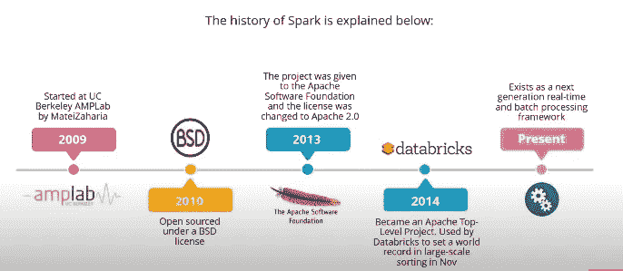
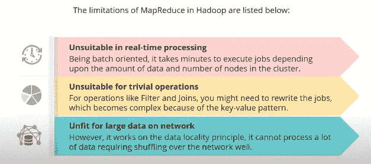
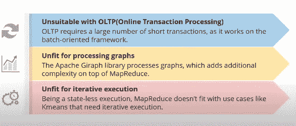
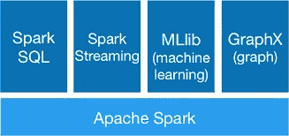
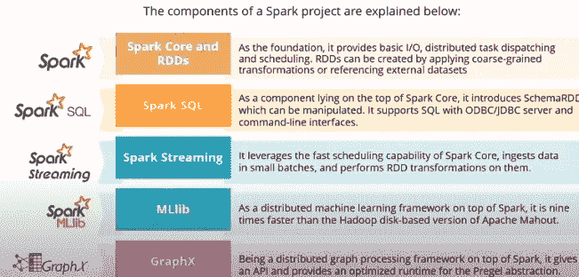
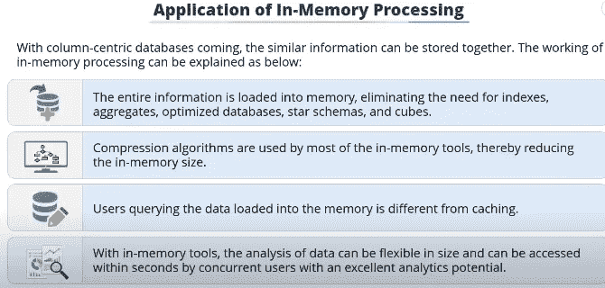
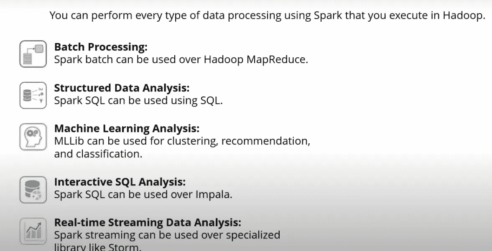
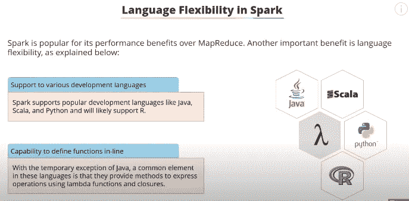
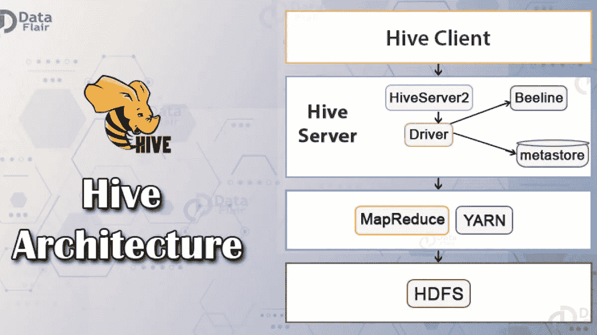

# 在开始使用 Apache Spark 之前，请阅读本文

> 原文：<https://medium.com/nerd-for-tech/read-this-before-getting-started-with-apache-spark-5ffd61953a3d?source=collection_archive---------9----------------------->

## 在动手使用 Apache Spark 数据处理框架之前，您需要了解的所有内容

[图像参考](https://memegenerator.net/instance/80479297/honey-boo-boo-running-better-hurry)

*每当我们学习一种新工具/技术时，我们都急于跳过理论部分，直接跳到实现和编码阶段。这有时没有问题，并且节省了大量时间，但是如果您刚刚开始使用 Apache Spark，情况就不一样了……*

*在你真正开始 Spark 的编码和实现部分之前，了解它的组件、用法、优点和其他相关系统非常重要，这样才能真正知道实现什么和如何实现。*

*这篇博客是您开始 Apache Spark 和大数据处理框架之旅的全部所需。*

> 请注意:这篇博客大部分是改编自***【Simplilearn 的 Spark 教程】*** ，所以如果你想通读视频，这里有[链接。](https://www.youtube.com/watch?v=QaoJNXW6SQo)

## 在这篇博客中，你将读到:

1.  常见的大数据数据处理框架有哪些？
2.  什么是火花？
3.  为什么是火花？
4.  为什么需要 Spark？
5.  Hadoop 中 Map Reduce 有哪些局限性？
6.  星火项目的组成部分是什么？
7.  Spark 中的内存处理是什么？
8.  Spark 相比 Hadoop 有哪些优势和牛逼之处？
9.  您可能遇到的术语

> 让我们开始吧…

# 常见的大数据数据处理框架有哪些？

1.**Apache Hadoop MapReduce:**Apache Hadoop(MapReduce)是一个针对大数据并行计算的分布式离线计算框架，它是 Hadoop 数据分析框架的核心。

2. **Apache Spark:** Spark 是一个分布式计算，**依赖于 MapReduce 算法。**

Spark 是 MapReduce 的一个众所周知的替代品，也是 Hadoop 的一个**非凡模块。它**兼容 HDFS 和 Hive** ，可以集成到 Hadoop 生态系统中，没有 MapReduce 的任何危险或不足。**

**Spark 用 Scala 语言**编写，使用 **Scala 作为其应用框架**。Spark 和 Scala 集成在一起，Scala 操作分布式数据集就像操作本地集合对象一样容易。 Spark 通过提供丰富的 Scala、Java、Python API、R 和交互式 Shell，提高了可用性。

Spark 提供批处理模式、流处理、交互处理、图形处理等服务，并为机器学习和其他大数据应用提供一站式平台。

## 其他鲜为人知的数据处理框架:

3.阿帕奇弗林克

4.阿帕奇风暴

5.阿帕奇技术中心

6.阿帕奇萨姆扎

等等…

图像参考:数据块

# 什么是火花？

> Spark 是一个数据处理框架。

火花的历史:

历史的火花:[图片参考](https://www.youtube.com/watch?v=QaoJNXW6SQo)

*注:Spark 既是一个* ***实时又是一个*** *批处理框架。*

# **为什么需要 Spark？**

> ***创建 Spark 的主要原因是为了克服 Map-Reduce 的局限性。***

图像参考

**Hadoop 中 Map Reduce 的局限性:**

1.  只有做批量处理。
2.  甚至 T **rial 操作查询也很复杂**，键值(缩减器和映射器代码)
3.  **不适合网络上的大数据:**复制数据需要大量时间，这就产生了大量的网络带宽问题。根据数据局部性原则工作，因此在数据驻留的节点上工作良好。
4.  **不适合 OLTP:** 因为它在批处理模式下工作，所以没有几秒和几毫秒的延迟。
5.  **不适合图形处理:**图形代表探索各个点之间关系的结构，例如:在社交媒体中寻找朋友(脸书使用)。Hadoop 有 Apache Giraph 库来处理这种运行在 Map 之上的情况——这降低并增加了复杂性。
6.  因为它是一个无状态的执行器，所以每次都从头开始运行，这使得**不适合迭代**过程。

> **Spark 是一个开源集群计算框架，解决了 map-reduce 的所有限制。**

# 星火项目的组成部分是什么？

星火工程主要包含以下组成部分:

1.  **火花芯**(用于批量加工)
2.  **Spark SQL** (用于交互处理)
3.  **火花流(**用于流处理)
4.  **火花图 x** (用于图形计算)
5.  **Spark MLlib** (用于机器学习)

[图像参考](https://www.youtube.com/watch?v=QaoJNXW6SQo)

**星火项目详细组成:**

1.  **Spark Core 和 RDDs:** 是整个 Spark 项目的基础，它们提供基本的 I/O 功能、分布式任务分派和调度。

rdd 是基本的编程提取，是在逻辑上跨机器划分的数据集合。rdd 可以通过对现有 rdd 应用粗粒度转换或引用外部数据集来创建。

这些转换的例子有:归约、连接、过滤和映射。

rdd 的抽象通过 Python、Java 或 Scala 中的语言集成 API 以类似于进程内和本地集合的方式公开。作为 RDDs 抽象的结果，编程的复杂性变得简单，因为应用程序改变 RDDs 的方式类似于改变本地数据集合。

**2。Spark SQL:** Spark SQL 驻留在 Spark 核心的顶层。它引入了 **SchemaRDD，**这是一种新的数据抽象，支持半结构化和结构化数据。

SchemaRDD 可以通过 Spark SQL 在任何基于领域的语言(Python、Java、Scala)中操作。Spark SQL 还支持带有开放式数据库连接(ODBC)或 Java 数据库连接(JDBC)服务器和命令行界面的 SQL。

**3。Spark Streaming:**Spark Streaming 利用 Spark Core 的快速调度功能进行流分析，小批量接收数据，并对其执行 RDD 变换。

由于这种设计，为批量分析编写的相同应用程序代码集可以在单个引擎上用于流分析。

**4。ML lib:**Spark 的第四个组件是机器学习库，它位于 Spark 之上，是一个分布式 ML 框架。它可以应用各种常见的 ML 算法。凭借其基于内存的架构，它比基于磁盘的 Hadoop 版本快 9 倍。

**5。GraphX:** 最后一个组件 GraphX 也位于 Spark 之上，是一个分布式图形处理框架。对于图形的计算，它提供了一个 API，并为 Pregel 抽象提供了一个优化的运行时。Pregel 是一个用于大规模图形处理的系统。

[图像参考](https://www.youtube.com/watch?v=QaoJNXW6SQo)

## **Spark 中的内存处理是什么？**

Spark 为内存处理应用提供了 100 倍的性能提升。

让我们讨论使用以列为中心的数据库进行内存处理的应用程序。在以列为中心的数据库中:

1.  相似的数据可以存储在一起:因此数据可以用更少的内存和更高的效率存储。
2.  更少的内存使用:允许在相同的空间存储大量的数据。
3.  提高处理速度:在内存数据库中，整个数据库都加载到内存中，不需要索引等。
4.  避免性能瓶颈和较慢的数据库访问:使用缓存来加速查询，缓存是一个非常特殊的有组织的数据集的子集。
5.  由于数据完全位于内存中:并发用户可以在几秒钟内完成分析。
6.  允许最终用户和 BA 创建定制的查询和报告

[图像参考](https://www.youtube.com/watch?v=QaoJNXW6SQo)

> **所有这些导致数据访问比磁盘快 10，000- 1，000，000 倍！！！**

[图片参考](https://www.youtube.com/watch?v=QaoJNXW6SQo)

# **有哪些星火优势:**

1.  **速度:**扩展 map-reduce 模型以支持流处理和交互式查询。
2.  解决 map-reduce 所有限制的开源集群计算框架。
3.  适合实时处理、琐碎操作、处理网络上的大数据、OLTP、图形和迭代执行
4.  比 map-reduce 快 100 倍
5.  快速的性能使它适合 ML，因为它允许程序重复加载和查询数据。
6.  **语言灵活性**

[图像参考](https://www.youtube.com/watch?v=QaoJNXW6SQo)

**7。组合:** Spark 涵盖了过去需要不同分布式系统的各种工作负载，如流、迭代、批处理应用，因为这些应用在同一引擎上得到支持，所以组合不同的处理类型很容易。Spark 是生产数据分析管道所必需的，其组合功能允许轻松管理单独的工具。

**8。Hadoop 支持:** Spark 能够从存储在 Hadoop 分布式文件系统(HDFS)或任何其他支持的存储系统中的任何文件创建分布式数据集。

Spark 不需要 Hadoop，它只支持实现 Hadoop API 的存储系统。

# **遇到的术语:**

*   Scala 是一种强大的静态类型通用编程语言，支持面向对象编程和函数式编程。
*   Apache Hive 是一个基于 Apache Hadoop 的数据仓库软件项目，用于提供数据查询和分析。Hive 给出了一个类似 SQL 的接口，用于查询存储在各种数据库和文件系统中的数据，这些数据库和文件系统与 Hadoop 集成在一起。
*   **HDFS:**Hadoop 分布式文件系统(HDFS)是一个分布式文件系统。Apache Hadoop 是一个开源软件实用程序的集合，它有助于使用许多计算机的网络来解决涉及大量数据和计算的问题。它使用 MapReduce 编程模型为大数据的分布式存储和处理提供了一个软件框架。

图像参考:数据天赋

**参考文献:**

*   Simplilearn，Spark 教程:[https://www.youtube.com/watch?v=QaoJNXW6SQo](https://www.youtube.com/watch?v=QaoJNXW6SQo)