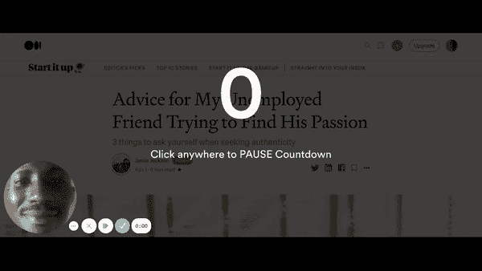

# 读者体验和媒介

> 原文：<https://medium.com/nerd-for-tech/reader-experience-and-medium-35cf28ff29a2?source=collection_archive---------17----------------------->

在像下面这样的中型模板文章中

像我或你这样的读者现在能消费的唯一内容是标题和一幅精美的插图。这是一个让读者感兴趣的标题，因为他或她点击了它，而且图片设计得非常艺术，因为这是这类文章模板的常见情况，但问题是你和我这些计算机用户应该滚动屏幕才能看到文章的正文。这种进入身体的滚动大约需要 3 秒钟。这个 3 秒钟的收益媒介，因为它是增加到用户访问持续时间的少量时间，并且考虑到数百万游客访问 Medium.com，它很容易变成大量的时间。访问持续时间是谷歌或必应等搜索引擎考虑的一个指标。我认为这有助于强调这种设计选择，并询问它是否不仅有益于 Medium，还浪费了读者的时间。

由于我经常喜欢在钉问题时带来解决方案，这里是我认为像我们这样的计算机用户应该拥有的读者体验，或者以另一种形式说 Medium 的 UX 设计团队应该做什么。

让文章的正文可以直接访问，节省我们 3 秒的滚动时间

或者在标题旁边放一个按钮，我们可以点击它直接进入文章的正文，快速滚动或者弹出一个在图片顶部显示文本的窗口。

这篇文章只是一个用户提出他对一个平台的想法，他很乐意使用这个平台，但会让它变得更好。

如果你认识在那里工作的人，请与 Medium 分享。