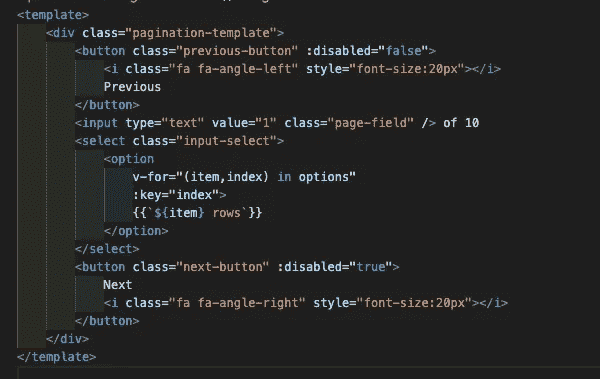
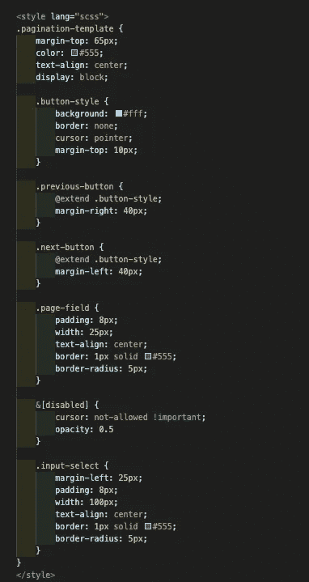

# 分页

> 原文：<https://medium.com/nerd-for-tech/ready-made-ui-components-364c8aa155d0?source=collection_archive---------0----------------------->

作为前端开发人员，我们经常会遇到许多挑战。我们会创建许多组件，以便在整个 Web 应用程序中重用它们。
基本上，页面和组件有什么区别？
简单来说，页面在大多数情况下是组件的组合。
组件是微小的设计片段，可以在任意数量的页面中重用。
与技术相关，
组件是编程语言中的一种模块，它有自己的功能，与其他代码无关。即
一个模块接受输入并产生一个与逻辑相关的输出
类似地，组件也有一些属性，它相应地显示内容，而不管它在哪个页面上使用。
在这个故事中，我只是想分享现成的组件，即我们经常使用的分页，可以根据需要进行配置。

我这里用的框架是 Vue Js。
Pagination.vue

Pagination.vue

上面代码中的选项可能是我们在表中显示的行数。理想情况下，行数是 5 的倍数。
: disabled —这里我们根据数据中的页数禁用 next 和 previous。
我用 scss 做造型。大多数企业应用程序更喜欢在其应用程序中使用 scss 和 node-sass。

风格

上述组件将是可配置的，可以在任何应用程序中使用。希望你们喜欢。如果是的话，给它一个掌声。
如果以上帖子需要任何评论或改进。请在下面随意评论。

谢谢:)
干杯！！