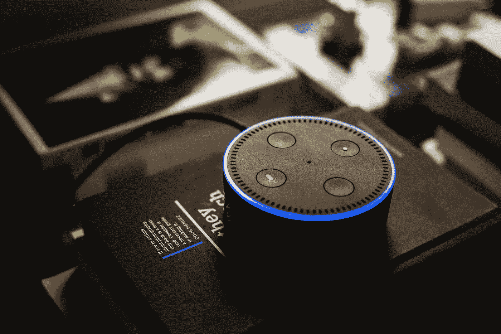

# AIoT 设备的真实案例

> 原文：<https://medium.com/nerd-for-tech/real-cases-of-aiot-devices-39f3afad7229?source=collection_archive---------4----------------------->

当人工智能与物联网结合时，我们得到了一种叫做人工智能物联网(AIoT)的东西。将人工智能与物联网结合的主要原因是，虽然物联网设备的目的是收集所有数据，并将其传输到通常的云或任何其他空间**，但在这些空间中，人工智能被认为是 AIoT 的大脑**。它实际上会做出决定，或者模拟机器的动作或反应。

## **1。交通管理**

交通是城市中令人烦恼的问题，人们总是需要有效的交通管理来避免拥堵。由人类进行的交通管理有时会导致混乱。然而，AIoT 为这个问题提供了一个巧妙的解决方案。现在，使用无人机可以有效地管理实时交通。无人机可以监控大面积区域并传输交通数据，然后使用 AI 对其进行分析，以做出最终的决定，如人工干预，调整交通灯。

更多阅读:[2021 年智能交通](https://tinyurl.com/4u5sbwjf)

## **2。自动驾驶汽车**

自动驾驶汽车是嵌入人工智能的物联网设备的另一个案例。特斯拉的自动驾驶汽车就是一个很好的例子。在安装的传感器和人工智能的帮助下，汽车可以通过确定周围环境的条件来做出类似人类的决定。例如，他们可以通过确定最佳速度、天气和路况来做出有效的决策。

更多阅读:[巨型自动驾驶公司特斯拉介绍](https://tinyurl.com/x982a425)

## **3。智能家居**

物联网和人工智能的融合也导致了智能家居概念的出现。当智能家居通过物联网连接所有设备时，这些设备就有能力在 AI 的帮助下做出智能决策。智能家居让我们能够远程控制设备，从而让我们的生活变得更加轻松。例如，我们可以在发生火灾时打开电视或打电话给消防队时提前决定。即使我们不在家，我们也可以根据需要打开或关闭电器。

更多阅读:[未来的家是什么样子？](/nerd-for-tech/what-the-future-home-looks-like-6b667b6f1bbe)

## **4。人体传感器**

保持健康是当今人们面临的主要挑战。由于工作繁忙，很大一部分人很难不定期地去看医生进行定期检查，但这个问题也可以通过健身追踪器等可穿戴设备来解决，这些设备有助于跟踪血糖，心跳，胆固醇水平等。因此，它有助于健康管理。建筑公司也可以使用这些传感器来检测工人的姿势，以避免工作时受到伤害。

更多阅读:[数据标签服务如何赋能安防行业？](https://tinyurl.com/c8e3dz8x)

## **5。制造机器人**

制造业也在制造过程中使用机器人。这些机器人只是 AIoT 设备的另一种形式。它们通过节省时间和成本来帮助改进制造过程。一个例子是眼镜。制造商可以使用机器人制造高精度镜头。

更多阅读:[数据标签服务如何赋能制造业 2021？](https://tinyurl.com/yytsnspy)

## **6。智能建筑**

物联网和人工智能的另一个交叉点是智能写字楼。不仅是住宅，整个建筑都可以安装 AIoT，以提高效率和管理成本。例如，一些公司已经在其建筑物中安装了 AIoT 设备网络。这些设备可以检测人的存在并相应地调节温度，或者在没有人类干预的情况下关闭设备，从而提高能源效率并最终降低成本。

# **定制标签数据集**

从人工智能技术的研究方向来看，无论是在传统的机器学习领域还是深度学习领域，基于训练数据的监督学习仍然是一种主要的模型训练方法。尤其是在深度学习领域，需要更多的标记数据来提高模型的有效性。

目前，各行业对最优质的 AI 训练数据需求迫切。人工智能应用于各个领域，如教育、法律、智能驾驶、银行和金融等。每个领域都有细分和专业化的要求。

随着 AI 商业化进程的加快，以及辅助驾驶、客服聊天机器人等 AI 技术在各行各业的应用，人们对特殊场景下的数据质量的期望越来越高。高质量的标签数据将是人工智能公司的核心竞争力之一。

如果说之前的算法模型使用的一般数据集是粗粮，那么算法模型目前需要的是定制的营养餐。如果公司想要进一步提高某些模型的商业化，他们必须逐步从通用数据集向前发展，以创建独特的数据集。

## NLP 服务

我们在电子商务、零售、搜索引擎、社交媒体等领域提供不同类型的自然语言处理。我们的服务包括语音分类、情感分析、文本识别和文本分类(聊天机器人相关性)。

ByteBridge 与全球 30 多个不同的语言社区合作，现在提供[数据收集和文本注释服务](https://tinyurl.com/3d6h6u2n)，涵盖语言包括**英语、中文、西班牙语、韩语、孟加拉语、越南语、印度尼西亚语、土耳其语、阿拉伯语、俄语等**。

# 结束

将您的数据标注任务外包给[字节桥](https://tinyurl.com/3d6h6u2n)，您可以更便宜、更快速地获得高质量的 ML 训练数据集！

*   无需信用卡的免费试用:您可以快速获得样品结果，检查输出，并直接向我们的项目经理反馈。
*   100%人工验证
*   透明和标准定价:[有明确的定价](https://www.bytebridge.io/#/?module=price)(包含人工成本)

为什么不试一试呢？

资料来源:https://baijiahao.baidu.com/s?id = 1713944602772076382 & wfr =蜘蛛&for=pc