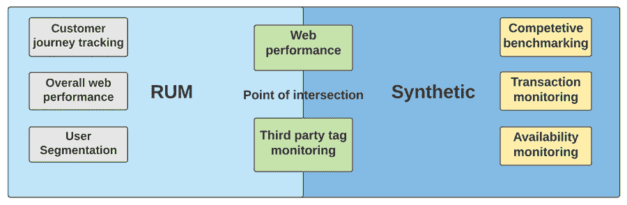

# 真实用户监控与合成监控

> 原文：<https://medium.com/nerd-for-tech/real-user-monitoring-vs-synthetic-monitoring-d89085323e6?source=collection_archive---------28----------------------->

在我们生活的数字世界中，网站监控至关重要。你的业务将会根据你的网站每一分钟的表现来评判。这不仅仅是由你的网站访问者完成的，搜索引擎也是如此。

糟糕的网站表现或网站中的问题会导致更多的人退出。当更多的用户离开时，搜索引擎会降低你网站的排名。为了在监控过程中帮助您，我们有两种类型的用户监控工具，即真实用户监控和综合监控。

在这篇文章中，我们将了解两者的主要区别。

**目录**

1.  什么是合成监听？
2.  什么是真实用户监控？
3.  我们应该比较合成的和真实的用户监控吗？
4.  综合监控的优势
5.  真实用户监控的优势
6.  为什么不只是合成监控？
7.  结束语

# 什么是合成监听？

综合监控是您在网站上进行的一种测量。这样做是为了确保您的网站在期望的水平上运行。它确保用户可以毫无问题地执行业务关键功能。

以下是作为综合监控的一部分被监控的一些因素-

*   注册试用你的产品的新客户
*   在您的网站上创建帐户的新客户
*   登录到您网站的成员
*   你购物车上的人
*   您的“结帐”标签上的人员
*   已经完成结帐过程并购买了您的产品的人
*   在您的网站上提交表单的客户和用户

综合监控包括使用脚本来记录您想要在网站上测量的因素。它不是一个持续的监控过程，而是一个受控的过程。综合监控中记录的数据不属于实际用户。综合监控收集的数据指向在您的网站上完成了某项任务的用户。

这样，它就不是全天然的了。这就是我们称之为合成监听的原因。

# 什么是真实用户监控？

真实用户监控(RUM)在多个方面与合成监控完全不同。RUM 持续监控你的用户如何与你的网站互动。这不是有条件的或定期做的事情。

真正的用户监控会在用户进入你的网站时记录数据。从那时起，直到用户离开你的网站，所有的数据都会被记录下来。这将有助于你鸟瞰你的网站的表现。

朗姆酒的一部分是:

*   在每个用户登录时实时跟踪页面负载
*   获得你的网站上每个页面的平均加载时间
*   了解您的网站在不同操作系统和浏览器上的表现
*   了解您的网站在不同设备(Android、iOS 等)上的表现
*   分析你的网站相对于用户位置的表现。

真实用户监控实时显示你的用户在做什么，他们在访问什么页面。你可以实时观察每个新用户，分析他们的用户旅程。总的来说，真实用户监控显示了真实用户从真实位置实时加载的网页。

# 我们应该比较合成的和真实的用户监控吗？

比较合成的和真实的用户监控没有任何意义。他们既不是对立面，也不是互相争斗的竞争者。它们是两个协同作用的因素。

综合监控使您能够访问持续和受控的数据流。只要你改变核心条件，这个数据流就不会改变。这使您能够获得有针对性的数据，帮助您做出业务决策。但是综合监测不会给你一个关于网站性能的整体概念。既然是有条件的，就不会记录所有的数据。这给了你数据流中的某些空白区域。

这就是真正的用户监控有所帮助的地方。它记录了你网站的所有数据，帮助你分析网站的整体表现。在某种程度上，你可以说合成监控是真实用户监控的子集。但这也不完全准确。

两者兼而有之对你的网站有好处。但是两者兼得总是更好。虽然合成监控可以帮助您改善非常具体的问题，但真实用户监控将为您提供全面的可见性。

把这两者结合起来，你的武器库中就有了一件优秀的武器。您可以确定几个缺点，并运行测试来改进它们。你也可以确保你的网站足够快，让你的用户满意。来自他们两个的数据也将帮助你分析你当前网站 UX 的有效性。简而言之，将两者结合使用会让你拥有一个超快的高性能网站。

# 综合监控的优势

以下是合成监控的主要使用案例和优势-

*   它允许您在一个受控的设置中模拟用户的旅程
*   它允许您运行对业务有重大影响的测试
*   它允许你在你的网站上定期安排测试
*   您可以监视由多个阶段组成的复杂事务。
*   测试您的网站在特定地理位置的性能
*   测试您的网站在特定设备和操作系统上的性能
*   设定一个基准，用竞争对手来衡量你的网站表现
*   运行和测量 A/B 测试，以提高网站的性能
*   跨特定地理位置和设备跟踪网站的服务水平协议

# 真实用户监控的优势

以下是真实用户监控的主要使用案例和优势-

*   实时收集用户数据
*   在没有任何过滤器或条件的情况下收集数据
*   通过实时仪表板监控用户体验和旅程
*   记录用户在你的网站上的点击和旅程以供分析
*   根据条件设置计算转换率
*   读取历史数据来预测用户行为，并据此做出改变
*   记录数据后，通过应用过滤器读取数据
*   收集所有条件下的用户数据，并查看他们如何实现业务 KPI

# 为什么不只是合成监控？

以下是您不能在项目中仅使用合成监听的一些原因-

## 它不是基于真实的用户

综合监控基于您的条件下运行的模拟用户。所以整体表现不能用这个来衡量。或者更好的方法是——整体性能不应该使用综合监控来衡量

## 它只能帮助你回答特定的问题

合成监控采用人工方式，系统定期探测您的网站。这可以让你回答一些问题，比如-

1.  我的网站启动并运行了吗？
2.  我的结账流程现在正常吗？
3.  我的转换关键标签工作完美吗？
4.  我的网站的登录功能正常吗？

# 结束语

虽然合成监测可以帮助你回答你已经有的问题，但它不能帮助你发现新的问题。你没有得到数据来形成新的假设，这将最终允许你设置更多的探测器。这只能通过从真实用户监控系统获得的数据来实现。

*原载于*[*https://www . partech . nl*](https://www.partech.nl/nl/publicaties/2021/04/real-user-monitoring-vs-synthetic-monitoring)*。*