# 领域 GraphQL 演示:自定义解析器

> 原文：<https://medium.com/nerd-for-tech/realm-graphql-demo-custom-resolvers-c2233ee73219?source=collection_archive---------3----------------------->

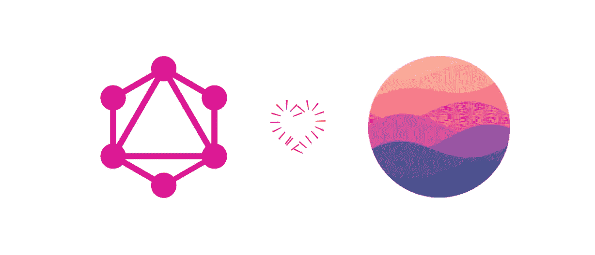

> 本教程的目的是学习如何使用**自定义解析器**来处理复杂的用例。

# 动机

ealm 提供了几种简单的方法让第三方访问我们的数据。其中一个可以通过所谓的 web hooks([https://docs . MongoDB . com/realm/services/configure/service-web hooks/](https://docs.mongodb.com/realm/services/configure/service-webhooks/))。通过这些，我们可以以可控的方式提供不同的端点来访问我们的服务和数据。

一个真实的例子是向客户或合作伙伴提供这样的 webhooks，以便他们可以访问特定用例中存在的业务逻辑所必需的某些信息。

但是，这种解决问题的方式有一定的缺点。最重要的包括:

1.  **响应负载的固定大小**:响应的大小不能超过 **4 MB** 。这个限制将使我们无法查询需要大于 4 MB 响应的聚合数据。
2.  **为每个业务逻辑需求创建不同的端点**。这不仅会带来管理问题，还会带来维护问题:如果我们在未来做出改变会怎样？我们如何管理不同的版本？如果我们想在请求中发送参数来定制对需求的响应，这个模型会变得更加复杂。

***那么更有效的解决方案是什么呢？***

Realm 提供了使用其 GraphQL API 来满足这一需求和其他需求的可能性。在这个用例中使用 GraphQL 的优势可以列举如下:

1.  一种更容易、更简单的方法来执行准确的端点调用。
2.  更容易选择我们在响应中需要什么，通过不需要不必要的字段来减少响应的大小。
3.  维护更简单。
4.  避免版本化。

# 我们要建造什么？

利用 MongoDB 中的[样本可用数据集。我们将构建一个过滤器，能够返回那些满足一组要求的电影。这些要求是:](https://docs.atlas.mongodb.com/sample-data/available-sample-datasets/)

1.  具有给定的 IMDB 等级。
2.  属于一系列流派的。
3.  有一定的比率。
4.  有几种可用的语言。

过滤参数将是动态的，以便我们可以返回那些最符合我们的标准。

为此，我们将使用一个 **GraphQL 自定义解析器**和一个外部客户端应用程序来执行我们的查询。

# 先决条件

他的教程将提供运行演示的分步指南。为此，我们必须遵循以下先决条件:

1.  拥有云 MongoDB 帐户。
2.  创建一个空闲层集群。
3.  配置`realm-cli`。
4.  添加一个 API-Key，以便能够使用`realm-cli`进行访问。
5.  将初始数据加载到集群中。

## 创建一个 Atlas 帐户

首先，您需要一个 MongoDB Atlas 帐户。如果你已经有了一个现有的 MongoDB Atlas 帐户，你可以跳过这一步，跳到**安装领域 CLI** 部分。如果您没有 Atlas 帐户，请按照以下步骤创建一个:

1.  导航到 [MongoDB Atlas 登录页面](https://account.mongodb.com/account/register)。
2.  单击登录。
3.  要么输入一组新的用户凭据，要么单击“注册 Google”按钮。
4.  单击“注册”创建您的帐户。
5.  按照提示在您的 Atlas 帐户中创建一个组织和项目。您可以使用默认的建议名称，也可以输入自己的名称。

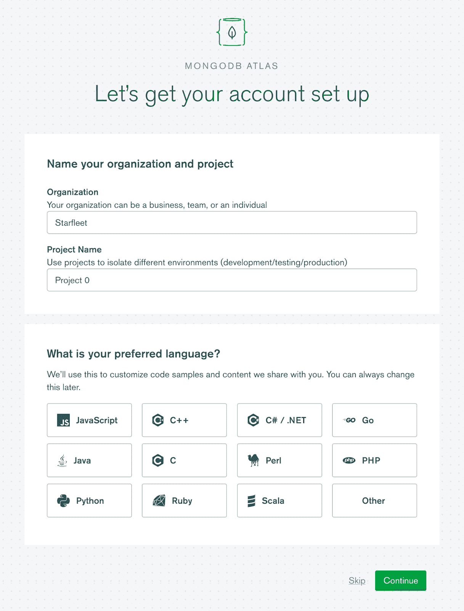

账户启动截图

当您创建完您的组织和项目后，您应该会看到一个屏幕，提示您创建一个 Atlas 集群:

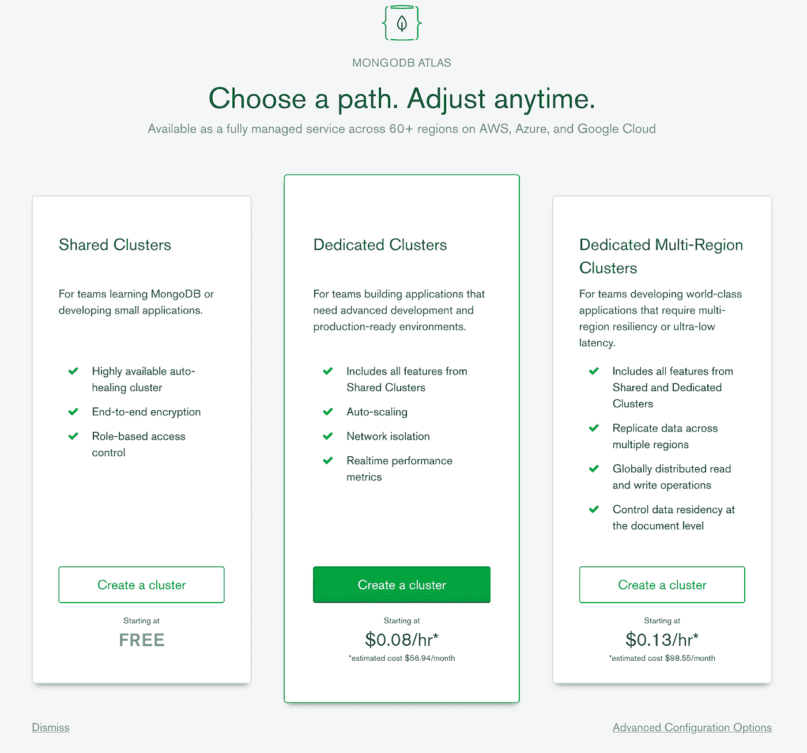

自由层集群屏幕截图

## 创建一个免费的 Atlas 集群

接下来，您需要一个运行 MongoDB 4.4 或更高版本的 MongoDB Atlas 集群。如果您已经在运行 MongoDB 4.4 以外版本的 Atlas 项目中创建了一个自由集群，那么您可以[在 Atlas](https://docs.atlas.mongodb.com/tutorial/manage-projects/#procedure) 中创建新项目，然后使用下面的说明在该项目中创建新的运行 MongoDB 4.4 的集群。如果您尚未创建任何群集，请按照以下说明创建您的第一个空闲群集:

1.  在[cloud.mongodb.com](https://cloud.mongodb.com/)登录你的 MongoDB Atlas 账户。
2.  一旦你登录到你的账户，Atlas 会提示你创建你的第一个集群。在共享集群类别中，单击创建集群。或者，您可以在 Atlas 帐户的项目视图中单击构建集群。
3.  在云提供商和地区下，选择 AWS 和 N. Virginia (us-east-1)。
4.  在附加设置下，从选择版本下拉列表中选择 MongoDB 4.4。
5.  在群集名称下，输入新群集的名称 Cluster0。
6.  单击页面底部的创建集群按钮。

创建集群后，Atlas 应该为您的 Atlas 帐户启动项目视图。在这个视图中，您将看到 Atlas 初始化新集群的过程:

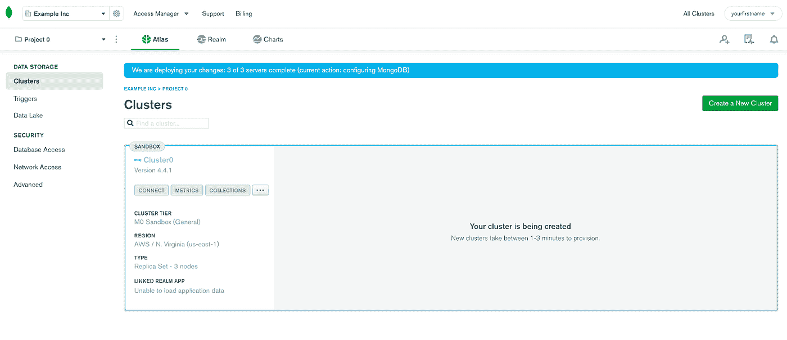

最近创建的集群的屏幕截图

## 安装领域 CLI

既然您已经创建了一个集群作为您的 Realm 应用程序的数据源，我们需要一些方法来创建应用程序本身。在大多数情况下，您会使用 Realm UI，您可以通过 Atlas UI 访问它。然而，对于本教程，我们将使用 [Realm 命令行接口](https://docs.mongodb.com/realm/deploy/realm-cli-reference/#std-label-realm-cli)，也称为`realm-cli` **。**

我们使用 Realm CLI 是因为它允许您使用 JSON 配置文件而不是 Realm UI 以编程方式管理您的 Realm 应用程序。

这让您可以更快地开始预先准备好的应用程序配置。按照下面的说明，使用软件包管理器或`realm-cli`二进制文件在您的开发环境中安装 Realm CLI:

领域 CLI 在 npm 上可用。要在您的系统上安装它，请确保您已经安装了 [Node.js](https://nodejs.org/en/download/) ，然后在您的 shell 中运行以下命令:

```
npm install -g mongodb-realm-cli@beta
```

安装完`realm-cli`后，您可以运行以下命令来确认您的安装是否成功:

```
realm-cli --version
```

如果您看到包含版本号的输出，比如`2.0.0-beta.4`，那么您的`realm-cli`安装是成功的。

## 向您的 Atlas 项目添加一个 API 密钥，并登录 Realm CLI

现在您已经将`realm-cli`安装到您的开发环境中，您将需要一种使用`realm-cli`进行认证的方法。出于安全原因，`realm-cli`只允许使用编程 API 键登录，所以我们将从创建一个编程 API 键开始，您可以使用它来管理您的新 Atlas 项目:

*   点击图集界面顶部的**访问管理器**。从下拉菜单中选择**项目访问**选项。
*   导航到 **API 键**选项卡。
*   点击**创建 API** 按键。
*   在**描述**文本框中，输入“MongoDB 领域 CLI 的 API 密钥”。

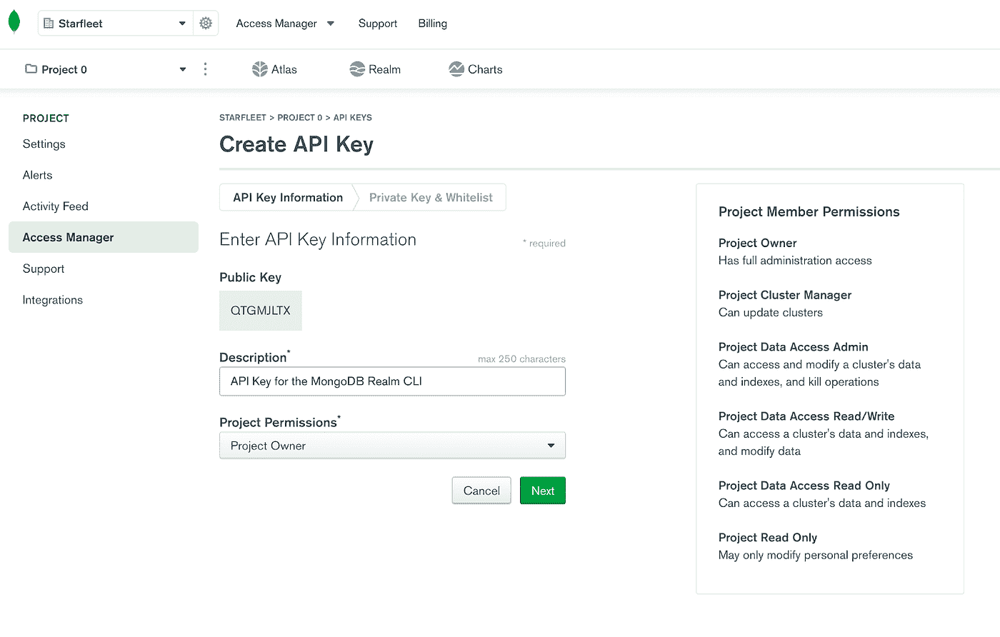

在领域 UI 中创建 API 键屏幕截图

*   在**项目权限**下拉列表中，选择“项目所有者”并取消选择“项目只读”。

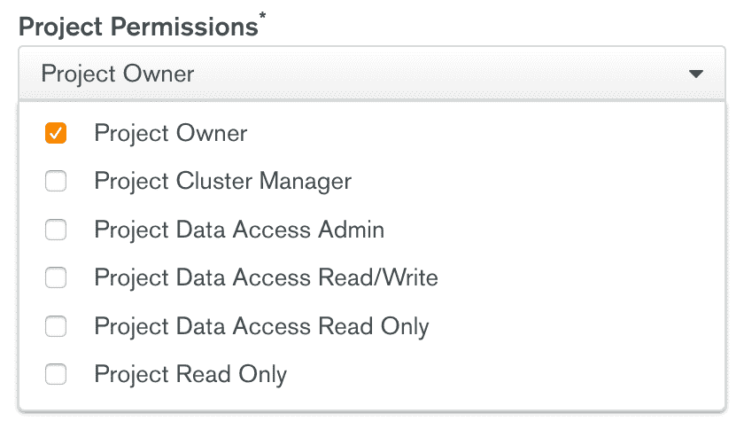

项目权限截图

*   复制您的公共 API 密钥，并将其保存在某个地方。
*   点击**下一步**。
*   复制您的私有 API 密钥，并将其保存在某个地方；离开此页面后，您将无法再通过领域 UI 查看它。
*   点击**添加访问列表条目**按钮。
*   点击**使用当前 IP 地址**。
*   点击**保存**。
*   当您安全地记录了您的私有 API 密钥后，点击 **Done** 返回到项目访问管理器页面。
*   在终端中使用以下命令通过领域 CLI 进行身份验证:

```
realm-cli login --api-key <public API key> --private-api-key <private API key>
```

如果`realm-cli`产生如下输出，则您已成功通过认证:

```
you have successfully logged in as <public API key>
```

## 将样本数据集加载到集群

一旦我们部署了集群，我们就可以利用 MongoDB 提供的样本集合。为此，我们必须单击“…”和“加载样本数据集”。

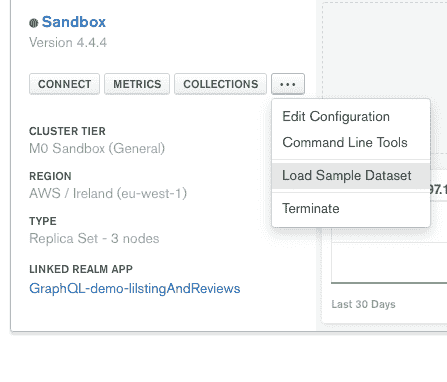

加载样本数据集屏幕截图

由于样本集合的大小，此过程可能需要几分钟时间。分别是大概~ **350 MB** 。完成后，我们可以通过单击 collections 来验证集合是否已经成功加载。

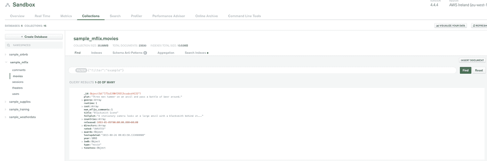

电影收藏截图一份

检查数据是否已经加载到我们的集群并与之交互的另一种方法是安装 [MongoDB Compass](https://www.mongodb.com/products/compass) 或通过终端和 [Mongo shell](https://docs.mongodb.com/manual/mongo/.) 访问它。

# 向我们的集合添加规则

为了使用 GraphQL，我们需要为将要使用的集合配置规则，为此，我们转到 Realm UI 中的**数据访问**和**规则**。

然后我们需要选择最新导入的`sample_mflix.movies`集合，并点击“**配置集合**”。我们可以在不选择任何模板的情况下配置它(将来我们可以对它进行更改)。

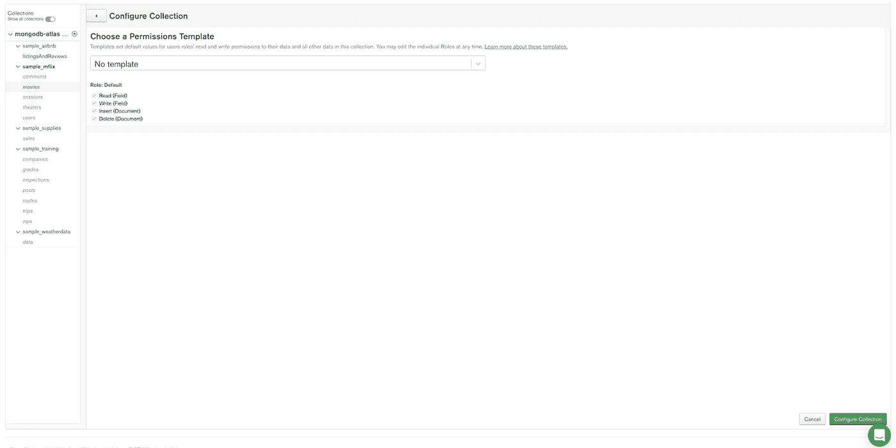

领域 UI 中的规则部分

一旦选择了集合，点击“**配置集合**”后，我们必须选择“**所有附加字段**”选项，并勾选“**读取**”框。此时，这将允许任何经过身份验证的用户读取该集合中的数据。这对于以后通过外部客户端(如 Postman)发出请求是必要的。

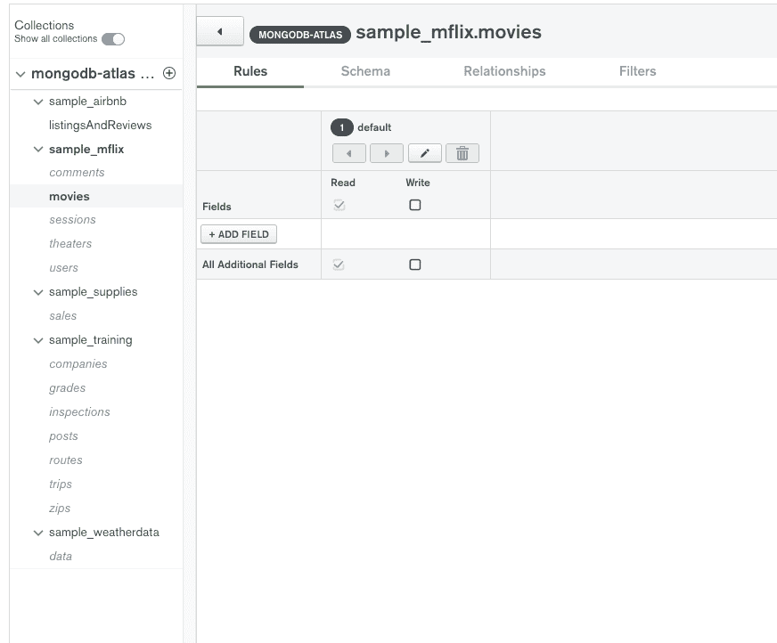

领域 UI 中的规则部分

在这一步之后，我们可以配置**模式**。为此，在“ **Schema** ”选项卡中，我们可以使用 Realm 集合中已经加载的文档来从它们生成一个模式。

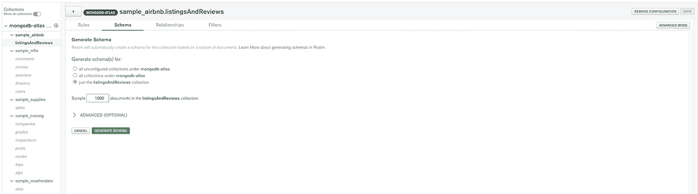

在领域 UI 中生成模式

等待几分钟后，我们将能够查阅在同一屏幕上创建的模式。

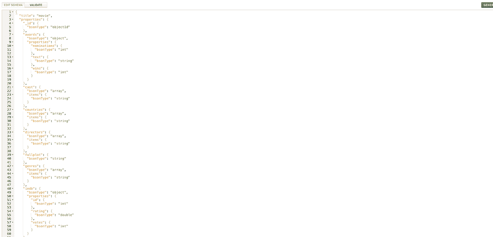

为电影集合生成的架构

# 添加身份验证提供程序

答我们将通过 GraphQL 客户端发出的所有请求都必须经过身份验证。为此，我们可以激活 Realm 中可用的任何身份验证提供程序。

对于这个例子，我们将使用 **API 密钥**，这样我们可以为我们的每个客户/合作伙伴创建一个 API 密钥，并在将来需要时禁用访问。

激活身份验证提供者后，我们会生成一个新的密钥，并复制接口提供的值。

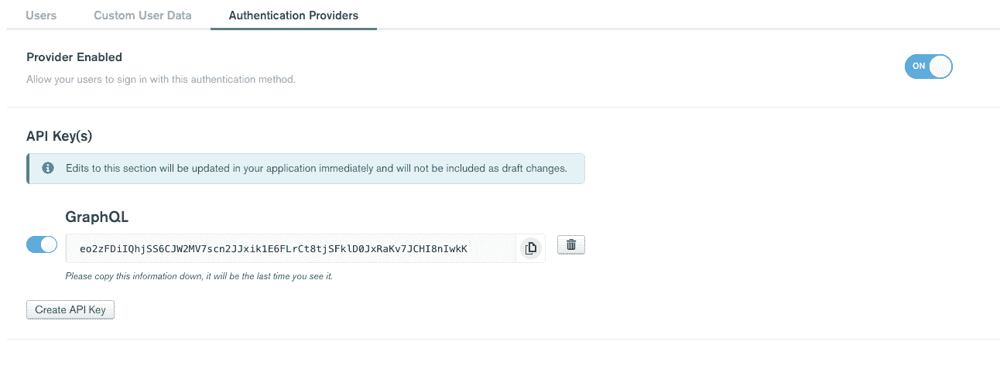

API 密钥身份验证提供程序

# 用 GraphQL 测试 graph QL

ealm 提供了一个嵌入式的 GraphiQL 接口来直接测试请求。

这些请求不需要经过身份验证，允许您在真实场景中发出请求之前对其进行测试。

为了检查所有的配置是否正确，我们可以执行下面的查询。

```
query {
  movie {
    _id
  }
}
```

这个请求是对电影集合的简单查询，我们请求只返回`_id`。从 MongoDB 的角度来看，这个请求可以等同于下面的`mongoshell`方法:

```
db.movies.findOne({},{"_id" : 1})
```

在 Realm 中使用 GraphQL API 的一个优点是，它会为已配置的集合自动生成模式。我们可以通过导航到 GraphQL 中的“ **Schema** ”选项卡来检查这一点，并验证“ **movies** ”集合的模式确实已生成。此时，我们可以下载模式，供以后在第三方 GraphQL 客户端(如 Postman)中使用。

# 创建自定义冲突解决程序

在对我们问题的描述中，我们讨论了如何在我们的数据集中检测符合一组预定义过滤器的电影。到目前为止，我们可以从数据集中获取所有电影，并在客户端应用程序中执行一些处理，但幸运的是，我们可以利用 MongoDB 中的*聚合* *管道*通过自定义解析器在服务器上执行这种转换。

如果我们想要测试获取匹配我们的过滤器的所有电影所需的语法，我们必须执行这个*聚合*:

```
[{"$match": {
  "imdb.rating": { "$gte": 7 },
  "genres": { "$nin": [ "Crime", "Horror" ] } ,
  "rated": { "$in": ["PG", "G" ] },
  "languages": { "$all": [ "English", "Japanese" ] }
  }
}]
```

要执行的第一步是在 GraphQL 中“**添加一个自定义解析器**”。

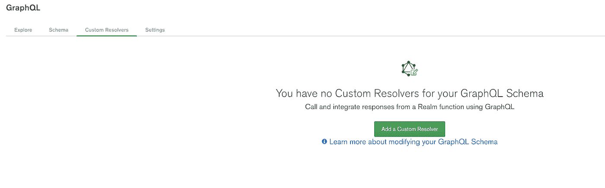

领域中添加自定义解析器屏幕的屏幕截图

要填写的字段如下:

*   **GraphQL 字段名**:这对应于我们在查询中引用这个自定义解析器时想要使用的名称。
*   **父类型**:我们正在创建的自定义解析器的类型，在我们的例子中，是一个读请求，我们将选择 Query。
*   **函数**:这里我们创建一个函数，每次调用我们的自定义解析器时都会调用这个函数。您可以链接现有功能或在此创建功能。

该函数的代码如下所示:

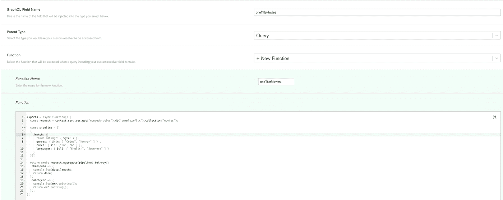

领域 UI 中自定义解析器编辑器的屏幕截图

*   **输入类型(推荐)**:目前我们将把它留在**无**。稍后我们将解释我们可以用它做什么，它是用来做什么的。
*   **有效载荷类型(推荐)**:响应对象类型。在我们的例子中，我们的*聚合*将返回一组电影，因此我们选择**现有类型(列表)**和类型**【电影】**。

此时，我们可以直接在 Realm 中测试新的**自定义解析器**。为此，在同一个 GraphiQL 部分中，我们可以编写如下查询:

```
query {
  oneTitleMovies {
    title
  }
}
```

单击播放按钮后，我们应该会看到我们的查询结果。

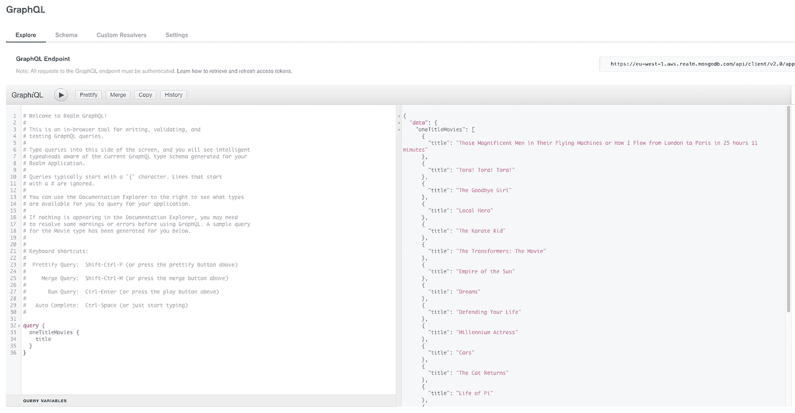

# 在 Postman 中测试我们最新创建的**自定义解析器**

为了在外部客户机中测试我们的查询，我们将使用 Postman。有一个[教程](https://learning.postman.com/docs/sending-requests/supported-api-frameworks/graphql/)用 API/Schema 在 Postman 中进行查询。在这个例子中，我们将进行一个没有模式的简单查询，因此我们不会使用它(但它值得一看)。

为了在 Postman 中测试这个查询，我们将创建一个新的 POST 请求，其中 URL 由 Realm (GraphQL 端点)提供。在请求的主体中，我们将选择 GraphQL 并编写:

```
query {
  oneTitleMovies {
    title
    cast
  }
}
```

当使用 Realm 和外部 GraphQL 客户端时，我们需要添加某种类型的**认证。**在前面的步骤中，我们创建了一个 API 密匙作为身份验证提供者，尽管我们可以使用它们中的任何一个。

在请求头中，我们应该添加:

```
{"apiKey","{{api_key}}"}
```

这里我们用之前获得的值替换“ *{{api_key}}* ”。

对于这个请求，Postman 的 cURL 大概是这样的:

```
curl --location --request POST '[your_graphql_endpoint]' \
 --header 'apiKey: [your_api_key]' \
 --header 'Content-Type: application/json' \
 --data-raw '{"query": "query {"query oneTitleMovies {"title" {"cast", "variables":{}}'
```


对 GraphQL 查询的邮递员请求

# 向我们的**自定义解析器**添加一个**输入类型**

当我们创建自定义解析器时，我们将它与一个函数相关联。该功能有一些预设参数:

1.  " imdb.rating": { $gte: 7 }
2.  流派:{ $nin: [《犯罪》《恐怖》] }，
3.  分级:{ $in: [ "PG "，" G" ] }，
4.  语言:{ $all: ["英语"，"日语"] } }

我们可以创建一个**输入类型**类型**自定义类型**以便那些暂时固定的值可以通过参数发送。**自定义类型**必须定义为 JSON 对象中的模式。对于我们的用例，我们的模式如下:

```
{
  "bsonType": "object",
  "title": "Filter",
  "required" : [
      "imdbRating",
      "genres",
      "rated"],
  "properties": {
    "imdbRating": {
      "bsonType": "int"
    },
    "genres": {
      "bsonType": "array",
      "items": {
        "bsonType": "string"
      }
    },
    "rated": {
      "bsonType": "array",
      "items": {
        "bsonType": "string"
      }
    },
    "languages": {
      "bsonType": "array",
      "items": {
        "bsonType": "string"
      }
    }
  }
}
```

我们将使“IMDB.rating”，“流派”和“评级”字段是强制性的，所以他们必须始终发送和“语言”字段将是可选的。

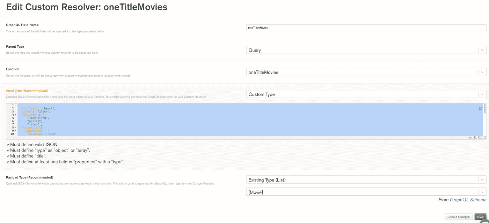

自定义冲突解决程序中自定义类型的输入类型

为了能够使用我们新的**输入类型**、**、**发送的数据，我们必须修改链接的函数，以便我们可以通过参数接收它们。

因为我们知道“imdbRating”、“流派”和“rated”是强制的，我们可以假设它们总是作为参数出现，因此我们直接将它们分配给我们的*聚合*。对于“语言”字段，因为它是可选的，我们将必须验证确实有一个关联的值，如果没有，我们将发送默认值。

现在我们可以在我们的外部 GraphQL 客户机中测试这个查询。查询如下所示(以获得与开始时相同的结果):

```
query {
  oneTitleMovies(input: {
      imdbRating: 7
      genres: [
          "Crime"
          "Horror"
      ]
      rated: [
          "PG"
          "G"
      ]
      languages: [
          "English"
          "Japanese"
      ]
  }) {
      title
  }
}
```

在这里，我们可以使用输入的不同字段来过滤我们的结果。使用 GraphQL 替代 Rest API 的优点之一是可以提前选择字段或响应值。在上面的例子中，我们只返回“标题”字段，但是我们可以返回“电影”集合中所有字段的子集。

# 包扎

Realm GraphQL 是创建无服务器应用程序的强大工具，可以轻松涵盖所有基本和复杂的用例。使用 Realm 作为 BaaS 可以帮助您比以往更快地构建和部署应用程序。

在本教程中，我们学习了如何创建一个链接到函数的自定义解析器来解析聚合管道。您可以简单地将这个例子应用到您自己的复杂用例中。

有问题吗？评论？我们很乐意与您联系。加入 [MongoDB 社区论坛的讨论。](https://developer.mongodb.com/community/forums/c/realm/9)

# 从 GitHub 下载示例代码

您可以从[https://github . com/josman Perez/realmGraphQLCustomResolverDemo](https://github.com/josmanperez/realmGraphQLCustomResolverDemo)下载示例代码，然后用

```
realm-cli import \
  --app-id=myapp-abcde \
  --path=./path/to/app/dir \
  --strategy=merge \
  --include-hosting \
  --include-dependencies
```