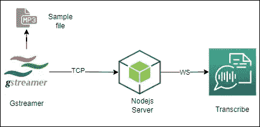

# 使用 AWS 转录、Nodejs 和 Gstreamer 进行实时音频转录

> 原文：<https://medium.com/nerd-for-tech/realtime-audio-transcription-with-aws-transcribe-nodejs-and-gstreamer-8e069f58f854?source=collection_archive---------0----------------------->


转录是 AWS 提供的一种机器学习服务，用于将语音转换为文本。这项服务建立在自动语音识别和自然语言处理技术的基础上。通过提供标点符号、数字标准化、时间间隔生成和多说话者识别等功能，转录提供了易于阅读的抄本。

实时音频转录是最酷的功能之一，允许流式音频和从 Websocket 读取文本。在本文中，我将展示如何构建一个 nodejs 应用程序来传输音频文件并打印文本输出。

## 设计



Gstreamer pipeline 模仿音频流服务，使用 *filesrc* 加载一个样本 mp3 文件，并使用 *tcpclientsink* 插件*将其流式传输到 Nodejs TCP 服务器。* Nodejs TCP 服务器读取这些音频组块，转换成二进制消息，最后通过 WebSocket 转发给转录者。然后它读取结果并输出到 shell。

## Gstreamer

```
gst-launch-1.0 filesrc location="/home/ubuntu/NSC_.mp3" ! decodebin ! audioconvert ! audioresample ! audio/x-raw, rate=16000 ! flacenc ! tcpclientsink port=2225
```

Gstreamer 管道从源读取文件，转换成合适的音频格式，并将其传输到 TCP 端口。

## Nodejs 应用

AWS 提供了一个内容丰富的[指南](https://docs.aws.amazon.com/transcribe/latest/dg/streaming.html)，解释了如何使用 WebSocket 接口访问转录功能的步骤。

首先，我们需要创建一个 nodejs TCP 服务器来监听端口 2225 并从 Gstreamer 读取音频流。为此，我们可以使用 nodejs 提供的“net”包。

TCP 服务器

然后，我们需要创建一个方法来转换音频块，以转录流 API 友好的二进制消息。AWS Javascript SDK 为此提供了一组实用方法。

现在，接收和转换音频块部分已经完成。接下来是最重要的部分，通过 WebSocket 将转换后的二进制消息转换成流。第一步是使用 WebSocket 连接转录，web socket 受 Amazon Signature 第 4 版签名方法保护。网上有足够的代码示例来解释签名过程。我直接从这个[链接](https://github.com/amazon-archives/amazon-transcribe-websocket-static/blob/master/lib/aws-signature-v4.js)复制代码，一点点修改。

签名 V4 实用程序代码

现在，我们可以使用上面的代码来生成预签名的 URL，以连接转录服务。

连接到转录 Websocket

最后，从 WebSocket 读取结果并输出到 shell。结果是一个包含大量细节的 JSON 对象。其中最重要的一个是部分。因为这是一个流服务，所以套接字一开始流音频就开始返回结果。转录提供两种类型的结果集，部分和完整的。它返回递增的部分结果，直到它使用 NLP 引擎识别出音频的暂停。然后将生成并转发最终结果。

```
{
  "TranscriptResultStream": {
    "TranscriptEvent": {
      "Transcript": {
        "Results": [
          {
            "Alternatives": [
              {
                "Items": [
                  {
                    "Content": "The",
                    "EndTime": 0.3799375,
                    "StartTime": 0.0299375,
                    "Type": "pronunciation",
                    "VocabularyFilterMatch": false
                  },
                  {
                    "Content": "Amazon",
                    "EndTime": 0.5899375,
                    "StartTime": 0.3899375,
                    "Type": "pronunciation",
                    "VocabularyFilterMatch": false
                  },
                  {
                    "Content": "is",
                    "EndTime": 0.7899375,
                    "StartTime": 0.5999375,
                    "Type": "pronunciation",
                    "VocabularyFilterMatch": false
                  },
                  {
                    "Content": "the",
                    "EndTime": 0.9199375,
                    "StartTime": 0.7999375,
                    "Type": "pronunciation",
                    "VocabularyFilterMatch": false
                  },
                  {
                    "Content": "largest",
                    "EndTime": 1.0199375,
                    "StartTime": 0.9299375,
                    "Type": "pronunciation",
                    "VocabularyFilterMatch": false
                  }
                ],
                "Transcript": "The Amazon is the largest"
              }
            ],
            "EndTime": 1.02,
            "IsPartial": true,
            "ResultId": "2db76dc8-d728-11e8-9f8b-f2801f1b9fd1",
            "StartTime": 0.0199375
          }
        ]
      }
    }
  }
}
```

现在我们的代码准备好了。测试解决方案的时间到了。


## 结论

有各种各样的用例可用于实时转录。实时转录的一些用例是呼叫中心和广播服务。这些转录可以被输入到人工智能系统中，并识别可以触发下游行动的事件，例如向呼叫中心主管发送警报。此外，它们可以被输入搜索平台以建立知识库。有像 AWS Comprehend 这样的服务可以从抄本中提取有价值的信息以供进一步处理。