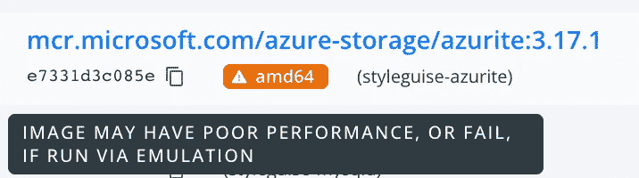
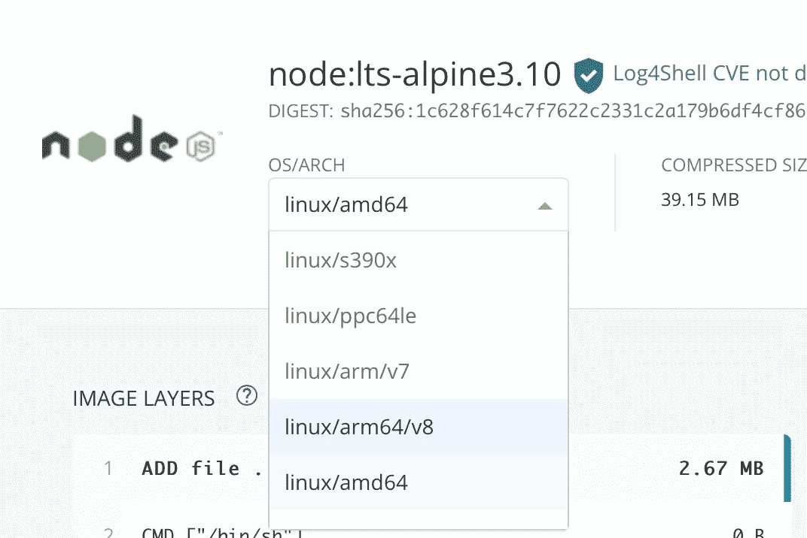
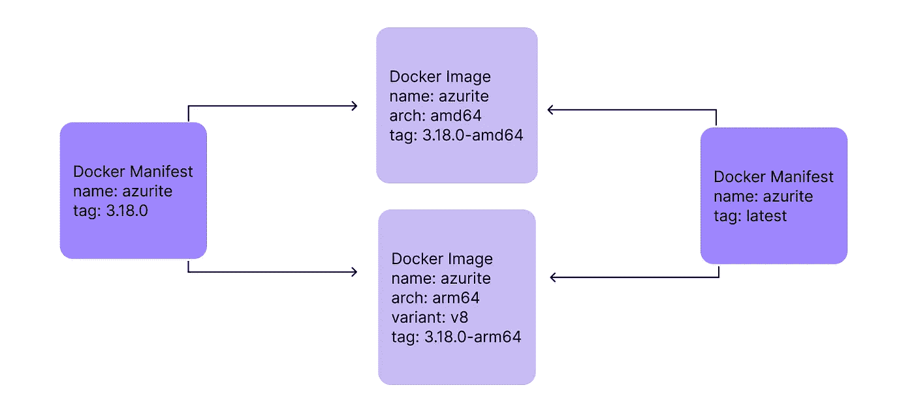
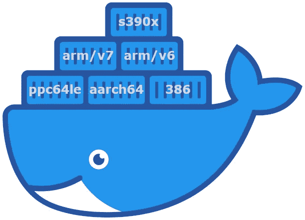

# 为 Apple Silicon 重建第三方 Docker 映像

> 原文：<https://medium.com/nerd-for-tech/rebuilding-a-3rd-party-docker-image-for-apple-silicon-8299fca9654?source=collection_archive---------0----------------------->

在本文中，我解释了如何将微软发布的 AMD64 Docker 映像转换为多架构映像，以便在 Apple Silicon 上本地运行。

# 问题概述

问题中的码头工人形象是 [**石青**](https://github.com/Azure/Azurite)；微软为模拟其 Azure 存储云服务而创建的产品。开发人员使用 Azure 来构建和测试他们基于 Azure 存储的应用程序，而不会产生任何实际的云成本。

尽管纯粹是为了本地开发，Azurite 实际上是一个非常强大的工具，它模拟:

*   Azure Blob 存储(类似于 AWS S3)
*   Azure 队列存储(类似于 AWS SQS)
*   Azure 表存储(类似于 AWS DynamoDB)

为了让开发者使用起来超级简单，微软发布了一张 Azurite 的 [Docker 图片……不幸的是，那张图片只为 AMD64 制作。](https://hub.docker.com/_/microsoft-azure-storage-azurite)

这意味着当我在基于苹果芯片的 MacBook Air 上运行该图像时，我会在 Docker 桌面上收到一个大警告。



苹果芯片的 Docker 文档明确指出:

> 总之，在基于 Arm 的机器上运行基于 Intel 的容器应该被认为是“尽了最大努力”。我们建议尽可能在 Apple silicon 机器上运行 arm64 容器，并鼓励容器作者生产他们的容器的 arm64 或多 arch 版本。

Docker Desktop for Mac 能够使用 Rosetta 2 很好地模拟 AMD64 架构，这并不是一个完全的阻塞。然而，我开发的网站( [StyleGuise](https://www.styleguise.net/) )使用了大量的图像数据，所以当我知道我在本地开发时从 Azurite 获得的性能低于标准时，我总是很苦恼。

**好在石青是开源的！**

# 发现

我决定看看是否有其他人在 GitHub 上报告了这个问题。请看，[有人在](https://github.com/Azure/Azurite/issues/1556)前 5 天创建了一个问题。因为我不知道微软解决这个问题的优先级有多高，所以我查看了一下引擎盖，发现 Azurite 是用 node.js 构建的，[它的 Docker 映像基于 Alpine linux](https://github.com/Azure/Azurite/blob/main/Dockerfile#L23) 。🧐我在回购文件的最上面找到了:

```
FROM node:lts-alpine3.10
```

我认为这个基本图像必须支持苹果硅。为了证实这一点，我使用了 docker 命令行工具:

```
docker manifest inspect node:lts-alpine3.10
```

这产生了一长串受支持的架构，其中最显著的是 AMD64 和 ARM64😃

```
{
  "schemaVersion": 2,
  "manifests": [
    {
      "mediaType": "application/vnd.docker.distribution.manifest.v2+json",
      "size": 1158,
      "digest": "sha256:1c628f614c7f7622c2331c2a179b6df4cf86e53920107b2385739c0294130678",
      "platform": {
        "architecture": "amd64",
        "os": "linux"
      }
    },
    {
      "mediaType": "application/vnd.docker.distribution.manifest.v2+json",
      "size": 1158,
      "digest": "sha256:7725cb78551a3eec8874aa0c3fe2afadfd548224fd405d04a8a56235dfdef9e6",
      "platform": {
        "architecture": "arm64",
        "os": "linux",
        "variant": "v8"
      }
    }
  ]
}
```

提示:查看 Docker 镜像支持的架构的另一种方式是通过 [Docker Hub UI](https://hub.docker.com/layers/node/library/node/lts-alpine3.10/images/sha256-f9cba6817f3dee4a9b8545e4abf77b91b7f25ec381f4231741be2c06b5e25920?context=explore)



# 构建多元建筑形象

经过一些研究，我了解到了`buildx`、[Docker 工具链中的一个命令，它简化了多架构映像的构建](https://docs.docker.com/buildx/working-with-buildx/)。

`buildx`是一个 Docker 插件，由[莫比](https://github.com/moby/buildkit)构建，并提供开箱即用的 Mac Docker 桌面。

构建多架构 Docker 清单的过程如下:

1.  创建一个 docker *builder* ，它实际上是一个运行莫比构建工具包工具链的容器，该工具链可以针对各种架构
2.  配置 docker 在创建图像时使用那个特殊的 *builder* 实例。
3.  为目标体系结构生成 docker 映像。在我的例子中，我想把这些变化反馈给微软，所以我的目标是构建一个支持 AMD64 和 ARM64 的映像。
4.  将图像发布到图像注册中心(理论上可以是 [DockerHub](https://hub.docker.com) 、 [AWS 弹性容器服务](https://aws.amazon.com/ecs/?trk=7dd0b498-f689-4b34-988c-60ef7607e90a&sc_channel=ps&sc_campaign=acquisition&sc_medium=GC-PMM%7CPS-GO%7CBrand%7CAll%7CPA%7CDatabase%7CECS%7CSolution%7CUS%7CEN%7CText%7Cxx%7CSEM%7CPMO22-13405&s_kwcid=AL!4422!3!547620651310!p!!g!!aws%20container%20service&ef_id=CjwKCAjwh-CVBhB8EiwAjFEPGV0sseZ5-2Puv5dSBZ-e9VoQu7iTmko-wdLYGjqQ_77J5-ZhuWUvThoCQ2EQAvD_BwE:G:s&s_kwcid=AL!4422!3!547620651310!p!!g!!aws%20container%20service)或 [Azure 容器注册中心](https://azure.microsoft.com/en-us/services/container-registry/))。
5.  生成捆绑了各种映像的多架构清单。
6.  将多体系结构清单发布到映像注册表。

清单是“多拱图像”,用户可以将其作为其他 Docker 图像的基础。我把它放在引号中是因为，对于所有的意图和目的，它看起来和感觉上像任何旧的 Docker 映像，然而，它实际上是一个清单列表，将架构映像变量捆绑到一个单一的实体中。

Azurite 的`package.json`透露了[微软用来构建他们的 AMD64 Docker 映像的命令](https://github.com/Azure/Azurite/blob/main/package.json#L256)，所以我分叉克隆了这个回购，并从那里开始。接下来是我用来构建多架构映像的命令序列。

```
# create the multi-arch builder
docker buildx create --name multi-platform-builder# set multi-arch builder as image builder
docker buildx use multi-platform-builder# generate arm64 image and output to local docker image list
docker buildx build \
  --platform linux/arm64 \
  --load \
  --no-cache \
  --file Dockerfile \
  --tag mcr.microsoft.com/azure-storage/azurite:3.18.0-arm64 \
  .# generate amd64 image and output to local docker image list
# you may notice this takes a lot longer than the arm64 build
docker buildx build \
  --platform linux/amd64 \
  --load \
  --no-cache \
  --file Dockerfile \
  --tag mcr.microsoft.com/azure-storage/azurite:3.18.0-amd64 \
  .# push images to registry (assumes your docker is logged in)
docker push mcr.microsoft.com/azure-storage/azurite:3.18.0-arm64
docker push mcr.microsoft.com/azure-storage/azurite:3.18.0-amd64# create manifest with tag 3.18.0
docker manifest create \
  mcr.microsoft.com/azure-storage/azurite:3.18.0 \
  mcr.microsoft.com/azure-storage/azurite:3.18.0-arm64 \
  mcr.microsoft.com/azure-storage/azurite:3.18.0-amd64# create manifest with tag latest
docker manifest create \
  mcr.microsoft.com/azure-storage/azurite:latest \
  mcr.microsoft.com/azure-storage/azurite:3.18.0-arm64 \
  mcr.microsoft.com/azure-storage/azurite:3.18.0-amd64# push manifests to registry
docker push mcr.microsoft.com/azure-storage/azurite:3.18.0
docker push mcr.microsoft.com/azure-storage/azurite:latest
```

下面您会看到两个 Docker 图像和指向这些图像的两个清单。



瞧，ARM64 映像原生运行在苹果芯片上！


# 结论

使用 Docker + `buildx`构建和发布多架构映像非常简单。由于大多数基本 linux 映像已经支持多种体系结构，因此将基于这些映像之一的项目升级到多体系结构清单中是相对简单的。

我[向微软](https://github.com/Azure/Azurite/pull/1569)提交了一份 PR，所以希望其他人很快就能获得最新的 Azurite 图像，并在苹果芯片上运行，而无需额外的工作！

更新(2022 年 9 月 11 日):微软接受了我的 PR，发布了支持 ARM 的新 docker 图片！从 3.19.0 开始提供

