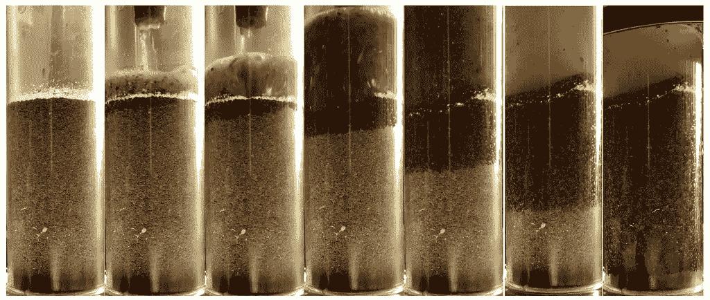
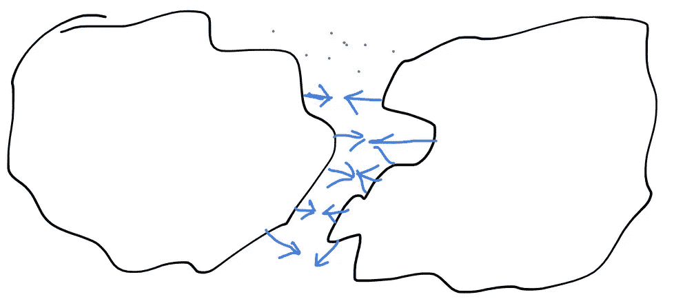
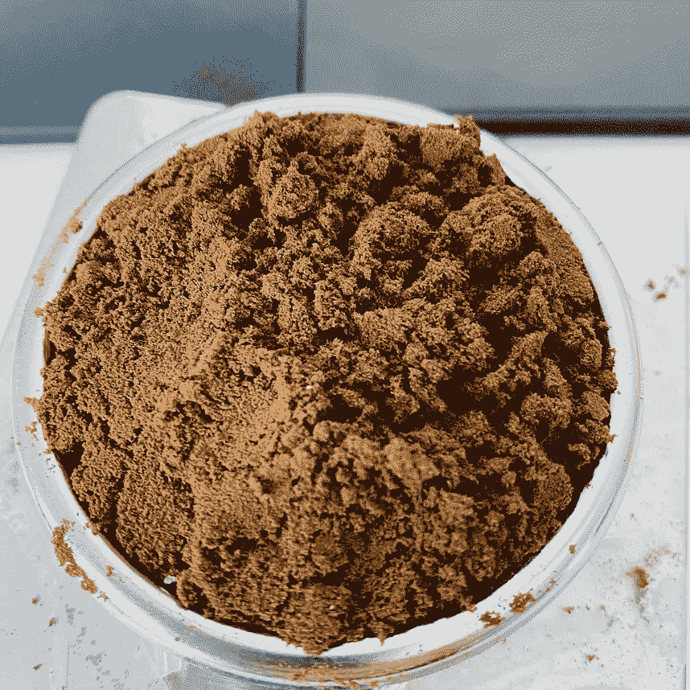
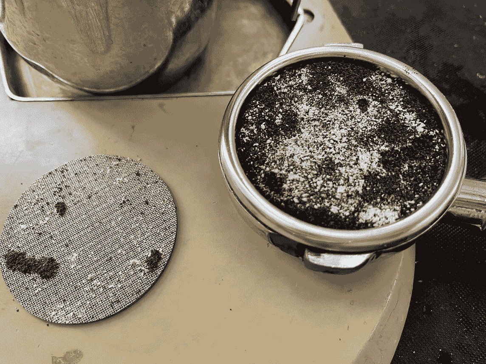

# 斥责浓缩咖啡中的微粒迁移

> 原文：<https://medium.com/nerd-for-tech/rebuking-fines-migration-in-espresso-6790e6c964de?source=collection_archive---------16----------------------->

## 咖啡数据科学

## 关于微粒迁移主题的文章集

浓缩咖啡中的粉末会迁移的理论已经流行了很多年，但讨论主要是理论上的。为了测试和挑战 espresso 的所有假设，我进入了了解微粒迁移的兔子洞。

我的结论是，罚款不会迁移太多，这里是我用来驳斥这一理论的研究成果。

## 视频摘要:

# 查看以前的数据:

[细颗粒迁移理论起源的同行评议](https://rmckeon.medium.com/a-peer-review-of-the-origin-of-the-fines-migration-theory-f8d1aa1776ba?source=your_stories_page-------------------------------------)

## 按时间顺序排列的文章:

[浓缩咖啡过程中粉末不会迁移](https://towardsdatascience.com/fines-dont-migrate-during-an-espresso-shot-1bb77e3252ca?source=your_stories_page-------------------------------------)

[揭露浓缩咖啡中的粉末迁移](https://towardsdatascience.com/debunking-fines-migration-in-espresso-989f486eef0e?source=your_stories_page-------------------------------------)

[咖啡渣遇水膨胀](https://towardsdatascience.com/coffee-grounds-expand-with-water-9f0b2ddb8a56)

[罚款迁移的丧钟](https://towardsdatascience.com/the-death-knell-to-fines-migration-8909c1deb2b4?source=your_stories_page-------------------------------------)

[在深浓咖啡中发光，寻找微粒迁移](https://towardsdatascience.com/glow-in-the-dark-espresso-in-search-of-fines-migration-b369a3beee3b?source=your_stories_page-------------------------------------)

[横断面浓缩咖啡圆盘切片](https://towardsdatascience.com/cross-sectional-espresso-puck-slicing-4caa57366e3c?source=your_stories_page----------------------------------------)

[咖啡中的粉末会迁移，但不会太远:第 1 部分](https://towardsdatascience.com/fines-migrate-in-espresso-but-not-far-part-1-44a1e7184224?source=your_stories_page----------------------------------------)

[咖啡中的粉末会迁移，但不会太远:第二部分](https://towardsdatascience.com/fines-migrate-in-espresso-but-not-far-part-2-320a0801677c?source=your_stories_page----------------------------------------)

[咖啡中的粉末会迁移，但不会太远:第三部分](https://towardsdatascience.com/fines-migrate-in-espresso-but-not-far-part-3-f24c48584223?source=your_stories_page----------------------------------------)

[用水测量咖啡粉末](/towards-data-science/measuring-coffee-fines-using-water-aa17595526c9?source=your_stories_page-------------------------------------)

[咖啡中的粉末迁移:更有力的证据](/towards-data-science/fines-migrate-in-espresso-stronger-evidence-15c42a3d41d8?source=your_stories_page-------------------------------------)

如果你愿意，请在 [Twitter](https://mobile.twitter.com/espressofun?source=post_page---------------------------) 和 [YouTube](https://m.youtube.com/channel/UClgcmAtBMTmVVGANjtntXTw?source=post_page---------------------------) 上关注我，我会在那里发布不同机器上的浓缩咖啡照片和浓缩咖啡相关的视频。你也可以在 [LinkedIn](https://www.linkedin.com/in/robert-mckeon-aloe-01581595?source=post_page---------------------------) 上找到我。也可以在[中](https://towardsdatascience.com/@rmckeon/follow)关注我。

# [我的进一步阅读](https://rmckeon.medium.com/story-collection-splash-page-e15025710347):

[浓缩咖啡系列文章](https://rmckeon.medium.com/a-collection-of-espresso-articles-de8a3abf9917?postPublishedType=repub)

[工作和学校故事集](https://rmckeon.medium.com/a-collection-of-work-and-school-stories-6b7ca5a58318?source=your_stories_page-------------------------------------)

[个人故事和关注点](https://rmckeon.medium.com/personal-stories-and-concerns-51bd8b3e63e6?source=your_stories_page-------------------------------------)

[乐高故事首页](https://rmckeon.medium.com/lego-story-splash-page-b91ba4f56bc7?source=your_stories_page-------------------------------------)

[摄影启动页面](https://rmckeon.medium.com/photography-splash-page-fe93297abc06?source=your_stories_page-------------------------------------)

[使用图像处理测量咖啡研磨颗粒分布](https://link.medium.com/9Az9gAfWXdb)

[改善浓缩咖啡](https://rmckeon.medium.com/improving-espresso-splash-page-576c70e64d0d?source=your_stories_page-------------------------------------)

[断奏生活方式概述](https://rmckeon.medium.com/a-summary-of-the-staccato-lifestyle-dd1dc6d4b861?source=your_stories_page-------------------------------------)

[测量咖啡磨粒分布](https://rmckeon.medium.com/measuring-coffee-grind-distribution-d37a39ffc215?source=your_stories_page-------------------------------------)

[咖啡萃取](https://rmckeon.medium.com/coffee-extraction-splash-page-3e568df003ac?source=your_stories_page-------------------------------------)

[咖啡烘焙](https://rmckeon.medium.com/coffee-roasting-splash-page-780b0c3242ea?source=your_stories_page-------------------------------------)

[咖啡豆](https://rmckeon.medium.com/coffee-beans-splash-page-e52e1993274f?source=your_stories_page-------------------------------------)

[浓缩咖啡用纸质过滤器](https://rmckeon.medium.com/paper-filters-for-espresso-splash-page-f55fc553e98?source=your_stories_page-------------------------------------)

[浓缩咖啡篮及相关主题](https://rmckeon.medium.com/espresso-baskets-and-related-topics-splash-page-ff10f690a738?source=your_stories_page-------------------------------------)

[意式咖啡观点](https://rmckeon.medium.com/espresso-opinions-splash-page-5a89856d74da?source=your_stories_page-------------------------------------)

[透明 Portafilter 实验](https://rmckeon.medium.com/transparent-portafilter-experiments-splash-page-8fd3ae3a286d?source=your_stories_page-------------------------------------)

[杠杆机维护](https://rmckeon.medium.com/lever-machine-maintenance-splash-page-72c1e3102ff?source=your_stories_page-------------------------------------)

[咖啡评论和想法](https://rmckeon.medium.com/coffee-reviews-and-thoughts-splash-page-ca6840eb04f7?source=your_stories_page-------------------------------------)

[咖啡实验](https://rmckeon.medium.com/coffee-experiments-splash-page-671a77ba4d42?source=your_stories_page-------------------------------------)