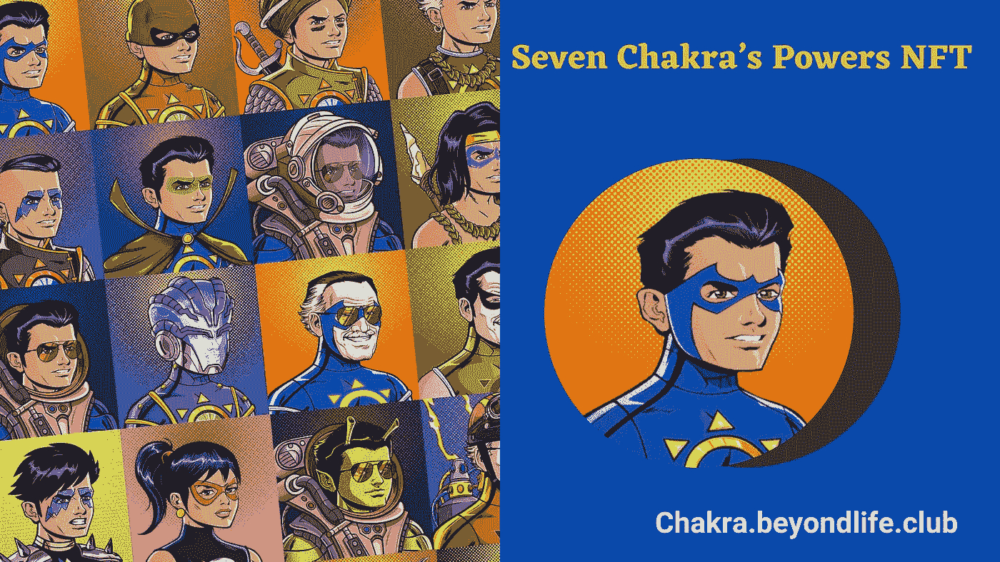
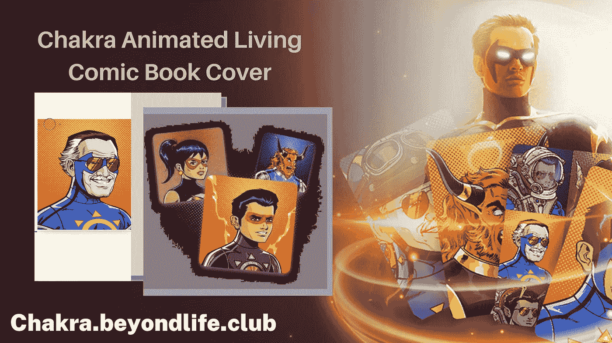

# 追忆斯坦·李独一无二的超级英雄查克拉-无敌:加入查克拉 NFT 系列的发布会

> 原文：<https://medium.com/nerd-for-tech/recollecting-stan-lees-unique-superhero-chakra-the-invincible-join-the-launch-of-the-chakra-nft-66fccab03a4c?source=collection_archive---------2----------------------->

许多超级英雄成功背后的漫威漫画创作者斯坦·李，也创造了一个独特的印度超级英雄。随着印度文化、瑜伽和冥想实践的多样化，斯坦·李受到启发，创造了一个基于能量脉轮的超级英雄。2012 年，他提出了一个新的超级英雄，名为“查克拉”——与印度图形合作的无敌英雄。该故事于 2013 年在卡通网络上以漫画和 3 部续集动画电影的形式发布。

**斯坦·李不为人知的作品**

他死后，粉丝们一直在关注他的作品。他们甚至有兴趣知道他最后的作品。斯坦·李有许多未发行的作品令粉丝们着迷。有关于一个叫泥土人的角色的谈话，他在最后的日子里和他的女儿一起工作。

在他未发行的作品列表中，一个独特的角色是查克拉的成人版本。来自 NFT 脉轮收藏的 [**脉轮动画 NFT 视频**](https://chakra.beyondlife.club/?fsz=home) 将包括成年人脉轮的 3D 动画，由斯坦·李在去世前创作。

不仅如此，该系列还包括一个特殊的 NFT 包，这是斯坦·李的 Bday 特别 NFT。这个包裹里有一个斯坦·李工作了几十年的未知角色。他把这个独特的角色命名为“温柔的珀西的力量”。NFT 将于 12 月 28 日拍卖，拍卖将持续 3 天。查看拍卖倒计时的官方页面。

**斯坦粉丝的新年盛宴**

每一个斯坦·李球迷都有机会分享他的遗产。藏品中有很多平价的限量版艺术朋克。查克拉艺术朋克战利品盒可以通过盲目购买获得，并会分配一个查克拉漫画人物。有 6865 个独特的角色，最初是由斯坦创造的。巨型点唱机包括各种罕见的漫画书封面，供粉丝添加到他们的漫画收藏中。

还有其他收集像艺术朋克(15 个独特的角色)，七查克拉权力(7 个独特的三维动画)，动画生活漫画封面(2 个独特的封面)。这些项目将被拍卖，每个项目都有不同的最低拍卖价格。

**在市场上做标记**

DC Comics 和漫威与 VeVe 合作创作的超级英雄 NFT 仍然在市场上存在。但看不见的漫画封面，有史以来第一个查克拉漫画的个人签名副本，斯坦·李的看不见的作品只包括在这个 NFT 收集。所以粉丝们都很想知道更多，想拥有这个收藏。

NFT 每天都在制造。找到一个罕见的和独特的投资是困难的。这个收藏将在市场上树立一个极其罕见的收藏品的标志，使 NFT 爱好者和漫画爱好者对这个收藏感兴趣。

**对该系列的最终想法**

查克拉 NFT 收藏即将推出，让粉丝们期待拥有斯坦·李的原创艺术品。该系列将于 12 月 27 日和 28 日由 beyondlife.club 推出，由 Guardian link、Orange comet 和斯坦·李的 Pow 提供支持！娱乐。你可以在 beyondlife.club 上关注发布会的倒计时。粉丝们已经挤满了 artpunks 和 Jukebox 的等候名单，并注册了拍卖。

拍卖将持续三天，在所有的销售和拍卖结束后，有一个宝箱等待着粉丝们。拥有超过 5 个 [**查克拉 NFT 收藏**](https://chakra.beyondlife.club/?fsz=home)NFT 的粉丝，无论价格如何，都将获得宝箱。