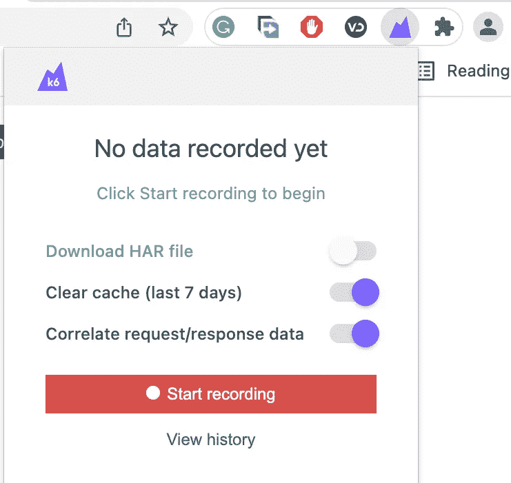
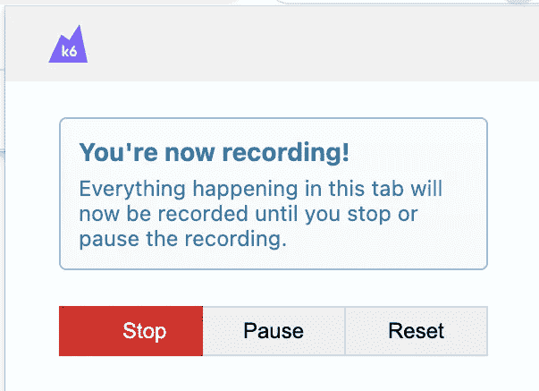
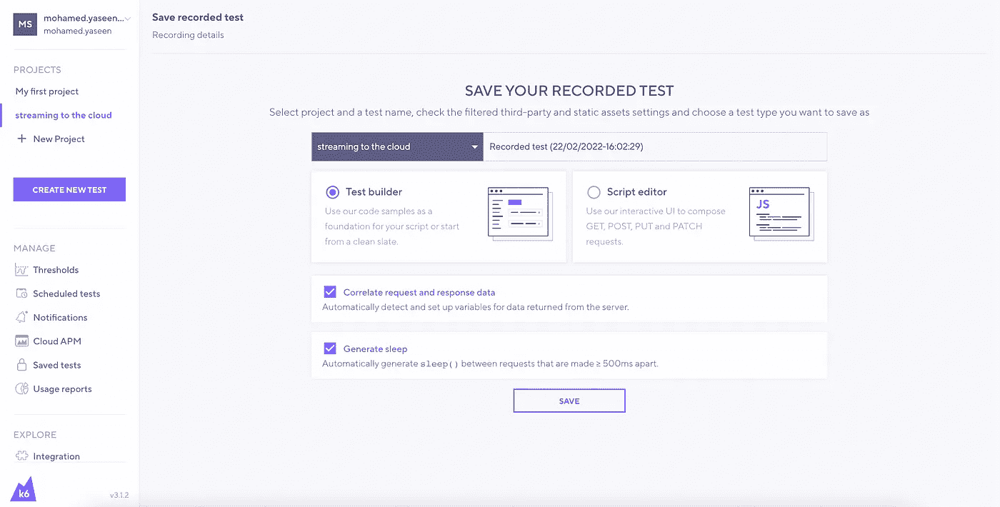
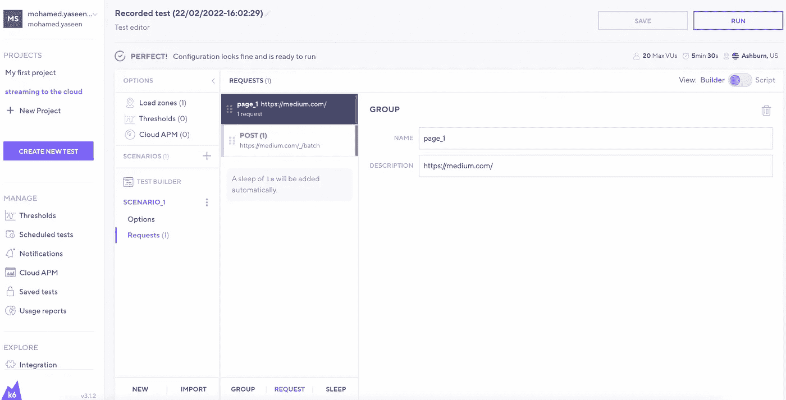
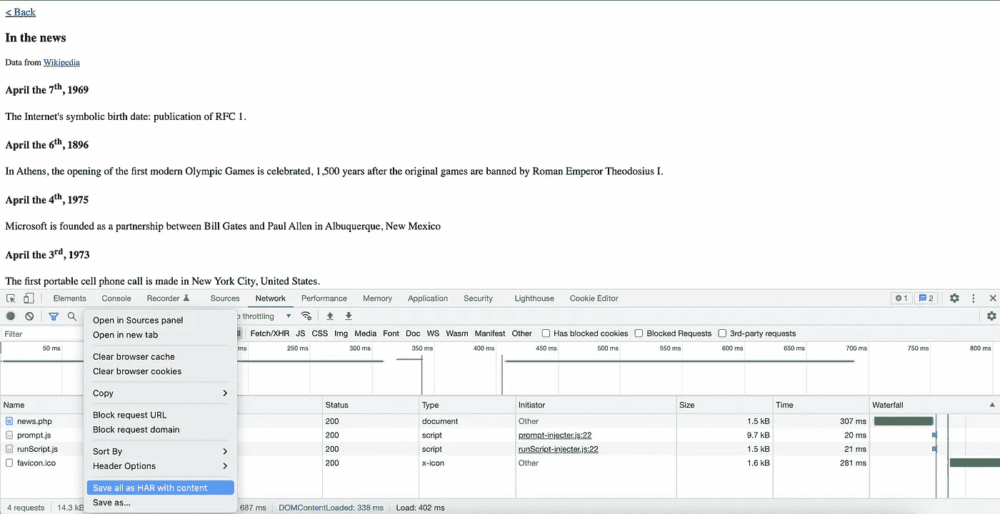
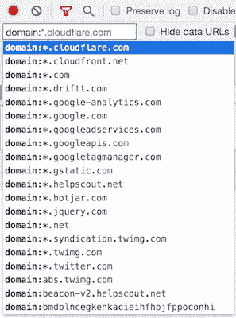

# 在 K6 中记录会话

> 原文：<https://medium.com/nerd-for-tech/recording-a-session-in-k6-f28daeffdabd?source=collection_archive---------0----------------------->

在负载测试的上下文中，记录通常是指从用户会话记录中构造负载测试。该过程有三个步骤:创建用户或 API 会话记录，将记录的会话转换为测试，运行测试。

虽然并不总是必要的，但在测试网站或移动应用程序的复杂场景时，通常会使用录音。记录允许测试人员查看请求序列和会话设置，允许他们快速生成复杂的请求链。假设您需要开发一个性能测试，用几十或几百个查询模拟用户旅程。在这种情况下，录音可以让您不必从头开始。

为了从记录的用户体验中生成 K6 脚本，K6 支持两种机制:

1.  浏览器记录器使用浏览器会话来构建 k6 脚本。Chrome 和 Firefox 都支持。
2.  HAR 转换器根据 HAR 文件中的请求创建一个 k6 脚本。

# 浏览器记录器

浏览器记录器允许您从 web 体验中创建 k6 脚本。它以 Chrome 和 Firefox 扩展的形式提供。k6 云支持浏览器记录器功能。当用户完成会话记录时，扩展将自动生成的 k6 测试上传到用户的 k6 云帐户。

browser recorder 允许您像用户一样访问您的站点或 web 应用程序，从而生成大多数测试脚本。准备好的脚本作为将来需要时进行编辑的基础。记录器将收集一切信息，包括你点击时载入浏览器的每一个 HTTP(s)请求，包括广告、图片、文档等等，让你对正在发生的事情有一个更准确的了解。点击“记录”，开始冲浪，完成后脚本将存储到您的 k6 云帐户。

要做的步骤

1.  安装 [Chrome](https://chrome.google.com/webstore/detail/k6-browser-recorder/phjdhndljphphehjpgbmpocddnnmdbda?hl=en) 或 [Firefox](https://addons.mozilla.org/en-US/firefox/addon/k6-browser-recorder/) 扩展。
2.  要开始记录当前的浏览器标签，点击 k6 图标并按“开始记录”打开插件。记录用户会话时，请记住以下推荐做法:

做

*   像用户一样浏览
*   利用用户在阅读页面内容时会出现的自然停顿
*   关注最常见的用例，而不是所有可能的用例
*   请注意表格/登录所在的页面；您将需要做额外的脚本，使其使用动态值。

不

*   在一次旅行中浏览每一页
*   点击每个可能的选项
*   尽可能快地导航
*   离开你实际的站点或应用程序



3.完成后，按“停止记录”,您将被带到应用程序来查看记录的测试脚本



4.将脚本记录保存在任何项目中。如果在录制过程中有任何第三方请求，它们将被自动过滤掉，因为:

这些第三方请求会扭曲您的性能统计的百分比。
您可能无法影响第三方服务的表现。
负载测试可能违反您与提供商签订的服务合同的条件。

如果您希望将某些请求包括在第三方列表中，请取消选择您希望包括的请求，然后保存。



5.对脚本进行任何必要的更改。根据测试的类型，您可能需要修改脚本的某些部分。最常见的修改是:

最好是修改负载选择。默认情况下，上升时间设置为 12 分钟。
你应该处理动态的相关数据。

6.在本地机器或 k6 云上运行测试。如果您希望通过 k6 Cloud UI 启动云测试，请点击 Run。

如果您希望使用 k6 CLI 执行本地或云测试，请将创建的脚本复制到您的本地文本编辑器并运行

```
k6 run or k6 cloud
```

命令开始测试。



# HAR 转炉

HAR 转换器(所有主流浏览器和许多其他程序使用的一种文件格式，用于导出记录的 HTTP 请求。)是浏览器记录器的替代产品。它从 HAR 文件中的 HTTP 请求构建一个 k6 脚本。

NodeJS 用于运行 har-to-k6 转换器。与浏览器记录器不同，k6 脚本不需要由 k6 云用户生成。使用 HAR 转换器时，程序如下:
1。使用您喜欢的浏览器或程序创建 HAR 文件。
2。要从 HAR 文件生成 k6 测试，请使用 har-to-k6 转换器。
3。在您的文本编辑器或 IDE 中，更新自动生成的 k6 测试。
4。用 k6 运行测试。

# 1.记录 HAR 文件

要以 HAR 格式导出 HTTP 流量，可以使用各种浏览器和技术。Chrome、Firefox 和微软 Edge 就是几个例子。

以下是在 Chrome 中创建录音的基本步骤:
1。在 Chrome 中打开一个新的匿名窗口(严格来说不是必须的，但是使用匿名窗口意味着你不会传输那么多的 cookies，等等。你的浏览器可能已经保存了)。
2。启动 Chrome 开发者工具(按 F12)
3。导航到“网络”选项卡。
4。检查录音按钮(圆形按钮)是否打开(红色)。
5。如果您希望记录大量连续的页面加载，请单击“保留日志”选项。
6。输入您的站点的 URL，并开始执行您希望您的模拟负载测试客户做的任何事情。
7。在 Chrome 开发者工具中，右键点击 URL 列表，选择“另存为 HAR 内容”



在记录用户会话时，最好记住以下推荐做法:

**做**

1.  像用户一样浏览。
2.  采取自然停顿，消费者会采取摄取页面信息。
3.  关注最常见的用例，而不是所有可能的用例。
4.  记下任何带有表单或登录信息的页面；您很可能需要在那里编写一些脚本。

**不要**1
。在一次旅行中浏览每一页。

2.选择每个可行的选项。

3.尽可能快地离开你实际的站点或应用程序。

# 2.将 HAR 文件转换成 k6 脚本

har-to-k6 转换器是一个 NodeJS 实用程序，用于将 har 文件(浏览器会话)转换为 k6 脚本。下载并安装 har-to-k6 转换器。必须按照要求安装 NodeJS(版本> =11.0.0)。您可以使用 npm 来安装转换器:

```
npm install -g har-to-k6
```

执行 convert 命令。现在，您可以使用转换器从 HAR 文件创建 k6 脚本:

```
har-to-k6 myfile.har -o loadtest.js
```

上面的程序将为您生成一个 k6 脚本。它将读取 HAR 文件(myfile.har)并创建一个 k6 测试(loadtest.js)。

# 3.修改自动生成的 k6 脚本

转换器为前一阶段的测试创建了一个 k6 脚本。这将有助于确定 k6 脚本的任何部分是否需要更改。根据您的使用情况，您可能需要更改以下一些内容:

## 1.配置加载选项

目前，k6 已经开发了一个“功能”测试，默认情况下，它将使用一个“虚拟用户”运行一次“迭代”。是时候为您的性能测试设置“负载”参数了。k6 可以通过多种方式进行配置:

1.  运行测试时作为 CLI 参数:

```
k6 run --vus 10 --duration 30s loadtest.js
```

2.脚本文件的选项。

```
export const options = {vus: 10,duration: '30s',};
```

## 2.删除第三方内容

当您在网站上记录用户会话时，您将默认记录所有 HTTP 请求，包括来自您网站上使用的第三方工具的请求，如分析工具、脸书、Twitter、支持小部件、cdn 等等。应该删除这些第三方查询，因为:

这些第三方请求会扭曲您的性能统计的百分比。
你可能无法影响第三方服务的表现。
负载测试可能违反您与提供商签订的服务合同的条件。在您的 k6 脚本中，您有两种选择来跳过第三方请求。

1 .编辑自动生成的 k6 脚本，并逐个消除对第三方服务的查询。

2 .下载一个 HAR 文件，其中只包含对所选域的请求。

你可以使用 DevTools 网络过滤器将你的搜索限制在 Chrome 的特定领域。为了匹配几个域，过滤器输入支持正则表达式。

`/loadimpact.com|cloudfront.net/`


过滤完您选择的域后，您可以按照本文第一步中的说明下载 HAR 文件，而 HAR 文件将只包含对所选域的请求。如果您不知道要过滤的所有域，那么利用网络过滤器的查询语言是一个好主意。在过滤器中输入 domain:以查看网络面板记录的所有域。



## 关联动态数据

负载测试中的相关性是指从一个请求的答案中检索一个或多个值，并在未来的请求中重用它们。获取令牌或某种形式的 ID 经常需要完成用户旅程中的一系列阶段。记录的 HAR 文件可能包含来自您站点的动态数据，如 id、CSRF 令牌、VIEWSTATE、wpnonce 和其他动态变量，这些数据将被转换为 k6 脚本。为了正确执行负载测试，您可能需要用从以前的请求中获得的动态数据替换硬编码的数据。例如，令牌会很快过期，并且是消费者会与记录的会话相关联的最典型的项目之一。

# 4.运行测试

要运行 k6 脚本，请使用 k6 run 命令:

```
k6 run loadtest.js
```