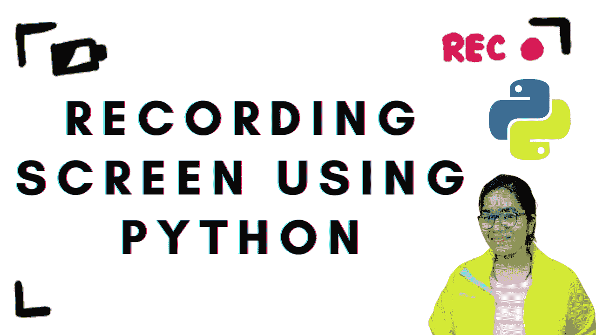

# 使用 Python 录制屏幕

> 原文：<https://medium.com/nerd-for-tech/recording-screen-using-python-1e9f8453e478?source=collection_archive---------5----------------------->



各位编码员好，

在这篇博客中，我将告诉你“如何使用 python 来构建一个屏幕记录器”。

> 完整的解释，请观看我在 YouTube 上的视频。

为此，您需要 2 个库。

*   时间
*   screen_recoder_sdk

这里时间是一个内置的库，所以不需要安装它。

另一方面，screen_recoder_sdk 需要安装。

在这个库的帮助下，你可以截图和录制视频。

用于安装—

```
> pip install numpy
> pip install screen-recorder-sdk
```

安装完成后，让我们开始编码。

1.  导入库。

```
> import time
> from screen_recorder_sdk import screen_recorder
```

2.启用开发记录器

```
screen_recorder.enable_dev_log ()
```

3.设置参数。

```
params = screen_recorder.RecorderParams ()
```

4.初始化屏幕记录器。

```
screen_recorder.init_resources (params)
```

5.截图

```
screen_recorder.get_screenshot (5).save ('sample.png')
```

> 屏幕截图“sample.png”将保存在您的程序被保存的地方。

6.开始视频录制

```
screen_recorder.start_video_recording ('sample.mp4', 30, 8000000, True)
```

**论据解释** —

*   文件名= sample.mp4
*   帧速率= 30
*   比特率= 8000000
*   use_hw_transfowrms=True

7.限期

```
time.limit(10) 
```

> 录音将持续 10 秒钟。

8.停止录音

```
screen_recorder.stop_video_recording ()
```

> 忠太😊，现在您将看到保存您的节目的录像。

> 完整代码→ [Github](https://github.com/varchasa/YouTube-Projects/tree/main/Screen%20Recoder)

感谢您阅读这篇文章🙌。请鼓掌👏，如果你觉得我的文章有用。

瓦尔恰萨·阿加尔瓦尔