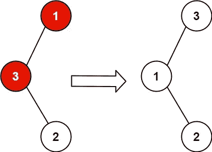

# 恢复二叉查找树[Leetcode 99]

> 原文：<https://medium.com/nerd-for-tech/recover-binary-search-tree-leetcode-99-7faf94241044?source=collection_archive---------1----------------------->

## Leetcode 问题，树问题，递归


约翰尼斯·普莱尼奥在 Unsplash[拍摄的照片](https://unsplash.com/s/photos/binary-tree?utm_source=unsplash&utm_medium=referral&utm_content=creditCopyText)

这篇文章旨在解决恢复二叉查找树 Leetcode 99 问题

# 问题陈述

给你一个二叉查找树(BST)的`root`，其中**的值正好是**树的两个节点被错误地交换了。*恢复树而不改变其结构*。



源 Leetcode

# 示例 1

```
**Input:** [10,5,15,6]
    10   
   /  \
  5    15   
 /
6 

**Output:** [10,6,15,5]
    10   
   /  \
  6   15   
 /
5
```

# 示例 2

```
**Input:** [3,1,4,null,null,2]   
  3  
 / \ 
1   4    
   /   
  2 
**Output:** [2,1,4,null,null,3]   
  2  
 / \ 
1   4    
   /   
  3
```

> ***如果你正在准备你的技术编码面试，或者你想学习递归来提高你解决问题的技能，那么你应该查看这个 udemy 课程*** [**递归大师班，从 C++**](https://www.udemy.com/course/master-the-recursion-from-beginner-to-advance-level/?referralCode=75F57675BDABF6D104C0) ***的初级到高级水平，或者你可以在***[***Skillshare***](https://skl.sh/3PTOCns)***上查看这个递归课程。***
> 
> ***如果你想从初学者到专家水平学习 ARKit 3，那么点击*** [***这里***](https://www.udemy.com/course/ios-13-swift-5-the-complete-arkit-3-course/?referralCode=7A726FE5CBCEF5839185) ***获得课程，你还将获得 97%的折扣。***
> 
> ***如果你对学习 iOS 移动开发充满热情，并希望将你的 iOS 开发技能提升到一个新的水平，那么使用 CloudKit framework 的核心数据应该是你的首选。点击*** [***此处***](https://www.udemy.com/course/mastering-coredata-with-cloudkit-in-swift-5-for-ios/?couponCode=FORDEVS) ***获取课程，您还将获得 97%的折扣。***
> 
> ***从头开始学习 SwiftUI 点击*** [***此处***](https://www.udemy.com/course/swiftui-the-complete-course-building-real-world-apps/?couponCode=FORCODERS) ***获取课程，因为在本课程中，我们将使用 SwiftUI 构建许多应用，如脸书克隆、新闻应用、笔记应用等等。***

# 强力方法

首先，我们将创建一个向量，我们将按顺序遍历树(您可以使用任何遍历算法)，我们将推回向量中的元素，然后我们将按升序对向量进行排序。

之后，我们将再次遍历树，我们将使用向量值更改树的值，但这一次我们必须以有序的方式遍历，因为二叉查找树由小于左侧节点的元素和大于右侧节点的元素组成，有序遍历将使元素按**升序排列。**

# 暴力方法的代码

```
class Solution {
public:vector<int> v;void solve(TreeNode* root) {
        if(root == NULL) {
            return;
        }
        solve(root->left);
        v.push_back(root->val);
        solve(root->right);
    }int i = 0;
    void inOrderTraversal(TreeNode* root) {
        if(root == NULL) {
            return;
        }
        inOrderTraversal(root->left);
        root->val = v[i];
        i++;
        inOrderTraversal(root->right);
    }

    void recoverTree(TreeNode* root) {
        solve(root);
        sort(v.begin(), v.end());
        inOrderTraversal(root);
    }
};
```

# 蛮力方法时间和空间复杂性

**时间复杂度:O(n)**

**空间复杂度:O(n)**

# 最佳方法

在强力方法中，空间复杂度是 O(n)我们必须做得更好，如果你认为在这个问题中只有两个节点被交换， 我们能做的是以有序的方式遍历树，创建一个先前的节点，并将值设置为空，之后我们将遍历树，并将当前节点值与先前节点值进行比较。如果先前节点不为空，并且先前节点值大于当前节点值，那么我们可以将先前节点和当前节点推回到我们的对向量中，因为这是被交换的节点。

我们的数组中有所有这样的对。数组大小将是 1 或 2 不超过 2，因为只有两个节点被交换。如果数组大小为 1，这意味着只有两个相邻的节点被交换，否则数组大小将为 2。

因此，我们必须相应地交换数字，以回到原来的树。

# 最佳进场代码

```
class Solution {
public:TreeNode* prev = NULL;
vector<pair<TreeNode*, TreeNode*>> v;void solve(TreeNode* root) {
        if(root == NULL) {
            return;
        }

        solve(root->left);
        if(prev != NULL) {
            if(prev->val > root->val) {
                v.push_back(make_pair(root, prev));
            }
        }
        prev = root;
        solve(root->right);
    }

    void recoverTree(TreeNode* root) {
        solve(root);
        if(v.size() == 1) {
            swap(v[0].first->val, v[0].second->val);
        } else {
            swap(v[0].second->val, v[1].first->val);    
        }

    }
};
```

# 最优进场时间和空间复杂度

**时间复杂度:O(n)**

**空间复杂度:O(1) //我们不考虑堆栈空间**

# 结论

这件作品到此为止。我希望你喜欢这篇文章，并且你已经学会了如何解决三个问题。

# 额外资源

> ***如果你正在准备你的技术编码面试，或者你想学习递归来提高你解决问题的技能，那么你应该查看这个 udemy 课程*** [**递归大师班，从 C++**](https://www.udemy.com/course/master-the-recursion-from-beginner-to-advance-level/?referralCode=75F57675BDABF6D104C0) ***的初级到高级水平，或者你可以在***[***skill share***](https://skl.sh/3PTOCns)***上查看这个递归课程。***
> 
> **如果你想从初学者到专家水平学习 ARKit 3，那么点击** [**这里**](https://www.udemy.com/course/ios-13-swift-5-the-complete-arkit-3-course/?couponCode=FORCREATOR) **获得课程，你还将获得 97%的折扣。**
> 
> **如果你对学习 iOS 移动开发充满热情，并希望将你的 iOS 开发技能提升到一个新的水平，那么使用 CloudKit framework 的核心数据应该是你的首选。点击** [**此处**](https://www.udemy.com/course/mastering-coredata-with-cloudkit-in-swift-5-for-ios/?couponCode=FORDEVS) **获取课程，您还将获得 97%的折扣。**
> 
> **从头开始学习 SwiftUI 点击** [**此处**](https://www.udemy.com/course/swiftui-the-complete-course-building-real-world-apps/?couponCode=FORCODERS) **获取课程，因为在本课程中，我们将使用 SwiftUI 构建许多应用，如脸书克隆、新闻应用、笔记应用等等。**