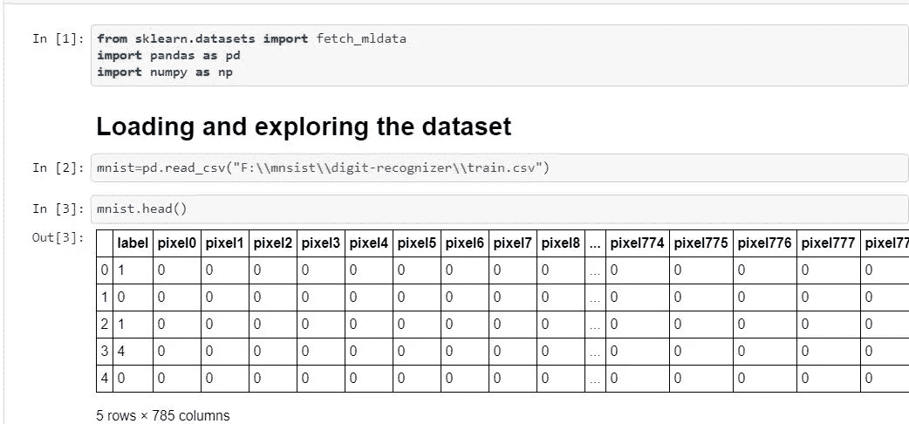
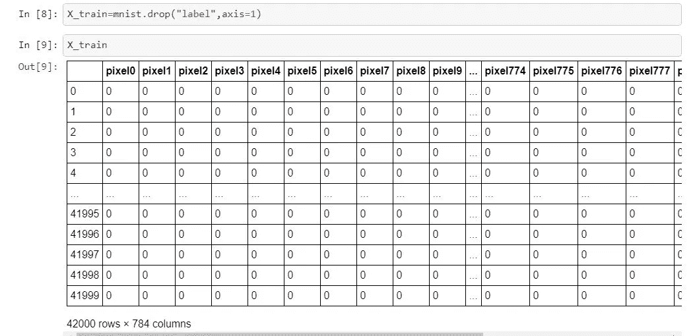
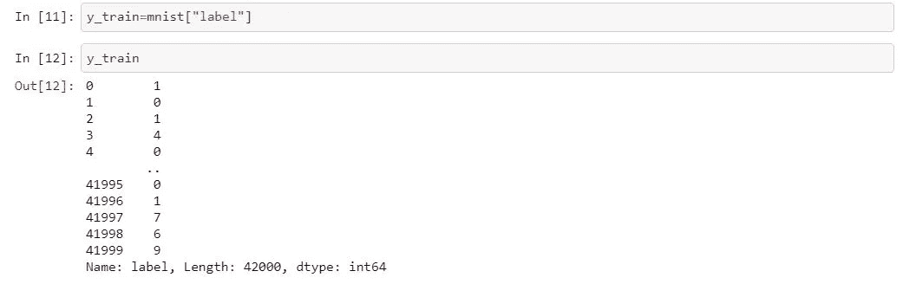
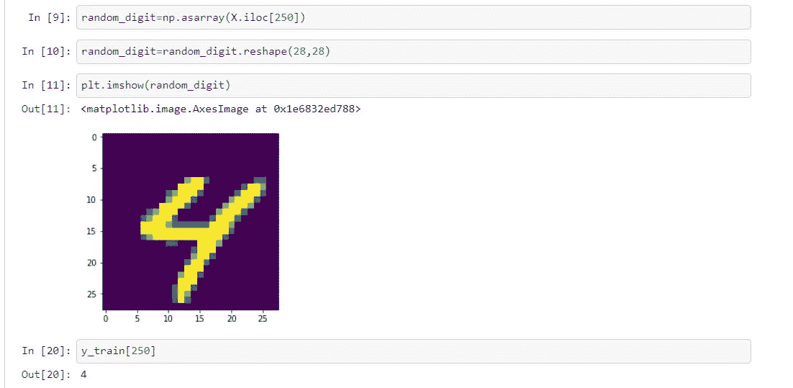
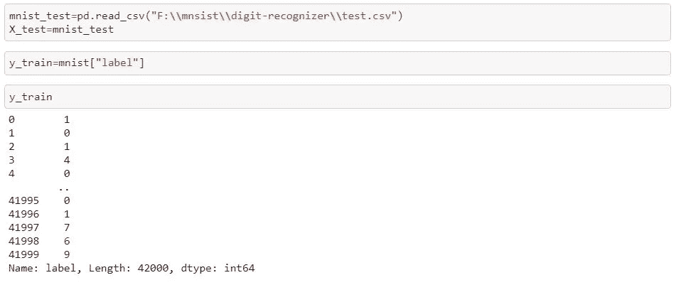
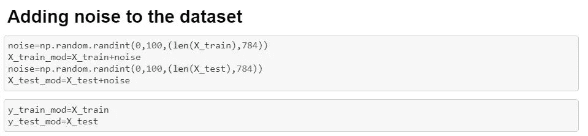
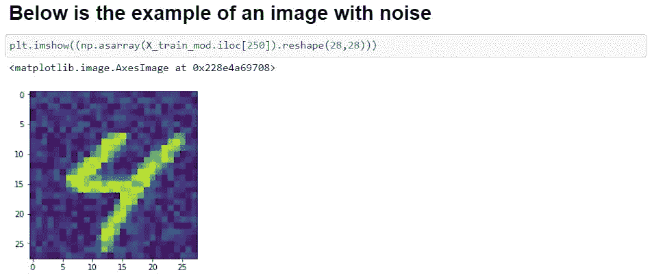
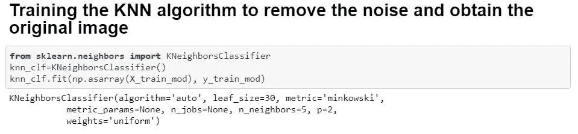
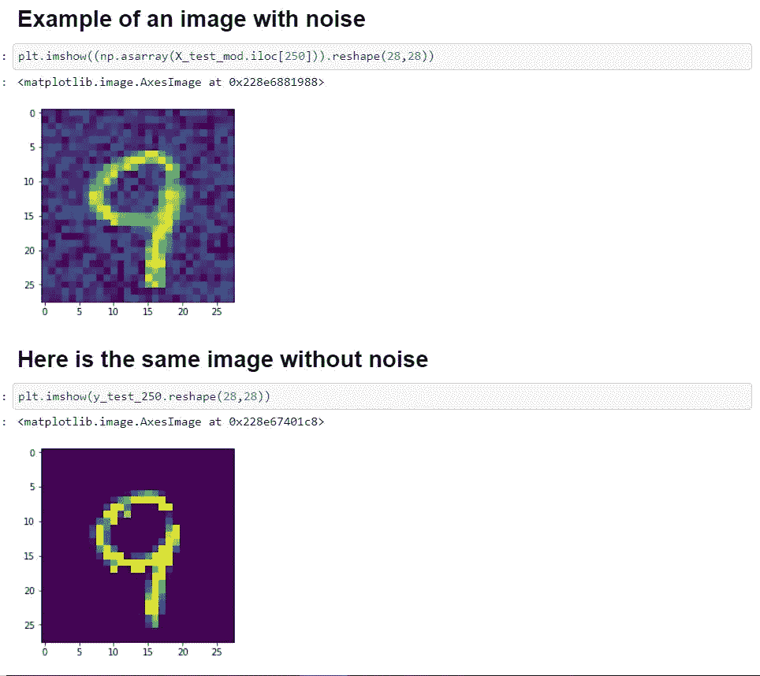

# 使用 KNN(MNIST 手写数字分类数据集)从具有噪声的图像中恢复原始图像

> 原文：<https://medium.com/nerd-for-tech/recovering-the-original-image-from-the-image-having-noise-using-knn-mnist-handwritten-digit-530edf39587e?source=collection_archive---------0----------------------->

***简介*** *:我们将演示如何使用* ***KNN 进行多类多输出分类*** *。此外，我们将讨论，如何添加噪声的图像，然后恢复原始图像使用 KNN。*

***关于数据集*** *的信息:它是一个* ***数据集*** *的 6 万个小正方形 28×28 像素灰度图像的* ***手写*** *单个数字* ***数字*** *在 0 到 9 之间。任务是将***一个给定的* ***手写数字*** *的图像分类为 10 类中的一类，代表从 0 到 9 的整数值，包括 0 和 9。
链接:*[*https://www.kaggle.com/c/digit-recognizer/data*](https://www.kaggle.com/c/digit-recognizer/data)*

****先决条件*** *:机器学习，K 近邻算法知识**

1.  *我们将从导入数据集开始。*

**

*我们已经加载了数据集*

***2。**现在，由于我们已经划分了训练数据集和测试数据集。因此，我们将定义 X_train 和 y_train。*

****

*定义 y 列车*

*X_train 包含手写数字的原始像素值。*

***3。我们将使用 matplotlib 绘制原始图像。因为，很明显这个数字是‘4’。当我们使用 y_train 验证数字的标签时，我们发现相应的数字分别与标签“4”相关联。***

**

*绘制数字，然后检查其标签。*

***5。**现在，我们将使用 n *umpy* 库的 *randint()* 函数在原始数字的像素强度中引入噪声。`**numpy.random.randint()**`是 NumPy 中进行随机采样的函数之一。它返回一个指定形状的数组，并用从低(含)到高(不含)的随机整数填充，即在区间`[low, high).`内*

***6。**让我们加载测试数据集*

**

*我们已经加载了测试数据集并定义了 X_test*

***7。我们将向数据集添加噪声***

**

***8。让我们看一下我们的数据集***

**

***9。**我们的下一步将是训练用于多输出分类的 KNN 模型。这里，我们将 X_train_mod 是添加了噪声的原始 X_test，或者换句话说，噪声已经添加到它们的像素强度中。y_train 和 y_test 分别是原来的 X_train 和 X_test。*

**

***10。**最后一步是清理图像，得到我们的原始图像。*

**

# ****节日快乐乡亲们！****