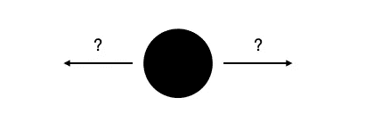
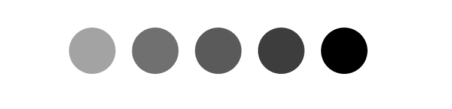
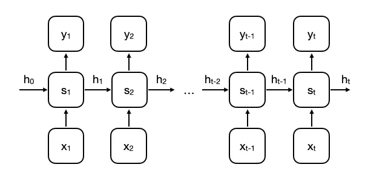
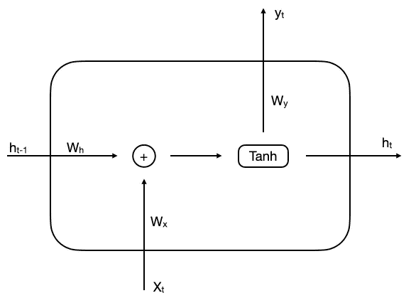
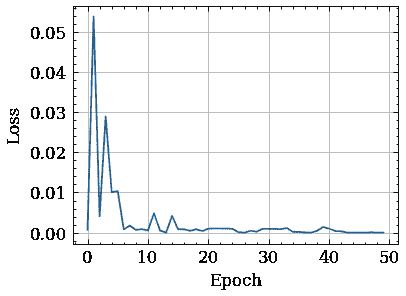
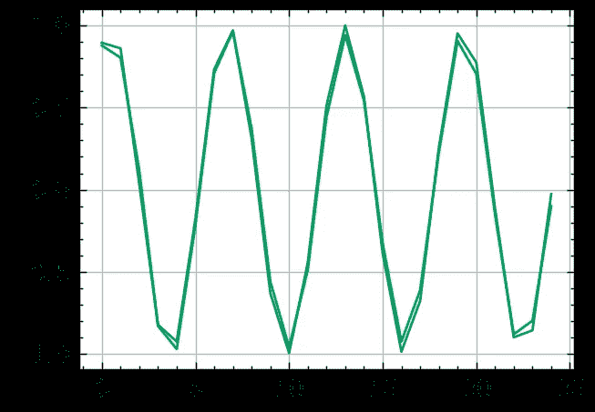

# 从头开始的递归神经网络

> 原文：<https://medium.com/nerd-for-tech/recurrent-neural-networks-3a0adb1d4515?source=collection_archive---------3----------------------->

这是一个简单快捷的教程，解释了 RNN 是如何工作的，以及如何用 Python 从头开始构建自己的网络。

Jeffrey Brandjes 在 [Unsplash](https://unsplash.com?utm_source=medium&utm_medium=referral) 上拍摄的照片

## **简介**

递归神经网络处理**序列数据**来预测下一个事件。为了理解这个模型的必要性，让我们从一个思维实验开始。

*你能根据这个画面预测球的方向吗？*

在没有明确了解以前的位置的情况下，这是一个随机的猜测。

当我们有以前位置的历史时，问题就变得容易多了。这就是为什么序列模型在处理像语言或音频文件这样的时序数据时很方便。

**RNN** 架构是分布在时间步长 t 上的一系列**存储单元**

展开的 RNN 建筑

存储单元

每个**存储单元**接受 2 个输入:

*   **xt** —输入(如句子中的单词)
*   **ht-1** —隐藏状态(包含前一单元格的上下文信息)

并返回两个值:

*   **ht** —下一个隐藏状态
*   **yt** —预测(如预测句子中的下一个单词)

## **让我们用 Python 创建 RNN 类**

**隐藏单元的**变量是处于隐藏状态的“神经元”数量。一个时间步长大致类似于神经网络中的层。

## 资料组

我们的数据集是**一个正弦函数**变成 200 个样本，每个样本有 25 个时间步长。

## 前进传球

正向传递包括循环样本中的每一步的**以获得最终输出 **yt** 并计算 **MSE** 损失。**

## 反向传播

这就是事情变得有点棘手的地方。在 RNN 中，权重是跨时间步长共享的，因此权重 **Wh** 取决于时间上的每个隐藏状态。类似的权重 **Wx** 取决于前一时间步的每个输入。这就是为什么我们称之为穿越时间的反向传播( **BPTT** )。我不会把所有的数学方程式都放在这里。尽管如此，如果你想知道引擎盖下到底发生了什么，我还是推荐这个视频。

我们还限制了渐变以防止**消失**和**爆发**渐变问题。

# 让我们齐心协力

因此，我们构建了向前和向后传播的代码，现在我们可以向我们的网络提供数据，并观察它的行为。完整实现可在 [**Github**](https://github.com/maciejbalawejder/DeepLearning-collection/blob/main/Sequentials/RNN/RNN.ipynb) 上获得。

**左**:损失函数**右**:绿色——预测，蓝色——地面真实

该模型似乎基于之前的 25 个数据点准确地预测正弦函数值。平均误差在 0.5%左右。

# 丰富

因为它是 RNN 的普通实现，所以有很多升级:

*   向隐藏状态添加偏差
*   随时间截断反向传播(TBPTT) —适用于较长的序列
*   更先进的模式，如 LSTM 或 GRU

# 结论

理查德·费曼的名言是，“我不能创造的，我不理解。”这就是为什么我认为从零开始建立这些模型是至关重要的，以获得对内部数学、与任务相关的问题以及如何解决这些问题的更深刻的理解。

如果想看我的其他项目，可以查看我的 [**中**](https://maciejbalawejder.medium.com/) 和[**Github**](https://github.com/maciejbalawejder)**简介。**

***探索更多 RNNs 的宝贵资料。***

** [## 初学者递归神经网络入门-victorzhou.com

### 递归神经网络是一种专门处理序列的神经网络。他们经常…

victorzhou.com](https://victorzhou.com/blog/intro-to-rnns/)  [## 递归神经网络图解指南

### 理解直觉

towardsdatascience.com](https://towardsdatascience.com/illustrated-guide-to-recurrent-neural-networks-79e5eb8049c9)  [## 序列模型和递归神经网络

### 理解深度递归神经网络(RNNs)

towardsdatascience.com](https://towardsdatascience.com/sequence-models-and-recurrent-neural-networks-rnns-62cadeb4f1e1)**