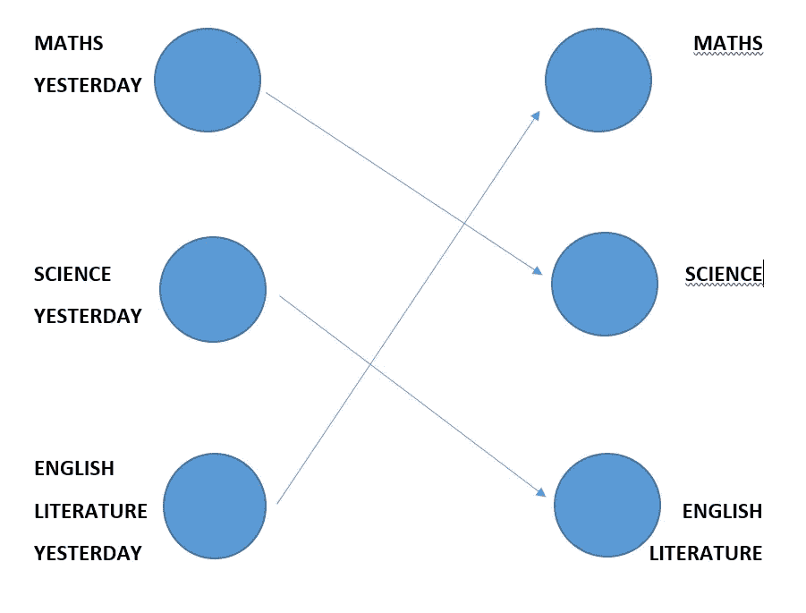
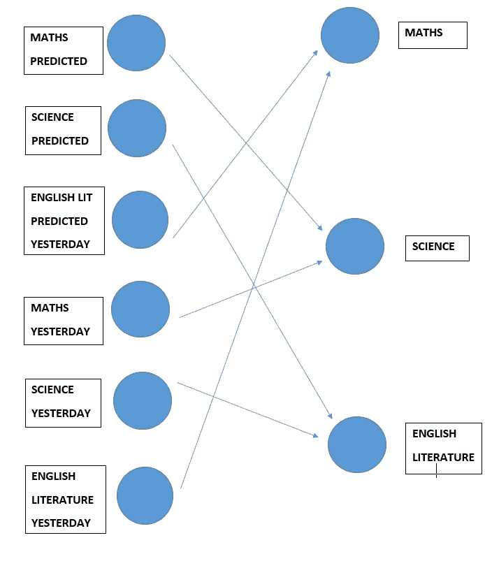
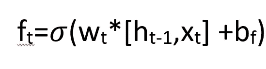
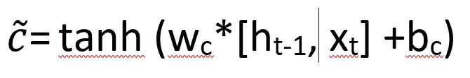
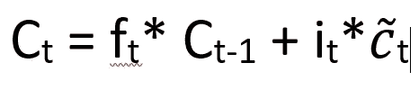
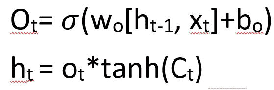

# 递归神经网络。

> 原文：<https://medium.com/nerd-for-tech/recurrent-neural-networks-8186403e7e0d?source=collection_archive---------15----------------------->

递归神经网络模仿大脑的工作。就像我们根据上下文、主题、性别和情境来选择单词一样，RNNs 也根据之前的输入/上下文来分类和预测单词。学习 rnn 很有趣。他们也有相当惊人的应用。

我们将把它分成三个部分:

1.  什么是 RNN，我们为什么需要它？
2.  什么是长短期记忆，它是如何工作的？
3.  RNN 的应用。

我们将首先讨论应用程序，以了解下一部分的背景。一旦你理解了 rnn 在哪里使用，学习这个概念就很容易了。

## **无线网络的应用:**

rnn 主要用于*文本预测*。RNNs 理解文本的*上下文。他们甚至可以学习拼写！！RNNs 还可用于*语音识别、语音到文本的转换、*反之亦然。其他应用包括*文本摘要、视频标记、翻译、语音搜索、*等等。基本上，它也可以用于文本、音频、视频、语音和图像。*

## 递归神经网络；

致谢:维基百科

引入 RNNs 是为了克服前馈网络的局限性。前馈结构不能基于以前的数据进行预测，因为它是单向的，而且它只能接受固定大小的数据并给出固定大小的输出。RNNs 没有这个问题。RNN 是一个具有反馈架构的*人工神经网络*，这意味着网络的输出被反馈到网络的*隐藏层*。rnn 使用反向传播算法。反向传播使用梯度方法来更新输入的权重。他们记得以前的预测，并使用这些预测来改变输入的权重，以更好地预测下一个单词或结果。rnn 以矩阵的形式考虑所有数据，因为这是让它们理解的语言。

让我们举个例子来更好地理解。假设你计划学习 3 门课程(每天一门)。你已经制定了你想学习的顺序。这些科目是数学、科学和英国文学。顺序是*数学- >理科- >英国文学- >数学- >理科..如此等等。*所以，预测取决于你前一天学了什么。通过前馈网络这是不可能的，因为它不记得任何以前的预测。这就是 RNN 出现的原因。RNN 有一个存储先前预测的记忆。因此，当你发送*数学*作为输入时，你得到*科学*作为输出。科学和英国文学也是如此。某天你错过了学习，所以你将会有一个昨天*预测的输入*和另一个你*上次实际学习过的*(因为你错过了一天)。因此，RNN 必须记住前一天的预测，然后再预测今天的情况。

让我们再举一个例子。这些句子是关于海洋食物链的，“鲨鱼以金枪鱼为食。”、“金枪鱼以小鱼为食。”，“小鱼以海洋植物为食。”，“海洋植物以微生物为食。”和“微生物以鲨鱼为食”。现在，假设您将这些数据输入到 RNNs。然后你输入*‘sharks’*，模型应该根据给定的数据造出一个有意义的句子。RNN 会明白，因为有一个名词和可能性会'*饲料'*或一个*时期(。).*但是如果它是一个*’那么这个句子就是“鲨鱼”这没有任何意义。而其他可以形成的不想要的句子有*“鲨鱼以鲨鱼为食。”，“海洋植物。”，“海洋植物以鲨鱼为食。”等*。发生这种情况是因为反向传播只关心名词或动词，但缺乏对有关输入的每种可能性的意义的理解。由于反向传播，还有一些其他问题:*

1.  *消失梯度:*反向传播使用梯度方法来更新权重。但有时梯度很小，以至于随着梯度的更新，预测不会改变。就像消失了一样。随着更多的层被添加到网络，损失函数几乎变为零。因此使得网络很难训练。
2.  *爆炸渐变:*顾名思义是消失渐变的反义词。在这里，梯度是如此之大，以至于在模型中进行了大的改变。这使得模型不稳定，并且变得无法训练模型。因此，重要的是用正确的量更新梯度，以使其在正确的方向上训练。

这些问题可以用长短期记忆来解决。

## **长短期记忆(LSTM):**

演职员表: [LSTM，科拉的博客](https://colah.github.io/posts/2015-08-Understanding-LSTMs/)

与具有短期依赖性的基本 rnn 相比，LSTMs 用于长期依赖性。标准的 rnn 结构简单，只有一个不断重复的 *tanh* 层。但是 LSTMs 有四个循环的 *sigmoid* 层( *tanh* 和 *sigmoid* 是激活函数)。LSTMs 有一个*单元状态*(如上图所示)，它从每一层收集信息以获得输出，并由门调节。门是 *sigmoid 函数*和*逐点乘法运算*的组合。 *sigmoid 函数*的输出在 0 和 1 之间。LSTMs 有 3 个这样的门。LSTMs 有四个主要步骤，我们将详细讨论每个步骤:

以下步骤以文本预测为例进行解释，以使其更容易理解。

***第一步:(遗忘步骤)***

这个步骤被称为*遗忘步骤*，因为它的主要工作是决定是否需要丢弃特定信息。这是通过一个*s 形*层完成的，这个门被称为*忘记门*。这个门的输入是 *h(t-1)* 和 *x(t)* 。这个门的输出*【f(t)】*不是 1 就是 0。1 表示不丢弃信息，0 表示丢弃信息。这个门有助于记住当前主题的性别，因此可以使用正确的代词。而当接收到新的主题时，旧的主题就被扔掉了。

***第二步:***

这一步决定在单元状态中存储哪些信息。这涉及到两个门。一个是称为*输入门层*的*s 形门*。这个门决定需要更新的值。

第二个门是 tanh，它为新的候选键创建一个向量。

然后这两个门被组合以创建状态的更新。

***第三步:***

现在，单元状态已经接收到来自前面步骤的信息。它会忘记要忘记的状态，更新要更新的信息，把这两个结合起来得到 c(t)。

***第四步:***

这是最后一步。它有两层 tanh 和乙状结肠。这里决定了产量。Sigmoid 用于选择在输出中提供单元状态的哪些部分。然后通过 tanh，这两个门的输出相乘。

因此，获得了输出。

**参考文献:**

1.  [了解 LSTM 网络](https://colah.github.io/posts/2015-08-Understanding-LSTMs/)(强烈推荐)

2.[递归神经网络的不合理有效性](http://karpathy.github.io/2015/05/21/rnn-effectiveness/)

3.[循环神经网络(RNN)和长短期记忆(LSTM)](https://www.youtube.com/watch?v=WCUNPb-5EYI&t=1411s) 作者布兰登·罗勒

作者:SMRUTHI R PALADHI