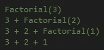

# 递归

> 原文：<https://medium.com/nerd-for-tech/recursion-fe77129e405e?source=collection_archive---------4----------------------->

递归是计算机编程中的一个概念，它意味着根据问题本身来定义问题。解释递归的另一种方式是通过重复使用算法来定义函数或计算数字。

如何使用递归的一个很好的例子是，如果你试图计算阶乘。

上面的代码说明了如何使用递归来计算阶乘。函数中有两个返回。首先是基础案例。基本情况是我们知道答案而不需要递归调用。第二个返回是递归情况。递归情况是我们不知道答案并且需要递归调用的情况。

为了解释发生了什么，我将遍历这个函数。

用三(**阶乘(3)** )调用函数，函数会检查 3 是否等于 1。它没有，所以它将继续向下并返回 **3 *阶乘(3–1)**。这将再次用 2 调用函数。由于 2 不等于 1，该函数将返回 **2 *阶乘(2–1)**。这将使用 1 调用函数。因为 1 等于 1，所以该函数将返回 1。这将导致**阶乘(3)** 返回 **3 + 2 + 1** ，等于 6 或 3！。