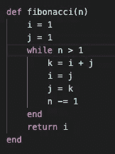
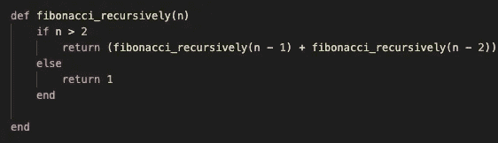
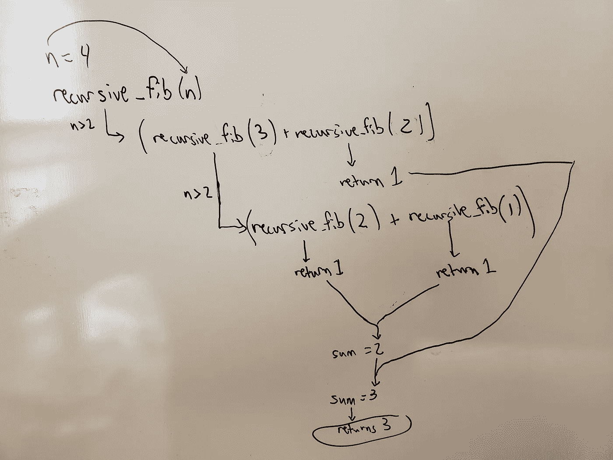
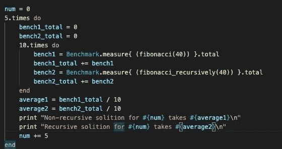
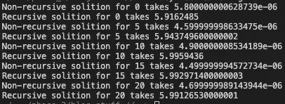

# 递归、斐波那契和 Ruby 速度

> 原文：<https://medium.com/nerd-for-tech/recursion-fibonacci-and-speed-with-ruby-1a2491cb8e8e?source=collection_archive---------14----------------------->

斐波纳契数列是一个数字序列，序列中的下一个数字是前两个数字的和。典型的例子是这样的:

斐波那契数列

在这篇博客中，我将尝试递归的基本原理。我将在 Ruby 中实现两种不同的解决方案来查找指定的 Fibonacci 序列的元素。第一种解决方案是更标准的编码实践，而第二种使用更优雅的递归解决方案来完成这项工作。

第一个解决方案接受一个数字 n，并创建一个斐波那契数列，从开始一直到我们要寻找的元素:

这种方法简单快捷。它以两个变量为 1 开始，然后将它们相加得到第三个变量，然后将第三个变量移入第二个变量，第二个变量移入第一个变量。它一遍又一遍地这样做，直到我们提取出我们正在寻找的价值。

第二种解决方案使用递归来实现相同的结果:

这个方法比第一个方法代码少得多，而且看起来更优雅。将一个数字 n 传递给该方法，并检查它是否大于 2。如果它不大于 2，它将遇到返回值为 1 的方法的所谓“基本情况”。如果它大于 2，它用小于 n 的 1 来调用自己，并将该值加到用小于 n 的 2 来调用的自己上。该递归循环一直运行，直到 n 达到基本情况，并最终返回值。

为了有助于可视化这种方法中发生的情况，请参见下面的专业图表:

图解递归

为了找出哪种方法更快，我对结果进行了基准测试:

标杆管理

哪种方法其实更快？这里:

结果

非递归解决方案要快得多。递归似乎在函数中发挥了神奇的作用，但是在这种情况下，它并不是解决问题的最佳方法。递归是一个令人头脑麻木的话题，勾勒出正在发生的事情对你理解它有很大的帮助。